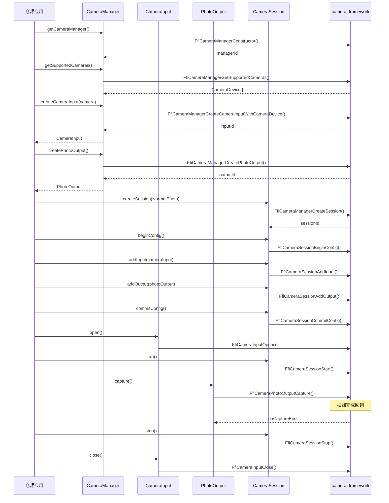
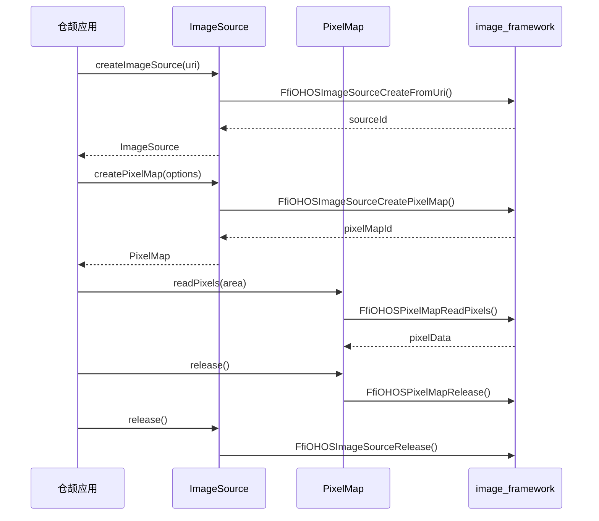
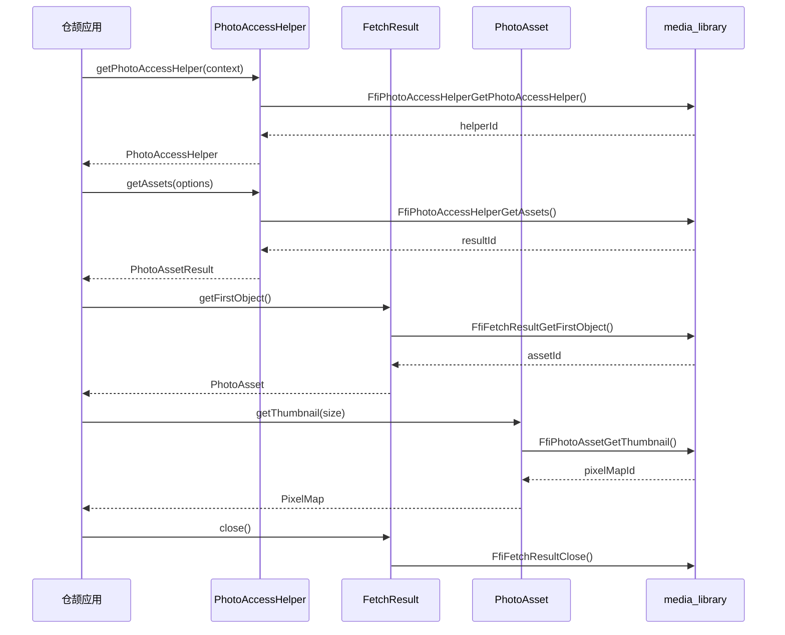
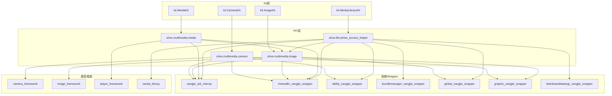

# 架构说明

> 本文档描述 multimedia_cangjie_wrapper 的系统架构、组件关系、数据流与线程模型

---

## 目的与适用范围

**目的**：帮助开发者理解系统的整体架构设计，包括：
- 组件分层与职责划分
- 模块间依赖关系
- 关键数据流
- 线程模型

**适用范围**：架构师、框架开发者、需要深入理解系统设计的工程师

---

## 整体架构

### 分层架构图

```
┌─────────────────────────────────────────────────────────────────────────┐
│                           应用层 (Application Layer)                      │
│                    仓颉应用使用 Kit 接口开发多媒体功能                      │
└─────────────────────────────────────────────────────────────────────────┘
                                    ↓
┌─────────────────────────────────────────────────────────────────────────┐
│                            Kit 层 (Kit Layer)                           │
│  ┌─────────────┐  ┌─────────────┐  ┌─────────────┐  ┌─────────────────┐ │
│  │ CameraKit   │  │  ImageKit   │  │  MediaKit   │  │ MediaLibraryKit │ │
│  │ index.cj    │  │ index.cj    │  │ index.cj    │  │ index.cj        │ │
│  └──────┬──────┘  └──────┬──────┘  └──────┬──────┘  └────────┬────────┘ │
└─────────┼────────────────┼────────────────┼──────────────────┼──────────┘
          │                │                │                  │
          └────────────────┴────────────────┴──────────────────┘
                                    ↓
┌─────────────────────────────────────────────────────────────────────────┐
│                           FFI 层 (FFI Layer)                            │
│  ┌────────────────┐ ┌────────────────┐ ┌────────────────┐               │
│  │ohos.multimedia │ │ohos.multimedia │ │ohos.multimedia │  ┌──────────┐│
│  │.camera         │ │.image          │ │.media          │  │ohos.file ││
│  │                │ │                │ │                │  │.photo_ac-││
│  │ camera_ffi.cj  │ │ image.cj       │ │ media_ffi.cj   │  │cess_help-││
│  │ camera_manager │ │ pixel_map.cj   │ │ avimage_gener- │  │er        ││
│  │ camera_session │ │ image_source.cj│ │ ator.cj        │  │          ││
│  │ camera_input   │ │ image_packer.cj│ │                │  │ photo_   ││
│  │ camera_output  │ │ ...            │ │                │  │accesshel-││
│  │ ...            │ │                │ │                │  │per_ffi.cj││
│  └────────┬───────┘ └────────┬───────┘ └────────┬───────┘  └────┬─────┘│
└───────────┼──────────────────┼──────────────────┼───────────────┼──────┘
            │                  │                  │               │
            └──────────────────┴──────────────────┴───────────────┘
                                    ↓
┌─────────────────────────────────────────────────────────────────────────┐
│                          底层框架 (Native Framework)                      │
│  ┌────────────────┐ ┌────────────────┐ ┌────────────────┐               │
│  │ camera_        │ │ image_         │ │ player_        │  ┌──────────┐│
│  │ framework      │ │ framework      │ │ framework      │  │media_lib-││
│  │                │ │                │ │                │  │rary      ││
│  │ cj_camera_ffi  │ │ cj_image_ffi   │ │ cj_avplayer_   │  │cj_photo- ││
│  │ (C++接口)      │ │ (C++接口)      │ │ ffi (C++接口)  │  │accesshel-││
│  └────────────────┘ └────────────────┘ └────────────────┘  │per_ffi   ││
│                                                            └──────────┘│
└─────────────────────────────────────────────────────────────────────────┘
```

### 模块职责

| 模块 | 职责 | 代码位置 |
|------|------|----------|
| **Kit 层** | 对外暴露简洁的仓颉接口 | `kit/*/index.cj` |
| **FFI 层** | FFI 绑定、数据转换、业务逻辑 | `ohos/**/*.cj` |
| **底层框架** | 提供 C++ 实现的媒体能力 | 外部依赖 |

---

## 组件详细设计

### Camera 模块

```
┌─────────────────────────────────────────────────────────────┐
│                    CameraKit (index.cj)                     │
│                public import ohos.multimedia.camera.*        │
└─────────────────────────────────────────────────────────────┘
                              ↓
┌─────────────────────────────────────────────────────────────┐
│                 ohos.multimedia.camera                       │
│  ┌─────────────┐ ┌─────────────┐ ┌─────────────┐            │
│  │CameraManager│ │CameraSession│ │CameraInput  │            │
│  │相机管理器   │ │会话管理     │ │相机输入     │            │
│  └──────┬──────┘ └──────┬──────┘ └──────┬──────┘            │
│         │               │               │                   │
│  ┌──────▼──────┐ ┌──────▼──────┐ ┌──────▼──────┐            │
│  │PhotoOutput  │ │VideoOutput  │ │PreviewOutput│            │
│  │拍照输出     │ │录像输出     │ │预览输出     │            │
│  └─────────────┘ └─────────────┘ └─────────────┘            │
│                                                             │
│  camera_ffi.cj - FFI 函数声明与 C 结构体定义                │
│  camera_common.cj - 公共类型、错误码、工具函数              │
└─────────────────────────────────────────────────────────────┘
                              ↓
┌─────────────────────────────────────────────────────────────┐
│                  camera_framework                            │
│                    cj_camera_ffi (C++)                      │
└─────────────────────────────────────────────────────────────┘
```

**关键类关系**：

| 类名 | 职责 | FFI 入口 |
|------|------|----------|
| `CameraManager` | 相机设备管理、能力查询 | `FfiCameraManager*` |
| `CameraInput` | 相机硬件控制（打开/关闭） | `FfiCameraInput*` |
| `PreviewOutput` | 预览流管理 | `FfiCameraPreviewOutput*` |
| `PhotoOutput` | 拍照控制 | `FfiCameraPhotoOutput*` |
| `VideoOutput` | 录像控制 | `FfiCameraVideoOutput*` |
| `Session` | 会话配置与生命周期 | `FfiCameraSession*` |

### Image 模块

```
┌─────────────────────────────────────────────────────────────┐
│                    ImageKit (index.cj)                      │
│                public import ohos.multimedia.image.*        │
└─────────────────────────────────────────────────────────────┘
                              ↓
┌─────────────────────────────────────────────────────────────┐
│                  ohos.multimedia.image                       │
│  ┌─────────────┐ ┌─────────────┐ ┌─────────────┐            │
│  │ ImageSource │ │ ImagePacker │ │ PixelMap    │            │
│  │ 图像源      │ │ 图像打包器  │ │ 像素图      │            │
│  └─────────────┘ └─────────────┘ └─────────────┘            │
│  ┌─────────────┐ ┌─────────────┐                            │
│  │ImageReceiver│ │   Image     │                            │
│  │图像接收器   │ │ 图像对象    │                            │
│  └─────────────┘ └─────────────┘                            │
│                                                             │
│  cj_image_common.cj - 公共类型（Size、Region、Component）    │
│  cj_image_enum.cj - 枚举定义                                │
│  cj_image_utils.cj - 工具函数                               │
│  cj_image_log.cj - 日志封装                                 │
└─────────────────────────────────────────────────────────────┘
                              ↓
┌─────────────────────────────────────────────────────────────┐
│                  image_framework                             │
│                    cj_image_ffi (C++)                       │
└─────────────────────────────────────────────────────────────┘
```

### Media 模块

```
┌─────────────────────────────────────────────────────────────┐
│                    MediaKit (index.cj)                      │
│                public import ohos.multimedia.media.*        │
└─────────────────────────────────────────────────────────────┘
                              ↓
┌─────────────────────────────────────────────────────────────┐
│                  ohos.multimedia.media                       │
│  ┌─────────────────────────┐                                │
│  │   AVImageGenerator      │                                │
│  │   视频缩略图生成器       │                                │
│  └─────────────────────────┘                                │
│                                                             │
│  media_ffi.cj - FFI 类型定义                                │
│  media_common.cj - 公共定义                                 │
└─────────────────────────────────────────────────────────────┘
                              ↓
┌─────────────────────────────────────────────────────────────┐
│                  player_framework                            │
│            cj_avplayer_ffi (C++)                            │
└─────────────────────────────────────────────────────────────┘
```

### PhotoAccessHelper 模块

```
┌─────────────────────────────────────────────────────────────┐
│                 MediaLibraryKit (index.cj)                  │
│              public import ohos.file.photo_access_helper.*  │
└─────────────────────────────────────────────────────────────┘
                              ↓
┌─────────────────────────────────────────────────────────────┐
│              ohos.file.photo_access_helper                   │
│  ┌─────────────────┐ ┌─────────────────┐                    │
│  │ PhotoAccessHelper│ │   PhotoAsset    │                    │
│  │ 相册访问助手     │ │   媒体资源       │                    │
│  └────────┬────────┘ └─────────────────┘                    │
│           │                                                 │
│  ┌────────▼────────┐ ┌─────────────────┐ ┌───────────────┐  │
│  │   Album         │ │ FetchResult     │ │ MediaChange   │  │
│  │   相册          │ │ 查询结果         │ │ Request       │  │
│  │                 │ │                 │ │ 变更请求      │  │
│  └─────────────────┘ └─────────────────┘ └───────────────┘  │
│                                                             │
│  photo_accesshelper_ffi.cj - FFI 函数与结构体               │
│  photo_accesshelper_utils.cj - 工具函数                     │
└─────────────────────────────────────────────────────────────┘
                              ↓
┌─────────────────────────────────────────────────────────────┐
│                   media_library                              │
│            cj_photoaccesshelper_ffi (C++)                   │
└─────────────────────────────────────────────────────────────┘
```

---

## 数据流分析

### 相机拍照流程



### 图像解码流程



### 相册资源访问流程



---

## 线程模型

### 主要线程

| 线程类型 | 用途 | 证据 |
|----------|------|------|
| 主线程 | API 调用、同步返回 | - |
| Worker 线程 | 耗时操作（图片编解码、缩略图获取） | `@!APILevel[workerthread: true]` |
| 回调线程 | 异步事件通知 | `Callback1Param` 机制 |

### Worker 线程标记

来源：`photo_accesshelper.cj:89`
```cangjie
@!APILevel[
    since: "22",
    permission: "ohos.permission.READ_IMAGEVIDEO",
    syscap: "SystemCapability.FileManagement.PhotoAccessHelper.Core",
    throwexception: true,
    workerthread: true  // 标记为 Worker 线程执行
]
public func getAssets(options: FetchOptions): PhotoAssetResult
```

### 回调机制

```
┌─────────────┐     注册回调      ┌─────────────┐
│  仓颉应用   │ ───────────────→ │ FFI 层      │
│             │                  │             │
│             │ ←─────────────── │ 底层框架    │
│             │   异步事件通知     │ (C++)       │
└─────────────┘                  └─────────────┘
         ↑
         │ Callback1Param 包装
         │
┌────────┴────┐
│ Lambda 包装  │
│ 类型转换    │
│ 异常处理    │
└─────────────┘
```

---

## 信任边界

```
┌─────────────────────────────────────────────────────────────┐
│                        应用沙盒                              │
│  ┌───────────────────────────────────────────────────────┐  │
│  │                   仓颉应用代码                          │  │
│  │              （无特权，受权限管控）                      │  │
│  └───────────────────────────────────────────────────────┘  │
└─────────────────────────────────────────────────────────────┘
                              ↓ 系统 API 调用
┌─────────────────────────────────────────────────────────────┐
│                     multimedia_cangjie_wrapper               │
│  ┌───────────────────────────────────────────────────────┐  │
│  │  Kit 层 → FFI 层 → 权限检查 → 参数校验 → 底层调用      │  │
│  │              （本仓库代码，系统组件）                    │  │
│  └───────────────────────────────────────────────────────┘  │
└─────────────────────────────────────────────────────────────┘
                              ↓ IPC/Syscall
┌─────────────────────────────────────────────────────────────┐
│                      底层多媒体服务                          │
│  ┌─────────────┐ ┌─────────────┐ ┌────────────────────────┐ │
│  │Camera Service│ │Image Service│ │Media Library Service  │ │
│  │  (系统服务)  │ │  (系统服务)  │ │  (系统服务)            │ │
│  └─────────────┘ └─────────────┘ └────────────────────────┘ │
└─────────────────────────────────────────────────────────────┘
```

---

## 依赖关系图



---

## 关键结论

1. **分层清晰**：Kit 层 → FFI 层 → 底层框架，职责单一
2. **统一模式**：所有模块遵循 RemoteDataLite + FFI + Callback 模式
3. **权限前置**：敏感操作在 FFI 层之前进行权限声明
4. **线程分离**：耗时操作标记 Worker 线程，避免阻塞主线程
5. **错误统一**：使用 BusinessException 进行错误传播

---

## 相关跳转

- [目录结构](02_Directory_Structure.md)
- [N-API 接口](03_NAPI_Interfaces.md)
- [安全风险分析](07_Security_Analysis.md)
