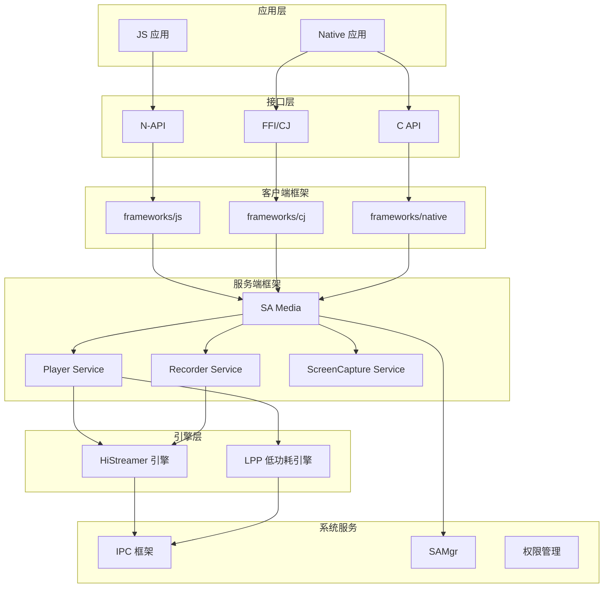

# 系统架构

## 整体架构图



## 模块交互

### N-API 到服务的调用链

```
JS API 调用
    ↓
N-API 层 (frameworks/js/xxx/)
    ↓
IPC Proxy (services/xxx/ipc/xxx_proxy.cpp)
    ↓
IPC Stub (services/sa_media/ipc/media_service_stub.cpp)
    ↓
Service Stub (services/xxx/ipc/xxx_service_stub.cpp)
    ↓
Service Server (services/xxx/server/xxx_server.cpp)
    ↓
引擎实现 (services/engine/histreamer/)
```

### 关键组件

#### N-API 层 (frameworks/js/)

负责 JS 到 Native 的桥接：
- 参数类型转换
- Promise/Callback 封装
- 错误码转换
- 权限校验前置

#### 客户端 IPC (services/xxx/client/)

负责与服务端通信：
- 获取 SA 代理
- 序列化请求参数
- 反序列化响应
- 死亡回调处理

#### 服务端 IPC (services/xxx/ipc/)

处理客户端请求：
- 请求分发
- 权限校验
- 参数验证
- 调用服务端实现

#### 引擎层 (services/engine/)

核心业务逻辑：
- 播放控制
- 录制处理
- 编解码
- 渲染输出

## 代码证据

| 组件 | 位置 | 关键文件 |
|------|-----|---------|
| N-API 入口 | `frameworks/js/media/native_module_ohos_media.cpp:71-88` | `napi_module` 定义 |
| SA Stub | `services/services/sa_media/ipc/media_service_stub.cpp:131` | `OnRemoteRequest` |
| Player Stub | `services/services/player/ipc/player_service_stub.cpp:311` | `OnRemoteRequest` |
| Recorder Stub | `services/services/recorder/ipc/recorder_service_stub.cpp:186` | `OnRemoteRequest` |

## 相关文档

- [数据流与线程模型](04_DataFlow_Threading.md)
- [Inner API 参考](13_Inner_API.md)
