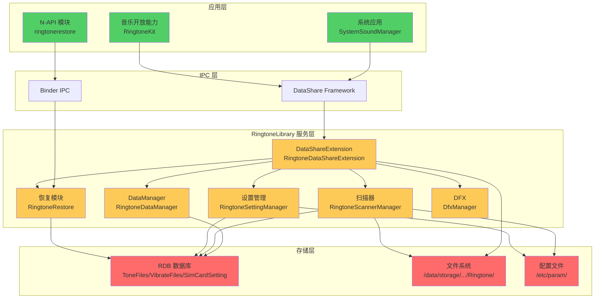
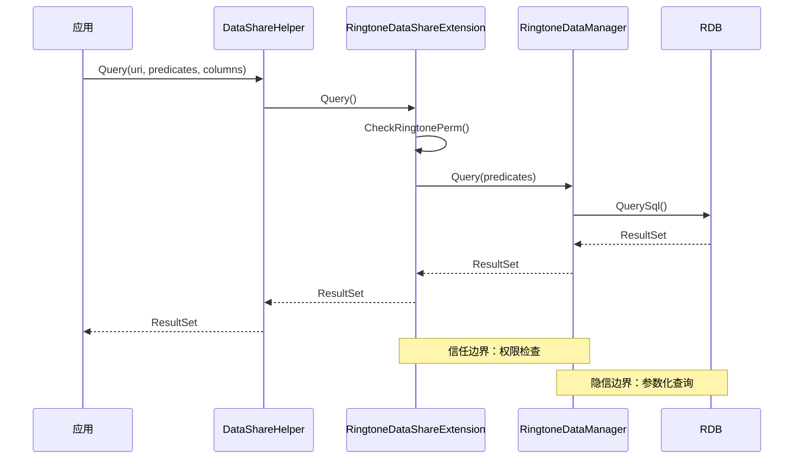
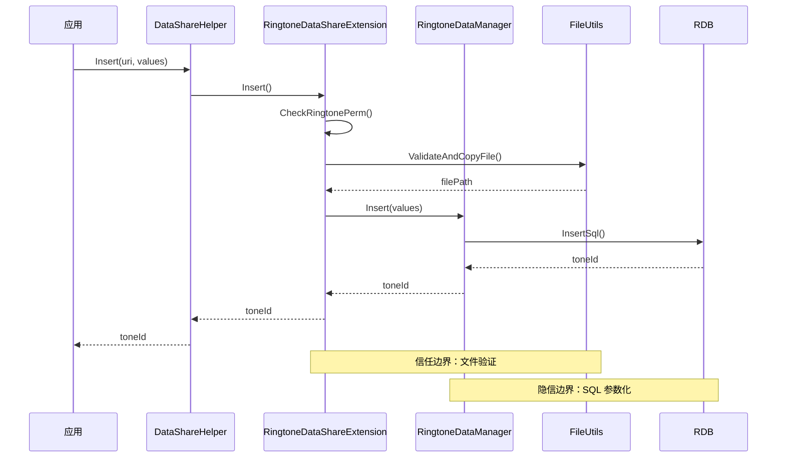
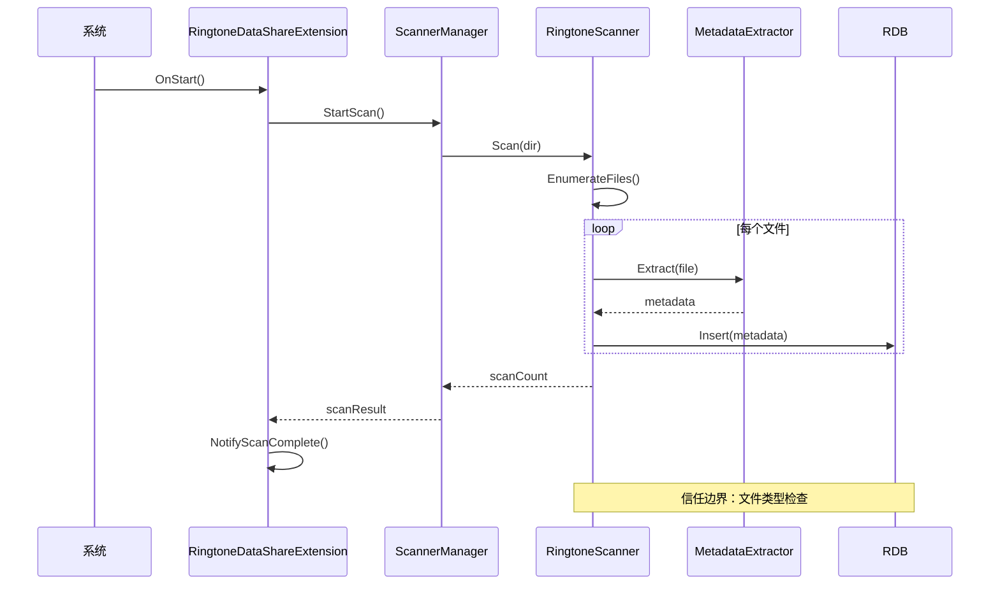
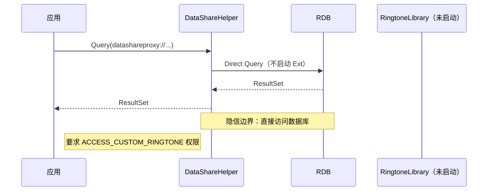
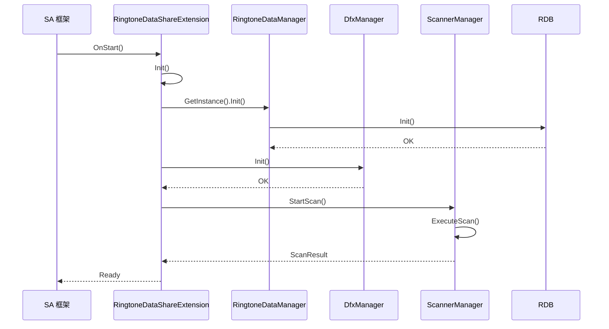
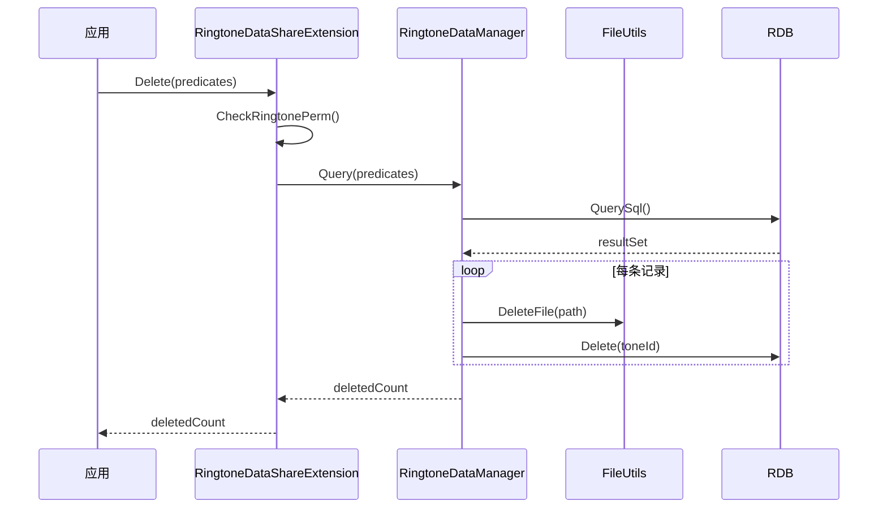

# 架构与数据流

> **适用对象**: 新人学习者、安全研究员
> **阅读时间**: 20 分钟
> **前置知识**: DataShare 框架、RDB 数据库

---

## 目的与适用范围

本文档详细说明 RingtoneLibrary 的架构设计，包括：
- 组件图和模块依赖
- 数据流和信任边界
- 线程模型和时序
- 关键流程说明

**适用场景**:
- 开发者：理解系统架构，定位问题
- 安全研究员：识别潜在攻击点和数据流

---

## 系统架构图

### 整体架构



**证据**: `README_zh.md:10-11`, `services/ringtone_data_extension/src/ringtone_datashare_extension.cpp`

---

## 模块职责

### 核心模块

| 模块 | 主要职责 | 关键类 | 证据 |
|------|---------|---------|------|
| **DataShareExtension** | DataShare 接口实现，IPC 入口 | `RingtoneDataShareExtension` | `ringtone_datashare_extension.cpp` |
| **DataManager** | 数据操作管理，RDB CRUD | `RingtoneDataManager` | `ringtone_data_manager.cpp` |
| **Scanner** | 扫描系统铃音，元数据提取 | `RingtoneScannerObj` | `ringtone_scanner.cpp` |
| **SettingManager** | 铃音设置管理（来电/闹钟/通知） | `RingtoneSettingManager` | `ringtone_setting_manager.cpp` |
| **Restore** | 备份恢复，跨版本迁移 | `RingtoneRestore` | `ringtone_restore.cpp` |
| **DFX** | 诊断和故障报告 | `DfxManager` | `dfx_manager.cpp` |

**证据**: `services/` 各模块源文件

---

## 数据流

### 1. 查询流程



**证据**: `ringtone_datashare_extension.cpp:421`, `ringtone_data_manager.cpp`

---

### 2. 新增铃音流程



**证据**: `ringtone_datashare_extension.cpp:356`, `ringtone_file_utils.cpp`

---

### 3. 扫描流程



**证据**: `ringtone_scanner.cpp`, `ringtone_metadata_extractor.cpp`

---

### 4. 静默访问流程



**证据**: `README_zh.md:184-241`

---

## 线程模型

### 主线程

- **职责**：处理 DataShare 请求（Insert/Update/Delete/Query/OpenFile）
- **实现**：`RingtoneDataShareExtension` 单例
- **证据**: `ringtone_datashare_extension.cpp`

---

### 扫描线程

- **职责**：异步扫描铃音目录，不阻塞主线程
- **实现**：`RingtoneScanExecutor`
- **线程池**：使用工作队列管理扫描任务
- **证据**: `ringtone_scan_executor.cpp`

---

### DFX 线程

- **职责**：异步上报故障和诊断信息
- **实现**：`DfxWorker`
- **线程池**：使用事件队列
- **证据**: `dfx_worker.cpp`

---

### N-API 线程

- **职责**：处理 JavaScript 调用（startRestore）
- **实现**：`RingtoneRestoreNapi`
- **异步**：使用 Promise/Callback 机制
- **证据**: `ringtone_restore_napi.cpp`

---

## 关键时序

### 初始化时序



**证据**: `ringtone_datashare_extension.cpp:135-172`

---

### 删除铃音时序



**证据**: `ringtone_datashare_extension.cpp:401`, `ringtone_data_manager.cpp`

---

## 数据存储模型

### RDB 数据库

```
/data/service_el2/
└── ringtone_library/
    ├── ringtone.db          # 主数据库
    │   ├── ToneFiles       # 铃音表
    │   ├── VibrateFiles    # 振动表
    │   ├── SimCardSetting  # SIM 卡设置
    │   └── PreloadConfig   # 预加载配置
```

**证据**: `ringtone_rdbstore.cpp:Init()`

---

### 文件系统

```
/data/storage/el2/base/files/Ringtone/
├── ringtones/             # 用户铃音
│   ├── ringtone1.ogg
│   └── custom_ringtone.m4a
├── vibrate/              # 振动文件
│   └── vibrate_pattern.bin
└── backup/               # 备份文件
    └── backup_20240101/
```

**证据**: `ringtone_db_const.h:RINGTONE_DATA_PATH`

---

## 信任边界

### 边界 1：应用 ↔ DataShareExtension

**安全控制**：
- `CheckRingtonePerm()` 权限校验
- `IsSystemApp()` 系统应用检查
- AccessToken 验证

**证据**: `ringtone_datashare_extension.cpp:200-216`

---

### 边界 2：DataShareExtension ↔ RDB

**安全控制**：
- 参数化 SQL 查询（防 SQL 注入）
- 事务隔离
- 数据库文件权限限制

**证据**: `ringtone_rdbstore.cpp`

---

### 边界 3：RingtoneLibrary ↔ 文件系统

**安全控制**：
- 路径规范化（待确认完整实现）
- 符号链接检查（待确认）
- 文件类型验证

**证据**: `ringtone_file_utils.cpp`

---

### 边界 4：扫描器 ↔ 文件系统

**安全控制**：
- 扫描路径白名单
- MIME 类型检查
- 文件大小限制

**证据**: `ringtone_scanner.cpp`, `ringtone_metadata_extractor.cpp`

---

## 关键结论

1. **架构模式**：DataShareExtension 单例模式，RDB 存储模式
2. **数据流**：应用 → DataShare → Extension → DataManager → RDB/FS
3. **线程模型**：主线程 + 扫描线程 + DFX 线程 + N-API 线程
4. **信任边界**：4 个关键边界，需要验证安全控制完整性
5. **存储**：RDB 数据库 + 文件系统（/data/storage/...）

---

## 相关链接

- [项目概览](./01_Overview.md) - 了解项目定位
- [攻击面分析](./05_AttackSurface.md) - 详细攻击面映射
- [内部实现细节](./08_Internals.md) - 深入核心逻辑

---

**文档版本**: 1.0
**最后更新**: 2026-02-07
