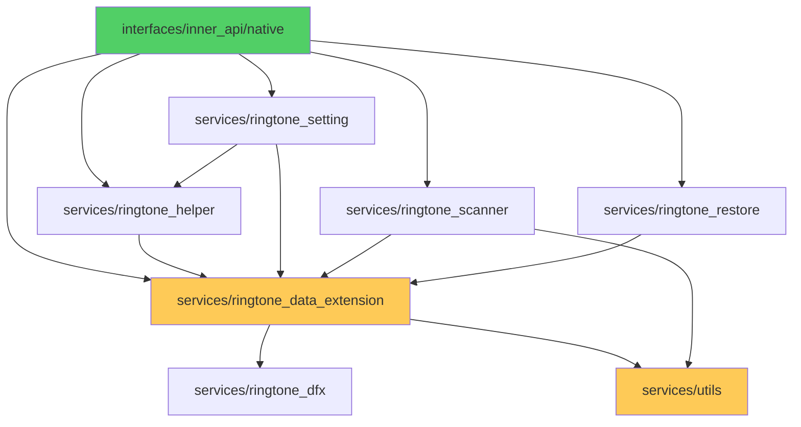

# 目录结构与代码地图

> **适用对象**: 新人学习者
> **阅读时间**: 10 分钟
> **前置知识**: C++、OpenHarmony 目录结构

---

## 目的与适用范围

本文档提供 RingtoneLibrary 的目录结构和代码地图，帮助开发者：
- 快速理解项目组织
- 定位关键代码位置
- 了解模块职责和边界

**适用场景**:
- 新人：了解项目结构，快速上手
- 开发者：定位特定功能代码
- 集成者：了解模块依赖

---

## 顶层目录结构

```
ringtone_library/
├── LICENSE                      # Apache 2.0 许可证
├── README.md                    # 英文文档
├── README_zh.md                 # 中文文档（详细）
├── bundle.json                  # 组件清单
├── hisysevent.yaml             # 系统事件配置
├── OAT.xml                     # OHOS 合规配置
├── ringtone_library.gni        # GN 构建变量
├── figures/                    # 文档图片
├── frameworks/                 # HAP 扩展（备份/恢复）
├── interfaces/                 # 内部 API 头文件
├── services/                   # 核心服务实现
└── test/                      # 测试代码（本文档忽略）
```

**证据**: 根目录 `ls -la`

---

## frameworks/ 目录

### 职责
包含 HAP（HarmonyOS Ability Package）扩展，用于备份和恢复功能。

### 目录结构
```
frameworks/ringtone_extension_hap/
├── BUILD.gn                    # HAP 构建配置
├── signature/                   # 签名证书
└── RingtoneLibraryExt/          # Extension 项目
    ├── AppScope/               # 应用级配置
    └── entry/                 # 入口 Ability
        ├── src/main/ets/     # TypeScript 源码
        │   ├── DataShareExtAbility/
        │   ├── MainAbility/
        │   ├── RingtoneBackupExtAbility/
        │   └── pages/
        └── src/main/resources/ # 资源文件（RDB 元数据配置）
```

### 关键文件

| 文件路径 | 职责 | 证据 |
|---------|------|------|
| `frameworks/ringtone_extension_hap/BUILD.gn` | HAP 构建配置 | `BUILD.gn` |
| `frameworks/ringtone_extension_hap/RingtoneLibraryExt/entry/src/main/module.json` | 模块配置（权限、能力） | `module.json` |

---

## interfaces/ 目录

### 职责
提供内部 API（Inner API）头文件，供其他系统模块使用。

### 目录结构
```
interfaces/inner_api/native/
├── ringtone_type.h           # 类型定义（枚举、结构体）
├── ringtone_asset.h          # 铃音资源类
├── ringtone_db_const.h       # 数据库常量（表名、列名、URI）
├── ringtone_proxy_uri.h      # DataShare URI 定义
├── ringtone_fetch_result.h   # 查询结果封装
├── ringtone_check_utils.h    # 检查工具函数
├── vibrate_type.h           # 振动类型定义
├── vibrate_asset.h          # 振动资源类
└── simcard_setting_asset.h   # SIM 卡设置资源类
```

### 关键文件

| 文件路径 | 职责 | 证据 |
|---------|------|------|
| `interfaces/inner_api/native/ringtone_type.h` | 类型定义（ToneType, SourceType 等） | `ringtone_type.h` |
| `interfaces/inner_api/native/ringtone_db_const.h` | 数据库常量（表名、列名） | `ringtone_db_const.h` |
| `interfaces/inner_api/native/ringtone_proxy_uri.h` | URI 定义（标准 URI、静默访问 URI） | `ringtone_proxy_uri.h` |

---

## services/ 目录

### 职责
核心服务实现，包含 DataShareExtension、扫描器、设置管理、工具函数等。

### 目录结构
```
services/
├── BUILD.gn                         # 主构建文件
├── etc/                             # 参数配置文件
│   ├── ringtone_scanner_param.para
│   ├── ringtone_setting_notifications.para
│   ├── ringtone_setting_ringtones.para
│   ├── ringtone_setting_shots.para
│   └── ringtone_param.para.dac
│
├── ringtone_data_extension/          # DataShareExtension 实现
│   ├── include/
│   │   ├── ringtone_data_command.h
│   │   ├── ringtone_data_manager.h
│   │   ├── ringtone_datashare_extension.h
│   │   ├── ringtone_datashare_stub_impl.h
│   │   ├── ringtone_rdbstore.h
│   │   └── ringtone_subscriber.h
│   └── src/
│       ├── ringtone_bundle_manager.cpp
│       ├── ringtone_data_command.cpp
│       ├── ringtone_data_manager.cpp
│       ├── ringtone_datashare_extension.cpp      # 主入口
│       ├── ringtone_datashare_stub_impl.cpp
│       ├── ringtone_language_manager.cpp
│       ├── ringtone_rdbstore.cpp
│       └── ringtone_subscriber.cpp
│
├── ringtone_scanner/               # 扫描器实现
│   ├── include/
│   │   ├── ringtone_default_setting.h
│   │   ├── ringtone_metadata_extractor.h
│   │   ├── ringtone_scan_executor.h
│   │   ├── ringtone_scanner.h
│   │   ├── ringtone_scanner_db.h
│   │   ├── ringtone_scanner_manager.h
│   │   └── ringtone_scanner_utils.h
│   └── src/
│       ├── ringtone_default_setting.cpp
│       ├── ringtone_metadata_extractor.cpp    # 元数据提取
│       ├── ringtone_scan_executor.cpp        # 扫描执行器
│       ├── ringtone_scanner.cpp            # 扫描器
│       ├── ringtone_scanner_db.cpp
│       ├── ringtone_scanner_manager.cpp     # 扫描管理器
│       └── ringtone_scanner_utils.cpp
│
├── ringtone_restore/               # 备份恢复实现
│   ├── include/
│   │   ├── customised_tone_processor.h
│   │   ├── dualfwk_conf_loader.h
│   │   ├── dualfwk_conf_parser.h
│   │   ├── dualfwk_sound_setting.h
│   │   ├── ringtone_restore.h
│   │   ├── ringtone_restore_base.h
│   │   ├── ringtone_restore_db_utils.h
│   │   ├── ringtone_restore_factory.h
│   │   ├── ringtone_restore_napi.h
│   │   └── ringtone_rdb_transaction.h
│   └── src/
│       ├── customised_tone_processor.cpp
│       ├── dualfwk_conf_loader.cpp
│       ├── dualfwk_conf_parser.cpp
│       ├── dualfwk_sound_setting.cpp
│       ├── native_module_ohos_ringtone_restore.cpp  # N-API 模块注册
│       ├── ringtone_dualfwk_restore.cpp
│       ├── ringtone_restore.cpp
│       ├── ringtone_restore_base.cpp
│       ├── ringtone_restore_db_utils.cpp
│       ├── ringtone_restore_factory.cpp
│       ├── ringtone_restore_napi.cpp             # N-API 实现
│       └── ringtone_rdb_transaction.cpp
│
├── ringtone_setting/               # 铃音设置管理
│   ├── include/
│   │   ├── ringtone_metadata.h
│   │   ├── ringtone_setting_manager.h
│   │   └── vibrate_metadata.h
│   └── src/
│       ├── ringtone_metadata.cpp
│       ├── ringtone_setting_manager.cpp          # 设置管理器
│       └── vibrate_metadata.cpp
│
├── ringtone_dfx/                  # DFX（诊断）
│   ├── include/
│   │   ├── dfx_manager.h
│   │   ├── dfx_reporter.h
│   │   └── dfx_worker.h
│   └── src/
│       ├── dfx_manager.cpp
│       ├── dfx_reporter.cpp
│       ├── dfx_worker.cpp
│
├── ringtone_helper/               # 客户端辅助库
│   ├── BUILD.gn
│   └── src/
│       ├── ringtone_asset.cpp
│       ├── ringtone_fetch_result.cpp
│       ├── ringtone_check_utils.cpp
│       ├── simcard_setting_asset.cpp
│       └── vibrate_asset.cpp
│
└── utils/                         # 工具函数
    ├── include/
    │   ├── permission_utils.h
    │   ├── ringtone_file_utils.h
    │   ├── ringtone_mimetype_utils.h
    │   ├── ringtone_privacy_manager.h
    │   ├── ringtone_rdb_callbacks.h
    │   ├── ringtone_utils.h
    │   └── ringtone_xcollie.h
    └── src/
        ├── permission_utils.cpp               # 权限检查
        ├── ringtone_file_utils.cpp           # 文件操作
        ├── ringtone_mimetype_utils.cpp     # MIME 类型
        ├── ringtone_privacy_manager.cpp
        ├── ringtone_rdb_callbacks.cpp
        ├── ringtone_utils.cpp
        └── ringtone_xcollie.cpp
```

**证据**: `services/` 目录结构

---

## 代码导航图

### 按功能定位代码

| 功能 | 关键文件 | 证据 |
|------|---------|------|
| **DataShare 入口** | `services/ringtone_data_extension/src/ringtone_datashare_extension.cpp` | `ringtone_datashare_extension.cpp` |
| **权限检查** | `services/utils/src/permission_utils.cpp` | `permission_utils.cpp` |
| **数据库操作** | `services/ringtone_data_extension/src/ringtone_rdbstore.cpp` | `ringtone_rdbstore.cpp` |
| **数据管理** | `services/ringtone_data_extension/src/ringtone_data_manager.cpp` | `ringtone_data_manager.cpp` |
| **铃音扫描** | `services/ringtone_scanner/src/ringtone_scanner.cpp` | `ringtone_scanner.cpp` |
| **元数据提取** | `services/ringtone_scanner/src/ringtone_metadata_extractor.cpp` | `ringtone_metadata_extractor.cpp` |
| **设置管理** | `services/ringtone_setting/src/ringtone_setting_manager.cpp` | `ringtone_setting_manager.cpp` |
| **文件操作** | `services/utils/src/ringtone_file_utils.cpp` | `ringtone_file_utils.cpp` |
| **备份恢复** | `services/ringtone_restore/src/ringtone_restore.cpp` | `ringtone_restore.cpp` |
| **N-API 绑定** | `services/ringtone_restore/src/ringtone_restore_napi.cpp` | `ringtone_restore_napi.cpp` |
| **诊断** | `services/ringtone_dfx/src/dfx_manager.cpp` | `dfx_manager.cpp` |

---

### 按模块定位代码

#### ringtone_data_extension 模块

| 子模块 | 文件 | 职责 |
|--------|------|------|
| 主入口 | `ringtone_datashare_extension.cpp` | DataShareExtension 实现 |
| 数据管理 | `ringtone_data_manager.cpp` | 数据操作单例 |
| RDB 存储 | `ringtone_rdbstore.cpp` | RDB 操作封装 |
| 命令处理 | `ringtone_data_command.cpp` | 数据命令分发 |
| Bundle 管理 | `ringtone_bundle_manager.cpp` | 应用 Bundle 信息 |
| 订阅器 | `ringtone_subscriber.cpp` | 数据变更订阅 |

#### ringtone_scanner 模块

| 子模块 | 文件 | 职责 |
|--------|------|------|
| 扫描器 | `ringtone_scanner.cpp` | 文件扫描核心 |
| 扫描管理器 | `ringtone_scanner_manager.cpp` | 扫描生命周期管理 |
| 扫描执行器 | `ringtone_scan_executor.cpp` | 异步扫描任务 |
| 元数据提取 | `ringtone_metadata_extractor.cpp` | 音频/视频元数据 |
| 默认设置 | `ringtone_default_setting.cpp` | 系统预设铃音 |

#### ringtone_restore 模块

| 子模块 | 文件 | 职责 |
|--------|------|------|
| 恢复核心 | `ringtone_restore.cpp` | 恢复逻辑 |
| N-API | `ringtone_restore_napi.cpp` | JS/C++ 绑定 |
| 双框架恢复 | `ringtone_dualfwk_restore.cpp` | 跨版本迁移 |
| 配置加载 | `dualfwk_conf_loader.cpp` | 配置文件解析 |

#### utils 模块

| 子模块 | 文件 | 职责 |
|--------|------|------|
| 权限工具 | `permission_utils.cpp` | 权限检查（CheckRingtonePerm, IsSystemApp） |
| 文件工具 | `ringtone_file_utils.cpp` | 文件操作（复制、删除、验证） |
| MIME 工具 | `ringtone_mimetype_utils.cpp` | MIME 类型检测 |
| 隐私管理 | `ringtone_privacy_manager.cpp` | 隐私数据管理 |
| RDB 回调 | `ringtone_rdb_callbacks.cpp` | 数据库初始化回调 |

---

## 模块依赖关系



**证据**: `services/BUILD.gn:85-94`

---

## 关键结论

1. **核心模块**：7 个主要模块（data_extension、scanner、restore、setting、dfx、helper、utils）
2. **代码量**：约 80+ 源文件（不包括测试）
3. **接口定义**：9 个公共头文件（interfaces/inner_api/native/）
4. **关键入口**：`ringtone_datashare_extension.cpp`（DataShare 入口）
5. **依赖关系**：utils → setting/helper → data_extension → restore

---

## 相关链接

- [项目概览](./01_Overview.md) - 了解项目定位
- [架构与数据流](./02_Architecture.md) - 深入理解架构
- [对外接口文档](./04_Interface.md) - API 使用参考

---

**文档版本**: 1.0
**最后更新**: 2026-02-07
