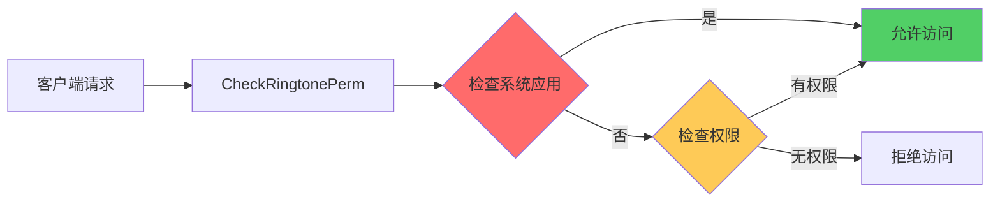

# 对外接口文档

> **适用对象**: 新人学习者、安全研究员
> **阅读时间**: 15 分钟
> **前置知识**: DataShare 框架、URI 编程

---

## 目的与适用范围

本文档详细说明 RingtoneLibrary 的所有对外接口，包括：
- DataShare API 完整清单
- URI 定义和使用方式
- 权限要求和错误码
- 使用示例代码

**适用场景**:
- 开发者：使用 RingtoneLibrary API 开发应用
- 安全研究员：分析输入处理和权限校验

---

## DataShare API 清单

### CRUD 操作总览

| 操作 | 方法 | 同步/异步 | 权限要求 | 证据 |
|------|------|-----------|-----------|------|
| 新增 | `Insert()` | 同步 | WRITE_RINGTONE | `ringtone_datashare_extension.cpp:356` |
| 修改 | `Update()` | 同步 | WRITE_RINGTONE | `ringtone_datashare_extension.cpp:379` |
| 删除 | `Delete()` | 同步 | WRITE_RINGTONE | `ringtone_datashare_extension.cpp:401` |
| 查询 | `Query()` | 同步 | - | `ringtone_datashare_extension.cpp:421` |
| 打开文件 | `OpenFile()` | 同步 | WRITE_RINGTONE | `ringtone_datashare_extension.cpp:451` |

---

## URI 定义

### 标准访问 URI

| 用途 | URI 模式 | 证据 |
|------|----------|------|
| 铃音操作 | `datashare:///ringtone/ringtone` | `README_zh.md:59` |

### 静默访问 URI

| 用途 | URI 模式 | 权限 | 证据 |
|------|----------|------|------|
| 铃音表 | `datashareproxy://com.ohos.ringtonelibrary.ringtonelibrarydata/entry/ringtone_library/ToneFiles?Proxy=true&user={uid}` | ACCESS_CUSTOM_RINGTONE | `ringtone_proxy_uri.h` |
| 振动表 | `datashareproxy://com.ohos.ringtonelibrary.ringtonelibrarydata/entry/ringtone_library/VibrateFiles?Proxy=true&user={uid}` | ACCESS_CUSTOM_RINGTONE | `ringtone_proxy_uri.h` |
| SIM 卡设置 | `datashareproxy://com.ohos.ringtonelibrary.ringtonelibrarydata/entry/ringtone_library/SimCardSetting?Proxy=true&user={uid}` | ACCESS_CUSTOM_RINGTONE | `ringtone_proxy_uri.h` |

**证据**: `interfaces/inner_api/native/ringtone_proxy_uri.h`, `README_zh.md:214-241`

---

## 权限要求

| 权限 | 用途 | 检查位置 | 证据 |
|------|------|---------|------|
| `ohos.permission.WRITE_RINGTONE` | 新增、修改、删除铃音 | `CheckRingtonePerm()` | `ringtone_datashare_extension.cpp:200` |
| `ohos.permission.ACCESS_CUSTOM_RINGTONE` | 静默访问自定义铃音 | `VerifyAccessToken()` | `README_zh.md:229-231` |

**权限检查流程**:



**证据**: `ringtone_datashare_extension.cpp:200-216`

---

## 数据库字段常量

### 铃音表字段

| 字段常量 | 数据库列 | 类型 | 必填 | 说明 | 证据 |
|---------|----------|------|------|------|------|
| `RINGTONE_COLUMN_TONE_ID` | ringtone_id | INTEGER | 自动 | 主键，自增 | `ringtone_db_const.h` |
| `RINGTONE_COLUMN_DATA` | data | TEXT | 是 | 铃音文件路径 | `ringtone_db_const.h` |
| `RINGTONE_COLUMN_SIZE` | size | BIGINT | 是 | 文件大小（字节） | `ringtone_db_const.h` |
| `RINGTONE_COLUMN_DISPLAY_NAME` | display_name | TEXT | 是 | 显示名称（title+后缀） | `ringtone_db_const.h` |
| `RINGTONE_COLUMN_TITLE` | title | TEXT | 是 | 铃音名称 | `ringtone_db_const.h` |
| `RINGTONE_COLUMN_MEDIA_TYPE` | media_type | INTEGER | 是 | 媒体类型（2=音频） | `ringtone_db_const.h` |
| `RINGTONE_COLUMN_TONE_TYPE` | tone_type | INTEGER | 是 | 铃音类型 | `ringtone_db_const.h` |
| `RINGTONE_COLUMN_MIME_TYPE` | mime_type | TEXT | 是 | MIME 类型 | `ringtone_db_const.h` |
| `RINGTONE_COLUMN_SOURCE_TYPE` | source_type | INTEGER | 是 | 来源（1=系统，2=自定义） | `ringtone_db_const.h` |
| `RINGTONE_COLUMN_DURATION` | duration | INTEGER | 否 | 时长（毫秒） | `ringtone_db_const.h` |

**证据**: `interfaces/inner_api/native/ringtone_db_const.h`

---

## 使用示例

### 示例 1：查询所有系统铃音

```cpp
// 获取 DataShareHelper
auto saManager = SystemAbilityManagerClient::GetInstance().GetSystemAbilityManager();
auto remoteObj = saManager->GetSystemAbility(STORAGE_MANAGER_MANAGER_ID);
std::shared_ptr<DataShareHelper> helper = DataShareHelper::Creator(remoteObj,
    "datashare:///ringtone/ringtone");

// 构造查询条件
DataSharePredicates predicates;
predicates.EqualTo(RINGTONE_COLUMN_SOURCE_TYPE, "1"); // 系统预制
predicates.EqualTo(RINGTONE_COLUMN_TONE_TYPE, "1"); // 来电铃音

vector<string> columns = {
    RINGTONE_COLUMN_TONE_ID,
    RINGTONE_COLUMN_TITLE,
    RINGTONE_COLUMN_DATA
};

DatashareBusinessError businessError;
auto resultSet = helper->Query(
    Uri("datashare:///ringtone/ringtone"),
    predicates,
    columns,
    &businessError
);

// 处理结果
if (resultSet != nullptr && resultSet->GoToFirstRow() == 0) {
    do {
        int32_t id;
        string title;
        string path;

        resultSet->GetInt(0, id);
        resultSet->GetString(1, title);
        resultSet->GetString(2, path);

        MEDIA_LOGI("Ringtone: id=%d, title=%s", id, title.c_str());
    } while (resultSet->GoToNextRow() == 0);
}
```

**证据**: `README_zh.md:153-182`

---

### 示例 2：新增自定义铃音

```cpp
// 准备铃音数据
DataShareValuesBucket values;
values.Put(RINGTONE_COLUMN_DATA, "/data/storage/el2/base/files/Ringtone/custom.ogg");
values.Put(RINGTONE_COLUMN_SIZE, 1024);
values.Put(RINGTONE_COLUMN_DISPLAY_NAME, "custom.ogg");
values.Put(RINGTONE_COLUMN_TITLE, "Custom Ringtone");
values.Put(RINGTONE_COLUMN_MEDIA_TYPE, 2); // 音频
values.Put(RINGTONE_COLUMN_TONE_TYPE, 1); // 来电铃音
values.Put(RINGTONE_COLUMN_MIME_TYPE, "ogg");
values.Put(RINGTONE_COLUMN_SOURCE_TYPE, 2); // 自定义
values.Put(RINGTONE_COLUMN_DURATION, 15); // 15 秒

// 插入数据库
int32_t toneId = helper->Insert(
    Uri("datashare:///ringtone/ringtone"),
    values
);

if (toneId > 0) {
    MEDIA_LOGI("Ringtone added successfully, id=%d", toneId);
}
```

**证据**: `README_zh.md:67-100`

---

### 示例 3：删除铃音

```cpp
// 构造删除条件
DataSharePredicates deletePredicates;
deletePredicates.SetWhereClause(RINGTONE_COLUMN_TONE_ID + " = ?");
deletePredicates.SetWhereArgs({ std::to_string(1) });

// 删除铃音（同时删除文件）
int32_t deletedCount = helper->Delete(
    Uri("datashare:///ringtone/ringtone"),
    deletePredicates
);

if (deletedCount > 0) {
    MEDIA_LOGI("Deleted %d ringtones", deletedCount);
}
```

**证据**: `README_zh.md:103-124`

---

### 示例 4：静默访问（高性能）

```cpp
#include "ringtone_proxy_uri.h"

// 构造静默访问 URI
Uri proxyUri(RINGTONE_LIBRARY_PROXY_DATA_URI_TONE_FILES + "&user=" +
    std::to_string(GetCurrentUserId()));

DataSharePredicates predicates;
predicates.EqualTo(RINGTONE_COLUMN_SOURCE_TYPE, "2"); // 自定义

vector<string> columns = {
    RINGTONE_COLUMN_TONE_ID,
    RINGTONE_COLUMN_TITLE
};

DatashareBusinessError businessError;
auto resultSet = helper->Query(proxyUri, predicates, columns, &businessError);

// 静默访问不拉起铃音库进程，直接访问数据库
```

**证据**: `README_zh.md:214-241`

---

## 错误码

| 错误码 | 说明 | 处理建议 | 证据 |
|--------|------|---------|------|
| E_OK | 操作成功 | - | 通用 |
| E_PERMISSION_DENIED | 权限不足 | 检查权限声明 | `CheckRingtonePerm()` |
| E_INVALID_URI | URI 格式错误 | 检查 URI 格式 | DataShare 框架 |
| E_FILE_NOT_FOUND | 文件不存在 | 检查文件路径 | `ringtone_file_utils.cpp` |
| E_DB_ERROR | 数据库错误 | 检查 SQL 语句 | `ringtone_rdbstore.cpp` |

---

## 安全注意事项

### 1. 文件路径安全

- **风险**: 用户输入的 `data` 字段直接用于文件操作
- **建议**: 验证路径是否在允许的目录内

**证据**: `ringtone_datashare_extension.cpp:356`

---

### 2. 权限检查

- **风险**: 某些操作可能绕过权限检查
- **建议**: 所有写操作必须调用 `CheckRingtonePerm()`

**证据**: `ringtone_datashare_extension.cpp:200-216`

---

### 3. 静默访问

- **风险**: 静默访问绕过进程隔离
- **建议**: 确保 `ACCESS_CUSTOM_RINGTONE` 权限正确检查

**证据**: `README_zh.md:229-231`

---

## 关键结论

1. **主要接口**: DataShare CRUD（5 个操作）
2. **URI 类型**: 标准访问 + 静默访问
3. **权限要求**: WRITE_RINGTONE（写操作）、ACCESS_CUSTOM_RINGTONE（静默访问）
4. **数据存储**: RDB 数据库 + 文件系统
5. **安全控制**: 权限检查 + 系统应用验证

---

## 相关链接

- [项目概览](./01_Overview.md) - 了解项目定位
- [攻击面分析](./05_AttackSurface.md) - 深度安全分析
- [架构与数据流](./02_Architecture.md) - 理解系统架构

---

**文档版本**: 1.0
**最后更新**: 2026-02-07
