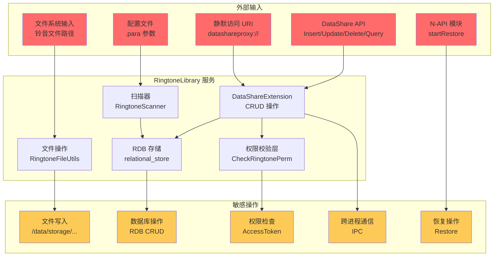

# 攻击面分析

> **适用对象**: 安全研究员
> **阅读时间**: 15 分钟
> **前置知识**: OpenHarmony 安全模型、DataShare 框架

---

## 目的与适用范围

本文档分析 RingtoneLibrary 的攻击面，帮助安全研究员：
- 识别所有外部输入入口
- 定位敏感操作和特权接口
- 理解信任边界和安全控制点
- 建立威胁模型

**适用场景**:
- 漏洞挖掘：识别潜在漏洞点
- 安全审计：评估系统安全风险
- 威胁建模：建立攻击路径

---

## 攻击面概览



---

## 外部输入清单

### 1. DataShare API 输入

| 接口 | 输入参数 | 风险点 | 证据 |
|------|----------|---------|------|
| `Insert()` | `DataShareValuesBucket` - 铃音数据 | 文件路径、类型、大小 | `ringtone_datashare_extension.cpp:356` |
| `Update()` | `DataShareValuesBucket` + 条件 | 路径遍历、SQL 注入 | `ringtone_datashare_extension.cpp:379` |
| `Delete()` | `DataSharePredicates` - 删除条件 | 条件注入、误删 | `ringtone_datashare_extension.cpp:401` |
| `Query()` | `DataSharePredicates` + 列名 | 查询注入、信息泄露 | `ringtone_datashare_extension.cpp:421` |
| `OpenFile()` | URI + 文件描述 | 路径遍历、权限绕过 | `ringtone_datashare_extension.cpp:451` |

**关键风险**:
- **文件路径注入**：用户控制的 `data` 字段直接用于文件操作
- **类型混淆**：`tone_type`、`source_type` 等字段可被恶意设置

**证据**: `services/ringtone_data_extension/src/ringtone_datashare_extension.cpp`

---

### 2. 静默访问输入

**URI 模式**: `datashareproxy://com.ohos.ringtonelibrary.ringtonelibrarydata/entry/ringtone_library/ToneFiles?Proxy=true&user=...`

| 输入 | 风险点 | 证据 |
|------|---------|------|
| `user` 参数 | 用户 ID 注入，跨用户访问 | `README_zh.md:225-226` |
| `Proxy=true` 标志 | 静默访问标志，绕过进程隔离 | `README_zh.md:215` |
| URI 路径 | 路径遍历，访问其他表 | `interfaces/inner_api/native/ringtone_proxy_uri.h` |

**关键风险**:
- **跨用户访问**：修改 `user` 参数可能访问其他用户数据
- **路径遍历**：URI 构造不当可能访问其他表（如 `../VibrateFiles`）

**证据**: `README_zh.md:214-241`

---

### 3. N-API 输入

**模块**: `multimedia.ringtonerestore`
**导出函数**: `startRestore(sceneCode, baseBackupPath)`

| 参数 | 类型 | 风险点 | 证据 |
|------|------|---------|------|
| `sceneCode` | number | 枚举值注入，非法场景 | `ringtone_restore_napi.cpp:StartRestore` |
| `baseBackupPath` | string | 路径遍历，文件读取 | `ringtone_restore_napi.cpp:StartRestore` |

**关键风险**:
- **路径遍历**：`baseBackupPath` 直接用于文件读取，可能读取任意文件
- **类型注入**：`sceneCode` 未充分校验可能导致逻辑错误

**证据**: `services/ringtone_restore/src/ringtone_restore_napi.cpp`

---

### 4. 文件系统输入

**铃音文件存储路径**: `/data/storage/el2/base/files/Ringtone/`

| 输入 | 风险点 | 证据 |
|------|---------|------|
| 铃音文件路径 | 符号链接、恶意文件 | `ringtone_db_const.h:RINGTONE_COLUMN_DATA` |
| 扫描目录 | 目录遍历、恶意文件注入 | `ringtone_scanner.cpp:Scan` |
| 振动文件 | 格式混淆、内存破坏 | `vibrate_asset.h` |

**关键风险**:
- **符号链接攻击**：用户可上传符号链接指向系统敏感文件
- **文件格式混淆**：伪造音频文件包含恶意载荷

**证据**: `interfaces/inner_api/native/ringtone_db_const.h`

---

### 5. 配置文件输入

**配置文件位置**: `/etc/param/`

| 文件 | 风险点 | 证据 |
|------|---------|------|
| `ringtone_scanner_param.para` | 扫描路径配置，目录遍历 | `services/BUILD.gn:367-372` |
| `ringtone_setting_*.para` | 铃音设置，逻辑注入 | `services/BUILD.gn:374-393` |
| `ringtone_param.para.dac` | DAC 权限配置，权限绕过 | `services/BUILD.gn:395-400` |

**关键风险**:
- **配置篡改**：攻击者修改配置文件可能导致扫描错误路径
- **权限绕过**：DAC 配置不当可能降低权限要求

**证据**: `services/BUILD.gn:367-400`

---

## 敏感操作清单

### 1. 文件写入操作

| 位置 | 操作 | 影响范围 | 证据 |
|------|------|---------|------|
| `Insert()` | 写入铃音文件到 `/data/storage/...` | 磁盘空间、文件系统 | `ringtone_datashare_extension.cpp:356` |
| `Delete()` | 删除铃音文件 | 数据丢失 | `ringtone_datashare_extension.cpp:401` |
| `Restore` | 从备份恢复文件 | 系统配置 | `ringtone_restore.cpp:Restore` |

**风险**:
- 路径遍历导致写入任意位置
- 符号链接导致删除敏感文件
- 磁盘空间耗尽攻击

---

### 2. 数据库操作

| 操作 | 影响 | 证据 |
|------|------|------|
| RDB Insert/Update/Delete | 数据完整性 | `ringtone_rdbstore.cpp` |
| RDB Query | 信息泄露 | `ringtone_rdbstore.cpp` |
| SQL 执行 | SQL 注入 | `ringtone_datashare_extension.cpp:421` |

**风险**:
- SQL 注入导致数据库破坏
- 查询注入导致信息泄露
- 并发操作导致数据竞争

---

### 3. 权限检查操作

| 函数 | 检查内容 | 证据 |
|------|---------|------|
| `CheckRingtonePerm()` | WRITE_RINGTONE 权限 | `ringtone_datashare_extension.cpp:200-216` |
| `IsSystemApp()` | 系统应用标识 | `permission_utils.cpp:161-178` |
| `VerifyAccessToken()` | ACCESS_CUSTOM_RINGTONE 权限 | `README_zh.md:229-231` |

**风险**:
- 权限检查缺失导致未授权访问
- 权限检查绕过（TOCTOU）
- 时间窗口攻击

---

### 4. 跨进程通信（IPC）

| 接口 | 协议 | 风险点 | 证据 |
|------|------|---------|------|
| DataShare | Binder IPC | 数据泄露、权限绕过 | `data_share_provider` |
| N-API | JS/C++ 互操作 | 类型混淆、内存破坏 | `ringtone_restore_napi.cpp` |
| SystemAbility | SA 框架 | 服务劫持 | `ringtone_data_extension.cpp` |

**风险**:
- Binder 数据泄露
- N-API 类型混淆
- 服务劫持攻击

---

### 5. 恢复操作

| 操作 | 影响 | 证据 |
|------|------|------|
| `startRestore()` | 从备份恢复数据 | `ringtone_restore_napi.cpp` |
| `DualFwkRestore` | 跨框架迁移 | `ringtone_dualfwk_restore.cpp` |

**风险**:
- 备份文件注入恶意数据
- 跨版本迁移逻辑错误
- 资源泄漏

---

## 信任边界

### 边界 1：应用进程 ↔ 铃音库服务

```
[应用进程] --IPC--> [DataShareExtension]
    ↑
    | 隐信边界
    | - 仅有 WRITE_RINGTONE 权限的应用可访问
    | - 仅系统应用可直接调用内部 API
```

**安全控制**:
- `CheckRingtonePerm()` 权限校验
- `IsSystemApp()` 系统应用检查
- AccessToken 权限验证

**证据**: `ringtone_datashare_extension.cpp:200-216`, `permission_utils.cpp:161-178`

---

### 边界 2：铃音库服务 ↔ RDB 数据库

```
[DataShareExtension] --SQL--> [RDB]
                              ↑
                              | 隐信边界
                              | - 仅经过参数化的 SQL
                              | - 数据库文件权限控制
```

**安全控制**:
- 参数化查询（防 SQL 注入）
- RDB 文件权限限制
- 事务隔离

**证据**: `ringtone_rdbstore.cpp`

---

### 边界 3：铃音库服务 ↔ 文件系统

```
[DataShareExtension] --File I/O--> [文件系统]
                                      ↑
                                      | 隐信边界
                                      | - 路径规范化检查
                                      | - 符号链接检查
```

**安全控制**:
- 路径规范化（待确认）
- 符号链接检查（待确认）
- 文件权限验证

**证据**: `ringtone_file_utils.cpp` (需进一步分析)

---

### 边界 4：扫描器 ↔ 文件系统

```
[RingtoneScanner] --Scan--> [文件系统]
                               ↑
                               | 隐信边界
                               | - 扫描路径白名单
                               | - 文件类型检查
```

**安全控制**:
- 扫描路径白名单
- 文件类型验证
- MIME 类型检查

**证据**: `ringtone_scanner.cpp`, `ringtone_metadata_extractor.cpp`

---

## 数据流与攻击路径

### 路径 1：文件上传攻击

```
攻击者
  ↓ (构造恶意 DataShareValuesBucket)
[Insert()]
  ↓ (写入文件)
[ringtone_file_utils.cpp:WriteFile]
  ↓ (路径拼接)
任意文件写入（路径遍历）
```

**风险点**:
- `RINGTONE_COLUMN_DATA` 字段未充分校验
- 符号链接攻击

**证据**: `ringtone_datashare_extension.cpp:356`

---

### 路径 2：静默访问绕过

```
攻击者
  ↓ (构造 datashareproxy:// URI)
[静默访问]
  ↓ (直接访问 RDB)
[数据库信息泄露]
```

**风险点**:
- `user` 参数未校验
- URI 路径遍历

**证据**: `README_zh.md:214-241`

---

### 路径 3：N-API 备份注入

```
攻击者
  ↓ (构造恶意 baseBackupPath)
[startRestore()]
  ↓ (读取备份文件)
[任意文件读取]
```

**风险点**:
- `baseBackupPath` 路径遍历
- 备份文件格式混淆

**证据**: `ringtone_restore_napi.cpp`

---

### 路径 4：扫描器注入

```
攻击者
  ↓ (在扫描目录放置恶意文件)
[RingtoneScanner]
  ↓ (扫描并解析)
[内存破坏/代码执行]
```

**风险点**:
- 文件格式解析漏洞
- 元数据提取漏洞

**证据**: `ringtone_metadata_extractor.cpp`

---

### 路径 5：权限绕过

```
攻击者
  ↓ (伪造系统应用签名)
[权限检查]
  ↓ (绕过 IsSystemApp)
[未授权访问]
```

**风险点**:
- 签名校验绕过
- TOCTOU 竞态条件

**证据**: `permission_utils.cpp:161-178`

---

## 关键结论

1. **主要攻击面**：DataShare API（5 个接口）、静默访问、N-API 模块

2. **输入风险**：文件路径、URI 参数、N-API 参数、配置文件

3. **敏感操作**：文件读写、数据库操作、权限检查、IPC、恢复操作

4. **信任边界**：4 个关键边界，需要检查安全控制完整性

5. **潜在漏洞类型**：
   - 路径遍历（高）
   - SQL 注入（中）
   - 权限绕过（高）
   - 类型混淆（中）
   - TOCTOU（中）

---

## 下一步

- [ ] 详细的安全风险评估 → [06_SecurityReview.md](./06_SecurityReview.md)
- [ ] 架构与数据流深度分析 → [02_Architecture.md](./02_Architecture.md)
- [ ] 对外接口详细分析 → [04_Interface.md](./04_Interface.md)

---

**文档版本**: 1.0
**最后更新**: 2026-02-07
