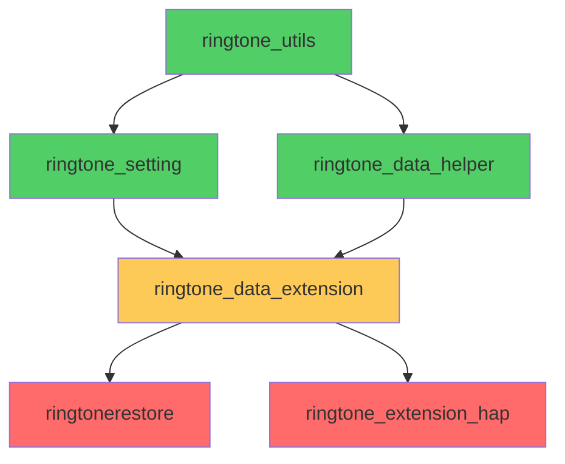
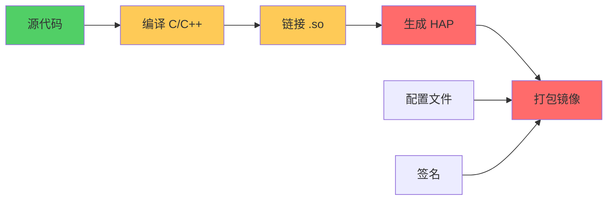
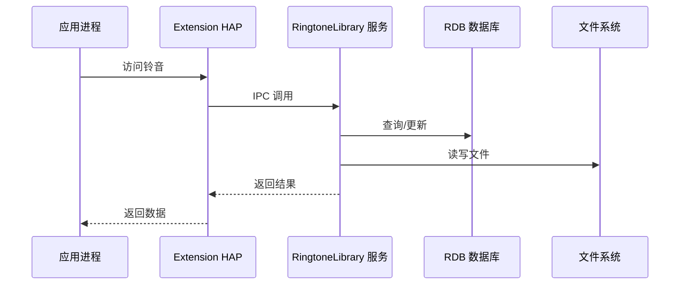

# 构建与产物

> **适用对象**: 开发者
> **阅读时间**: 10 分钟
> **前置知识**: GN 构建系统、OpenHarmony 编译流程

---

## 目的与适用范围

本文档说明 RingtoneLibrary 的构建系统和编译产物，帮助开发者：
- 理解 GN 构建目标和依赖关系
- 了解编译产物和安装路径
- 掌握 Feature 开关使用

**适用场景**:
- 开发者：修改构建配置，添加新模块
- 集成者：了解依赖关系，解决编译问题

---

## GN 目标清单

### 主要 Shared Libraries

| Target 名称 | 类型 | 输出文件 | 依赖 | 证据 |
|------------|------|---------|------|------|
| `ringtone_data_extension` | ohos_shared_library | libringtone_data_extension.so | ringtone_utils, ringtone_setting, ringtone_data_helper | `services/BUILD.gn:49-145` |
| `ringtonerestore` | ohos_shared_library | libringtonerestore.so | ringtone_data_extension, ringtone_setting, ringtone_utils | `services/BUILD.gn:147-231` |
| `ringtone_utils` | ohos_shared_library | libringtone_utils.so | 无内部依赖 | `services/BUILD.gn:237-304` |
| `ringtone_setting` | ohos_shared_library | libringtone_setting.so | ringtone_utils | `services/BUILD.gn:306-365` |
| `ringtone_data_helper` | ohos_shared_library | libringtone_data_helper.so | 无内部依赖 | `services/ringtone_helper/BUILD.gn` |

### HAP Package

| Target 名称 | 类型 | 输出文件 | 依赖 | 证据 |
|------------|------|---------|------|------|
| `ringtone_extension_hap` | ohos_hap | Ringtone_Library_Ext.hap | ringtone_data_extension | `frameworks/ringtone_extension_hap/BUILD.gn` |

### 配置文件

| Target 名称 | 类型 | 输出文件 | 安装路径 | 证据 |
|------------|------|---------|-----------|------|
| `ringtone_scanner_param.para` | ohos_prebuilt_etc | ringtone_scanner_param.para | `/etc/param/` | `services/BUILD.gn:367-372` |
| `ringtone_setting_notifications.para` | ohos_prebuilt_etc | ringtone_setting_notifications.para | `/etc/param/` | `services/BUILD.gn:374-379` |
| `ringtone_setting_ringtones.para` | ohos_prebuilt_etc | ringtone_setting_ringtones.para | `/etc/param/` | `services/BUILD.gn:381-386` |
| `ringtone_setting_shots.para` | ohos_prebuilt_etc | ringtone_setting_shots.para | `/etc/param/` | `services/BUILD.gn:388-393` |
| `ringtone_param.para.dac` | ohos_prebuilt_etc | ringtone_param.para.dac | `/etc/param/` | `services/BUILD.gn:395-400` |

**证据**: `services/BUILD.gn:367-400`

---

## 目标依赖关系



**证据**: `services/BUILD.gn`, `services/ringtone_helper/BUILD.gn`

---

## Feature 开关

### 编译时选项

| 选项 | 默认值 | 说明 | 影响范围 | 证据 |
|------|-------|------|---------|------|
| `ringtone_link_opt` | false | 为 false 时启用所有 sanitizer | 安全特性（CFI、UBSan、整数溢出等） | `ringtone_library.gni` |
| `ringtone_config_policy_enable` | true | 启用配置策略 | 添加 `USE_CONFIG_POLICY` 定义，依赖 config_policy | `ringtone_library.gni` |
| `ringtone_media_library_enable` | true | 启用媒体库集成 | 添加 `USE_MEDIA_LIBRARY` 定义，依赖 media_library | `ringtone_library.gni` |

**证据**: `ringtone_library.gni`, `services/BUILD.gn:138-141, 214-220`

---

## 编译产物清单

### Shared Libraries

| 产物 | 安装路径 | 大小（估算） | 功能 | 证据 |
|------|---------|-------------|------|------|
| `libringtone_data_extension.so` | `/system/lib64/` | ~300KB | DataShareExtension 实现 | `services/BUILD.gn:49` |
| `libringtonerestore.so` | `/system/lib64/module/multimedia/` | ~200KB | N-API 恢复模块 | `services/BUILD.gn:147` |
| `libringtone_utils.so` | `/system/lib64/` | ~150KB | 工具函数库 | `services/BUILD.gn:237` |
| `libringtone_setting.so` | `/system/lib64/` | ~100KB | 设置管理库 | `services/BUILD.gn:306` |
| `libringtone_data_helper.so` | `/system/lib64/` | ~100KB | 客户端辅助库 | `services/ringtone_helper/BUILD.gn` |

**证据**: `services/BUILD.gn:49,147,237,306`, `services/BUILD.gn:228`

---

### HAP Package

| 产物 | 安装路径 | 功能 | 证据 |
|------|---------|------|------|
| `Ringtone_Library_Ext.hap` | `/app/com.ohos.ringtonelibrary.RingtoneLibraryData/` | Extension HAP（备份/恢复） | `frameworks/ringtone_extension_hap/BUILD.gn` |

**证据**: `frameworks/ringtone_extension_hap/BUILD.gn`

---

### 配置文件

| 产物 | 安装路径 | 功能 | 证据 |
|------|---------|------|------|
| `ringtone_scanner_param.para` | `/etc/param/` | 扫描器参数 | `services/BUILD.gn:367` |
| `ringtone_setting_*.para` (x4) | `/etc/param/` | 铃音/振动/通知音设置 | `services/BUILD.gn:374-393` |
| `ringtone_param.para.dac` | `/etc/param/` | DAC 权限配置 | `services/BUILD.gn:395` |

**证据**: `services/BUILD.gn:367-400`

---

## 外部依赖

### 核心依赖

| 组件 | 用途 | 证据 |
|------|------|------|
| `data_share` | DataShare 框架 | `services/BUILD.gn:107-109` |
| `relational_store` | RDB 数据库 | `services/BUILD.gn:121-122` |
| `access_token` | 权限管理 | `services/BUILD.gn:103` |
| `hilog` | 日志输出 | `services/BUILD.gn:110` |
| `ipc` | IPC 通信 | `services/BUILD.gn:114` |
| `napi` | N-API 绑定 | `services/BUILD.gn:117` |

**证据**: `services/BUILD.gn:96-124`

---

## 编译选项

### 全局编译标志

```gn
cflags = [
    "-Wall",
    "-Werror",              # 将警告视为错误
    "-fvisibility=hidden",    # 隐藏符号
    "-fdata-sections",       # 死代码消除
    "-ffunction-sections",
    "-Os",                  # 优化大小
]
```

**证据**: `services/BUILD.gn:29-37`

---

### 安全特性

当 `ringtone_link_opt = false` 时启用：

| 特性 | 说明 | 证据 |
|------|------|------|
| CFI | Control Flow Integrity | `services/BUILD.gn:127-136` |
| UBSan | Undefined Behavior Sanitizer | `services/BUILD.gn:131` |
| Integer Overflow | 整数溢出检查 | `services/BUILD.gn:131` |
| Boundary Sanitize | 边界检查 | `services/BUILD.gn:132` |
| Stack Protector | 栈保护 | `services/BUILD.gn:134` |

**证据**: `services/BUILD.gn:126-136`

---

## 构建流程



---

## 运行时加载关系



**证据**: `services/BUILD.gn`, `README_zh.md`

---

## 关键结论

1. **构建产物**：5 个共享库 + 1 个 HAP + 5 个配置文件
2. **主要目标**：`ringtone_data_extension`（核心服务）、`ringtonerestore`（N-API 恢复）
3. **依赖关系**：utils → setting → data_extension → ringtonerestore
4. **Feature 开关**：3 个主要开关（link_opt、config_policy、media_library）
5. **安全特性**：默认启用 CFI、UBSan 等安全特性

---

## 相关链接

- [目录结构与代码地图](./03_CodeMap.md) - 定位构建文件
- [内部实现细节](./08_Internals.md) - 了解模块职责

---

**文档版本**: 1.0
**最后更新**: 2026-02-07
