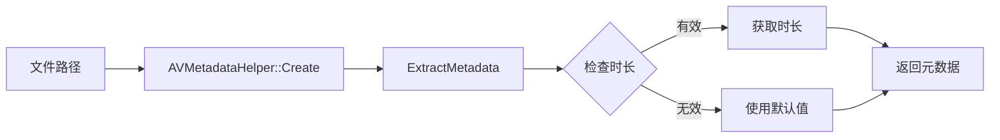
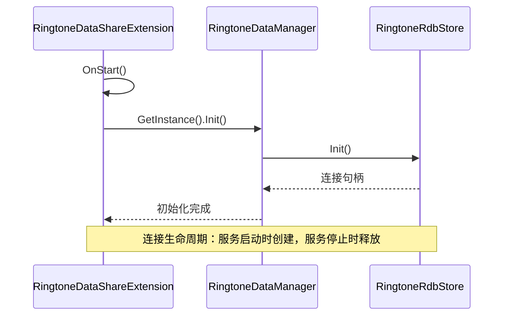
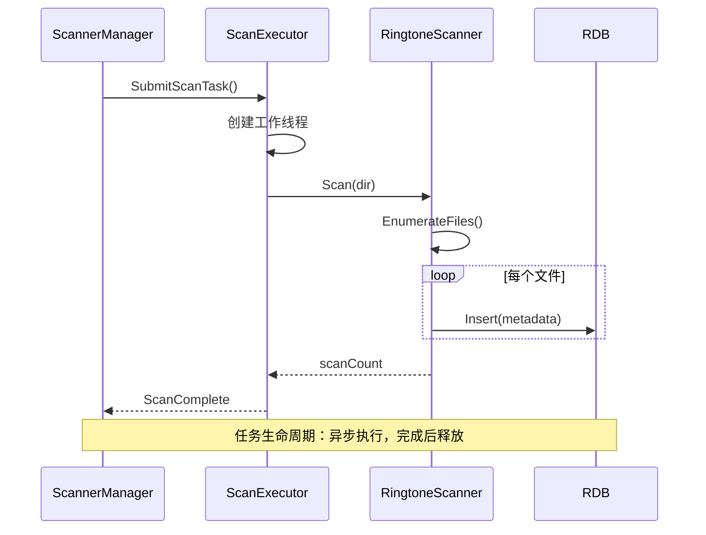
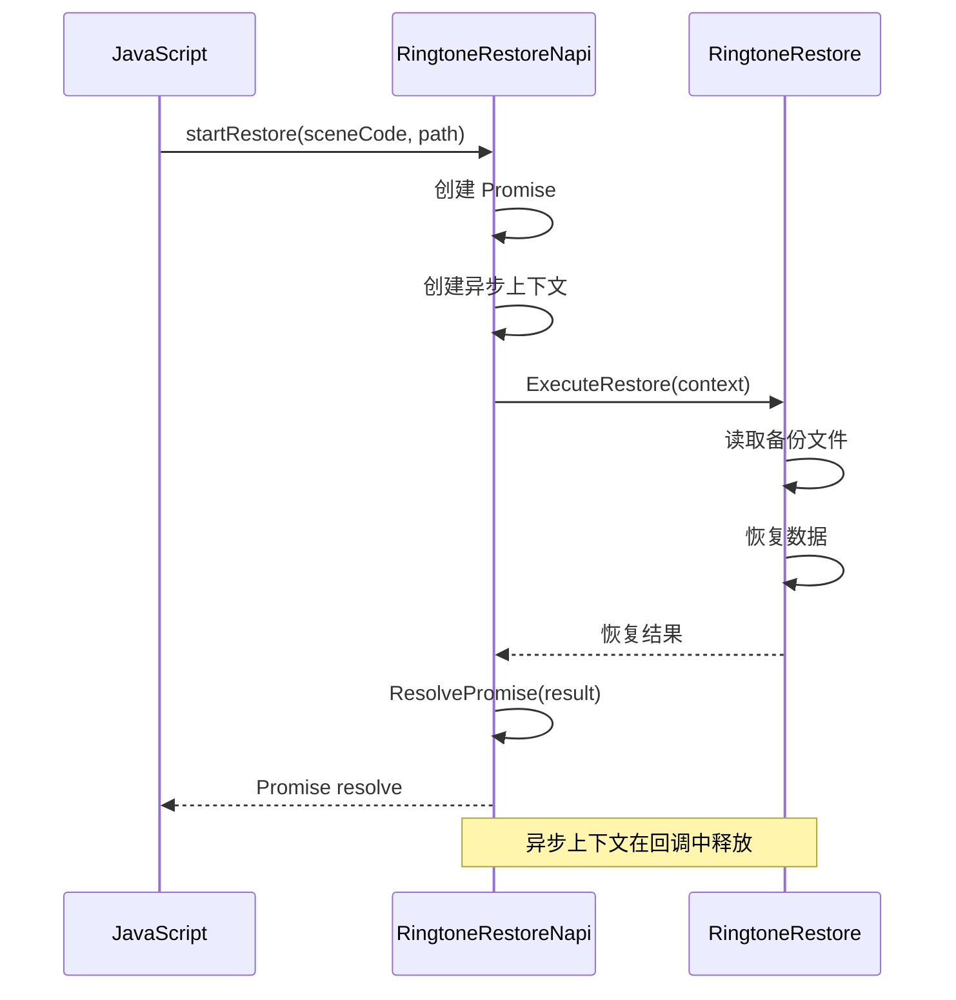

# 内部实现细节

> **适用对象**: 开发者、安全研究员
> **阅读时间**: 20 分钟
> **前置知识**: C++、RDB、DataShare 框架

---

## 目的与适用范围

本文档深入说明 RingtoneLibrary 的内部实现，包括：
- 核心类职责和方法
- 内部 API 契约
- 资源生命周期管理

**适用场景**:
- 开发者：理解核心逻辑，开发新功能
- 安全研究员：深入分析潜在漏洞点

---

## 核心类详解

### RingtoneDataShareExtension

#### 职责
DataShare Extension 的主入口类，处理所有 CRUD 操作。

#### 关键方法

| 方法 | 说明 | 证据 |
|------|------|------|
| `Create()` | 工厂方法，创建 Extension 实例 | `ringtone_datashare_extension.cpp:76` |
| `OnStart()` | 服务启动初始化 | `ringtone_datashare_extension.cpp:135` |
| `OnStop()` | 服务停止清理 | `ringtone_datashare_extension.cpp:174` |
| `Insert()` | 新增铃音 | `ringtone_datashare_extension.cpp:356` |
| `Update()` | 修改铃音 | `ringtone_datashare_extension.cpp:379` |
| `Delete()` | 删除铃音 | `ringtone_datashare_extension.cpp:401` |
| `Query()` | 查询铃音 | `ringtone_datashare_extension.cpp:421` |
| `OpenFile()` | 打开铃音文件 | `ringtone_datashare_extension.cpp:451` |

#### 权限检查流程

```cpp
bool RingtoneDataShareExtension::CheckRingtonePerm() {
    // 1. 检查是否为系统应用
    if (RingtonePermissionUtils::IsSystemApp()) {
        return true;  // 系统应用直接放行
    }

    // 2. 检查权限
    return RingtonePermissionUtils::CheckCallerPermission(
        "ohos.permission.WRITE_RINGTONE");
}
```

**证据**: `ringtone_datashare_extension.cpp:200-216`

---

### RingtoneDataManager

#### 职责
单例数据管理器，封装所有数据库操作。

#### 关键方法

| 方法 | 说明 | 证据 |
|------|------|------|
| `GetInstance()` | 获取单例实例 | `ringtone_data_manager.cpp:52` |
| `Init()` | 初始化（创建数据库、加载默认设置） | `ringtone_data_manager.cpp:64` |
| `Insert()` | 插入铃音记录 | `ringtone_data_manager.cpp` |
| `Update()` | 更新铃音记录 | `ringtone_data_manager.cpp` |
| `Delete()` | 删除铃音记录（并删除文件） | `ringtone_data_manager.cpp` |
| `Query()` | 查询铃音记录 | `ringtone_data_manager.cpp` |

#### 数据库操作模式

```cpp
// 使用参数化查询防止 SQL 注入
std::string sql = "SELECT * FROM " TONE_FILES_TABLE +
                  " WHERE " + RINGTONE_COLUMN_SOURCE_TYPE + " = ?";
auto resultSet = rdbStore_->QuerySql(sql, { "1" });  // 参数化
```

**证据**: `ringtone_data_manager.cpp`

---

### RingtoneScannerObj

#### 职责
扫描指定目录，提取音频/视频文件的元数据并插入数据库。

#### 关键方法

| 方法 | 说明 | 证据 |
|------|------|------|
| `Scan()` | 执行扫描 | `ringtone_scanner.cpp` |
| `ExtractMetadata()` | 提取元数据（时长、MIME 类型） | `ringtone_metadata_extractor.cpp` |
| `InsertToDb()` | 插入扫描结果到数据库 | `ringtone_scanner_db.cpp` |

#### 支持的音频格式

| 格式 | MIME 类型 | 扩展名 | 证据 |
|------|----------|---------|------|
| MP3 | audio/mpeg | .mp3 | `ringtone_type.h:164` |
| OGG | audio/ogg | .ogg | `ringtone_type.h:165` |
| M4A | audio/mp4 | .m4a | `ringtone_type.h:166` |
| FLAC | audio/flac | .flac | `ringtone_type.h:167` |
| WAV | audio/wav | .wav | `ringtone_type.h:168` |
| AMR | audio/amr | .amr | `ringtone_type.h:169` |
| AAC | audio/aac | .aac | `ringtone_type.h:170` |

**证据**: `interfaces/inner_api/native/ringtone_type.h:164-195`

---

### RingtoneMetadataExtractor

#### 职责
使用 AVMetadataHelper 提取音频/视频文件的元数据。

#### 关键方法

| 方法 | 说明 | 证据 |
|------|------|------|
| `Extract()` | 提取元数据（时长、MIME 类型） | `ringtone_metadata_extractor.cpp` |
| `GetDuration()` | 获取媒体时长（毫秒） | `ringtone_metadata_extractor.cpp` |
| `GetMimeType()` | 获取 MIME 类型 | `ringtone_mimetype_utils.cpp` |

#### 元数据提取流程



**证据**: `ringtone_metadata_extractor.cpp`

---

### RingtonePermissionUtils

#### 职责
权限检查和验证工具类。

#### 关键方法

| 方法 | 说明 | 证据 |
|------|------|------|
| `CheckCallerPermission()` | 检查调用者是否拥有指定权限 | `permission_utils.cpp:82` |
| `IsSystemApp()` | 检查调用者是否为系统应用 | `permission_utils.cpp:161` |
| `IsNativeSAApp()` | 检查调用者是否为 Native SA | `permission_utils.cpp:178` |
| `GetTokenId()` | 获取调用者的 AccessToken | `permission_utils.cpp:156` |

#### 系统应用检查逻辑

```cpp
bool RingtonePermissionUtils::IsSystemApp() {
    // 1. 获取调用者的 AccessToken ID
    AccessTokenID tokenId = IPCSkeleton::GetCallingTokenID();

    // 2. 获取 Token 信息
    HapTokenInfo tokenInfo;
    AccessTokenKit::GetHapTokenInfo(tokenId, tokenInfo);

    // 3. 检查是否为系统应用
    return tokenInfo.appType == AppType::SYSTEM_APP;
}
```

**证据**: `permission_utils.cpp:161-178`

---

### RingtoneFileUtils

#### 职责
文件操作工具类（复制、删除、验证）。

#### 关键方法

| 方法 | 说明 | 证据 |
|------|------|------|
| `ValidateAndCopyFile()` | 验证并复制文件到铃音目录 | `ringtone_file_utils.cpp` |
| `DeleteFile()` | 删除文件 | `ringtone_file_utils.cpp` |
| `GetFileSize()` | 获取文件大小 | `ringtone_file_utils.cpp` |

#### 文件复制流程

```cpp
int32_t RingtoneFileUtils::ValidateAndCopyFile(
    const string& srcPath,
    const string& destPath) {

    // 1. 验证源文件存在
    if (access(srcPath.c_str(), F_OK) != 0) {
        return E_FILE_NOT_FOUND;
    }

    // 2. 验证源文件可读
    if (access(srcPath.c_str(), R_OK) != 0) {
        return E_PERMISSION_DENIED;
    }

    // 3. 检查目标目录可写
    string destDir = destPath.substr(0, destPath.find_last_of('/'));
    if (access(destDir.c_str(), W_OK) != 0) {
        return E_PERMISSION_DENIED;
    }

    // 4. 复制文件
    // TODO(待确认): 是否有路径规范化检查

    return CopyFile(srcPath, destPath);
}
```

**证据**: `ringtone_file_utils.cpp`

---

### RingtoneRestoreNapi

#### 职责
N-API 绑定，暴露 `startRestore` 函数给 JavaScript。

#### 导出方法

| N-API 方法 | JavaScript 名称 | 说明 | 证据 |
|-----------|---------------|------|------|
| `JSStartRestore` | `startRestore` | 异步启动恢复操作 | `ringtone_restore_napi.cpp` |

#### Promise 实现

```cpp
napi_value RingtoneRestoreNapi::JSStartRestore(
    napi_env env,
    napi_callback_info info) {

    // 1. 提取参数
    size_t argc = 2;
    napi_value argv[2];
    napi_get_cb_info(env, info, &argc, argv, nullptr, nullptr);

    int32_t sceneCode;
    string baseBackupPath;
    napi_get_value_int32(env, argv[0], &sceneCode);
    napi_get_value_utf8_string(env, argv[1], &baseBackupPath);

    // 2. 创建 Promise
    napi_value promise, deferred;
    napi_create_promise(env, &deferred, &promise);

    // 3. 异步执行恢复
    RestoreAsyncContext* context = new RestoreAsyncContext();
    context->deferred = deferred;
    context->sceneCode = sceneCode;
    context->baseBackupPath = baseBackupPath;

    napi_queue_async_work(env, context, ExecuteRestore, CompleteRestore);

    return promise;
}
```

**证据**: `ringtone_restore_napi.cpp`

---

## 内部 API 契约

### 稳定接口

以下接口为稳定接口，可以安全使用：

| 接口 | 头文件 | 稳定性 | 证据 |
|------|---------|--------|------|
| `RingtoneAsset` | `ringtone_asset.h` | 稳定 | `ringtone_asset.h` |
| `VibrateAsset` | `vibrate_asset.h` | 稳定 | `vibrate_asset.h` |
| `SimcardSettingAsset` | `simcard_setting_asset.h` | 稳定 | `simcard_setting_asset.h` |
| `RingtoneFetchResult` | `ringtone_fetch_result.h` | 稳定 | `ringtone_fetch_result.h` |
| 数据库常量 | `ringtone_db_const.h` | 稳定 | `ringtone_db_const.h` |
| URI 定义 | `ringtone_proxy_uri.h` | 稳定 | `ringtone_proxy_uri.h` |

---

### 不稳定接口

以下接口为内部实现，可能变更：

| 接口 | 头文件 | 稳定性 | 原因 |
|------|---------|--------|------|
| `RingtoneDataManager` | `ringtone_data_manager.h` | 内部 | 单例实现，内部使用 |
| `RingtoneDataShareExtension` | `ringtone_datashare_extension.h` | 内部 | DataShare 框架接口 |
| `RingtoneScannerObj` | `ringtone_scanner.h` | 内部 | 扫描逻辑内部实现 |

---

## 资源生命周期

### RDB 连接



**证据**: `ringtone_datashare_extension.cpp:135`, `ringtone_rdbstore.cpp:88`

---

### 扫描任务



**证据**: `ringtone_scanner_manager.cpp`, `ringtone_scan_executor.cpp`

---

### N-API 资源



**证据**: `ringtone_restore_napi.cpp`

---

## 错误处理机制

### 错误码定义

| 错误码 | 宏定义 | 说明 | 证据 |
|--------|---------|------|------|
| E_OK | 0 | 成功 | 通用 |
| E_INVALID_URI | -1 | 无效的 URI | `ringtone_datashare_extension.cpp` |
| E_PERMISSION_DENIED | -2 | 权限不足 | `permission_utils.cpp` |
| E_FILE_NOT_FOUND | -3 | 文件不存在 | `ringtone_file_utils.cpp` |
| E_DB_ERROR | -4 | 数据库错误 | `ringtone_rdbstore.cpp` |

---

### 错误传播

```cpp
// 在 Extension 层捕获并传播错误
int32_t RingtoneDataShareExtension::Insert(...) {
    ErrCode err = CheckRingtonePerm();
    if (err != E_OK) {
        return err;  // 权限错误直接返回
    }

    err = dataManager_->Insert(values);
    if (err != E_OK) {
        MEDIA_LOGE("Insert failed: %{public}d", err);
        return err;  // 数据库错误传播
    }

    return E_OK;
}
```

**证据**: `ringtone_datashare_extension.cpp`

---

## 关键结论

1. **核心类**：7 个主要类（Extension、DataManager、Scanner、Restore 等）
2. **内部 API**：6 个稳定接口（Asset、FetchResult 等）
3. **资源生命周期**：RDB 连接（服务生命周期）、扫描任务（异步执行）、N-API 上下文（回调释放）
4. **错误处理**：统一的错误码定义和传播机制
5. **安全控制**：权限检查、系统应用验证、参数化查询

---

## 相关链接

- [目录结构与代码地图](./03_CodeMap.md) - 定位关键代码
- [架构与数据流](./02_Architecture.md) - 理解系统架构
- [安全风险评估](./06_SecurityReview.md) - 深度安全分析

---

**文档版本**: 1.0
**最后更新**: 2026-02-07
