# VPE 视频处理引擎架构设计

本文档详细描述 VPE 视频处理引擎的架构设计，包括组件图、数据流、线程模型和关键时序。

---

## 1 整体架构

### 1.1 架构分层

VPE 采用分层架构设计，从上到下分为四个层次：

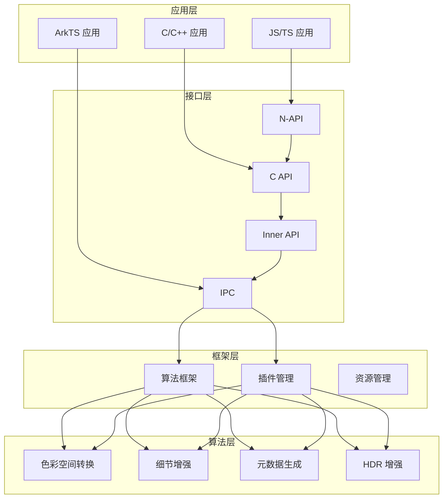

**证据位置**：`README.md:12-119` ✅

### 1.2 模块职责

| 层级 | 模块 | 职责 | 证据位置 |
|------|------|------|---------|
| **应用层** | JS/TS API | 提供 ArkTS/JS 调用接口 | `detail_enhance_napi.cpp:314-327` ✅ |
| **应用层** | C API | 提供 C 语言调用接口 | `image_processing.h` ✅ |
| **接口层** | Inner API | 系统内部模块间调用 | `interfaces/inner_api/` ✅ |
| **接口层** | IPC | 跨进程服务通信 | `IVideoProcessingServiceManager.idl` ✅ |
| **框架层** | 算法框架 | 统一调度各算法模块 | `framework/algorithm/` ✅ |
| **框架层** | 插件管理 | 动态算法插件注册加载 | `extension_manager.cpp` ✅ |
| **算法层** | 各算法模块 | 具体算法实现 | `framework/algorithm/*/` ✅ |

---

## 2 组件图

### 2.1 核心组件

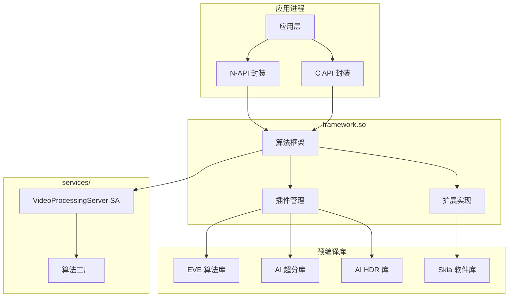

### 2.2 数据流组件

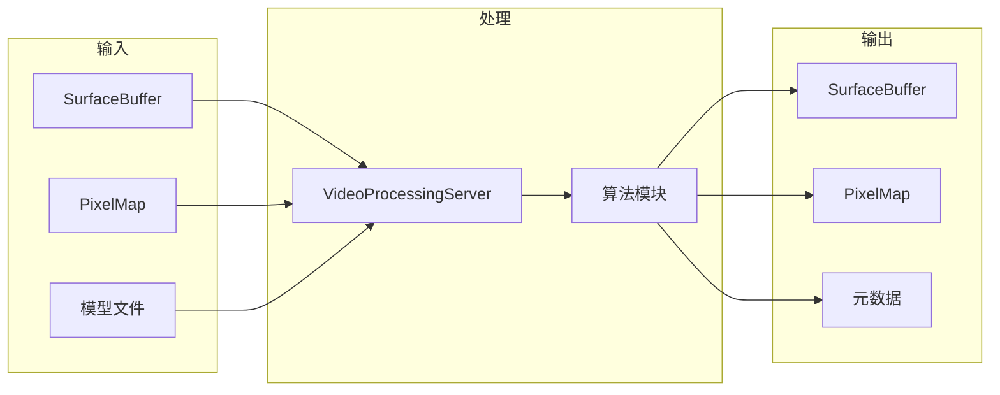

---

## 3 数据流

### 3.1 图像处理数据流

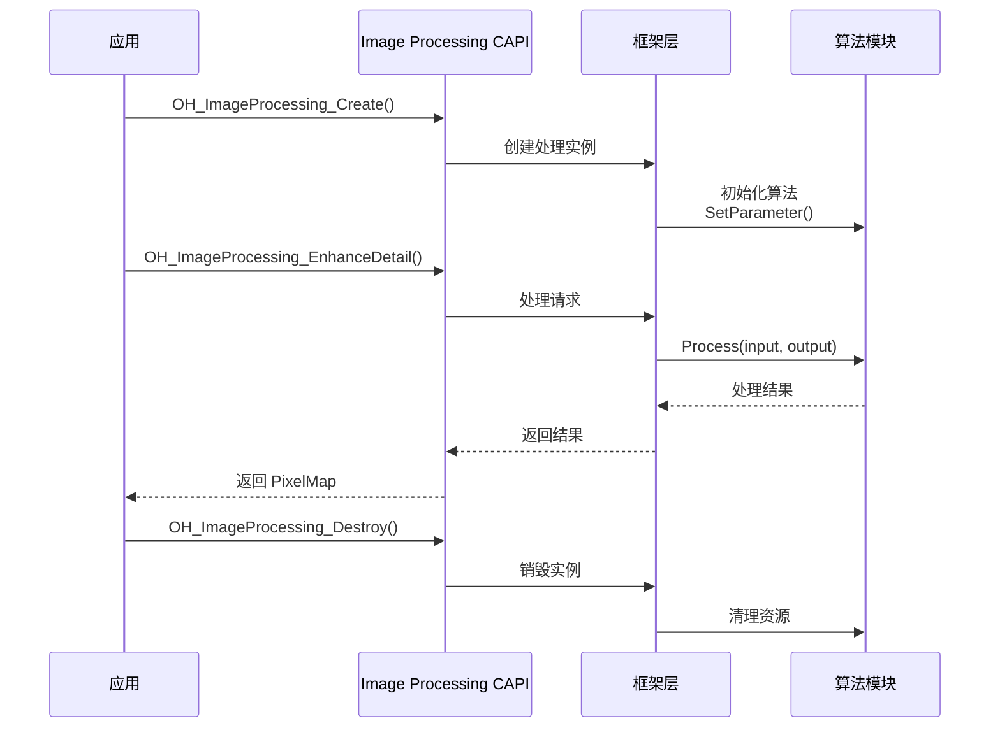

**证据位置**：`image_processing.h:150-308` ✅

### 3.2 视频处理数据流

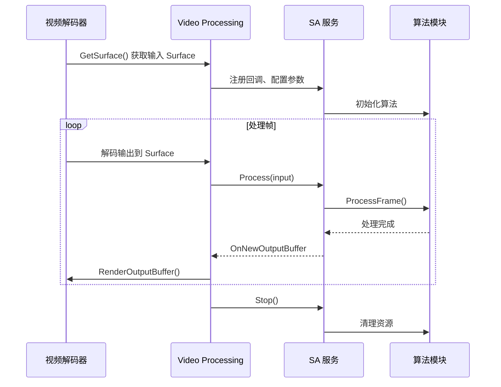

**证据位置**：`video_processing.h:120-244` ✅

### 3.3 插件加载数据流

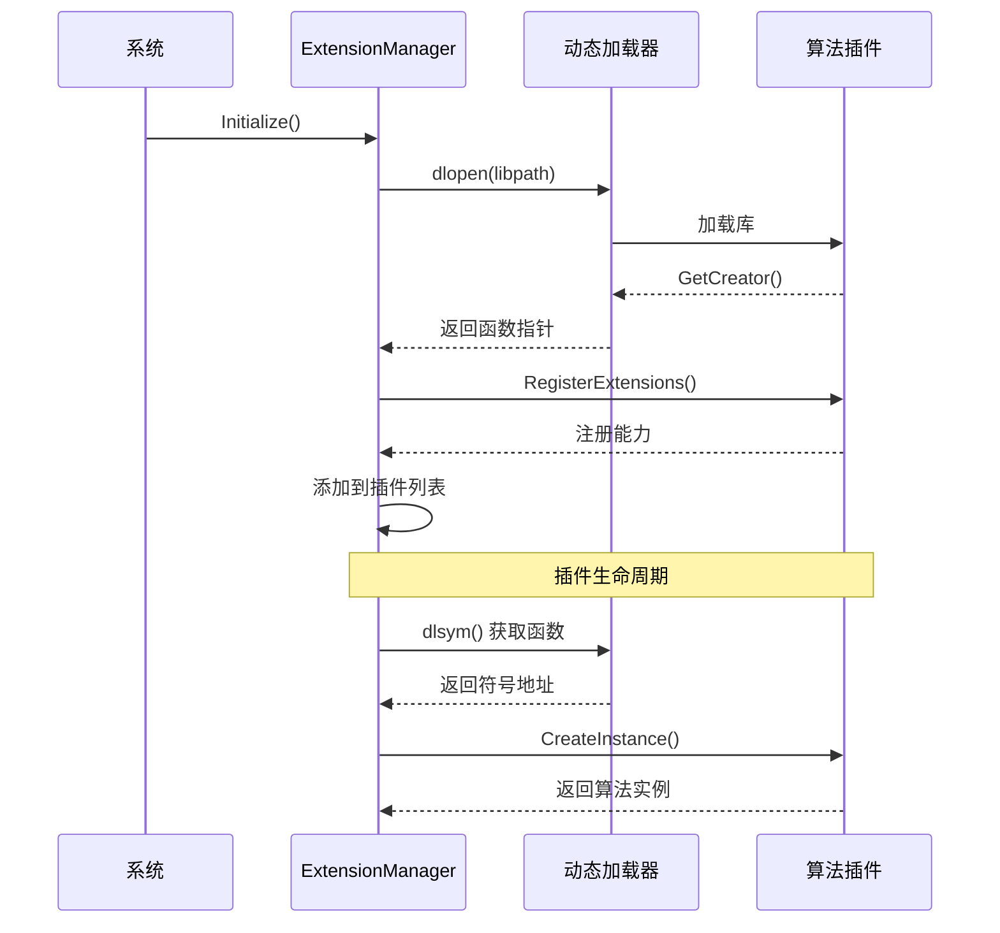

**证据位置**：`video_processing_algorithm_factory.cpp:63-90` ✅

---

## 4 线程模型

### 4.1 线程划分

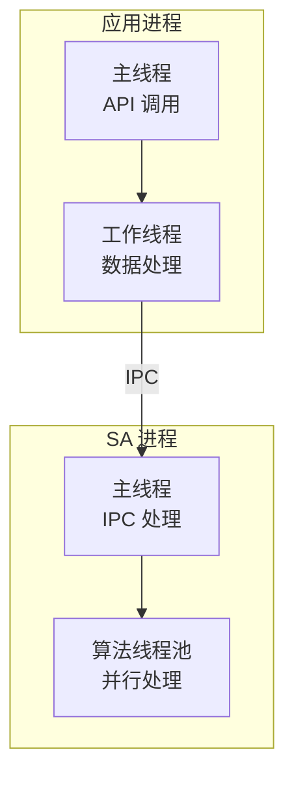

### 4.2 线程职责

| 线程 | 职责 | 证据位置 |
|------|------|---------|
| **应用主线程** | API 调用、N-API 回调 | `detail_enhance_napi.cpp:91-117` ✅ |
| **SA 主线程** | IPC 请求处理、生命周期管理 | `video_processing_server.cpp` ✅ |
| **算法线程池** | 实际算法计算、资源密集型任务 | `services/algorithm/` ✅ |

### 4.3 线程同步机制

**使用到的同步原语**：

| 同步类型 | 使用场景 | 证据位置 |
|---------|---------|---------|
| **std::mutex** | N-API 实例保护 | `detail_enhance_napi.cpp:94` ✅ |
| **std::lock_guard** | 临界区保护 | `detail_enhance_napi.cpp:121` ✅ |
| **sptr** | IPC 远程对象管理 | `video_processing_client.h` ✅ |
| **回调机制** | 异步结果通知 | `video_processing_callback_impl.cpp` ✅ |

**示例代码**：
```cpp
// detail_enhance_napi.cpp:94-99
std::lock_guard<std::mutex> lock(lock_);
if (mDetailEnh != nullptr) {
    napi_get_boolean(env, true, &result);
    return result;
}
```

---

## 5 关键时序

### 5.1 N-API 初始化时序

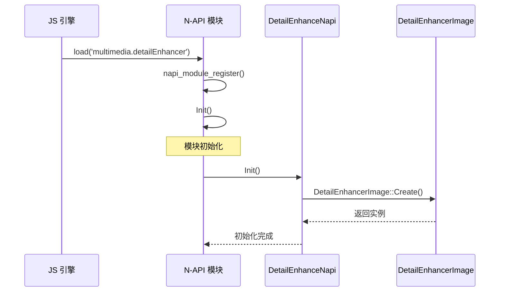

**证据位置**：`detail_enhance_napi.cpp:302-327` ✅

### 5.2 SA 服务加载时序

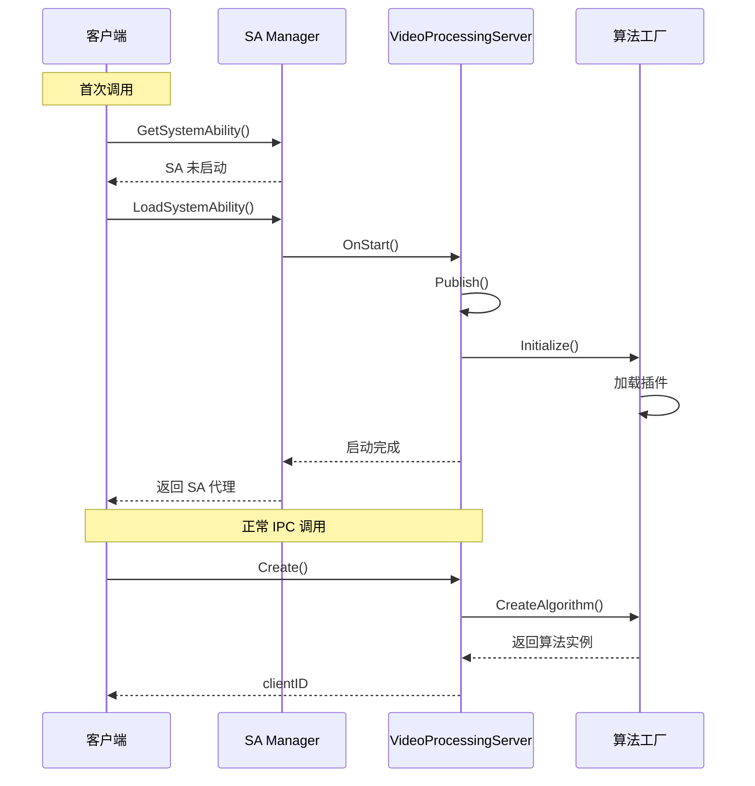

**证据位置**：
- `video_processing_client.cpp:139-185` ✅
- `video_processing_server.cpp:41` ✅

### 5.3 图像处理完整时序

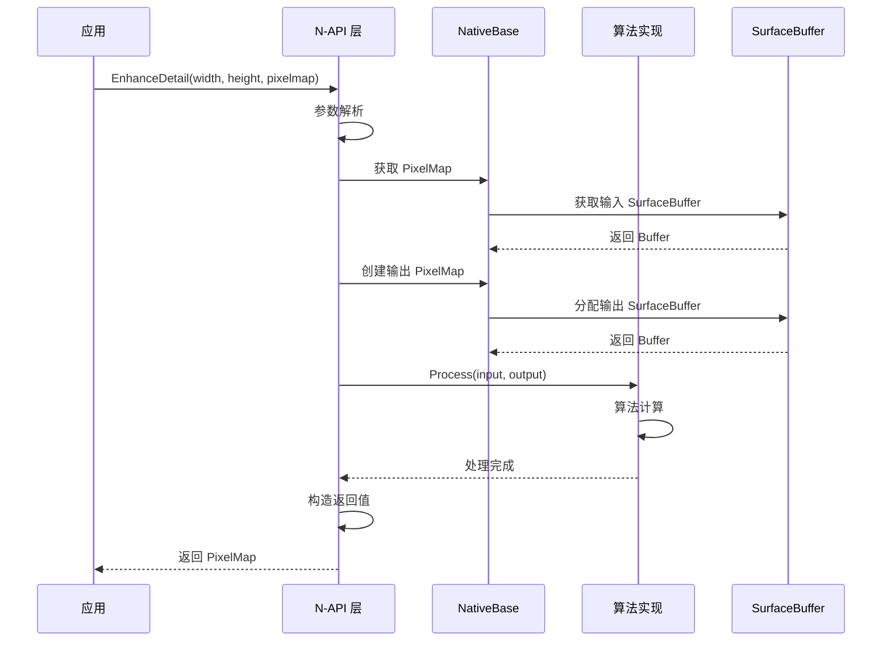

**证据位置**：`detail_enhance_napi.cpp:217-251` ✅

---

## 6 依赖方向

### 6.1 模块依赖图

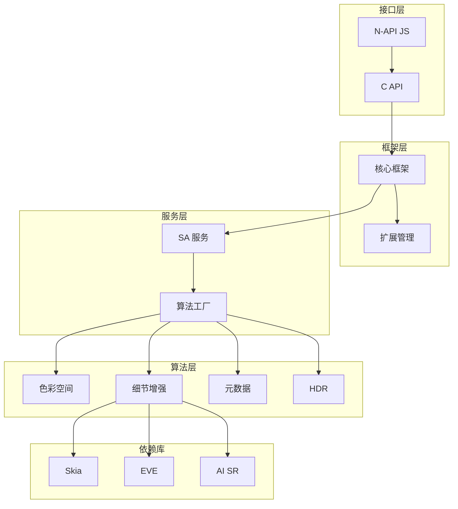

### 6.2 依赖关系说明

| 依赖方向 | 说明 | 证据位置 |
|---------|------|---------|
| 接口 → 框架 | CAPI 依赖核心框架 | `framework/BUILD.gn:335` ✅ |
| 框架 → 服务 | IPC 调用 SA 服务 | `services/BUILD.gn` ✅ |
| 服务 → 算法 | 工厂创建算法实例 | `video_processing_algorithm_factory.cpp` ✅ |
| 算法 → 扩展 | 插件动态加载 | `extension_manager.cpp:51` ✅ |

### 6.3 循环依赖检测

**当前架构无循环依赖** ✅

| 模块对 | 是否存在循环 | 说明 |
|-------|-------------|------|
| CAPI ↔ 框架 | ❌ 无 | CAPI 调用框架，框架不回调 CAPI |
| 框架 ↔ 服务 | ❌ 无 | IPC 单向调用 |
| 服务 ↔ 算法 | ❌ 无 | 工厂模式创建 |

---

## 7 跨进程通信

### 7.1 IPC 架构

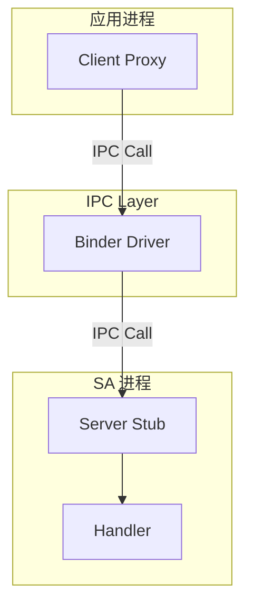

### 7.2 IDL 接口定义

**接口文件**：`services/IVideoProcessingServiceManager.idl`

| 方法 | 功能 | 方向 |
|------|------|------|
| `LoadInfo` | 加载模型信息 | Request |
| `Create` | 创建算法实例 | Request |
| `Destroy` | 销毁算法实例 | Request |
| `SetParameter` | 设置参数 | Request |
| `GetParameter` | 获取参数 | Request |
| `UpdateMetadata` | 更新元数据 | Request |
| `Process` | 执行处理 | Request |
| `ComposeImage` | 图像合成 | Request |
| `DecomposeImage` | 图像分解 | Request |

**证据位置**：`services/IVideoProcessingServiceManager.idl` ✅

### 7.3 SA 配置

| 配置项 | 值 | 证据位置 |
|--------|-----|---------|
| SA ID | 0x00010256 (66134) | `vpe_sa_constants.h:26` ✅ |
| 进程名 | video_processing_service | `video_processing_service.cfg` ✅ |
| 运行用户 | media | `video_processing_service.cfg` ✅ |
| SELinux 标签 | u:r:video_processing_service:s0 | `video_processing_service.cfg` ✅ |

---

## 8 插件扩展机制

### 8.1 插件注册流程

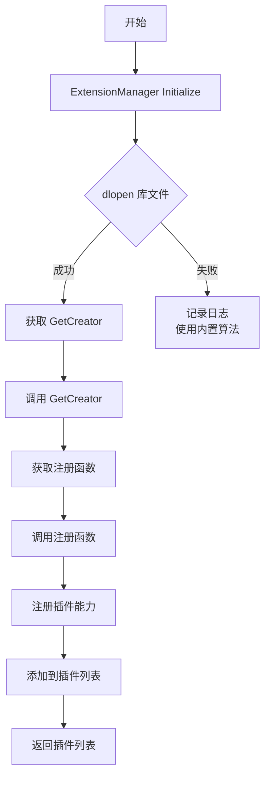

**证据位置**：`extension_manager.cpp:40-80` ✅

### 8.2 插件类型

| 插件类型 | 基类 | 功能 | 证据位置 |
|---------|------|------|---------|
| 色彩空间转换 | ColorSpaceConverterBase | 色彩空间转换 | `colorspace_converter_base.h` ✅ |
| 细节增强 | DetailEnhancerBase | 超分/锐化 | `detail_enhancer_base.h` ✅ |
| 元数据生成 | MetadataGeneratorBase | 元数据生成 | `metadata_generator_base.h` ✅ |

### 8.3 内置插件

| 插件名称 | 类型 | 算法来源 | 证据位置 |
|---------|------|---------|---------|
| Skia | DetailEnhancer | Skia 软件渲染 | `skia_impl.cpp` ✅ |
| EVE | DetailEnhancer | EVE AI 引擎 | 预编译库 |
| AISR | DetailEnhancer | AI 超分 | 预编译库 |
| AIHDR | HDR 增强 | AI HDR 引擎 | 预编译库 |

---

## 9 相关文档链接

| 文档 | 说明 |
|------|------|
| [index.md](./index.md) | 项目概览 |
| [NAPI_Reference.md](./NAPI_Reference.md) | API 参考 |
| [Build_System.md](./Build_System.md) | 构建系统 |
| [Artifacts.md](./Artifacts.md) | 编译产物 |
| [Security_Review.md](./Security_Review.md) | 安全评审 |

---

## 10 更新日志

| 版本 | 日期 | 变更内容 |
|------|------|---------|
| 1.0 | 2026-02-06 | 初始版本，包含完整架构设计 |
