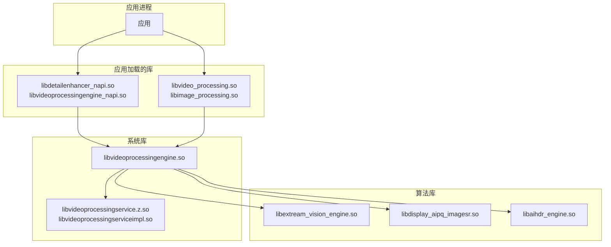
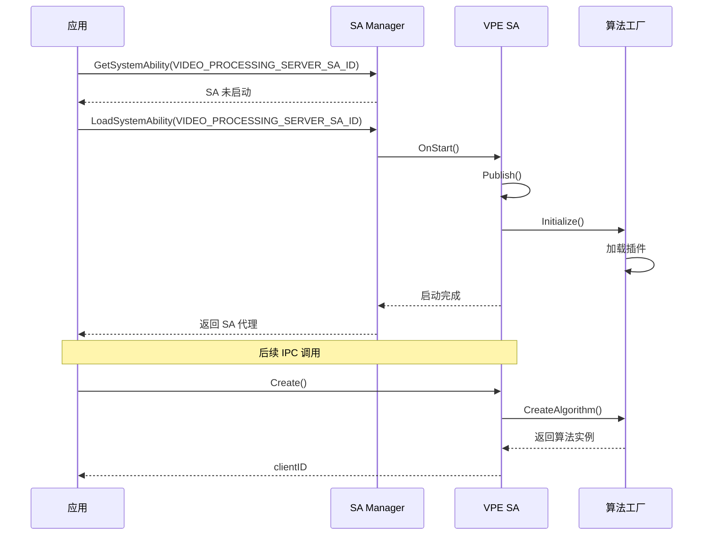

# VPE 编译产物

本文档描述 VPE 视频处理引擎的编译产物、安装路径和运行时加载关系。

---

## 1 产物清单

### 1.1 核心库产物

| 产物名称 | 类型 | 描述 | 证据位置 |
|---------|------|------|---------|
| `libvideoprocessingengine.so` | 共享库 | VPE 核心引擎库，包含所有算法框架 | `framework/BUILD.gn:145` ✅ |
| `libvideo_processing.so` | NDK 库 | 视频处理 C API 库 | `framework/BUILD.gn:361` ✅ |
| `libimage_processing.so` | NDK 库 | 图像处理 C API 库 | `framework/BUILD.gn:277` ✅ |
| `libdetailenhancer_napi.so` | NAPI 库 | 细节增强 JS API 库（新版） | `framework/BUILD.gn:488` ✅ |
| `libvideoprocessingengine_napi.so` | NAPI 库 | 视频处理引擎 JS API 库 | `framework/BUILD.gn:442` ✅ |

### 1.2 服务层产物

| 产物名称 | 类型 | 描述 | 证据位置 |
|---------|------|------|---------|
| `libvideoprocessingservice.z.so` | SA 服务 | VPE 系统能力服务 | `services/BUILD.gn` ✅ |
| `libvideoprocessingserviceimpl.so` | 共享库 | SA 服务实现库 | `services/BUILD.gn` ✅ |

### 1.3 算法插件产物

| 产物名称 | 类型 | 描述 | 证据位置 |
|---------|------|------|---------|
| `libextream_vision_engine.so` | 预编译库 | EVE AI 视觉增强引擎 | `framework/BUILD.gn:91` ✅ |
| `libdisplay_aipq_imagesr.so` | 预编译库 | AI 超分辨率算法库 | `framework/BUILD.gn:107` ✅ |
| `libaihdr_engine.so` | 预编译库 | AI HDR 增强引擎 | `framework/BUILD.gn:121` ✅ |

### 1.4 NDK 头文件产物

| 产物名称 | 类型 | 描述 | 证据位置 |
|---------|------|------|---------|
| `multimedia/video_processing_engine/video_processing.h` | 头文件 | 视频处理 C API 头文件 | `interfaces/kits/c/video_processing/BUILD.gn` ✅ |
| `multimedia/video_processing_engine/video_processing_types.h` | 头文件 | 视频处理类型定义 | `interfaces/kits/c/video_processing/BUILD.gn` ✅ |
| `multimedia/video_processing_engine/image_processing.h` | 头文件 | 图像处理 C API 头文件 | `interfaces/kits/c/image_processing/BUILD.gn` ✅ |
| `multimedia/video_processing_engine/image_processing_types.h` | 头文件 | 图像处理类型定义 | `interfaces/kits/c/image_processing/BUILD.gn` ✅ |

---

## 2 安装路径

### 2.1 系统库路径

| 产物 | 安装路径 | 模式 | 证据位置 |
|------|---------|------|---------|
| `libvideoprocessingengine.so` | `/system/lib64/` | 系统库 | `framework/BUILD.gn:148` ✅ |
| `libvideo_processing.so` | `/system/lib64/` | 系统库 | `framework/BUILD.gn:363` ✅ |
| `libimage_processing.so` | `/system/lib64/` | 系统库 | `framework/BUILD.gn:279` ✅ |
| `libvideoprocessingservice.z.so` | `/system/lib64/` | 系统库 | `services/BUILD.gn` ✅ |
| `libvideoprocessingserviceimpl.so` | `/system/lib64/` | 系统库 | `services/BUILD.gn` ✅ |
| `libextream_vision_engine.so` | `/system/lib64/` | 系统库 | `framework/BUILD.gn:99` ✅ |
| `libdisplay_aipq_imagesr.so` | `/system/lib64/` | 系统库 | `framework/BUILD.gn:113` ✅ |
| `libaihdr_engine.so` | `/system/lib64/` | 系统库 | `framework/BUILD.gn:127` ✅ |

### 2.2 模块路径

| 产物 | 安装路径 | 模式 | 证据位置 |
|------|---------|------|---------|
| `libdetailenhancer_napi.so` | `/system/lib64/module/multimedia/` | 模块 | `framework/BUILD.gn:484` ✅ |
| `libvideoprocessingengine_napi.so` | `/system/lib64/module/multimedia/` | 模块 | `framework/BUILD.gn:532` ✅ |

### 2.3 数据路径

| 路径 | 用途 | 权限 | 证据位置 |
|------|------|------|---------|
| `/data/service/el1/public/videoprocessingservice/` | SA 数据目录 | `0711 media media` | `video_processing_service.cfg` ✅ |
| `/sys_prod/etc/VideoProcessingEngine/` | 模型文件目录 | 只读 | `vpe_model_path.h` ✅ |

### 2.4 配置文件路径

| 路径 | 用途 | 证据位置 |
|------|------|---------|
| `/system/profile/video_processing_service.json` | SA 启动配置 | `video_processing_service.cfg` ✅ |
| `/system/etc/init/videoprocessingservice.cfg` | 服务配置 | `services/sa_profile/` ✅ |

---

## 3 运行时加载关系

### 3.1 加载依赖图



### 3.2 动态库加载顺序

| 加载顺序 | 库文件 | 加载者 | 加载方式 |
|---------|--------|--------|---------|
| 1 | `libvideoprocessingengine.so` | NAPI/CAPI 库 | dlopen (链接时) |
| 2 | `libvideoprocessingservice.z.so` | videoprocessingengine.so | dlopen (IPC) |
| 3 | `libvideoprocessingserviceimpl.so` | videoprocessingservice.so | dlopen (IPC) |
| 4 | `libextream_vision_engine.so` | videoprocessingengine.so | dlopen (运行时) |
| 5 | `libdisplay_aipq_imagesr.so` | videoprocessingengine.so | dlopen (运行时) |
| 6 | `libaihdr_engine.so` | videoprocessingengine.so | dlopen (运行时) |

**证据位置**：`video_processing_algorithm_factory.cpp:63-90` ✅

### 3.3 算法库加载机制

**动态库加载代码**（`video_processing_algorithm_factory.cpp:63-76`）：

```cpp
bool VideoProcessingAlgorithmFactory::LoadDynamicAlgorithm(const std::string& path)
{
    // 打开动态库
    handle_ = dlopen(path.c_str(), RTLD_NOW);
    if (handle_ == nullptr) {
        VPE_LOGD("Can't open library '%{public}s' - %{public}s", 
                 path.c_str(), dlerror());
        return false;
    }
    
    // 获取创建函数符号
    auto getCreator = reinterpret_cast<GetCreator>(
        dlsym(handle_, "GetDynamicAlgorithmCreator"));
    if (getCreator == nullptr) {
        VPE_LOGD("Can't find symbol GetDynamicAlgorithmCreator");
        return false;
    }
    
    return true;
}
```

**加载标志**：`RTLD_NOW`

| 标志 | 说明 |
|------|------|
| `RTLD_NOW` | 立即加载所有未定义符号 |

---

## 4 SA 服务加载

### 4.1 SA 启动流程



### 4.2 SA 配置

**SA ID**：`0x00010256` (十进制 66134)

**证据位置**：`services/utils/include/vpe_sa_constants.h:26` ✅

**SA 配置文件**（`services/sa_profile/66134.json`）：

```json
{
    "process": "video_processing_service",
    "systemability": [
        {
            "name": 66134,
            "libpath": "libvideoprocessingservice.z.so",
            "run-on-create": false,
            "auto-restart": true,
            "distributed": false
        }
    ]
}
```

**服务启动配置**（`services/sa_profile/video_processing_service.cfg`）：

```json
{
  "services": [
    {
      "name": "video_processing_service",
      "path": [
        "/system/bin/sa_main",
        "/system/profile/video_processing_service.json"
      ],
      "uid": "media",
      "gid": ["system"],
      "ondemand": true,
      "secon": "u:r:video_processing_service:s0"
    }
  ]
}
```

---

## 5 模型文件

### 5.1 模型文件列表

VPE 使用 88 个模型文件用于算法处理：

| 模型类别 | 数量 | 路径 | 证据位置 |
|---------|------|------|---------|
| AI Light 模型 | 1 | `/sys_prod/etc/VideoProcessingEngine/AILIGHT_normal.omc` | `vpe_model_path.h` ✅ |
| AI HDR 模型 | 1 | `/sys_prod/etc/VideoProcessingEngine/aihdr_pic.bin` | `vpe_model_path.h` ✅ |
| 其他模型 | 86 | `/sys_prod/etc/VideoProcessingEngine/` | `vpe_model_path.h:92-158` ✅ |

### 5.2 模型文件路径定义

```cpp
// vpe_model_path.h:92-158
const std::array<std::string, VPE_MODEL_KEY_NUM> VPE_MODEL_PATHS = {
    "/sys_prod/etc/VideoProcessingEngine/AILIGHT_normal.omc",
    "/sys_prod/etc/VideoProcessingEngine/aihdr_pic.bin",
    // ... 共 88 个路径
};
```

### 5.3 模型文件大小限制

```cpp
// video_processing_server.cpp:82
const int VPE_INFO_FILE_MAX_LENGTH = 20485720;  // 约 20MB

if (fileLength < 0 || fileLength > VPE_INFO_FILE_MAX_LENGTH) {
    VPE_LOGE("fileLength %{public}d is too short or too long!", fileLength);
    return ERR_INVALID_DATA;
}
```

---

## 6 依赖库

### 6.1 系统依赖

| 依赖库 | 功能 | 证据位置 |
|--------|------|---------|
| `libhilog.so` | 日志系统 | `framework/BUILD.gn:232` ✅ |
| `libhitrace.so` | 性能追踪 | `framework/BUILD.gn:233` ✅ |
| `libipc.so` | IPC 通信 | `framework/BUILD.gn:236` ✅ |
| `libmedia_foundation.so` | 媒体基础 | `framework/BUILD.gn:237` ✅ |
| `libsurface.so` | Surface 管理 | `framework/BUILD.gn:226` ✅ |
| `libgraphic_2d.so` | 2D 图形 | `framework/BUILD.gn:223-225` ✅ |
| `libsafwk.so` | System Ability 框架 | `framework/BUILD.gn:238` ✅ |
| `libsamgr.so` | SAMgr 代理 | `framework/BUILD.gn:239` ✅ |
| `libskia.so` | Skia 图形库 | `framework/BUILD.gn:240` ✅ |

### 6.2 第三方依赖

| 依赖库 | 功能 | 证据位置 |
|--------|------|---------|
| `libcl.so` | OpenCL 计算 | `framework/BUILD.gn:241` ✅ |
| `libEGL.so` | OpenGL ES | `framework/BUILD.gn:224` ✅ |
| `libGLESv3.so` | OpenGL ES 3.0 | `framework/BUILD.gn:225` ✅ |

---

## 7 产物验证

### 7.1 库文件检查

```bash
# 检查库是否正确安装
ls -la /system/lib64/libvideoprocessingengine.so
ls -la /system/lib64/libvideo_processing.so
ls -la /system/lib64/libimage_processing.so

# 检查库依赖
ldd /system/lib64/libvideoprocessingengine.so

# 检查导出符号
nm -D /system/lib64/libvideoprocessingengine.so | grep " T "
```

### 7.2 SA 服务检查

```bash
# 检查 SA 是否运行
hidumper -s 66134

# 检查 SA 配置
cat /system/profile/video_processing_service.json
```

### 7.3 模型文件检查

```bash
# 检查模型文件是否存在
ls -la /sys_prod/etc/VideoProcessingEngine/

# 检查文件大小（应小于 20MB）
ls -la /sys_prod/etc/VideoProcessingEngine/*.omc
```

---

## 8 相关文档链接

| 文档 | 说明 |
|------|------|
| [Build_System.md](./Build_System.md) | 构建系统 |
| [Architecture.md](./Architecture.md) | 架构设计 |
| [Security_Review.md](./Security_Review.md) | 安全评审 |
| [Troubleshooting.md](./Troubleshooting.md) | 问题定位 |

---

## 9 更新日志

| 版本 | 日期 | 变更内容 |
|------|------|---------|
| 1.0 | 2026-02-06 | 初始版本，包含完整产物文档 |
