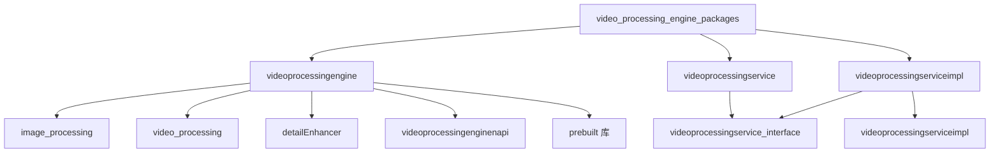

# VPE 构建系统

本文档描述 VPE 视频处理引擎的 GN 构建系统配置，包括 Targets 列表、依赖关系和构建产物。

---

## 1 构建配置概述

### 1.1 构建系统

VPE 使用 **GN（Generate Ninja）** 作为构建系统，与 OpenHarmony 整体构建保持一致。

**构建命令**：

```bash
# 32位 ARM 系统编译
./build.sh --product-name {product_name} --ccache --build-target video_processing_engine

# 64位 ARM 系统编译
./build.sh --product-name {product_name} --ccache --target-cpu arm64 --build-target video_processing_engine
```

**证据位置**：`README.md:165-173` ✅

### 1.2 配置文件

| 文件 | 用途 | 证据位置 |
|------|------|---------|
| `config.gni` | 全局路径和编译配置 | `config.gni` ✅ |
| `BUILD.gn` (根目录) | 顶层聚合目标 | `BUILD.gn` ✅ |
| `framework/BUILD.gn` | 框架层 Targets | `framework/BUILD.gn` ✅ |
| `services/BUILD.gn` | 服务层 Targets | `services/BUILD.gn` ✅ |
| `interfaces/kits/*/BUILD.gn` | 接口层 Targets | `interfaces/kits/*/BUILD.gn` ✅ |

---

## 2 全局配置 (config.gni)

### 2.1 目录路径变量

```gn
# 根目录
VIDEO_PROCESSING_ENGINE_ROOT_DIR = "//foundation/multimedia/video_processing_engine"

# 框架目录
FRAMEWORK_DIR = "$VIDEO_PROCESSING_ENGINE_ROOT_DIR/framework"
ALGORITHM_DIR = "$FRAMEWORK_DIR/algorithm"
CAPI_DIR = "$FRAMEWORK_DIR/capi"
COMMON_DIR = "$FRAMEWORK_DIR/common"
DFX_DIR = "$FRAMEWORK_DIR/dfx"

# 算法模块目录
AIHDR_ENHANCER_DIR = "$ALGORITHM_DIR/aihdr_enhancer"
COLORSPACE_CONVERTER_DIR = "$ALGORITHM_DIR/colorspace_converter"
METADATA_GENERATOR_DIR = "$ALGORITHM_DIR/metadata_generator"
DETAIL_ENHANCER_DIR = "$ALGORITHM_DIR/detail_enhancer"
VIDEO_REFRESHRATE_PREDICTION_DIR = "$ALGORITHM_DIR/video_variable_refresh_rate"

# 服务目录
SERVICES_DIR = "$VIDEO_PROCESSING_ENGINE_ROOT_DIR/services"

# 接口目录
INTERFACES_DIR = "$VIDEO_PROCESSING_ENGINE_ROOT_DIR/interfaces"
INTERFACES_INNER_API_DIR = "$INTERFACES_DIR/inner_api"
INTERFACES_CAPI_DIR = "$INTERFACES_DIR/kits/c"

# 第三方库
SKIA_DIR = "//third_party/skia"
EGL_DIR = "//third_party/EGL"
OPENGLES_DIR = "//third_party/openGLES"
```

**证据位置**：`config.gni:14-56` ✅

### 2.2 编译标志

```gn
VIDEO_PROCESSING_ENGINE_CFLAGS = [
  "-std=c++17",              # C++17 标准
  "-fno-rtti",               # 禁用 RTTI
  "-fno-exceptions",         # 禁用异常
  "-Wall",                   # 开启所有警告
  "-fno-common",              # 禁止 Common 块
  "-fstack-protector-strong", # 栈保护
  "-Wshadow",               # 警告变量遮蔽
  "-FPIC",                   # 位置无关代码
  "-FS",                     # 生成重定位信息
  "-O2",                     # 优化级别 2
  "-D_FORTIFY_SOURCE=2",     # FORTIFY_SOURCE
  "-Wformat=2",             # 格式安全检查
  "-Werror",                # 警告作为错误
  "-Wextra",                # 额外警告
  "-Wimplicit-fallthrough", # 贯穿 switch 警告
  "-Wsign-compare",         # 符号比较警告
  "-Wunused-parameter",     # 未使用参数警告
]
```

**证据位置**：`config.gni:74-93` ✅

### 2.3 条件配置

```gn
if (defined(global_parts_info) && defined(global_parts_info.third_party_skia)) {
  has_skia = true
} else {
  has_skia = false
}
```

**说明**：根据是否启用 Skia 第三方库来条件编译。

---

## 3 顶层 Targets (根 BUILD.gn)

### 3.1 video_processing_engine_packages

```gn
group("video_processing_engine_packages") {
  public_deps = [
    "framework:videoprocessingengine",      # 核心引擎库
    "services:videoprocessingservice",      # SA 服务
    "services:videoprocessingserviceimpl",  # SA 服务实现
  ]
}
```

**证据位置**：`BUILD.gn:17-23` ✅

| 属性 | 值 |
|------|-----|
| **类型** | group |
| **功能** | 顶层聚合目标，包含所有构建产物 |

---

## 4 框架层 Targets (framework/BUILD.gn)

### 4.1 核心引擎库 videoprocessingengine

```gn
ohos_shared_library("videoprocessingengine") {
  branch_protector_ret = "pac_ret"
  install_enable = true
  
  sanitize = {
    boundary_sanitize = true
    cfi = true
    cfi_cross_dso = true
    integer_overflow = true
    ubsan = true
    debug = false
  }
  
  configs = [ ":video_process_config" ]
  public_configs = [ ":export_config" ]
  
  include_dirs = [
    "$DFX_DIR/include",
    "$METADATA_GENERATOR_DIR/include",
    "$METADATA_GENERATOR_VIDEO_DIR/include",
    "$VIDEO_REFRESHRATE_PREDICTION_DIR/include",
    "$ALGORITHM_DIR/common/include",
    "$ALGORITHM_DIR/extension_manager/include",
    "$COLORSPACE_CONVERTER_DIR/include",
    "$COLORSPACE_CONVERTER_VIDEO_DIR/include",
  ]
  
  sources = [
    # HDR 增强
    "$AIHDR_ENHANCER_DIR/aihdr_enhancer_fwk.cpp",
    "$AIHDR_ENHANCER_VIDEO_DIR/aihdr_enhancer_video_impl.cpp",
    # 色彩空间转换
    "$COLORSPACE_CONVERTER_DIR/colorspace_converter_fwk.cpp",
    "$COLORSPACE_CONVERTER_VIDEO_DIR/colorspace_converter_video_impl.cpp",
    "$COLORSPACE_CONVERTER_DISPLAY_DIR/colorspace_converter_display_fwk.cpp",
    # 元数据生成
    "$METADATA_GENERATOR_DIR/metadata_generator_fwk.cpp",
    "$METADATA_GENERATOR_VIDEO_DIR/metadata_generator_video_impl.cpp",
    # 细节增强
    "$DETAIL_ENHANCER_DIR/detail_enhancer_image_fwk.cpp",
    "$DETAIL_ENHANCER_VIDEO_DIR/detail_enhancer_video_fwk.cpp",
    "$DETAIL_ENHANCER_VIDEO_DIR/detail_enhancer_video_impl.cpp",
    # 可变帧率
    "$VIDEO_REFRESHRATE_PREDICTION_DIR/video_refreshrate_prediction_fwk.cpp",
    # 对比度增强
    "$CONTRAST_ENHANCER_DIR/contrast_enhancer_image_fwk.cpp",
    # 公共代码
    "$ALGORITHM_DIR/common/algorithm_common.cpp",
    "$ALGORITHM_DIR/common/algorithm_utils.cpp",
    "$ALGORITHM_DIR/common/algorithm_video.cpp",
    "$ALGORITHM_DIR/common/algorithm_video_common.cpp",
    "$ALGORITHM_DIR/common/algorithm_video_impl.cpp",
    "$ALGORITHM_DIR/common/frame_info.cpp",
    "$ALGORITHM_DIR/common/image_opencl_wrapper.cpp",
    "$ALGORITHM_DIR/common/image_openclsetup.cpp",
    # 扩展管理
    "$ALGORITHM_DIR/extension_manager/extension_manager.cpp",
    "$ALGORITHM_DIR/extension_manager/utils.cpp",
    # DFX
    "$DFX_DIR/vpe_trace.cpp",
    "$DFX_DIR/vpe_log.cpp",
    # 服务客户端
    "$VIDEO_PROCESSING_ENGINE_ROOT_DIR/services/src/video_processing_client.cpp",
    "$VIDEO_PROCESSING_ENGINE_ROOT_DIR/services/src/video_processing_load_callback.cpp",
    "$VIDEO_PROCESSING_ENGINE_ROOT_DIR/services/utils/surface_buffer_info.cpp",
    # IDL 生成
    "${target_gen_dir}/../services/video_processing_service_manager_proxy.cpp",
    "${target_gen_dir}/../services/video_processing_service_manager_stub.cpp",
  ]
  
  deps = [
    "$VIDEO_PROCESSING_ENGINE_ROOT_DIR/services:videoprocessingservice_interface",
    ":aihdr_engine",
    ":ai_super_resolution",
    ":extream_vision_engine",
  ]
  
  if (has_skia) {
    defines += [ "SKIA_ENABLE" ]
    deps += [ "//third_party/skia:skia_ohos" ]
    include_dirs += [ "$ALGORITHM_EXTENSION_SKIA_DIR/include" ]
    sources += [ "$ALGORITHM_EXTENSION_SKIA_DIR/skia_impl.cpp" ]
  }
  
  external_deps = [
    "c_utils:utils",
    "drivers_interface_display:libdisplay_commontype_proxy_2.1",
    "graphic_2d:2d_graphics",
    "graphic_2d:EGL",
    "graphic_2d:GLESv3",
    "graphic_surface:surface",
    "graphic_surface:sync_fence",
    "hdf_core:libhdf_host",
    "hdf_core:libhdf_ipc_adapter",
    "hdf_core:libhdf_utils",
    "hdf_core:libhdi",
    "hilog:libhilog",
    "hitrace:hitrace_meter",
    "image_framework:image_native",
    "init:libbegetutil",
    "ipc:ipc_single",
    "media_foundation:media_foundation",
    "safwk:system_ability_fwk",
    "samgr:samgr_proxy",
    "skia:skia_canvaskit",
    "opencl-headers:libcl",
    "bounds_checking_function:libsec_static",
  ]
  
  subsystem_name = "multimedia"
  part_name = "video_processing_engine"
}
```

**证据位置**：`framework/BUILD.gn:145-247` ✅

| 属性 | 值 |
|------|-----|
| **类型** | ohos_shared_library |
| **输出名** | libvideoprocessingengine.so |
| **安装路径** | system/lib64 |
| **Sanitize** | ASan、UBSan、CFI、栈保护 |

### 4.2 图像处理 CAPI 库 image_processing

```gn
ohos_shared_library("image_processing") {
  stack_protector_ret = true
  install_enable = true
  
  sanitize = {
    boundary_sanitize = true
    cfi = true
    cfi_cross_dso = true
    integer_overflow = true
    ubsan = true
    debug = false
  }
  
  configs = [ ":vpe_capi_config" ]
  public_configs = [ ":vpe_capi_public_config" ]
  
  cflags = [
    "-ffunction-sections",
    "-fdata-sections",
    "-DIMAGE_COLORSPACE_FLAG",
  ]
  
  sources = [
    "$CAPI_IMAGE_DIR/image_environment_native.cpp",
    "$CAPI_IMAGE_DIR/image_processing.cpp",
    "$CAPI_IMAGE_DIR/image_processing_factory.cpp",
    "$CAPI_IMAGE_DIR/image_processing_impl.cpp",
    "$CAPI_IMAGE_DIR/image_processing_native_base.cpp",
    "$CAPI_IMAGE_DIR/image_processing_utils.cpp",
    "$CAPI_IMAGE_DIR/image_processing_capi_capability.cpp",
    "$CAPI_IMAGE_DIR/detail_enhancer/detail_enhancer_image_native.cpp",
    "$CAPI_IMAGE_DIR/colorspace_converter/colorspace_converter_image_native.cpp",
    "$CAPI_IMAGE_DIR/metadata_generator/metadata_generator_image_native.cpp",
    "$ALGORITHM_COMMON_DIR/vpe_utils_common.cpp",
  ]
  
  deps = [
    ":videoprocessingengine",
    "$VIDEO_PROCESSING_ENGINE_ROOT_DIR/services:videoprocessingservice_interface",
  ]
  
  external_deps = [
    "c_utils:utils",
    "drivers_interface_display:display_commontype_idl_headers",
    "graphic_surface:surface",
    "graphic_2d:2d_graphics",
    "hilog:libhilog",
    "hitrace:hitrace_meter",
    "image_framework:image_native",
    "drivers_interface_display:libdisplay_commontype_proxy_2.1",
    "ipc:ipc_single",
    "image_framework:pixelmap",
    "media_foundation:media_foundation",
    "safwk:system_ability_fwk",
    "samgr:samgr_proxy",
  ]
  
  innerapi_tags = [ "ndk" ]
  output_extension = "so"
  subsystem_name = "multimedia"
  part_name = "video_processing_engine"
}
```

**证据位置**：`framework/BUILD.gn:277-359` ✅

| 属性 | 值 |
|------|-----|
| **类型** | ohos_shared_library |
| **输出名** | libimage_processing.so |
| **安装路径** | system/lib64 |
| **API 标签** | ndk |
| **最小版本** | 13 |

### 4.3 视频处理 CAPI 库 video_processing

```gn
ohos_shared_library("video_processing") {
  stack_protector_ret = true
  install_enable = true
  
  sanitize = {
    boundary_sanitize = true
    cfi = true
    cfi_cross_dso = true
    integer_overflow = true
    ubsan = true
    debug = false
  }
  
  configs = [ ":vpe_capi_config" ]
  public_configs = [ ":vpe_capi_public_config" ]
  
  sources = [
    # CAPI 公共
    "$CAPI_VIDEO_DIR/video_environment_native.cpp",
    "$CAPI_VIDEO_DIR/video_processing_callback_impl.cpp",
    "$CAPI_VIDEO_DIR/video_processing_callback_native.cpp",
    "$CAPI_VIDEO_DIR/video_processing.cpp",
    "$CAPI_VIDEO_DIR/video_processing_capi_capability.cpp",
    "$CAPI_VIDEO_DIR/video_processing_factory.cpp",
    "$CAPI_VIDEO_DIR/video_processing_impl.cpp",
    "$CAPI_VIDEO_DIR/video_processing_native_base.cpp",
    "$CAPI_VIDEO_DIR/video_processing_utils.cpp",
    # CAPI 细节增强
    "$CAPI_VIDEO_DETAIL_ENHANCER_DIR/detail_enhancer_video_native.cpp",
    # CAPI 色彩空间转换
    "$CAPI_VIDEO_COLORSPACE_CONVERTER_DIR/colorSpace_converter_video_native.cpp",
    # CAPI 元数据生成
    "$CAPI_VIDEO_METADATA_GENERATOR_DIR/metadata_generator_video_native.cpp",
    # CAPI HDR 增强
    "$CAPI_VIDEO_DIR/aihdr_enhancer/aihdr_enhancer_video_native.cpp",
  ]
  
  deps = [
    ":videoprocessingengine",
    "$VIDEO_PROCESSING_ENGINE_ROOT_DIR/services:videoprocessingservice_interface",
  ]
  
  external_deps = [
    "c_utils:utils",
    "graphic_surface:surface",
    "hilog:libhilog",
    "hitrace:hitrace_meter",
    "ipc:ipc_single",
    "media_foundation:media_foundation",
    "drivers_interface_display:libdisplay_commontype_proxy_2.1",
    "graphic_2d:libgraphic_utils",
    "graphic_2d:librender_service_client",
    "safwk:system_ability_fwk",
    "samgr:samgr_proxy",
  ]
  
  innerapi_tags = [ "ndk" ]
  output_extension = "so"
  subsystem_name = "multimedia"
  part_name = "video_processing_engine"
}
```

**证据位置**：`framework/BUILD.gn:361-440` ✅

| 属性 | 值 |
|------|-----|
| **类型** | ohos_shared_library |
| **输出名** | libvideo_processing.so |
| **安装路径** | system/lib64 |
| **API 标签** | ndk |
| **最小版本** | 12 |

### 4.4 N-API 库 detailEnhancer

```gn
ohos_shared_library("detailEnhancer") {
  sanitize = {
    cfi = true
    cfi_cross_dso = true
    cfi_vcall_icall_only = true
    debug = false
  }
  
  defines = [ "IMAGE_COLORSPACE_FLAG" ]
  
  sources = [
    "$CAPI_IMAGE_DIR/detail_enhance_napi.cpp",
  ]
  
  deps = [
    ":videoprocessingengine",
  ]
  
  cflags = VIDEO_PROCESSING_ENGINE_CFLAGS
  
  external_deps = [
    "c_utils:utils",
    "graphic_surface:surface",
    "hilog:libhilog",
    "hitrace:hitrace_meter",
    "ipc:ipc_napi",
    "media_foundation:native_media_core",
    "napi:ace_napi",
    "image_framework:image_utils",
    "image_framework:image_native",
    "image_framework:pixelmap",
    "image_framework:image",
    "drivers_interface_display:libdisplay_commontype_proxy_2.1",
  ]
  
  output_name = "libdetailenhancer_napi"
  subsystem_name = "multimedia"
  relative_install_dir = "module/multimedia"
  part_name = "video_processing_engine"
}
```

**证据位置**：`framework/BUILD.gn:442-486` ✅

### 4.5 N-API 库 videoprocessingenginenapi

```gn
ohos_shared_library("videoprocessingenginenapi") {
  sanitize = {
    cfi = true
    cfi_cross_dso = true
    cfi_vcall_icall_only = true
    debug = false
  }
  
  defines = [ "IMAGE_COLORSPACE_FLAG" ]
  
  sources = [
    "$CAPI_IMAGE_DIR/detail_enhance_napi_formal.cpp",
    "$INTERFACES_DIR/kits/js/native_module_ohos_imageprocessing.cpp",
  ]
  
  deps = [
    ":videoprocessingengine",
  ]
  
  cflags = VIDEO_PROCESSING_ENGINE_CFLAGS
  
  external_deps = [
    "c_utils:utils",
    "drivers_interface_display:libdisplay_commontype_proxy_2.1",
    "graphic_surface:surface",
    "hilog:libhilog",
    "hitrace:hitrace_meter",
    "image_framework:image_utils",
    "image_framework:image_native",
    "image_framework:pixelmap",
    "image_framework:image",
    "ipc:ipc_napi",
    "media_foundation:native_media_core",
    "media_foundation:media_foundation",
    "napi:ace_napi",
  ]
  
  output_name = "libvideoprocessingengine_napi"
  subsystem_name = "multimedia"
  relative_install_dir = "module/multimedia"
  part_name = "video_processing_engine"
}
```

**证据位置**：`framework/BUILD.gn:488-536` ✅

---

## 5 服务层 Targets (services/BUILD.gn)

### 5.1 服务接口 videoprocessingservice_interface

```gn
idl_gen_interface("videoprocessingservice_interface") {
  idl_sources = [
    "IVideoProcessingServiceManager.idl",
  ]
}
```

**说明**：IDL 编译器生成的 IPC 接口代码。

### 5.2 服务实现 videoprocessingserviceimpl

```gn
ohos_shared_library("videoprocessingserviceimpl") {
  # 源文件列表
  sources = [
    "$ALGORITHM_COMMON_DIR/vpe_utils_common.cpp",
    "$DFX_DIR/vpe_trace.cpp",
    "algorithm/video_processing_algorithm_base.cpp",
    "algorithm/video_processing_algorithm_factory.cpp",
    "algorithm/video_processing_algorithm_without_data.cpp",
    "utils/configuration_helper.cpp",
    "utils/surface_buffer_info.cpp",
    "utils/vpe_sa_utils.cpp",
  ]
  
  # 宏定义
  defines = [ "AMS_LOG_TAG=\"VideoProcessingService\"" ]
}
```

### 5.3 SA 服务 videoprocessingservice

```gn
ohos_shared_library("videoprocessingservice") {
  install_enable = true
  
  sources = [
    "src/video_processing_server.cpp",
    # IDL 生成的代码
    "${target_gen_dir}/video_processing_service_manager_proxy.cpp",
    "${target_gen_dir}/video_processing_service_manager_stub.cpp",
  ]
  
  deps = [
    ":videoprocessingservice_interface",
    ":videoprocessingserviceimpl",
  ]
  
  external_deps = [
    "c_utils:utils",
    "eventhandler:eventhandler",
    "graphic_2d:2d_graphics",
    "graphic_2d:EGL",
    "graphic_surface:surface",
    "hilog:libhilog",
    "hitrace:hitrace_meter",
    "image_framework:image_native",
    "ipc:ipc_single",
    "media_foundation:media_foundation",
    "safwk:system_ability_fwk",
    "samgr:samgr_proxy",
  ]
  
  shlib_type = "sa"
}
```

---

## 6 预编译库 Targets

### 6.1 EVE 算法库

```gn
ohos_prebuilt_shared_library("extream_vision_engine") {
  if (is_asan && use_hwasan) {
    source = "//binary/artifacts/display/AIPQ20/asan/libextream_vision_engine.so"
  } else {
    source = "//binary/artifacts/display/AIPQ20/libextream_vision_engine.so"
  }
  module_install_dir = "lib64/"
  output = "libextream_vision_engine.so"
  install_images = [ "system" ]
  subsystem_name = "multimedia"
  part_name = "video_processing_engine"
  install_enable = true
}
```

### 6.2 AI 超分库

```gn
ohos_prebuilt_shared_library("ai_super_resolution") {
  if (is_asan && use_hwasan) {
    source = "//binary/artifacts/display/AIPQ20/asan/libdisplay_aipq_imagesr.so"
  } else {
    source = "//binary/artifacts/display/AIPQ20/libdisplay_aipq_imagesr.so"
  }
  module_install_dir = "lib64/"
  output = "libdisplay_aipq_imagesr.so"
  install_images = [ "system" ]
  subsystem_name = "multimedia"
  part_name = "video_processing_engine"
  install_enable = true
}
```

### 6.3 AI HDR 引擎库

```gn
ohos_prebuilt_shared_library("aihdr_engine") {
  if (is_asan && use_hwasan) {
    source = "//binary/artifacts/display/AIPQ20/asan/libaihdr_engine.so"
  } else {
    source = "//binary/artifacts/display/AIPQ20/libaihdr_engine.so"
  }
  module_install_dir = "lib64/"
  output = "libaihdr_engine.so"
  install_images = [ "system" ]
  subsystem_name = "multimedia"
  part_name = "video_processing_engine"
  install_enable = true
}
```

**证据位置**：`framework/BUILD.gn:91-143` ✅

---

## 7 Targets 汇总表

### 7.1 按类型分类

| 类型 | Target 名称 | 输出 | 证据位置 |
|------|-------------|------|---------|
| **group** | video_processing_engine_packages | 聚合目标 | `BUILD.gn:17` ✅ |
| **shared_library** | videoprocessingengine | libvideoprocessingengine.so | `framework/BUILD.gn:145` ✅ |
| **shared_library** | image_processing | libimage_processing.so | `framework/BUILD.gn:277` ✅ |
| **shared_library** | video_processing | libvideo_processing.so | `framework/BUILD.gn:361` ✅ |
| **shared_library** | detailEnhancer | libdetailenhancer_napi.so | `framework/BUILD.gn:442` ✅ |
| **shared_library** | videoprocessingenginenapi | libvideoprocessingengine_napi.so | `framework/BUILD.gn:488` ✅ |
| **sa** | videoprocessingservice | libvideoprocessingservice.z.so | `services/BUILD.gn` ✅ |
| **shared_library** | videoprocessingserviceimpl | libvideoprocessingserviceimpl.so | `services/BUILD.gn` ✅ |
| **prebuilt** | extream_vision_engine | libextream_vision_engine.so | `framework/BUILD.gn:91` ✅ |
| **prebuilt** | ai_super_resolution | libdisplay_aipq_imagesr.so | `framework/BUILD.gn:107` ✅ |
| **prebuilt** | aihdr_engine | libaihdr_engine.so | `framework/BUILD.gn:121` ✅ |

### 7.2 依赖关系图



---

## 8 相关文档链接

| 文档 | 说明 |
|------|------|
| [Architecture.md](./Architecture.md) | 架构设计 |
| [Artifacts.md](./Artifacts.md) | 编译产物 |
| [NAPI_Reference.md](./NAPI_Reference.md) | API 参考 |
| [Security_Review.md](./Security_Review.md) | 安全评审 |

---

## 9 更新日志

| 版本 | 日期 | 变更内容 |
|------|------|---------|
| 1.0 | 2026-02-06 | 初始版本，包含完整构建系统文档 |
