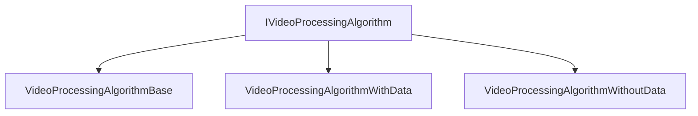
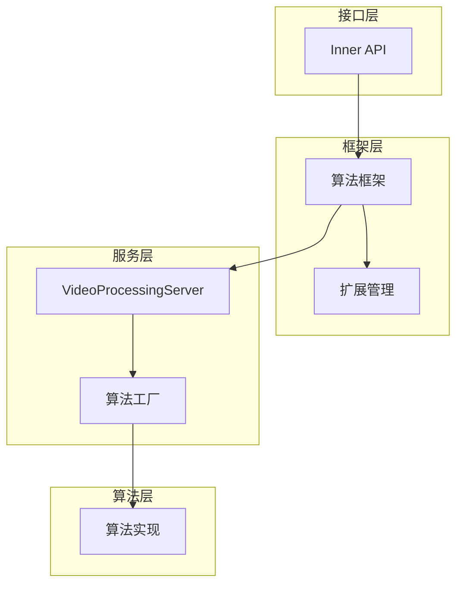

# VPE Inner API 参考

本文档描述 VPE 视频处理引擎的内部 API（Inner API），供系统开发者和框架集成使用。

---

## 1 Inner API 概述

### 1.1 定义与范围

**Inner API** 是 VPE 框架内部的编程接口，主要用于：
- 框架层模块间通信
- 服务层与框架层交互
- 系统级算法集成

**与对外 API 的区别**：

| 特性 | 对外 API (N-API/C API) | Inner API |
|------|------------------------|-----------|
| **稳定性** | 稳定，版本兼容 | 可能变化 |
| **调用者** | 应用开发者 | 系统开发者 |
| **可见性** | 导出符号 | 内部符号 |
| **文档** | 完整文档 | 参考代码 |

**证据位置**：`interfaces/inner_api/` ✅

### 1.2 可见性声明

Inner API 使用 C++ 可见性属性声明导出：

```cpp
// interfaces/inner_api/detail_enhancer_image.h:90
extern "C" __attribute__((visibility("default"))) int32_t DetailEnhancerCreate(int32_t* instance);
extern "C" __attribute__((visibility("default"))) int32_t DetailEnhancerProcessImage(
    int32_t instance,
    OHNativeWindowBuffer* inputImage, 
    OHNativeWindowBuffer* outputImage, 
    int32_t level);
extern "C" __attribute__((visibility("default"))) int32_t DetailEnhancerDestroy(int32_t* instance);
```

---

## 2 模块接口

### 2.1 色彩空间转换模块

#### 2.1.1 ColorSpaceConverterBase

**头文件**：`interfaces/inner_api/colorspace_converter.h`

**稳定性**：⚠️ Stable（主要接口稳定）

| 方法 | 功能 | 稳定性 |
|------|------|--------|
| `Create()` | 创建实例 | ✅ Stable |
| `Process()` | 执行转换 | ✅ Stable |
| `SetParameter()` | 设置参数 | ⚠️ Unstable |
| `GetParameter()` | 获取参数 | ⚠️ Unstable |

**证据位置**：`colorspace_converter.h` ✅

#### 2.1.2 ColorSpaceConverterVideo

**头文件**：`interfaces/inner_api/colorspace_converter_video.h`

**稳定性**：⚠️ Stable

| 方法 | 功能 | 稳定性 |
|------|------|--------|
| `Create()` | 创建实例 | ✅ Stable |
| `Init()` | 初始化 | ✅ Stable |
| `Process()` | 执行转换 | ✅ Stable |
| `Deinit()` | 反初始化 | ⚠️ Unstable |

**证据位置**：`colorspace_converter_video.h` ✅

#### 2.1.3 ColorSpaceConverterDisplay

**头文件**：`interfaces/inner_api/colorspace_converter_display.h`

**稳定性**：⚠️ Stable

| 方法 | 功能 | 稳定性 |
|------|------|--------|
| `Create()` | 创建实例 | ✅ Stable |
| `Process()` | 执行显示色彩转换 | ✅ Stable |

**证据位置**：`colorspace_converter_display.h` ✅

### 2.2 细节增强模块

#### 2.2.1 DetailEnhancerBase

**头文件**：`interfaces/inner_api/detail_enhancer_image.h`

**稳定性**：✅ Stable（核心接口稳定）

| 方法 | 功能 | 稳定性 |
|------|------|--------|
| `Create()` | 创建实例 | ✅ Stable |
| `Process()` | 执行细节增强 | ✅ Stable |
| `SetParameter()` | 设置参数 | ⚠️ Unstable |
| `GetParameter()` | 获取参数 | ⚠️ Unstable |

**证据位置**：`detail_enhancer_image.h:38` ✅

#### 2.2.2 DetailEnhancerVideo

**头文件**：`interfaces/inner_api/detail_enhancer_video.h`

**稳定性**：⚠️ Stable

| 方法 | 功能 | 稳定性 |
|------|------|--------|
| `Create()` | 创建实例 | ✅ Stable |
| `Init()` | 初始化 | ✅ Stable |
| `Process()` | 执行视频增强 | ✅ Stable |
| `SetParameter()` | 设置参数 | ⚠️ Unstable |

**证据位置**：`detail_enhancer_video.h:29` ✅

### 2.3 元数据生成模块

#### 2.3.1 MetadataGeneratorBase

**头文件**：`interfaces/inner_api/metadata_generator.h`

**稳定性**：⚠️ Stable

| 方法 | 功能 | 稳定性 |
|------|------|--------|
| `Create()` | 创建实例 | ✅ Stable |
| `Generate()` | 生成元数据 | ✅ Stable |
| `SetParameter()` | 设置参数 | ⚠️ Unstable |

**证据位置**：`metadata_generator.h:28` ✅

#### 2.3.2 MetadataGeneratorVideo

**头文件**：`interfaces/inner_api/metadata_generator_video.h`

**稳定性**：⚠️ Stable

| 方法 | 功能 | 稳定性 |
|------|------|--------|
| `Create()` | 创建实例 | ✅ Stable |
| `Generate()` | 生成视频元数据 | ✅ Stable |
| `UpdateMetadata()` | 更新元数据 | ⚠️ Unstable |

**证据位置**：`metadata_generator_video.h:26` ✅

### 2.4 HDR 增强模块

#### 2.4.1 AIHDREnhancer

**头文件**：`interfaces/inner_api/aihdr_enhancer.h`

**稳定性**：⚠️ Stable

| 方法 | 功能 | 稳定性 |
|------|------|--------|
| `Create()` | 创建实例 | ✅ Stable |
| `Enhance()` | HDR 增强处理 | ✅ Stable |
| `SetParameter()` | 设置参数 | ⚠️ Unstable |

**证据位置**：`aihdr_enhancer.h:30` ✅

#### 2.4.2 AIHDREnhancerVideo

**头文件**：`interfaces/inner_api/aihdr_enhancer_video.h`

**稳定性**：⚠️ Stable

| 方法 | 功能 | 稳定性 |
|------|------|--------|
| `Create()` | 创建实例 | ✅ Stable |
| `Enhance()` | 视频 HDR 增强 | ✅ Stable |
| `Init()` | 初始化 | ✅ Stable |

**证据位置**：`aihdr_enhancer_video.h:31` ✅

### 2.5 对比度增强模块

#### 2.5.1 ContrastEnhancerImage

**头文件**：`interfaces/inner_api/contrast_enhancer_image.h`

**稳定性**：⚠️ Stable

| 方法 | 功能 | 稳定性 |
|------|------|--------|
| `Create()` | 创建实例 | ✅ Stable |
| `Enhance()` | 对比度增强 | ✅ Stable |

**证据位置**：`contrast_enhancer_image.h:38` ✅

### 2.6 可变帧率模块

#### 2.6.1 VideoRefreshRatePrediction

**头文件**：`interfaces/inner_api/video_refreshrate_prediction.h`

**稳定性**：⚠️ Unstable（实验性功能）

| 方法 | 功能 | 稳定性 |
|------|------|--------|
| `Create()` | 创建实例 | ⚠️ Unstable |
| `Predict()` | 帧率预测 | ⚠️ Unstable |
| `SetParameter()` | 设置参数 | ⚠️ Unstable |

**证据位置**：`video_refreshrate_prediction.h:36` ✅

---

## 3 服务层接口

### 3.1 算法接口

#### 3.1.1 IVideoProcessingAlgorithm

**头文件**：`services/algorithm/include/ivideo_processing_algorithm.h`

**接口定义**：

| 方法 | 功能 | 证据位置 |
|------|------|---------|
| `Initialize()` | 初始化算法 | `ivideo_processing_algorithm.h:28` ✅ |
| `Deinitialize()` | 反初始化 | `ivideo_processing_algorithm.h:28` ✅ |
| `HasClient()` | 检查客户端 | `ivideo_processing_algorithm.h:28` ✅ |
| `Add()` | 添加客户端 | `ivideo_processing_algorithm.h:28` ✅ |
| `Del()` | 删除客户端 | `ivideo_processing_algorithm.h:28` ✅ |
| `SetParameter()` | 设置参数 | `ivideo_processing_algorithm.h:28` ✅ |
| `GetParameter()` | 获取参数 | `ivideo_processing_algorithm.h:28` ✅ |
| `Process()` | 执行处理 | `ivideo_processing_algorithm.h:28` ✅ |

**接口继承关系**：



### 3.2 工厂接口

#### 3.2.1 VideoProcessingAlgorithmFactory

**头文件**：`services/algorithm/include/video_processing_algorithm_factory.h`

| 方法 | 功能 | 证据位置 |
|------|------|---------|
| `CreateAlgorithm()` | 创建算法实例 | `video_processing_algorithm_factory.h` ✅ |
| `DestroyAlgorithm()` | 销毁算法实例 | `video_processing_algorithm_factory.h` ✅ |
| `LoadDynamicAlgorithm()` | 加载动态库 | `video_processing_algorithm_factory.cpp:63` ✅ |

**动态库加载**：
```cpp
// video_processing_algorithm_factory.cpp:63-90
bool VideoProcessingAlgorithmFactory::LoadDynamicAlgorithm(const std::string& path)
{
    handle_ = dlopen(path.c_str(), RTLD_NOW);
    if (handle_ == nullptr) {
        VPE_LOGD("Can't open library '%{public}s' - %{public}s", path.c_str(), dlerror());
        return false;
    }
    auto getCreator = reinterpret_cast<GetCreator>(dlsym(handle_, "GetDynamicAlgorithmCreator"));
    // ...
}
```

### 3.3 服务客户端接口

#### 3.3.1 VideoProcessingManager

**头文件**：`services/include/video_processing_client.h`

**单例模式**：
```cpp
// video_processing_client.cpp:35-39
VideoProcessingManager& VideoProcessingManager::GetInstance() {
    static VideoProcessingManager instance;
    return instance;
}
```

| 方法 | 功能 | 证据位置 |
|------|------|---------|
| `GetInstance()` | 获取单例 | `video_processing_client.cpp:35` ✅ |
| `Connect()` | 连接 SA 服务 | `video_processing_client.h` ✅ |
| `Disconnect()` | 断开连接 | `video_processing_client.h` ✅ |
| `Create()` | 创建处理实例 | `video_processing_client.h` ✅ |
| `Destroy()` | 销毁处理实例 | `video_processing_client.h` ✅ |
| `SetParameter()` | 设置参数 | `video_processing_client.h` ✅ |
| `GetParameter()` | 获取参数 | `video_processing_client.h` ✅ |
| `Process()` | 执行处理 | `video_processing_client.h` ✅ |

---

## 4 依赖方向

### 4.1 模块依赖关系



### 4.2 依赖详情

| 依赖方向 | 源模块 | 目标模块 | 说明 |
|---------|--------|---------|------|
| 接口 → 框架 | Inner API | 算法框架 | 标准调用 |
| 框架 → 服务 | 框架层 | SA 服务 | IPC 通信 |
| 服务 → 算法 | 算法工厂 | 具体算法 | 工厂创建 |
| 算法 → 扩展 | 具体算法 | 插件 | 动态加载 |

**证据位置**：`services/algorithm/video_processing_algorithm_factory.cpp` ✅

---

## 5 稳定性标注

### 5.1 稳定性等级说明

| 等级 | 标记 | 说明 |
|------|------|------|
| **✅ Stable** | 稳定接口 | 长期支持，版本兼容 |
| **⚠️ Unstable** | 不稳定接口 | 可能在未来版本中变更 |
| **❌ Experimental** | 实验性接口 | 仅供测试，可能移除 |

### 5.2 模块稳定性矩阵

| 模块 | 核心方法 | 辅助方法 | 总体评级 |
|------|---------|---------|---------|
| ColorSpaceConverterBase | ✅ Stable | ⚠️ Unstable | ⚠️ Unstable |
| ColorSpaceConverterVideo | ✅ Stable | ⚠️ Unstable | ⚠️ Unstable |
| DetailEnhancerBase | ✅ Stable | ⚠️ Unstable | ⚠️ Unstable |
| DetailEnhancerVideo | ✅ Stable | ⚠️ Unstable | ⚠️ Unstable |
| MetadataGeneratorBase | ✅ Stable | ⚠️ Unstable | ⚠️ Unstable |
| AIHDREnhancer | ✅ Stable | ⚠️ Unstable | ⚠️ Unstable |
| ContrastEnhancerImage | ✅ Stable | - | ⚠️ Unstable |
| VideoRefreshRatePrediction | ⚠️ Unstable | ⚠️ Unstable | ❌ Experimental |

### 5.3 稳定性使用建议

**推荐使用的接口**：
```cpp
// ✅ 推荐：稳定的创建和处理接口
auto converter = ColorSpaceConverterBase::Create();
converter->Process(input, output);

// ⚠️ 谨慎使用：不稳定的参数接口
converter->SetParameter(param);  // 可能在未来版本中变更
```

**不推荐使用的接口**：
```cpp
// ❌ 不推荐：实验性功能
auto predictor = VideoRefreshRatePrediction::Create();
predictor->Predict();  // 可能在未来版本中移除
```

---

## 6 插件扩展接口

### 6.1 扩展基类

#### 6.1.1 ExtensionBase

**头文件**：`framework/algorithm/extension_manager/include/extension_base.h`

**插件类型枚举**：

| 类型 | 说明 | 证据位置 |
|------|------|---------|
| `COLOR_SPACE_CONVERTER` | 色彩空间转换 | `extension_base.h` ✅ |
| `DETAIL_ENHANCER` | 细节增强 | `extension_base.h` ✅ |
| `METADATA_GENERATOR` | 元数据生成 | `extension_base.h` ✅ |
| `CONTRAST_ENHANCER` | 对比度增强 | `extension_base.h` ✅ |

**插件信息结构**：
```cpp
struct ExtensionInfo {
    ExtensionType type;      // 插件类型
    std::string name;        // 插件名称
    std::string version;     // 插件版本
};
```

### 6.2 扩展注册宏

**注册宏定义**（`framework/algorithm/extension_manager/include/utils.h:41-47`）：

```cpp
#define EXTENSION_EXPORT extern "C" __attribute__((visibility("default")))

#define REGISTER_EXTENSIONS(libName, registerFunc) \
    EXTENSION_EXPORT void Register##libName##Extensions(uintptr_t extensionListAddr) \
    { \
        OHOS::Media::VideoProcessingEngine::Extension::DoRegisterExtensions( \
            extensionListAddr, (registerFunc)); \
    }
```

**使用示例**：
```cpp
// 注册 Skia 扩展
REGISTER_EXTENSIONS(Skia, RegisterSkiaExtensions)
```

### 6.3 静态插件注册表

**注册表位置**：`framework/algorithm/extension_manager/include/static_extension_list.h:19-25`

```cpp
const std::unordered_map<std::string, RegisterExtensionFunc> staticExtensionsRegisterMap = {
#ifdef SKIA_ENABLE
    {"Skia", RegisterSkiaExtensions},
#endif
};
```

---

## 7 相关文档链接

| 文档 | 说明 |
|------|------|
| [Architecture.md](./Architecture.md) | 架构设计 |
| [NAPI_Reference.md](./NAPI_Reference.md) | 对外 API |
| [Build_System.md](./Build_System.md) | 构建系统 |
| [Security_Review.md](./Security_Review.md) | 安全评审 |

---

## 8 更新日志

| 版本 | 日期 | 变更内容 |
|------|------|---------|
| 1.0 | 2026-02-06 | 初始版本，包含完整 Inner API 参考 |
