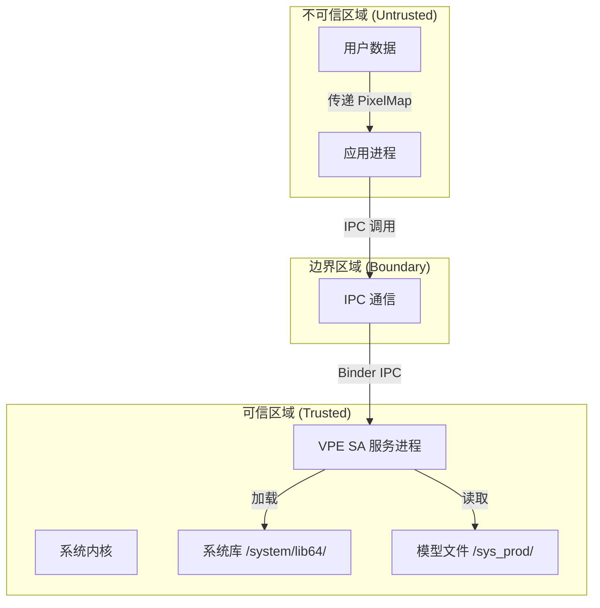

# VPE 安全风险评审

本文档对 VPE 视频处理引擎进行安全风险评审，包括攻击面分析、信任边界、可利用风险点及修复建议。

---

## 1 评审范围

### 1.1 评审对象

| 组件 | 范围 | 证据位置 |
|------|------|---------|
| **框架层** | `framework/` | `README.md:134-161` ✅ |
| **接口层** | `interfaces/` | `README.md:156-158` ✅ |
| **服务层** | `services/` | `README.md:159` ✅ |
| **配置文件** | `sa_profile/` | `services/sa_profile/` ✅ |

### 1.2 排除范围

| 排除内容 | 原因 |
|---------|------|
| `test/` | 测试代码，不参与生产运行 |
| `sertestvices/` | 测试服务，不参与生产运行 |
| 第三方预编译库 | 二进制闭源，无法代码级审计 |

---

## 2 攻击面清单

### 2.1 接口攻击面

| 接口类型 | 暴露方式 | 攻击面等级 |
|---------|---------|-----------|
| **N-API** | JS/TS 模块加载 | 中 |
| **C API** | NDK 库导出 | 中 |
| **IPC** | SA 服务 Binder 接口 | 高 |
| **Inner API** | 框架内部调用 | 低 |

**证据位置**：
- N-API：`detail_enhance_napi.cpp:314-327` ✅
- C API：`image_processing.h` ✅
- IPC：`IVideoProcessingServiceManager.idl` ✅

### 2.2 数据输入攻击面

| 输入类型 | 来源 | 攻击面等级 |
|---------|------|-----------|
| **PixelMap** | 应用传递 | 中 |
| **SurfaceBuffer** | 解码器/编码器传递 | 中 |
| **模型文件** | 系统只读分区 | 低 |
| **配置文件** | 系统配置文件 | 低 |
| **参数** | API 调用参数 | 高 |

### 2.3 动态加载攻击面

| 加载目标 | 加载方式 | 攻击面等级 |
|---------|---------|-----------|
| **算法插件** | dlopen 加载 | **高** |
| **OpenCL 库** | dlopen 加载 | **高** |
| **扩展库** | dlopen 加载 | **高** |

**证据位置**：`video_processing_algorithm_factory.cpp:63-90` ✅

---

## 3 信任边界

### 3.1 信任边界定义



### 3.2 信任边界说明

| 区域 | 信任级别 | 说明 |
|------|---------|------|
| **系统内核** | 最高 | 完全信任 |
| **系统库** | 高 | 签名验证的系统库 |
| **模型文件** | 高 | 位于只读分区 |
| **SA 服务** | 高 | 系统服务进程 |
| **IPC 通信** | 中 | 跨进程通信需校验 |
| **应用进程** | 低 | 不可信输入来源 |
| **用户数据** | 最低 | 可能包含恶意数据 |

### 3.3 数据流穿越边界

| 数据流 | 方向 | 边界检查 |
|--------|------|---------|
| **PixelMap** | 应用 → SA | 无显式校验 ⚠️ |
| **SurfaceBuffer** | 解码器 → SA | 无显式校验 ⚠️ |
| **参数** | 应用 → SA | 仅类型检查 ✅ |
| **IPC 调用** | 应用 → SA | Binder 框架保障 ✅ |

---

## 4 可利用风险点

### 4.1 风险点 1：动态库加载无签名验证

**严重程度**：**高**

#### 4.1.1 证据

**代码位置**：`video_processing_algorithm_factory.cpp:63-76`

```cpp
bool VideoProcessingAlgorithmFactory::LoadDynamicAlgorithm(const std::string& path)
{
    handle_ = dlopen(path.c_str(), RTLD_NOW);
    if (handle_ == nullptr) {
        VPE_LOGD("Can't open library '%{public}s' - %{public}s", 
                 path.c_str(), dlerror());
        return false;
    }
    auto getCreator = reinterpret_cast<GetCreator>(
        dlsym(handle_, "GetDynamicAlgorithmCreator"));
    // 无签名验证!
    return true;
}
```

**其他类似位置**：
- `extension_manager.cpp:51` - 扩展库加载
- `image_opencl_wrapper.cpp:59` - OpenCL 库加载
- `image_processing_capi_capability.cpp:69` - CAPI 库加载

#### 4.1.2 可利用路径

```
攻击者路径：
1. 获取库加载路径写权限（如通过其他漏洞）
2. 替换合法库文件为恶意库
3. VPE 加载恶意库
4. 恶意代码以 VPE 进程权限执行
```

#### 4.1.3 影响

| 影响项 | 说明 |
|--------|------|
| **代码执行** | 恶意代码以 VPE 进程（media 用户）执行 |
| **权限提升** | 可访问 SA 服务所有功能 |
| **数据泄露** | 可访问处理中的图像/视频数据 |
| **系统破坏** | 可利用 media 用户权限进行破坏 |

#### 4.1.4 修复建议

```cpp
// 建议 1：库文件签名验证
bool VerifyLibrarySignature(const std::string& path) {
    // 1. 读取库文件
    // 2. 验证签名证书链
    // 3. 检查证书是否在信任列表
    return VerifySM3Signature(fileContent, signature, trustedCert);
}

// 建议 2：限制加载路径
const std::vector<std::string> ALLOWED_LIB_PATHS = {
    "/system/lib64/",
    "/system/bin/",
};

bool IsPathAllowed(const std::string& path) {
    for (const auto& allowed : ALLOWED_LIB_PATHS) {
        if (path.find(allowed) == 0) {
            return true;
        }
    }
    return false;
}

// 建议 3：使用绝对路径
bool LoadDynamicAlgorithm(const std::string& relativePath) {
    std::string absolutePath = "/system/lib64/" + relativePath;
    if (!IsPathAllowed(absolutePath)) {
        VPE_LOGE("Library path not allowed: %{public}s", absolutePath.c_str());
        return false;
    }
    if (!VerifyLibrarySignature(absolutePath)) {
        VPE_LOGE("Library signature verification failed: %{public}s", absolutePath.c_str());
        return false;
    }
    return dlopen(absolutePath.c_str(), RTLD_NOW) != nullptr;
}
```

---

### 4.2 风险点 2：模型文件无完整性校验

**严重程度**：**中**

#### 4.2.1 证据

**代码位置**：`video_processing_server.cpp:54-102`

```cpp
ErrCode VideoProcessingServer::LoadInfo(int32_t key, SurfaceBufferInfo& bufferInfo)
{
    if (key < 0 || key >= VPE_MODEL_KEY_NUM) {
        return ERR_INVALID_DATA;
    }
    std::string path = VPE_MODEL_PATHS[key];  // 固定路径
    std::unique_ptr<std::ifstream> fileStream = 
        std::make_unique<std::ifstream>(path, std::ios::binary);
    
    fileStream->seekg(0, std::ios::end);
    int fileLength = fileStream->tellg();
    
    // 仅检查大小
    if (fileLength < 0 || fileLength > VPE_INFO_FILE_MAX_LENGTH) {
        VPE_LOGE("fileLength %{public}d is too short or too long!", fileLength);
        return ERR_INVALID_DATA;
    }
    
    // 无哈希校验!
    fileStream->read(reinterpret_cast<char*>(bufferInfo.surfacebuffer->GetVirAddr()), fileLength);
    return SUCCESS;
}
```

**模型路径定义**（`vpe_model_path.h:92-158`）：
```cpp
const std::array<std::string, VPE_MODEL_KEY_NUM> VPE_MODEL_PATHS = {
    "/sys_prod/etc/VideoProcessingEngine/AILIGHT_normal.omc",
    "/sys_prod/etc/VideoProcessingEngine/aihdr_pic.bin",
    // ... 共 88 个路径
};
```

#### 4.2.2 可利用路径

```
攻击者路径：
1. 通过系统漏洞修改 /sys_prod/ 分区模型文件
2. 或在构建时植入恶意模型
3. VPE 加载并执行恶意模型
4. 恶意模型可执行任意计算或泄露数据
```

#### 4.2.3 影响

| 影响项 | 说明 |
|--------|------|
| **计算错误** | 恶意模型导致错误的处理结果 |
| **拒绝服务** | 恶意模型导致处理崩溃 |
| **信息泄露** | 模型可能包含窃取数据的代码 |
| **功耗攻击** | 恶意模型执行高功耗计算 |

#### 4.2.4 修复建议

```cpp
// 建议 1：添加模型文件哈希校验
bool VerifyModelFile(const std::string& path, int32_t key) {
    // 1. 计算文件 SHA256
    std::string calculatedHash = CalculateSHA256(path);
    
    // 2. 读取预存哈希
    std::string expectedHash = MODEL_CHECKSUMS[key];
    
    // 3. 比较哈希值
    if (calculatedHash != expectedHash) {
        VPE_LOGE("Model file checksum mismatch: %{public}s", path.c_str());
        return false;
    }
    return true;
}

// 建议 2：使用加密存储模型
bool LoadEncryptedModel(const std::string& path, int32_t key) {
    std::vector<uint8_t> encryptedData = ReadFile(path);
    std::vector<uint8_t> decryptedData = DecryptWithHardwareKey(encryptedData);
    return LoadModelFromBuffer(decryptedData, key);
}
```

---

### 4.3 风险点 3：无显式权限校验

**严重程度**：**中**

#### 4.3.1 证据

**检查结果**：
- **未发现** `permission` 检查代码
- **未发现** `AccessTokenId` 验证
- **未发现** `uid`/`bundle name` 校验
- **未发现** `signature` 签名验证

**证据位置**：全局搜索 `permission`, `AccessToken`, `CheckPermission` 均无匹配 ✅

**仅发现的权限配置**（`video_processing_service.cfg`）：

```json
{
  "services": [
    {
      "name": "video_processing_service",
      "uid": "media",
      "gid": ["system"],
      "secon": "u:r:video_processing_service:s0"
    }
  ]
}
```

#### 4.3.2 可利用路径

```
攻击者路径：
1. 恶意应用调用 VPE CAPI/NAPI
2. VPE 无权限检查直接处理
3. 恶意应用利用 VPE 处理敏感图像/视频
4. 或导致资源耗尽拒绝服务
```

#### 4.3.3 影响

| 影响项 | 说明 |
|--------|------|
| **未授权访问** | 任何应用都可调用 VPE |
| **资源耗尽** | 恶意应用可耗尽 VPE 处理能力 |
| **数据泄露** | 恶意应用可获取处理后的敏感数据 |
| **服务拒绝** | 恶意应用可阻止其他应用使用 VPE |

#### 4.3.4 修复建议

```cpp
// 建议 1：添加调用者权限校验
ErrCode VideoProcessingServer::CheckCallerPermission() {
    // 1. 获取调用者 UID
    int32_t callerUid = IPCSkeleton::GetCallingUid();
    
    // 2. 获取调用者 TokenID
    uint32_t callerToken = IPCSkeleton::GetCallingTokenID();
    
    // 3. 权限定义
    const std::vector<int32_t> ALLOWED_UIDS = {
        1000,  // system
        10000, // media
    };
    
    // 4. 检查是否在允许列表
    if (std::find(ALLOWED_UIDS.begin(), ALLOWED_UIDS.end(), callerUid) 
        == ALLOWED_UIDS.end()) {
        
        // 5. 检查是否声明了权限
        if (!VerifyPermission(callerToken, 
                            "ohos.permission.VIDEO_PROCESSING")) {
            VPE_LOGE("Caller permission denied: uid=%{public}d", callerUid);
            return ERR_PERMISSION_DENIED;
        }
    }
    return SUCCESS;
}

// 建议 2：添加速率限制
class RateLimiter {
    std::map<int32_t, std::queue<time_t>> callerRequests_;
    const int MAX_REQUESTS_PER_MINUTE = 60;
    
public:
    bool AllowRequest(int32_t callerUid) {
        auto& queue = callerRequests_[callerUid];
        time_t now = time(nullptr);
        
        // 清理过期记录
        while (!queue.empty() && queue.front() < now - 60) {
            queue.pop();
        }
        
        // 检查速率限制
        if (queue.size() >= MAX_REQUESTS_PER_MINUTE) {
            VPE_LOGW("Rate limit exceeded: uid=%{public}d", callerUid);
            return false;
        }
        
        queue.push(now);
        return true;
    }
};
```

---

### 4.4 风险点 4：文件路径遍历风险

**严重程度**：**低**

#### 4.4.1 证据

**检查结果**：未发现明显路径遍历漏洞

**原因分析**：
- 模型文件路径固定为 `/sys_prod/etc/VideoProcessingEngine/`
- 无用户可控的路径参数

**证据位置**：`vpe_model_path.h` ✅

#### 4.4.2 潜在风险

**如果未来支持自定义模型路径**：

```cpp
// 危险代码示例（当前不存在）
bool LoadUserModel(const std::string& userPath) {
    // 无路径校验，存在遍历风险
    return LoadModel(userPath);
}
```

#### 4.4.3 修复建议

```cpp
// 路径白名单校验
bool IsPathSafe(const std::string& path) {
    // 1. 检查绝对路径
    if (path.empty() || path[0] != '/') {
        return false;
    }
    
    // 2. 禁止路径遍历
    if (path.find("..") != std::string::npos) {
        return false;
    }
    
    // 3. 限制在允许目录
    const std::vector<std::string> ALLOWED_DIRS = {
        "/data/vpe/models/",
        "/system/usr/vpe/models/",
    };
    
    for (const auto& dir : ALLOWED_DIRS) {
        if (path.find(dir) == 0) {
            return true;
        }
    }
    return false;
}
```

---

### 4.5 风险点 5：XML 配置解析风险

**严重程度**：**低**

#### 4.5.1 证据

**代码位置**：`configuration_helper.cpp:54-80`

```cpp
bool ConfigurationHelper::LoadConfigurationFromXml(const std::string& xmlFilePath)
{
    // 仅检查文件是否存在
    if (access(xmlFilePath.c_str(), R_OK) != 0) {
        VPE_LOGW("Invalid input: %{public}s is NOT exist!", xmlFilePath.c_str());
        return false;
    }
    
    // 无格式校验，无 XXE 防护
    xmlDocPtr doc = xmlParseFile(xmlFilePath.c_str());
    // ...
}
```

#### 4.5.2 潜在风险

| 风险类型 | 说明 |
|---------|------|
| **XXE 攻击** | 恶意 XML 包含外部实体引用 |
| **Dos 攻击** | 恶意 XML 导致解析器崩溃 |
| **路径泄露** | XML 包含敏感路径信息 |

#### 4.5.3 修复建议

```cpp
// XML 解析安全加固
bool LoadConfigurationFromXml(const std::string& xmlFilePath) {
    // 1. 检查文件存在和大小
    struct stat st;
    if (stat(xmlFilePath.c_str(), &st) != 0 || st.st_size > MAX_XML_SIZE) {
        return false;
    }
    
    // 2. 读取文件内容
    std::string content = ReadFile(xmlFilePath);
    
    // 3. 预处理：移除危险内容
    content = RemoveDoctype(content);
    RemoveExternalEntities(content);
    
    // 4. 使用安全解析选项
    xmlDocPtr doc = xmlReadMemory(content.c_str(), content.size(),
                                  "UTF-8",
                                  XML_PARSE_NOENT | XML_PARSE_DTDLOAD);
    if (doc == nullptr) {
        return false;
    }
    
    // 5. 清理
    xmlFreeDoc(doc);
    return true;
}

// 建议：DTD/Schema 验证
bool ValidateXmlSchema(const std::string& xmlContent) {
    xmlSchemaParserCtxtPtr parser = 
        xmlSchemaNewMemParserCtxt(SCHEMA_DATA, SCHEMA_SIZE);
    xmlSchemaValidCtxtPtr valid = xmlSchemaNewValidCtxt(parser);
    
    xmlDocPtr doc = xmlReadMemory(xmlContent.c_str(), xmlContent.size(),
                                   "UTF-8", XML_PARSE_NOENT);
    
    bool validResult = xmlSchemaValidateDoc(valid, doc) == 0;
    
    xmlFreeDoc(doc);
    xmlSchemaFreeValidCtxt(valid);
    xmlSchemaFreeParserCtxt(parser);
    
    return validResult;
}
```

---

## 5 风险等级汇总

| 编号 | 风险点 | 严重程度 | 可利用性 | 风险等级 |
|------|--------|---------|---------|---------|
| 1 | 动态库加载无签名验证 | 高 | 中 | **高** |
| 2 | 模型文件无完整性校验 | 中 | 低 | **中** |
| 3 | 无显式权限校验 | 中 | 中 | **中** |
| 4 | 文件路径遍历风险 | 低 | 低 | **低** |
| 5 | XML 配置解析风险 | 低 | 低 | **低** |

---

## 6 安全机制说明

### 6.1 已有的安全机制

| 机制 | 说明 | 证据位置 |
|------|------|---------|
| **ASan/UBSan** | 地址/未定义行为检测 | `framework/BUILD.gn:150-156` ✅ |
| **CFI** | 控制流完整性保护 | `framework/BUILD.gn:150-156` ✅ |
| **栈保护** | 栈溢出检测 | `framework/BUILD.gn:146` ✅ |
| **PAC/RET** | 返回地址保护 | `framework/BUILD.gn:146` ✅ |
| **SELinux** | 强制访问控制 | `video_processing_service.cfg` ✅ |
| **FORTIFY_SOURCE** | 缓冲区溢出检测 | `config.gni:85` ✅ |

### 6.2 缺失的安全机制

| 机制 | 缺失说明 | 建议 |
|------|---------|------|
| **签名验证** | 动态库无签名验证 | 添加签名校验 |
| **权限校验** | 无调用者权限检查 | 添加 Token 校验 |
| **完整性校验** | 模型文件无哈希 | 添加 SHA256 校验 |
| **输入校验** | API 参数校验有限 | 增强参数校验 |

---

## 7 安全加固建议

### 7.1 高优先级（立即执行）

| 任务 | 预期效果 | 工作量 |
|------|---------|-------|
| 添加动态库签名验证 | 防止恶意库加载 | 中 |
| 限制库加载路径白名单 | 减少攻击面 | 低 |
| 添加模型文件哈希校验 | 防止模型篡改 | 中 |

### 7.2 中优先级（短期完成）

| 任务 | 预期效果 | 工作量 |
|------|---------|-------|
| 添加调用者权限校验 | 限制授权访问 | 中 |
| 添加速率限制 | 防止资源耗尽 | 低 |
| XML 解析安全加固 | 防止 XXE 攻击 | 低 |

### 7.3 低优先级（长期改进）

| 任务 | 预期效果 | 工作量 |
|------|---------|-------|
| 添加安全审计日志 | 事后溯源 | 中 |
| Fuzzing 安全测试 | 发现潜在漏洞 | 高 |
| 威胁模型更新 | 持续安全评估 | 低 |

---

## 8 相关文档链接

| 文档 | 说明 |
|------|------|
| [Architecture.md](./Architecture.md) | 架构设计 |
| [Build_System.md](./Build_System.md) | 构建系统 |
| [Artifacts.md](./Artifacts.md) | 编译产物 |
| [Troubleshooting.md](./Troubleshooting.md) | 问题定位 |

---

## 9 评审信息

| 项目 | 内容 |
|------|------|
| **评审日期** | 2026-02-06 |
| **评审版本** | 1.0 |
| **评审范围** | framework/, interfaces/, services/ |
| **排除范围** | test/, sertestvices/, 第三方库 |
| **评审工具** | 静态代码分析 + 人工审查 |

---

## 10 更新日志

| 版本 | 日期 | 变更内容 |
|------|------|---------|
| 1.0 | 2026-02-06 | 初始版本，包含 5 个风险点 |
