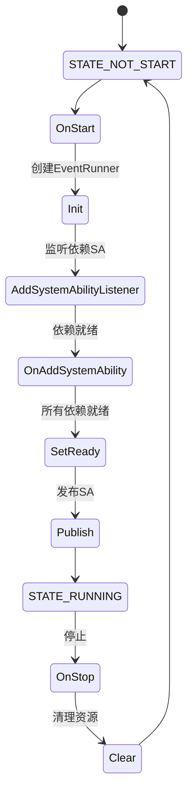
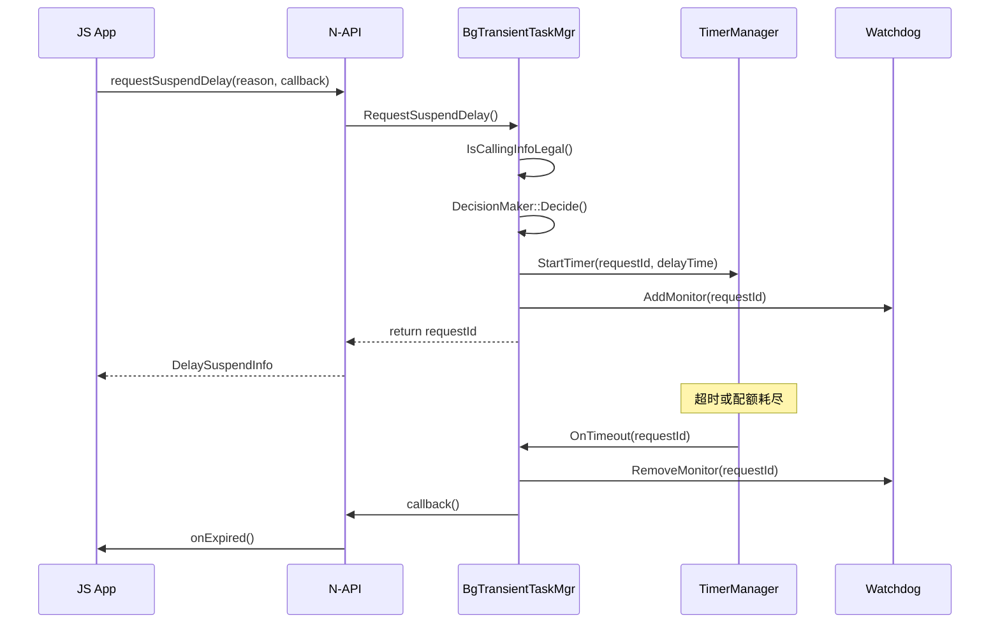
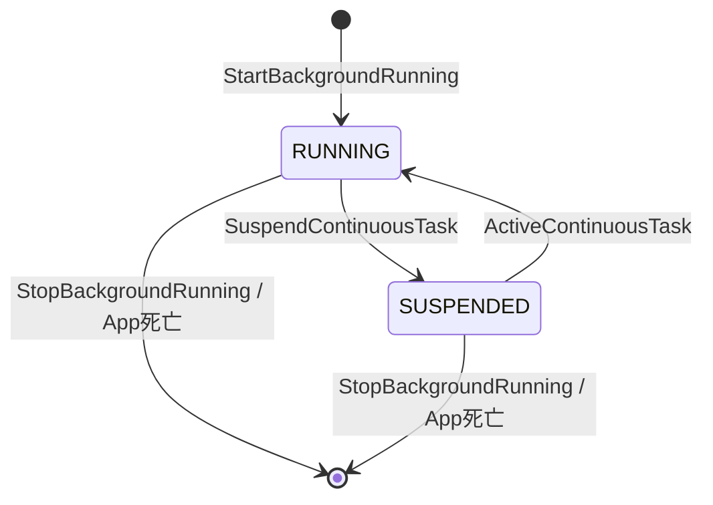
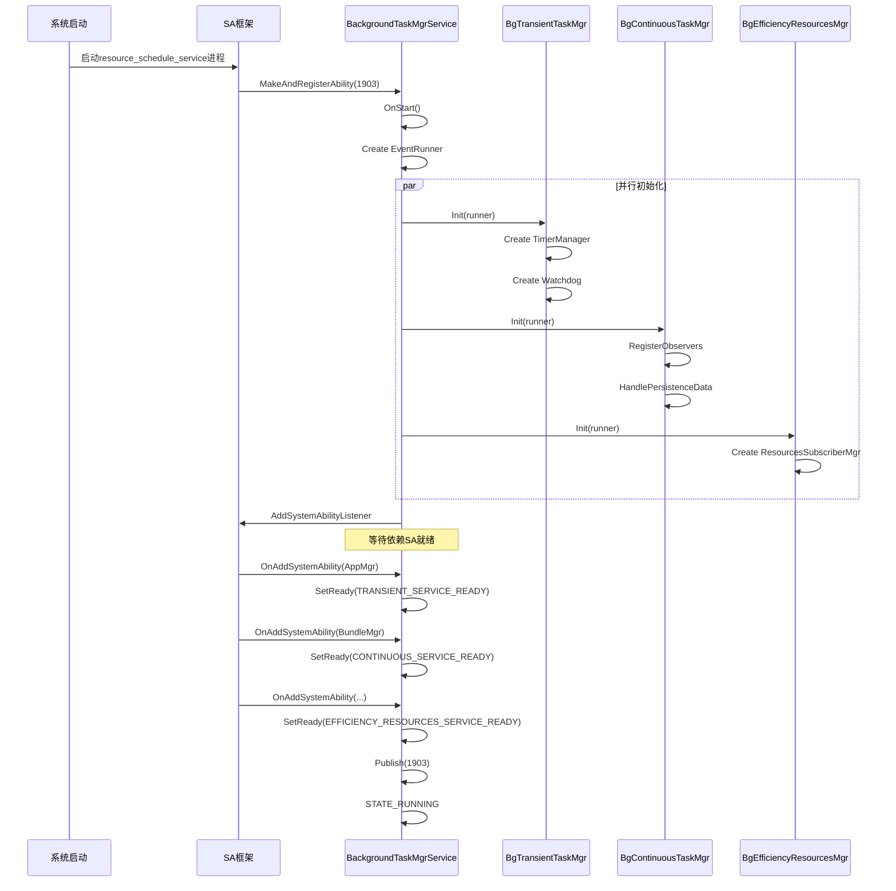
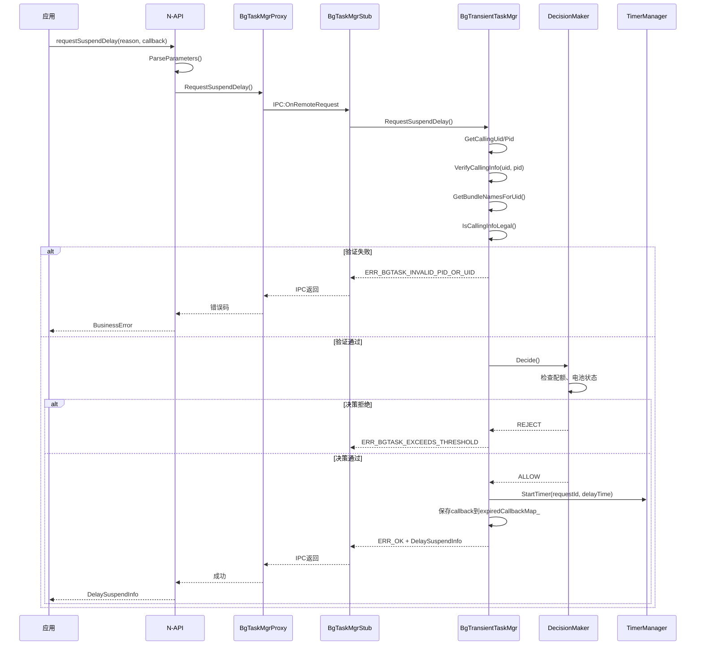

# 架构说明

## 总体架构

后台任务管理模块采用**分层架构**设计，分为接口层、框架层和服务层三个主要层次。

```
┌─────────────────────────────────────────────────────────────────┐
│                         应用层                                   │
│    ┌──────────────┐  ┌──────────────┐  ┌──────────────┐         │
│    │   JS/ArkTS   │  │     C++      │  │      C       │         │
│    │     App      │  │     App      │  │     App      │         │
│    └──────┬───────┘  └──────┬───────┘  └──────┬───────┘         │
└───────────┼─────────────────┼─────────────────┼─────────────────┘
            │                 │                 │
┌───────────▼─────────────────▼─────────────────▼─────────────────┐
│                      接口层 (interfaces)                         │
│  ┌─────────────────────────────────────────────────────────┐   │
│  │  kits/ - 对外接口层                                       │   │
│  │  ├── napi/  - JS/ArkTS N-API绑定                         │   │
│  │  ├── c/     - C API (NDK)                               │   │
│  │  ├── cj/    - Cangjie FFI                               │   │
│  │  └── ets/   - ArkTS 1.2 ANI                              │   │
│  └─────────────────────────────────────────────────────────┘   │
│  ┌─────────────────────────────────────────────────────────┐   │
│  │  innerkits/ - 对内接口层                                  │   │
│  │  ├── IDL接口定义 (IBackgroundTaskMgr.idl)                 │   │
│  │  ├── 数据结构定义 (DelaySuspendInfo等)                    │   │
│  │  └── 代理/存根生成                                        │   │
│  └─────────────────────────────────────────────────────────┘   │
└───────────────────────────┬─────────────────────────────────────┘
                            │ IPC (Binder)
┌───────────────────────────▼─────────────────────────────────────┐
│                     框架层 (frameworks)                          │
│              BackgroundTaskManager                               │
│         (客户端代理封装，单例模式)                                 │
└───────────────────────────┬─────────────────────────────────────┘
                            │ IPC调用
┌───────────────────────────▼─────────────────────────────────────┐
│                     服务层 (services)                            │
│          BackgroundTaskMgrService (SA 1903)                      │
│              ┌─────────┬─────────┬─────────┐                     │
│              ▼         ▼         ▼         ▼                     │
│         ┌────────┐ ┌────────┐ ┌────────┐ ┌────────┐             │
│         │Transient│ │Continuous│ │Efficiency│ │Common   │         │
│         │TaskMgr  │ │TaskMgr   │ │Resources │ │Services │         │
│         │(短时)   │ │(长时)    │ │Mgr       │ │(公共)   │         │
│         └────────┘ └────────┘ └────────┘ └────────┘             │
└─────────────────────────────────────────────────────────────────┘
```

---

## 组件详细说明

### 1. 接口层

#### 1.1 N-API模块

**双模块设计**: 提供两个N-API模块以兼容不同版本

| 模块名 | 路径 | 导出函数数 | 用途 |
|--------|------|------------|------|
| `backgroundTaskManager` | `interfaces/kits/napi/src/init.cpp` | 5 | 旧版兼容 |
| `resourceschedule.backgroundTaskManager` | `interfaces/kits/napi/src/init_bgtaskmgr.cpp` | 18+ | 主模块 |

**模块注册机制**:
```cpp
// init_bgtaskmgr.h:49-57
napi_module g_apiModule = {
    .nm_version = 1,
    .nm_flags = 0,
    .nm_filename = nullptr,
    .nm_register_func = InitApi,
    .nm_modname = "resourceschedule.backgroundTaskManager",
    .nm_priv = nullptr,
    .reserved = {nullptr}
};

__attribute__((constructor)) void RegisterModule(void) {
    napi_module_register(&g_apiModule);
}
```

#### 1.2 IDL接口定义

**文件**: `interfaces/innerkits/IBackgroundTaskMgr.idl`

**接口方法分类**:

| 类别 | 方法数 | 主要方法 |
|------|--------|----------|
| 短时任务 | 6 | RequestSuspendDelay, CancelSuspendDelay, GetRemainingDelayTime |
| 长时任务 | 12 | StartBackgroundRunning, StopBackgroundRunning, GetAllContinuousTasks |
| 能效资源 | 5 | ApplyEfficiencyResources, ResetAllEfficiencyResources |
| 订阅管理 | 2 | SubscribeBackgroundTask, UnsubscribeBackgroundTask |
| 系统接口 | 15 | StopContinuousTask, SuspendContinuousTask, Dump等 |

---

### 2. 框架层

**核心类**: `BackgroundTaskManager`

**职责**:
1. 封装IPC调用细节
2. 管理代理对象生命周期
3. 处理服务死亡重连
4. 提供同步/异步API

**关键成员**:
```cpp
class BackgroundTaskManager {
private:
    std::mutex mutex_;
    sptr<IBackgroundTaskMgr> proxy_;           // IPC代理
    sptr<BgTaskMgrDeathRecipient> recipient_;  // 死亡监听
};
```

**代理获取流程**:
```
GetBackgroundTaskManagerProxy()
    ↓
samgr::GetSystemAbility(BACKGROUND_TASK_MANAGER_SERVICE_ID)
    ↓
iface_cast<IBackgroundTaskMgr>(remoteObject)
    ↓
AddDeathRecipient(recipient_)
```

---

### 3. 服务层

#### 3.1 主服务 (BackgroundTaskMgrService)

**继承关系**:
```
SystemAbility
    └── BackgroundTaskMgrStub (IDL生成)
            └── BackgroundTaskMgrService
```

**生命周期**:



**依赖的System Ability**:
| SA ID | 名称 | 用途 |
|-------|------|------|
| 501 | APP_MGR_SERVICE | 应用生命周期 |
| 401 | BUNDLE_MGR_SERVICE | 包信息管理 |
| 65968 | SA_ID_VOIP_CALL_MANAGER | VoIP通话 |
| 9527 | SA_ID_HEALTH_SPORT | 健康运动 |
| 5099 | SUSPEND_MANAGER_SYSTEM_ABILITY_ID | 挂起管理 |

#### 3.2 短时任务管理器 (BgTransientTaskMgr)

**单例模式**: `DelayedSingleton<BgTransientTaskMgr>`

**核心组件**:

```
┌─────────────────────────────────────────────────┐
│           BgTransientTaskMgr                     │
├─────────────────────────────────────────────────┤
│  ┌──────────────┐  ┌──────────────┐            │
│  │ TimerManager │  │   Watchdog   │            │
│  │   (定时器)    │  │   (看门狗)    │            │
│  └──────────────┘  └──────────────┘            │
├─────────────────────────────────────────────────┤
│  ┌──────────────┐  ┌──────────────┐            │
│  │DecisionMaker │  │InputManager  │            │
│  │   (决策器)    │  │   (输入管理)  │            │
│  └──────────────┘  └──────────────┘            │
├─────────────────────────────────────────────────┤
│  expiredCallbackMap_  (回调映射表)               │
│  keyInfoMap_          (任务信息映射)              │
└─────────────────────────────────────────────────┘
```

**数据流**:



#### 3.3 长时任务管理器 (BgContinuousTaskMgr)

**状态管理**:

```
┌──────────────────────────────────────────────────────┐
│            BgContinuousTaskMgr                        │
├──────────────────────────────────────────────────────┤
│  continuousTaskInfosMap_  (任务记录表: key→Record)    │
│  cachedBundleInfos_       (应用缓存信息)              │
│  bgTaskSubscribers_       (订阅者列表)                │
├──────────────────────────────────────────────────────┤
│  ┌─────────────────┐  ┌─────────────────────────┐   │
│  │ContinuousTask   │  │   NotificationTools     │   │
│  │Record           │  │   (通知工具)             │   │
│  │(任务记录)        │  │                         │   │
│  └─────────────────┘  └─────────────────────────┘   │
├──────────────────────────────────────────────────────┤
│  事件监听:                                           │
│  - AppStateObserver      (应用状态)                  │
│  - TaskNotificationSubscriber (通知交互)             │
│  - SystemEventObserver   (系统事件)                  │
│  - ConfigChangeObserver  (配置变更)                  │
└──────────────────────────────────────────────────────┘
```

**任务状态转换**:



**通知机制**:
```
StartBackgroundRunning()
    ↓
SendContinuousTaskNotification()
    ↓
通知服务 → 显示通知栏 → 用户可见
    ↓
RegisterNotificationSubscriber()
    ↓
监听用户点击 → StopContinuousTaskByUser()
```

#### 3.4 能效资源管理器 (BgEfficiencyResourcesMgr)

**资源类型位掩码**:
```cpp
enum ResourceType : uint32_t {
    CPU = 1,                    // 0b000000001
    COMMON_EVENT = 2,           // 0b000000010
    TIMER = 4,                  // 0b000000100
    WORK_SCHEDULER = 8,         // 0b000001000
    BLUETOOTH = 16,             // 0b000010000
    GPS = 32,                   // 0b000100000
    AUDIO = 64,                 // 0b001000000
    RUNNING_LOCK = 128,         // 0b010000000
    SENSOR = 256,               // 0b100000000
};
```

**数据存储**:
```
appResourceApplyMap_     : <uid, ResourceApplicationRecord>
procResourceApplyMap_    : <pid, ResourceApplicationRecord>
```

**自动释放机制**:
- 应用死亡 → RemoveAppRecord() → 释放该应用所有资源
- 进程死亡 → RemoveProcessRecord() → 释放该进程资源
- 超时 → ResetTimeOutResource() → 定时清理

---

## 线程模型

### 主服务线程

**EventRunner模式**:
```cpp
// background_task_mgr_service.cpp
void BackgroundTaskMgrService::OnStart() {
    runner_ = AppExecFwk::EventRunner::Create("backgroundTaskMgr");
    // 所有子管理器共享同一个EventRunner
    BgTransientTaskMgr::GetInstance()->Init(runner_);
    BgContinuousTaskMgr::GetInstance()->Init(runner_);
    BgEfficiencyResourcesMgr::GetInstance()->Init(runner_);
}
```

**线程特点**:
- 单线程事件循环处理所有IPC请求
- 避免多线程竞争，简化同步逻辑
- 耗时操作使用异步回调

### 子管理器Handler

每个子管理器维护自己的EventHandler:
```cpp
// 统一从主runner创建
handler_ = std::make_shared<AppExecFwk::EventHandler>(runner_);

// 使用handler投递任务
handler_->PostTask([this]() { ... });
```

---

## 关键时序

### 服务启动时序



### 短时任务申请时序



---

## 数据流图

### 完整调用链

```
JS API调用链:
JS App
    ↓ @ohos.resourceschedule.backgroundTaskManager
N-API (init_bgtaskmgr.cpp)
    ↓ 调用
BackgroundTaskManager (frameworks)
    ↓ IPC Binder
IBackgroundTaskMgrProxy (IDL生成)
    ↓ OnRemoteRequest
BackgroundTaskMgrStub (IDL生成)
    ↓ 分发
BackgroundTaskMgrService (services/core)
    ↓ 路由
┌─────────────┬─────────────┬─────────────────┐
↓             ↓             ↓
BgTransient   BgContinuous  BgEfficiency
TaskMgr       TaskMgr       ResourcesMgr
(services/    (services/    (services/
transient_)   continuous_)  efficiency_)
task/         task/         resources/
```

---

## 安全边界

```
┌─────────────────────────────────────────────────────────────┐
│                      应用沙箱 (不可信)                        │
│                    JS/ArkTS / C++ / C                        │
│                      N-API调用                                │
└───────────────────────────┬─────────────────────────────────┘
                            │ 参数校验
┌───────────────────────────▼─────────────────────────────────┐
│                    IPC边界 (Binder)                           │
│              Parcel数据序列化/反序列化                         │
└───────────────────────────┬─────────────────────────────────┘
                            │ 权限检查
┌───────────────────────────▼─────────────────────────────────┐
│                 System Ability (可信)                         │
│              BackgroundTaskMgrService                        │
│         ┌─────────┬─────────┬─────────┐                     │
│         │ UID/PID │权限Token│ 系统应用 │                     │
│         │ 验证    │ 检查    │ 验证    │                     │
│         └─────────┴─────────┴─────────┘                     │
└─────────────────────────────────────────────────────────────┘
```

---

## 相关文档

- [目录结构](01_Directory_Structure.md) - 源码组织
- [N-API接口](03_NAPI_Reference.md) - JS接口说明
- [安全风险](06_Security.md) - 安全分析
