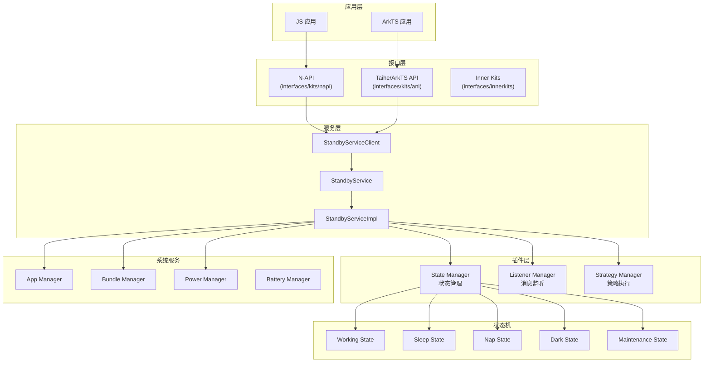
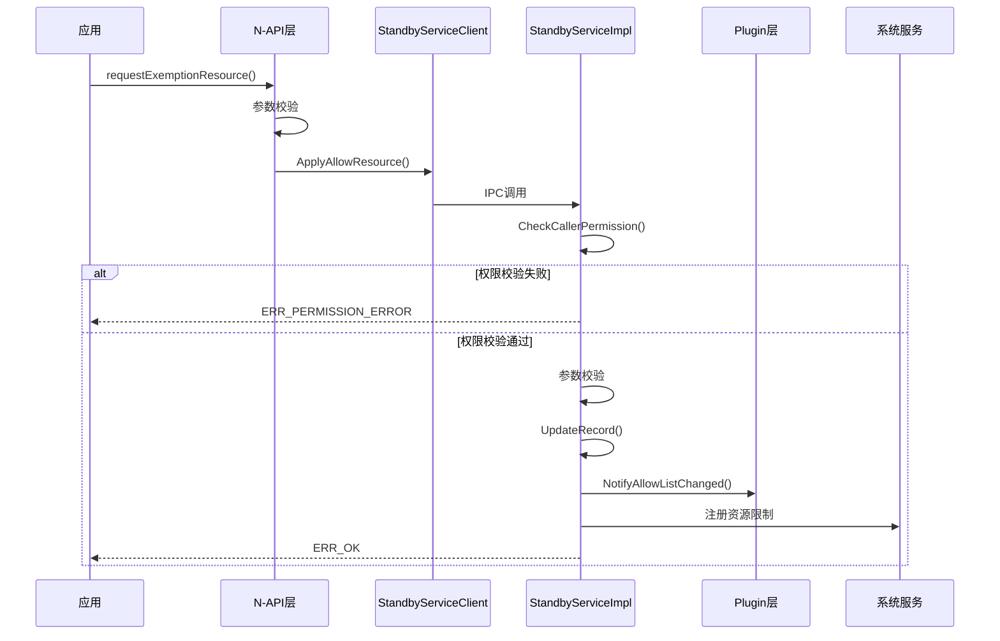
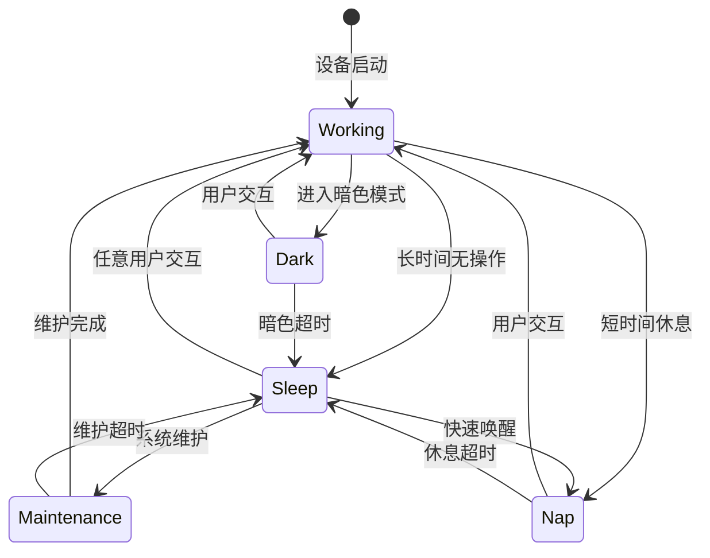
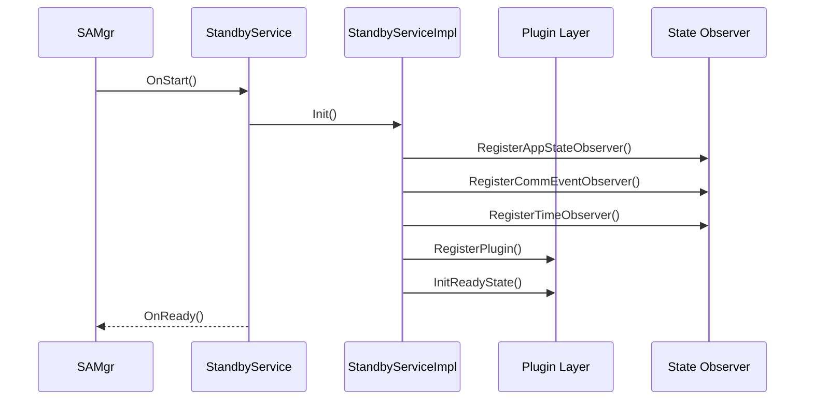
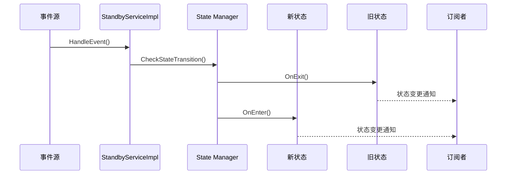

# 架构说明

## 整体架构图



## 数据流

### 豁免申请数据流



## 状态机

### 设备状态转换



### 状态管理职责

| 状态 | 进入条件 | 退出条件 | 限制策略 |
|------|----------|----------|----------|
| `working` | 设备启动/用户活跃 | 检测到空闲 | 无限制 |
| `sleep` | 空闲超时 | 用户交互 | 网络/Timer限制 |
| `nap` | 短时休息 | 用户交互/超时 | 宽松限制 |
| `dark` | 暗色模式 | 用户交互 | 低功耗模式 |
| `maintenance` | 系统维护 | 维护完成 | 严格限制 |

## 线程模型

### 核心线程

| 线程 | 职责 | 备注 |
|------|------|------|
| `Main Thread` | 服务初始化、IPC 响应 | SA 主线程 |
| `Event Handler` | 事件处理、状态机驱动 | 独立 EventRunner |
| `Plugin Thread` | 插件回调处理 | 根据配置 |

### 线程安全机制

| 保护对象 | 机制 | 文件 |
|----------|------|------|
| `allowRecordMutex_` | 互斥锁 | `standby_service_impl.h` |
| `backupRestoreMutex_` | 互斥锁 | `standby_service_impl.h` |
| `appStateObserverMutex_` | 互斥锁 | `standby_service_impl.h` |
| `eventObserverMutex_` | 互斥锁 | `standby_service_impl.h` |
| `timerObserverMutex_` | 递归互斥锁 | `standby_service_impl.h` |

## IPC 通信

### SA 注册信息

| 配置项 | 值 |
|--------|-----|
| SA ID | 1914 |
| 进程 | resource_schedule_service |
| 库路径 | libstandby_service.z.so |
| 启动方式 | 启动时加载 (run-on-create) |

### IPC 接口

主要通过 `IStandbyService` 接口进行通信，实现类为 `StandbyServiceImpl`。

```cpp
// 接口定义位置
frameworks/include/istandby_service.h  // TODO: 待确认实际路径

// 主要方法
ErrCode ApplyAllowResource(ResourceRequest& request);
ErrCode UnapplyAllowResource(ResourceRequest& request);
ErrCode GetAllowList(uint32_t allowType, std::vector<AllowInfo>& list, uint32_t reasonCode);
ErrCode IsDeviceInStandby(bool& isStandby);
ErrCode SubscribeStandbyCallback(const sptr<IStandbyServiceSubscriber>& subscriber);
ErrCode UnsubscribeStandbyCallback(const sptr<IStandbyServiceSubscriber>& subscriber);
```

## 关键时序图

### 初始化时序



### 状态切换时序



## 稳定性标注

| 层级 | 稳定性 | 说明 |
|------|--------|------|
| N-API | 稳定 | 对外公开接口 |
| Taihe | 稳定 | ArkTS 官方接口 |
| Inner Kits | 较稳定 | 系统内部接口 |
| Plugin | 内部 | 插件内部接口 |
| 服务实现 | 内部 | 核心实现细节 |
