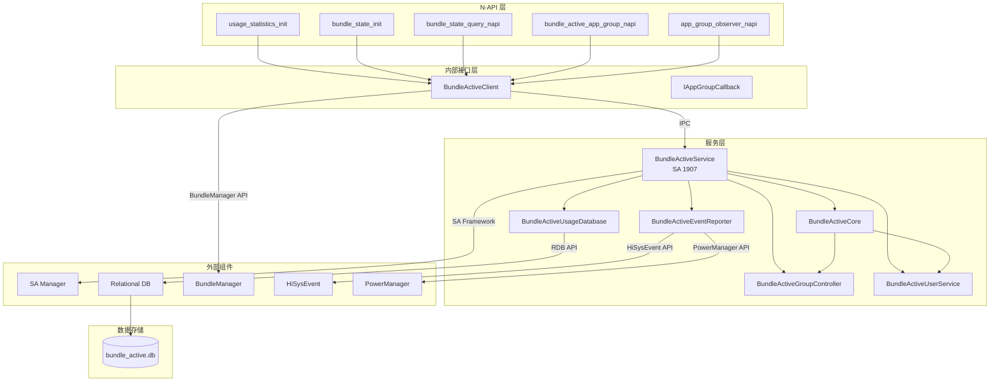
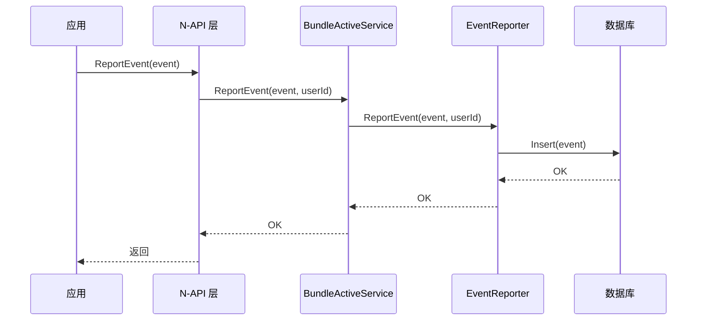
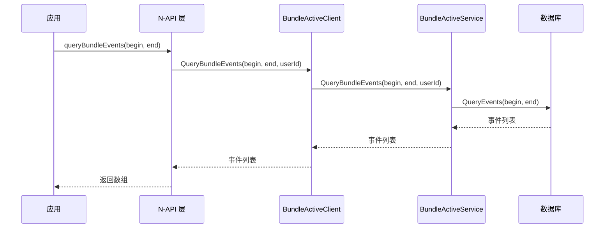
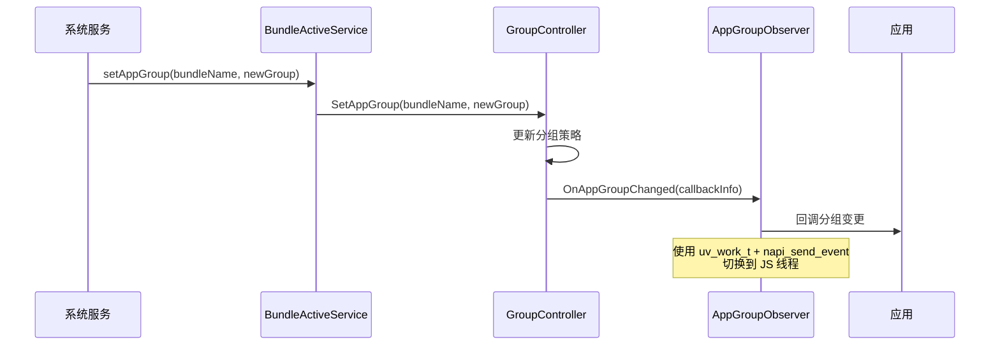
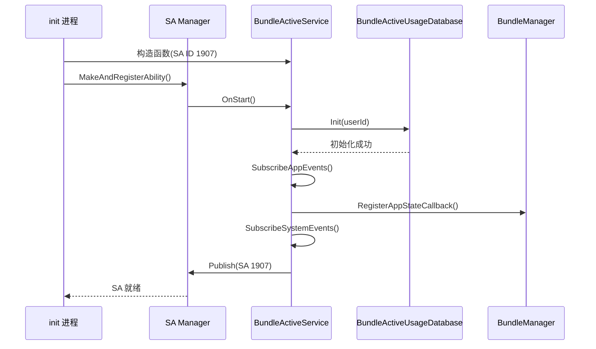
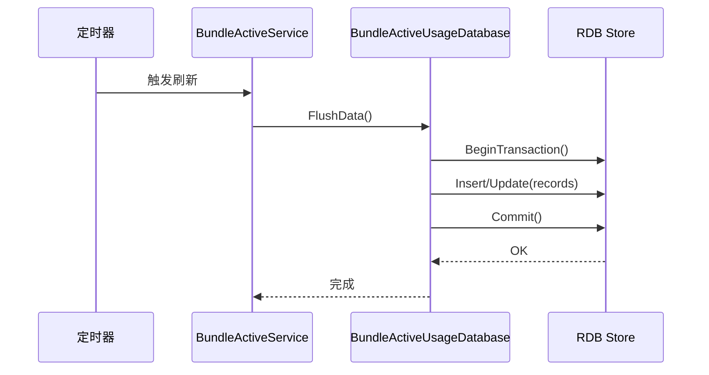

# 架构说明

## 目的

本文档描述 device_usage_statistics 组件的架构设计，包括组件图、数据流、线程模型和关键时序。

## 适用范围

- device_usage_statistics 组件的整体架构
- N-API 层、服务层、数据库层的交互关系
- 线程模型和并发控制

---

## 组件架构图

### 整体架构



---

## 数据流

### 1. 事件上报流程



**证据**:
- IBundleActiveService.idl:23: `ReportEvent` 接口定义
- services/common/src/bundle_active_event_reporter.cpp: 事件上报实现

---

### 2. 查询流程



**证据**:
- IBundleActiveService.idl:28-29: `QueryBundleEvents` 接口定义
- interfaces/innerkits/src/bundle_active_client.cpp: IPC 客户端实现

---

### 3. 应用分组变更流程



**证据**:
- IBundleActiveService.idl:37: `SetAppGroup` 接口定义
- IAppGroupCallback.idl:18: `OnAppGroupChanged` 回调定义
- frameworks/src/app_group_observer_napi.cpp:135-184: 观察者实现

---

## 线程模型

### 线程类型

| 线程类型 | 描述 | 使用场景 |
|----------|------|---------|
| 主线程 | SystemAbility 所在线程 | 处理 IPC 请求，协调各模块 |
| 工作线程池 | Node.js N-API 工作线程 | 异步执行耗时操作（查询、数据库操作） |
| uv 工作线程 | libuv 线程 | 应用分组变更回调到 JS |
| HiSysEvent 回调线程 | HiSysEvent 回调线程 | 处理系统事件通知 |
| 电源回调线程 | PowerManager 回调线程 | 处理电源状态变化 |
| 持续任务线程 | BackgroundTask 线程 | 监听持续任务状态 |

---

### 异步处理模式

**N-API 异步工作模式**:

```cpp
// frameworks/src/bundle_state_query_napi.cpp:120-123
napi_create_string_latin1(env, "IsIdleState", NAPI_AUTO_LENGTH, &resourceName);
napi_create_async_work(env, nullptr, resourceName,
    IsBundleIdleAsync,      // 工作线程执行
    IsBundleIdleAsyncCB,    // 主线程回调
    static_cast<void*>(asyncCallbackInfo), &asyncCallbackInfo->asyncWork);
napi_queue_async_work(env, callbackPtr->asyncWork);
```

**证据**:
- frameworks/src/bundle_state_query_napi.cpp:120-123: 异步工作创建
- frameworks/src/bundle_state_common.cpp:82-90: Promise/Callback 统一处理

---

### 应用分组观察者模式

**uv_work_t + napi_send_event**:

```cpp
// frameworks/src/app_group_observer_napi.cpp:135-184
ErrCode AppGroupObserver::OnAppGroupChanged(const AppGroupCallbackInfo &info) {
    // 创建 uv_work_t
    uv_work_t* work = new uv_work_t;

    // 填充回调数据
    CallbackReceiveDataWorker* worker = new CallbackReceiveDataWorker();
    worker->env = env_;
    worker->info = info;

    // 使用 napi_send_event 提交到 JS 线程
    auto task = [work]() { UvQueueWorkOnAppGroupChanged(work); };
    napi_send_event(callbackReceiveDataWorker->env, task, napi_eprio_high,
        "deviceUsageAppGroupChanged");
}
```

**证据**:
- frameworks/src/app_group_observer_napi.cpp:135-184: 观察者实现

---

## 关键时序

### 1. SystemAbility 启动时序



**证据**:
- services/common/src/bundle_active_service.cpp:57-127: OnStart 实现

---

### 2. 数据持久化时序

**定时刷新**（每 30 分钟、时间变更、新一天）:



**证据**:
- README_zh.md:120-123: 持久化时机说明
- services/common/src/bundle_active_usage_database.cpp: 数据库操作

---

## 模块边界

### N-API 层

**职责**:
- 对外暴露 JavaScript 接口
- 参数解析和校验
- 调用 IPC 客户端
- 处理异步/Promise

**边界**:
- ✅ **包含**: N-API 绑定、参数校验、异步工作管理
- ❌ **不包含**: 业务逻辑、数据库操作、IPC 实现

---

### 服务层

**职责**:
- 实现 SystemAbility 接口
- 协调各模块工作
- 处理权限检查
- 管理事件上报

**边界**:
- ✅ **包含**: 核心逻辑、权限检查、事件上报、数据库操作
- ❌ **不包含**: N-API 绑定、UI 相关、系统调度决策

---

### 数据存储层

**职责**:
- 数据库操作
- 表结构管理
- 数据升级和迁移

**边界**:
- ✅ **包含**: RDB 操作、SQL 执行、事务管理
- ❌ **不包含**: 业务逻辑、权限检查、事件上报

---

## 资源生命周期

### 1. SystemAbility 生命周期

- **创建**: 系统启动时由 SA Manager 创建
- **启动**: OnStart() 初始化数据库、订阅事件
- **停止**: OnStop() 清理资源、取消订阅
- **销毁**: 系统关闭时由 SA Manager 销毁

**证据**:
- services/common/src/bundle_active_service.cpp:122-127: OnStart()

---

### 2. N-API 资源生命周期

- **初始化**: RegisterModule() 注册模块
- **使用**: JS 调用时创建 napi_async_work
- **清理**: napi_delete_async_work 释放资源

**证据**:
- frameworks/src/usage_statistics_init.cpp:158-161: RegisterModule()

---

## 相关跳转链接

- [00_项目概览.md](00_项目概览.md) - 了解项目定位
- [01_目录结构与模块职责.md](01_目录结构与模块职责.md) - 了解模块组织
- [03_N-API接口文档.md](03_N-API接口文档.md) - 查看接口详情
- [04_内部API与模块接口.md](04_内部API与模块接口.md) - 查看内部接口

---

## 版本信息

- **生成时间**: 2026-02-06
- **文档版本**: v1.0
