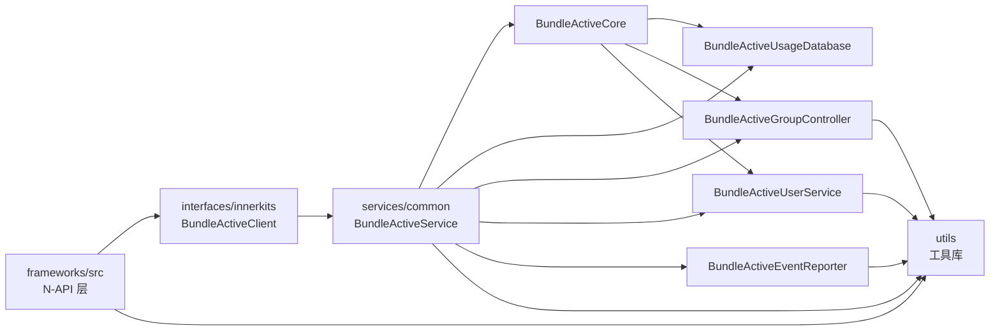

# 内部 API 与模块接口

## 目的

本文档描述 device_usage_statistics 组件的内部模块接口、依赖方向和接口稳定性。

## 适用范围

- interfaces/innerkits/ 目录下所有内部 C++ API
- 服务层各模块之间的接口依赖
- 模块稳定性和可替换性分析

---

## 内部 API 清单

### 1. BundleActiveClient

**文件**: `interfaces/innerkits/include/bundle_active_client.h`

**职责**: IPC 客户端，连接到 System Ability (SA 1907)

**主要接口**:

| 接口 | 职责 | 证据 |
|------|------|------|
| `GetInstance()` | 获取单例 | bundle_active_client.cpp:34-62 |
| `IsBundleIdle()` | 判断应用是否空闲 | IBundleActiveService.idl:24 |
| `QueryBundleEvents()` | 查询应用事件 | IBundleActiveService.idl:28-29 |
| `QueryBundleStatsInfos()` | 查询应用使用时长 | IBundleActiveService.idl:30-31 |
| `QueryCurrentBundleEvents()` | 查询当前应用事件 | IBundleActiveService.idl:34-35 |
| `QueryBundleStatsInfoByInterval()` | 按间隔查询统计 | IBundleActiveService.idl:26-27 |
| `QueryAppGroup()` | 查询应用分组 | IBundleActiveService.idl:36 |
| `SetAppGroup()` | 设置应用分组 | IBundleActiveService.idl:37 |
| `RegisterAppGroupCallBack()` | 注册分组回调 | IBundleActiveService.idl:39 |
| `UnRegisterAppGroupCallBack()` | 注销分组回调 | IBundleActiveService.idl:40 |
| `QueryModuleUsageRecords()` | 查询模块使用记录 | IBundleActiveService.idl:38 |
| `QueryDeviceEventStats()` | 查询系统事件统计 | IBundleActiveService.idl:41-44 |
| `QueryNotificationEventStats()` | 查询通知统计 | IBundleActiveService.idl:43-44 |
| `QueryAppStatsInfos()` | 查询应用统计 | IBundleActiveService.idl:31 |
| `QueryLastUseTime()` | 查询最后使用时间 | IBundleActiveService.idl:46 |

**证据**:
- IBundleActiveService.idl:22-47: IPC 接口定义
- interfaces/innerkits/include/bundle_active_client.h:36-267: 客户端接口

---

### 2. BundleActiveService

**文件**: `services/common/include/bundle_active_service.h`

**职责**: System Ability 实现，处理 IPC 请求并协调各模块

**主要接口**:

| 接口 | 职责 | 证据 |
|------|------|------|
| `OnStart()` | SA 启动初始化 | bundle_active_service.cpp:122-127 |
| `OnStop()` | SA 停止清理 | bundle_active_service.cpp:129-132 |
| `ReportEvent()` | 上报应用事件 | IBundleActiveService.idl:23 |
| `IsBundleIdle()` | 判断应用空闲 | bundle_active_service.cpp:796-808 |
| `QueryBundleEvents()` | 查询应用事件 | bundle_active_service.cpp:810-848 |
| `SetAppGroup()` | 设置应用分组 | bundle_active_service.cpp:931-983 |
| `RegisterAppGroupCallBack()` | 注册分组回调 | bundle_active_service.cpp:985-1018 |
| `UnRegisterAppGroupCallBack()` | 注销分组回调 | bundle_active_service.cpp:1020-1039 |
| `Dump()` | 导出调试信息 | bundle_active_service.cpp:1041-1109 |

**权限检查**:
- `CheckBundleIsSystemAppAndHasPermission()` (行 717-736)
- `CheckNativePermission()` (行 738-755)
- `CheckSystemAppOrNativePermission()` (行 757-766)

**证据**:
- services/common/include/bundle_active_service.h:41-42: 服务类定义

---

### 3. BundleActiveCore

**文件**: `services/common/include/bundle_active_core.h`

**职责**: 核心业务逻辑，协调各模块工作

**主要接口**:

| 接口 | 职责 | 证据 |
|------|------|------|
| `ReportEvent()` | 处理事件上报 | bundle_active_core.cpp:68-119 |
| `RestoreAllData()` | 恢复所有用户数据 | bundle_active_core.cpp:390-411 |
| `QueryBundleEvents()` | 查询应用事件 | bundle_active_core.cpp:413-475 |
| `IsBundleIdle()` | 判断应用空闲 | bundle_active_core.cpp:477-529 |
| `SetAppGroup()` | 设置应用分组 | bundle_active_core.cpp:531-582 |

**证据**:
- services/common/src/bundle_active_core.cpp: 核心逻辑实现

---

### 4. BundleActiveUsageDatabase

**文件**: `services/common/include/bundle_active_usage_database.h`

**职责**: 数据库操作，提供数据的 CRUD 接口

**主要接口**:

| 接口 | 职责 | 证据 |
|------|------|------|
| `Init()` | 初始化数据库 | bundle_active_usage_database.cpp:63-115 |
| `Insert()` | 插入记录 | bundle_active_usage_database.cpp:117-168 |
| `Query()` | 查询记录 | bundle_active_usage_database.cpp:170-348 |
| `Delete()` | 删除记录 | bundle_active_usage_database.cpp:350-458 |
| `Update()` | 更新记录 | bundle_active_usage_database.cpp:460-499 |
| `FlushData()` | 刷新数据到数据库 | bundle_active_usage_database.cpp:501-576 |

**数据库表**:
- bundle_active_event
- bundle_active_form_record
- bundle_active_package_stats
- bundle_active_module_record
- bundle_active_event_stats

**证据**:
- services/common/src/bundle_active_usage_database.cpp: 数据库操作实现

---

### 5. BundleActiveGroupController

**文件**: `services/packagegroup/include/bundle_active_group_controller.h`

**职责**: 应用分组控制器，管理分组策略

**主要接口**:

| 接口 | 职责 | 证据 |
|------|------|------|
| `SetAppGroup()` | 设置应用分组 | bundle_active_group_controller.cpp:366-368 |
| `QueryAppGroup()` | 查询应用分组 | bundle_active_group_controller.cpp:370-372 |
| `GetGroupInfo()` | 获取分组信息 | bundle_active_group_controller.cpp:374-376 |

**分组策略**:
- 活跃分组: 频繁使用的应用
- 每日分组: 每天使用的应用
- 固定分组: 长期使用的应用
- 罕见分组: 很少使用的应用
- 受限分组: 使用受限的应用
- 从未分组: 从未使用的应用

**证据**:
- services/packagegroup/src/bundle_active_group_controller.cpp: 分组控制实现

---

### 6. BundleActiveUserService

**文件**: `services/packageusage/include/bundle_active_user_service.h`

**职责**: 用户服务，管理用户数据

**主要接口**:

| 接口 | 职责 | 证据 |
|------|------|------|
| `Init()` | 初始化用户服务 | bundle_active_user_service.cpp:56-115 |
| `RestoreAllData()` | 恢复所有用户数据 | bundle_active_user_service.cpp:117-178 |
| `QueryModuleUsageRecords()` | 查询模块使用记录 | bundle_active_user_service.cpp:180-246 |
| `QueryAppStatsInfos()` | 查询应用统计信息 | bundle_active_user_service.cpp:248-310 |

**证据**:
- services/packageusage/src/bundle_active_user_service.cpp: 用户服务实现

---

### 7. BundleActiveEventReporter

**文件**: `services/common/include/bundle_active_event_reporter.h`

**职责**: 事件上报逻辑，订阅系统事件并上报

**主要接口**:

| 接口 | 职责 | 证据 |
|------|------|------|
| `ReportEvent()` | 上报事件 | bundle_active_event_reporter.cpp:52-84 |
| `SubscribeAppEvents()` | 订阅应用事件 | bundle_active_event_reporter.cpp:86-122 |
| `SubscribeSystemEvents()` | 订阅系统事件 | bundle_active_event_reporter.cpp:124-162 |

**证据**:
- services/common/src/bundle_active_event_reporter.cpp: 事件上报实现

---

## 模块依赖方向

### 依赖图

**依赖说明**:
- **N-API 层** → BundleActiveClient: 通过 IPC 调用服务
- **BundleActiveClient** → BundleActiveService: IPC 通信
- **BundleActiveService** → BundleActiveCore: 协调核心逻辑
- **BundleActiveCore** → 各子模块: 委托具体任务
- **所有服务模块** → utils: 使用工具函数

---

## 接口稳定性分析

### 稳定接口

这些接口相对稳定，可以作为外部依赖：

| 接口 | 稳定性 | 原因 |
|------|--------|------|
| `BundleActiveClient` | 高 | 提供标准的 IPC 客户端接口，接口通过 IDL 定义 |
| `BundleActiveEvent` 数据结构 | 高 | 简单数据结构，版本化支持 |
| `BundleActivePackageStats` 数据结构 | 高 | 简单数据结构，版本化支持 |
| `BundleActiveModuleRecord` 数据结构 | 高 | 简单数据结构，版本化支持 |
| `BundleActiveEventStats` 数据结构 | 高 | 简单数据结构，版本化支持 |

**证据**:
- interfaces/innerkits/include/bundle_active_*.h: 数据结构定义
- libusagestatsinner.versionscript: 导出符号版本控制

---

### 不稳定接口

这些接口可能变更，谨慎使用：

| 接口 | 不稳定性 | 原因 |
|------|----------|------|
| `BundleActiveService` 内部接口 | 高 | 内部实现细节，可能随重构变化 |
| `BundleActiveCore` 内部接口 | 高 | 核心逻辑可能随功能变化 |
| `BundleActiveUsageDatabase` 内部接口 | 中 | 数据库结构可能随升级变化 |
| `BundleActiveGroupController` 内部接口 | 中 | 分组策略可能调整 |

**证据**:
- services/common/include/bundle_active_*.h: 内部头文件
- services/packagegroup/include/bundle_active_*.h: 内部头文件
- services/packageusage/include/bundle_active_*.h: 内部头文件

---

## 可替换点

### 可替换组件

这些组件设计为可替换：

| 组件 | 替换方式 | 接口 |
|------|----------|------|
| BundleActiveUsageDatabase | 实现新的数据库操作类 | 继承或实现相同的接口 |
| BundleActiveEventReporter | 实现新的事件上报类 | 实现 ReportEvent 接口 |
| BundleActiveGroupController | 实现新的分组控制器 | 实现 SetAppGroup 接口 |

**注意**: 替换需要保持接口兼容性。

---

## 内部常量定义

### BundleActiveConstant

**文件**: `services/common/include/bundle_active_constant.h`

**主要常量**:

| 常量 | 值 | 说明 |
|--------|-----|------|
| `DEVICE_USAGE_STATISTICS_SYS_ABILITY_ID` | 1907 | SA ID |
| `NEEDED_PERMISSION` | "ohos.permission.BUNDLE_ACTIVE_INFO" | 所需权限 |
| `DEFAULT_INTERVAL_MILLI_SECNDS` | 1800000 | 默认刷新间隔（30 分钟） |
| `BUNDLE_ACTIVE_DATABASE_DIR` | "/data/service/el2/database/bundle_active" | 数据库目录 |

**证据**:
- services/common/include/bundle_active_constant.h: 常量定义

---

## 相关跳转链接

- [01_目录结构与模块职责.md](01_目录结构与模块职责.md) - 了解模块组织
- [02_架构说明.md](02_架构说明.md) - 深入了解架构
- [03_N-API接口文档.md](03_N-API接口文档.md) - 查看对外 API
- [05_GN构建系统.md](05_GN构建系统.md) - 了解构建配置

---

## 版本信息

- **生成时间**: 2026-02-06
- **文档版本**: v1.0
