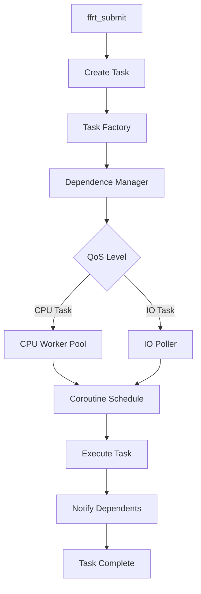
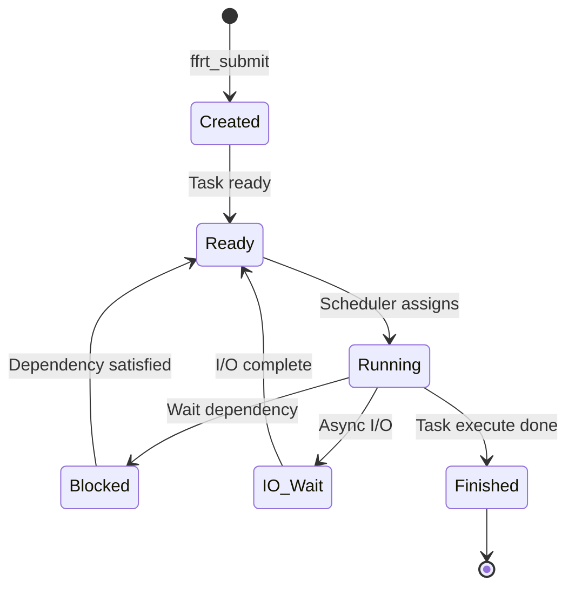
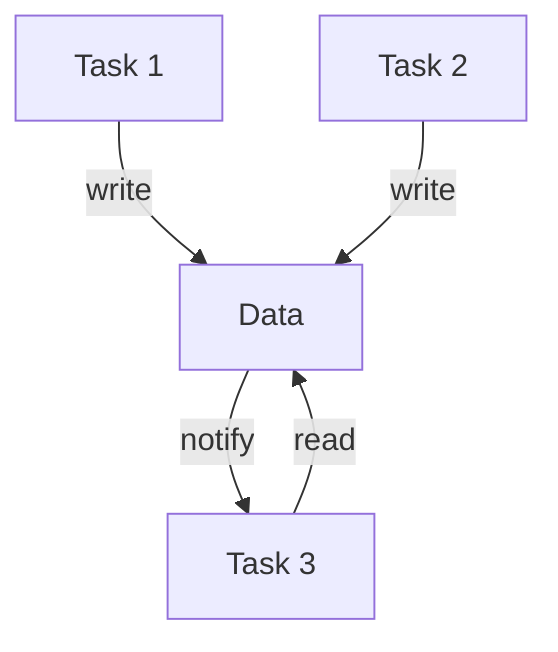
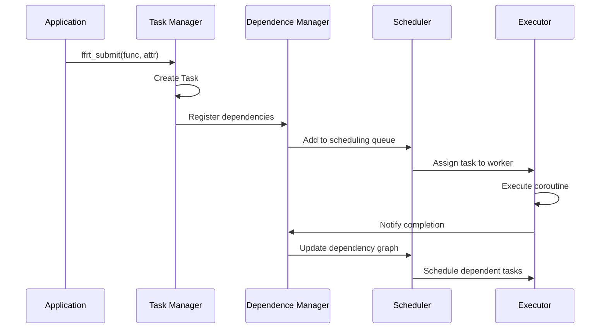

# FFRT 架构设计

## 整体架构

### 架构分层

```
┌─────────────────────────────────────────────────────────┐
│                    应用层 (Application)                   │
│              tasks, closures, dependencies               │
├─────────────────────────────────────────────────────────┤
│                   API 层 (interfaces/)                   │
│            C/C++ APIs (kits/), Inner APIs              │
├─────────────────────────────────────────────────────────┤
│                   核心层 (src/core/)                     │
│         task, entity, loop, poller, timer APIs          │
├─────────────────────────────────────────────────────────┤
│              运行时层 (src/eu/, src/sched/)              │
│     executor, scheduler, coroutine, worker thread       │
├─────────────────────────────────────────────────────────┤
│              管理器层 (src/tm/, src/dm/)                 │
│         task manager, dependence manager                │
├─────────────────────────────────────────────────────────┤
│              同步层 (src/sync/, src/queue/)              │
│    mutex, condvar, queue, timer, sleep, thread          │
├─────────────────────────────────────────────────────────┤
│              工具层 (src/util/, src/dfx/)                 │
│         util, log, trace, dump, bbox, watchdog           │
└─────────────────────────────────────────────────────────┘
```

### 核心组件

| 组件 | 位置 | 职责 |
|------|------|------|
| **Task Scheduler** | `src/sched/` | 任务调度决策 |
| **Executor** | `src/eu/` | 任务执行管理 |
| **Task Manager** | `src/tm/` | 任务生命周期 |
| **Dependence Manager** | `src/dm/` | 依赖关系管理 |
| **Queue Manager** | `src/queue/` | 队列管理 |
| **Sync Primitives** | `src/sync/` | 同步原语实现 |

## 数据流

### 任务提交流程



### 关键数据流

| 阶段 | 输入 | 处理 | 输出 |
|------|------|------|------|
| **提交** | function + attr | Task Factory 创建任务 | Task Handle |
| **调度** | Task + QoS | Scheduler 决策 | Worker 分配 |
| **执行** | Coroutine Context | EU 执行任务 | 结果输出 |
| **同步** | Dependencies | Dependence Manager | 完成通知 |

## 线程模型

### 线程分类

| 线程类型 | 数量 | 职责 |
|----------|------|------|
| **Worker Threads** | 动态 | 执行 CPU 任务 |
| **IO Poller Threads** | 1 | 处理 I/O 事件 |
| **Timer Threads** | 1 | 定时器管理 |
| **User Threads** | 用户控制 | 提交任务 |

### 协程与线程关系

```
┌─────────────────────────────────────────────────┐
│                 Worker Thread                   │
│  ┌─────────────────────────────────────────┐   │
│  │           Coroutine Scheduler           │   │
│  │  ┌─────────┐ ┌─────────┐ ┌─────────┐   │   │
│  │  │ Coroutine│ │ Coroutine│ │ Coroutine│   │   │
│  │  │    1    │ │    2    │ │    3    │   │   │
│  │  └────┬────┘ └────┬────┘ └────┬────┘   │   │
│  └───────┼───────────┼───────────┼─────────┘   │
│          │           │           │              │
└──────────┼───────────┼───────────┼──────────────┘
           │           │           │
        Task 1      Task 2      Task 3
```

**关键特性**:
- 单个 Worker 线程可运行多个协程
- 协程切换在用户态完成，无内核开销
- 协程栈大小可通过 `ffrt_task_attr_set_stack_size` 配置

## 任务生命周期



### 状态说明

| 状态 | 说明 | 触发条件 |
|------|------|----------|
| **Created** | 任务已创建 | `ffrt_submit()` 调用 |
| **Ready** | 任务就绪 | 依赖已满足 |
| **Running** | 正在执行 | Worker 开始执行 |
| **Blocked** | 被阻塞 | 等待依赖或锁 |
| **IO_Wait** | 等待 I/O | 异步 I/O 操作 |
| **Finished** | 已完成 | 任务执行结束 |

## 调度策略

### QoS 调度

FFRT 根据任务的 QoS 等级进行调度：

| QoS 等级 | 调度优先级 | 建议 Worker 数量 |
|----------|-----------|-----------------|
| `qos_background` | 最低 | 1-2 |
| `qos_utility` | 低 | 2-4 |
| `qos_default` | 中 | 默认配置 |
| `qos_user_initiated` | 高 | 4-8 |
| `qos_deadline_request` | 实时 | 专用池 |
| `qos_user_interactive` | 最高 | 最大配置 |

### 调度时机

1. **任务提交时**: 新任务加入就绪队列
2. **依赖满足时**: 被阻塞任务变为就绪
3. **协程让出**: 任务主动 `yield`
4. **定时器触发**: 延迟任务变为就绪
5. **I/O 完成**: 异步 I/O 任务唤醒

## 依赖管理

### 依赖类型

| 类型 | 结构 | 用途 |
|------|------|------|
| **数据依赖** | `dependence(data_ptr)` | 数据流同步 |
| **任务依赖** | `dependence(task_handle)` | 任务链同步 |

### 依赖图管理



**依赖解析流程**:
1. 任务提交时声明输入/输出依赖
2. 依赖管理器构建依赖图
3. 任务就绪时检查依赖是否满足
4. 任务完成时通知依赖方

## 关键时序图

### 任务提交与执行



## 模块依赖关系

```
                    ┌─────────────┐
                    │   TaskMgr   │
                    └──────┬──────┘
                           │
              ┌────────────┼────────────┐
              │            │            │
              ▼            ▼            ▼
       ┌──────────┐  ┌──────────┐  ┌──────────┐
       │ Scheduler│  │Dependence│  │ QueueMgr │
       │          │  │  Manager │  │          │
       └────┬─────┘  └────┬─────┘  └────┬─────┘
            │             │             │
            │    ┌────────┴────────┐    │
            │    │                 │    │
            ▼    ▼                 ▼    ▼
       ┌─────────────────────────────────────┐
       │           Executor (EU)             │
       │  ┌─────────┐ ┌─────────────────┐   │
       │  │ Coroutine│ │  Worker Thread │   │
       │  └─────────┘ └─────────────────┘   │
       └─────────────────────────────────────┘
```

## 相关文档

- [概览](01_Overview.md) - 基本概念介绍
- [API 参考](03_API_Reference.md) - 接口详细说明
- [编译构建](04_Build.md) - 构建配置
- [安全风险](05_Security.md) - 安全架构分析
