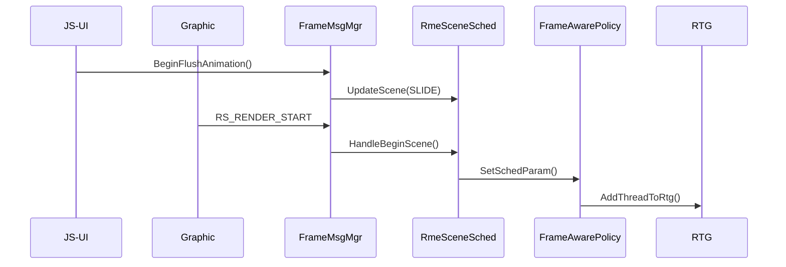

# 架构设计

## 整体架构

Frame Aware Sched 由两大核心组件构成：

1. **Frame Aware Collector**：运行在应用进程，负责帧事件收集与场景识别
2. **Frame Aware Policy**：运行在系统服务，负责应用状态管理与 RTG 调度控制

```mermaid
graph TB
    subgraph "应用进程 (App Process)"
        UI[JS-UI 子系统] -->|帧事件| FC[Frame Aware Collector]
        Graphic[Graphic 子系统] -->|帧事件| FC
        FC -->|上报消息| Policy
    end

    subgraph "系统服务 (System Service)"
        Policy[Frame Aware Policy]
        Policy -->|RTG 控制| RTG[RTG Interface]
        Policy -->|Auth 控制| QoS[QoS Manager]
        RTG -->|ioctl| Kernel[/proc/sched_rtg_ctrl]
        QoS -->|ioctl| AuthDev[/dev/basic_auth_ctrl]
        Policy -->|订阅事件| AppState[应用状态管理]
    end

    subgraph "内核 (Kernel)"
        Kernel -->|调度策略| Sched[CPU 调度器]
    end
```

## Frame Aware Collector

负责帧信息收集与场景识别，核心模块包括：

| 模块 | 职责 |
|------|------|
| **Frame Window Mgr** | 窗口管理（启动/使能状态） |
| **Frame Msg Mgr** | 帧消息处理（事件分发、场景更新） |
| **Frame Scene Sched** | 场景调度策略 |
| **RME Core Sched** | 核心调度逻辑 |
| **RME Scene Sched** | 场景调度实现 |

### 数据流

```
UI/Graphic 帧事件 ──> FrameMsgMgr::EventUpdate() ──> FrameEvent 映射 ──> 场景更新/参数调整
```

### 关键时序



## Frame Aware Policy

负责应用状态管理与 RTG 调度控制，核心模块包括：

| 模块 | 职责 |
|------|------|
| **IntelliSense Server** | 智能感知服务器（应用状态管理、XML 配置读取） |
| **App Info** | 应用信息管理（PID/UID/状态/RTG 组） |
| **Para Config** | 参数配置 |

### 关键功能

| 功能 | 说明 |
|------|------|
| **应用状态感知** | 前后台切换、窗口焦点变化 |
| **RTG 组管理** | 创建/销毁 RTG 组、线程增删 |
| **帧率感知** | 根据 FPS 调整调度策略 |
| **渲染线程识别** | 识别并绑定渲染线程 |

### 线程模型

- **Collector**：运行在应用主线程，通过回调方式收集帧事件
- **Policy**：使用 FFRT 任务队列（`frame_aware_sched_msg_queue`）异步处理消息

## RTG 控制接口

RTG（Related-Thread-Group）通过 `rtg_interface.cpp` 与内核交互：

| ioctl 命令 | 功能 |
|-----------|------|
| `CMD_ID_SET_ENABLE` | 启用/禁用 RTG |
| `CMD_ID_SET_RTG` | 添加/移除线程到 RTG 组 |
| `CMD_ID_SET_RTG_ATTR` | 设置 RTG 属性（帧率、类型） |
| `CMD_ID_BEGIN_FRAME_FREQ` | 开始帧率统计 |
| `CMD_ID_END_FRAME_FREQ` | 结束帧率统计 |
| `CMD_ID_DESTROY_RTG_GRP` | 销毁 RTG 组 |

## 配置文件

`profiles/hwrme.xml` 定义了调度策略参数：

```xml
<framedetect render_type="0" fps_list="60" size="24">
    <default_util>600</default_util>
</framedetect>
```

## 依赖组件

| 组件 | 用途 |
|------|------|
| `hilog` | 日志输出 |
| `hitrace` | 性能追踪 |
| `ffrt` | 异步任务队列 |
| `eventhandler` | 事件处理 |
| `libxml2` | XML 配置解析 |
| `samgr` | 系统服务管理 |
| `safwk` | 启动框架 |
| `bounds_checking_function` | 安全函数 |
| `c_utils` | 公共工具 |
