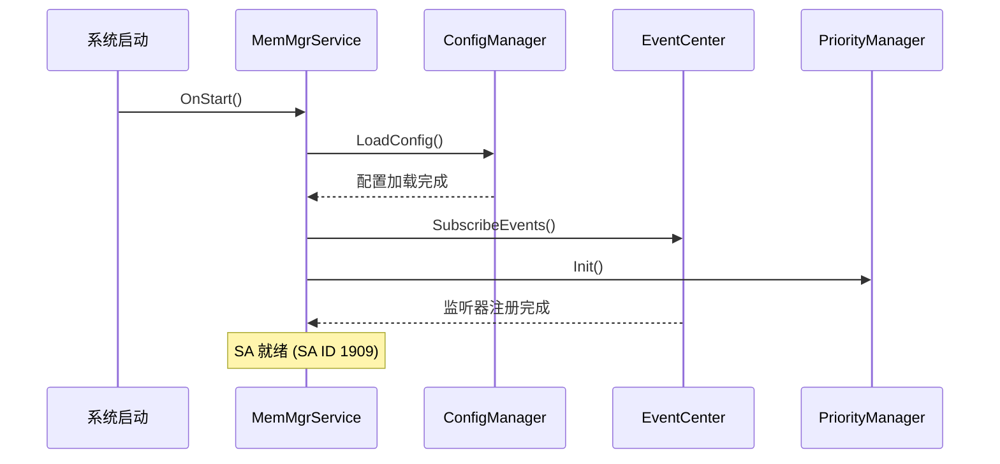

# 架构说明 (Architecture)

> MemMgr 组件内部架构详解

## 1. 系统架构总览

### 1.1 架构图

```
┌─────────────────────────────────────────────────────────────────────────────┐
│                          OpenHarmony 系统                                   │
├─────────────────────────────────────────────────────────────────────────────┤
│                                                                             │
│  ┌─────────────┐   ┌─────────────┐   ┌─────────────┐   ┌─────────────┐      │
│  │  App Lifecycle │   │  WindowMgr  │   │  BundleMgr  │   │  PSI/Kernel │      │
│  └──────┬──────┘   └──────┬──────┘   └──────┬──────┘   └──────┬──────┘      │
│         │                │                │                │              │
│         └────────────────┴────────────────┴────────────────┘              │
│                                    │                                        │
│                                    ▼                                        │
│  ┌─────────────────────────────────────────────────────────────────────┐   │
│  │                        MemMgr Service (SA 1909)                       │   │
│  │  ┌───────────────────────────────────────────────────────────────┐   │   │
│  │  │                      事件中心 (Event Center)                   │   │   │
│  │  │  ┌─────────┐ ┌─────────┐ ┌─────────┐ ┌─────────┐ ┌─────────┐   │   │   │
│  │  │  │AppState │ │ Window  │ │ Memory  │ │ Common  │ │Account │   │   │   │
│  │  │  │Observer│ │Visible │ │Pressure │ │ Event   │ │Observer│   │   │   │
│  │  │  └────┬────┘ └────┬────┘ └────┬────┘ └────┬────┘ └────┬────┘   │   │   │
│  │  └───────┼───────────┼───────────┼───────────┼───────────┼────────┘   │   │
│  └──────────┼───────────┼───────────┼───────────┼───────────┼──────────┘   │
│             │           │           │           │           │              │
│             ▼           │           │           │           │              │
│  ┌──────────────────────┐│           │           │           │              │
│  │ 回收优先级管理模块    ││           │           │           │              │
│  │ ReclaimPriorityManager│           │           │           │              │
│  │ ┌──────────────────┐ ││           │           │           │              │
│  │ │进程优先级列表      │ ││           │           │           │              │
│  │ │-1000 ~ 400       │ ││           │           │           │              │
│  │ └──────────────────┘ ││           │           │           │              │
│  └──────────────────────┘│           │           │           │              │
│             │           │           │           │           │              │
│             ▼           │           │           │           │              │
│  ┌─────────────────────────────────────────────────────────────────────┐   │
│  │                                                                     │   │
│  │  ┌─────────────────────┐        ┌─────────────────────┐            │   │
│  │  │   回收策略模块       │        │    查杀策略模块      │            │   │
│  │  │ ReclaimStrategyMgr  │        │  KillStrategy/LowMem│            │   │
│  │  │ - avail_buffer      │        │  - PSI 触发          │            │   │
│  │  │ - kswapd/zswapd     │        │  - 按优先级杀进程    │            │   │
│  │  │ - 回收参数下发       │        │  - 内存水线联动      │            │   │
│  │  └─────────────────────┘        └─────────────────────┘            │   │
│  │                                                                     │   │
│  └─────────────────────────────────────────────────────────────────────┘   │
│                                    │                                        │
│                                    ▼                                        │
│  ┌─────────────────────────────────────────────────────────────────────┐   │
│  │                     Kernel 接口管控模块                               │   │
│  │              kernel_interface.cpp                                     │   │
│  │  - 回收参数写入内核 (/proc/vmpressure 等)                              │   │
│  │  - 查杀命令下发 (lowmemorykiller)                                     │   │
│  └─────────────────────────────────────────────────────────────────────┘   │
│                                                                             │
│  ┌─────────────────────────────────────────────────────────────────────┐   │
│  │                     配置管理 (MemmgrConfigManager)                    │   │
│  │                   /etc/memmgr/memmgr_config.xml                      │   │
│  └─────────────────────────────────────────────────────────────────────┘   │
│                                                                             │
└─────────────────────────────────────────────────────────────────────────────┘
```

**证据**: `README_zh.md:54-66`, `figures/zh-cn_image_fwk.png`

### 1.2 模块职责

| 模块 | 职责 | 关键文件 |
|------|------|----------|
| **事件中心** | 统筹管理外部事件监听与分发 | `event/mem_mgr_event_center.h` |
| **回收优先级管理** | 计算并维护进程优先级列表 | `reclaim_priority_manager/` |
| **回收策略** | 调整回收参数，协调回收机制 | `reclaim_strategy_manager/` |
| **查杀策略** | 低内存时按优先级杀进程 | `kill_strategy_manager/` |
| **Kernel 接口** | 下发管控命令到内核 | `kernel_interface.cpp` |
| **配置管理** | 解析 XML 配置 | `memmgr_config_manager.cpp` |

---

## 2. 事件中心详解

### 2.1 架构设计

事件中心采用**观察者模式**，统一管理各类事件监听器：

```cpp
// 事件中心核心类
class MemMgrEventCenter {
public:
    void SubscribeEvents();    // 注册所有监听器
    void UnsubscribeEvents();  // 注销监听器
    void NotifyEvent(EventType type);  // 通知事件
};
```

**证据**: `services/memmgrservice/include/event/mem_mgr_event_center.h`

### 2.2 事件监听器列表

| 监听器 | 头文件 | 事件源 | 触发动作 |
|--------|--------|--------|----------|
| `AppStateObserver` | `app_state_observer.h` | 应用生命周期 | 更新进程优先级 |
| `WindowVisibilityObserver` | `window_visibility_observer.h` | 窗口显隐 | 更新进程优先级 |
| `MemoryPressureObserver` | `memory_pressure_observer.h` | PSI 压力 | 触发回收/查杀 |
| `KswapdObserver` | `kswapd_observer.h` | kswapd 状态 | 调整回收策略 |
| `BgTaskObserver` | `bg_task_observer.h` | 后台任务 | 更新进程优先级 |
| `ExtensionConnectionObserver` | `extension_connection_observer.h` | 扩展连接 | 更新进程优先级 |
| `CommonEventObserver` | `common_event_observer.h` | 系统公共事件 | 通用事件处理 |
| `AccountObserver` | `account_observer.h` | 账户切换 | 多账户优先级管理 |

**证据**: `services/memmgrservice/include/event/` 全部头文件

### 2.3 事件流

```
外部事件源
    │
    ▼
┌─────────────────┐
│ MemMgrEventCenter│
│   (事件分发)     │
└────────┬────────┘
         │
         ├──▶ AppStateObserver ───▶ ReclaimPriorityManager
         │                              │
         ├──▶ WindowVisibilityObs ─────▶ (更新优先级)
         │
         ├──▶ MemoryPressureObs ──────▶ KillStrategy
         │                              │
         ├──▶ KswapdObs ───────────────▶ ReclaimStrategy
         │                              │
         └──▶ 其他 Observer ───────────▶ (各模块处理)
```

---

## 3. 回收优先级管理详解

### 3.1 核心类结构

```
ReclaimPriorityManager
    │
    ├── ProcessPriorityInfo      # 单进程优先级信息
    │       │
    │       ├── pid, uid, bundleName
    │       ├── priority (计算值)
    │       └── oomScoreAdj (内核同步值)
    │
    ├── BundlePriorityInfo        # Bundle 级别信息
    │       │
    │       ├── bundleName, uid
    │       └── priority
    │
    ├── AccountPriorityInfo       # 账户级别信息
    │       │
    │       ├── accountId
    │       └── priority
    │
    └── MultiAccountManager       # 多账户管理
            │
            ├── DefaultMultiAccountStrategy
            └── MultiAccountStrategy (可替换)
```

**证据**: `services/memmgrservice/include/reclaim_priority_manager/` 全部头文件

### 3.2 优先级计算逻辑

**优先级公式** (伪代码):

```
ProcessPriority = BasePriority
                 + AccountPriority(多账户加成)
                 + ExtensionBonus(关联extension加成)
                 + BackgroundTaskBonus(后台任务加成)
```

**基础优先级映射**:

| 进程状态 | 基础优先级 | 证据 |
|----------|------------|------|
| 系统进程 (白名单) | -1000 | `README_zh.md:78` |
| 常驻进程 (可拉起) | -800 | `README_zh.md:79` |
| 前台应用 | 0 | `README_zh.md:80` |
| 后台短时任务 | 100 | `README_zh.md:81` |
| 后台感知应用 | 200 | `README_zh.md:82` |
| 分布式连接 | 260 | `README_zh.md:83` |
| 普通后台应用 | 400 | `README_zh.md:84` |

### 3.3 与内核同步

```cpp
// OOM Score Adj 工具类
class OomScoreAdjUtils {
public:
    static bool SetOomScoreAdj(int pid, int oomScoreAdj);
    static int PidToOomScoreAdj(int pid);
};
```

**证据**: `services/memmgrservice/include/reclaim_priority_manager/oom_score_adj_utils.h`

---

## 4. 回收策略模块详解

### 4.1 核心类

```
ReclaimStrategyManager
    │
    ├── ReclaimParam              # 回收参数结构
    │       │
    │       ├── availBuffer (800MB)
    │       ├── minAvailBuffer (750MB)
    │       ├── highAvailBuffer (850MB)
    │       ├── mem2zramRatio (60%)
    │       └── zram2ufsRatio (10%)
    │
    ├── AvailBufferManager        # 可用缓冲区管理
    │
    ├── Memcg                     # 内存控制组接口
    │       │
    │       └── MemcgMgr          # Memcg 管理器
    │
    └── MemoryLevelManager        # 内存级别管理
            │
            └── MemoryLevelConstants
```

**证据**: `services/memmgrservice/include/reclaim_strategy_manager/` 全部头文件

### 4.2 回收参数下发流程

```
配置解析 (XML)
       │
       ▼
ReclaimStrategyManager::LoadConfig()
       │
       ├──▶ AvailBufferManager::SetAvailBuffer()
       │           │
       │           └──▶ KernelInterface::WriteAvailBuffer()
       │
       └──▶ KernelInterface::SetReclaimParams()
                   │
                   └──▶ /proc/vmpressure 等
```

### 4.3 配置项详解

| 配置项 | 默认值 | 范围 | 作用 |
|--------|--------|------|------|
| `availBuffer` | 800 MB | 0~memTotal | 期望的正常状态 buffer |
| `minAvailBuffer` | 750 MB | 0~availBuffer | 唤醒 zswapd 的阈值 |
| `highAvailBuffer` | 850 MB | availBuffer~memTotal | 期望的回收量 |
| `swapReserve` | 200 MB | 0~memTotal | 交换分区空闲阈值 |
| `mem2zramRatio` | 60% | 0~100 | 内存压缩到 ZRAM 的比率 |
| `zram2ufsRatio` | 10% | 0~100 | ZRAM 换出到 UFS 的比率 |

**证据**: `README_zh.md:172-185`, `common/include/config/reclaim_config.h`

---

## 5. 查杀策略模块详解

### 5.1 低内存查杀器

```cpp
class LowMemoryKiller {
public:
    bool Init();
    void OnMemoryPressure(int level);  // PSI 事件回调
    bool KillProcessByPriority(int minPriority);  // 按优先级杀进程
};
```

**证据**: `services/memmgrservice/include/kill_strategy_manager/low_memory_killer.h`

### 5.2 查杀触发逻辑

```
MemoryPressureObserver (PSI 事件)
             │
             ▼
   LowMemoryKiller::OnMemoryPressure()
             │
             ├──▶ 判断内存压力级别 (轻/中/重)
             │
             └──▶ KillProcessByPriority(对应级别阈值)
                         │
                         ├──▶ 查询 ReclaimPriorityManager
                         │           │
                         │           └──▶ 优先杀低优先级进程
                         │
                         └──▶ KernelInterface::KillProcess()
                                     │
                                     └──▶ /dev/lowmemorykiller
```

### 5.3 查杀内存水线

| 内存水线 | 可杀最小优先级 | 触发场景 |
|----------|----------------|----------|
| 500 MB | 400 | 轻度内存压力 |
| 400 MB | 300 | 中度内存压力 |
| 300 MB | 200 | 重度内存压力 |
| 200 MB | 100 | 严重内存压力 |
| 100 MB | 0 | 极严重内存压力 |

**证据**: `README_zh.md:106-112`

---

## 6. Kernel 接口管控

### 6.1 交互方式

```cpp
class KernelInterface {
public:
    bool SetAvailBuffer(int availBuffer);      // 设置可用缓冲区
    bool SetReclaimParams(ReclaimParam &param); // 设置回收参数
    bool KillProcess(int pid);                 // 杀进程
    bool SetOomScoreAdj(int pid, int score);   // 设置 OOM 分数
};
```

**证据**: `common/include/kernel_interface.h`, `common/src/kernel_interface.cpp`

### 6.2 内核交互点

| 操作 | 内核接口 | 用途 |
|------|----------|------|
| 内存压力 | `/proc/vmpressure` | 监听内存压力事件 |
| 低内存查杀 | `/dev/lowmemorykiller` | 向内核发查杀命令 |
| OOM Score | `/proc/<pid>/oom_score_adj` | 调整进程 OOM 分数 |
| Memcg | cgroup v1 API | 内存控制组管理 |

---

## 7. 配置管理模块

### 7.1 配置加载流程

```
系统启动
    │
    ▼
MemmgrConfigManager::LoadConfig("/etc/memmgr/memmgr_config.xml")
    │
    ├──▶ XMLHelper::Parse()
    │           │
    │           └──▶ 各类 Config Parser
    │                   │
    │                   ├── AvailBufferConfig::Parse()
    │                   ├── KillConfig::Parse()
    │                   ├── ReclaimConfig::Parse()
    │                   └── ...
    │
    └──▶ 通知各模块应用配置
```

**证据**: `common/include/memmgr_config_manager.h`, `common/src/memmgr_config_manager.cpp`

### 7.2 配置结构体

| 配置类 | 头文件 | 用途 |
|--------|--------|------|
| `AvailBufferConfig` | `avail_buffer_config.h` | 可用缓冲区配置 |
| `KillConfig` | `kill_config.h` | 查杀策略配置 |
| `ReclaimConfig` | `reclaim_config.h` | 回收参数配置 |
| `NandLifeConfig` | `nand_life_config.h` | 磁盘寿命管控 |
| `PurgeableMemConfig` | `purgeablemem_config.h` | 可清理内存配置 |

---

## 8. 生命周期

### 8.1 SA 启动流程

```
SystemBoot
      │
      ▼
MemMgrService::OnStart()
      │
      ├──▶ MemmgrConfigManager::LoadConfig()
      │
      ├──▶ MemMgrEventCenter::SubscribeEvents()
      │
      ├──▶ ReclaimPriorityManager::Init()
      │
      ├──▶ ReclaimStrategyManager::Init()
      │
      └──▶ LowMemoryKiller::Init()
```

**证据**: `services/memmgrservice/include/mem_mgr_service.h:53-55`

### 8.2 关键时序图



---

## 9. 相关跳转

- **概览**: [00_Overview.md](./00_Overview.md)
- **Inner API**: [02_Inner_API.md](./02_Inner_API.md)
- **构建配置**: [03_Build.md](./03_Build.md)
- **安全评审**: [04_Security.md](./04_Security.md)
- **导航**: [SUMMARY.md](./SUMMARY.md)

---

*文档版本: 3.1.0 | 最后更新: 2026-02-06*
