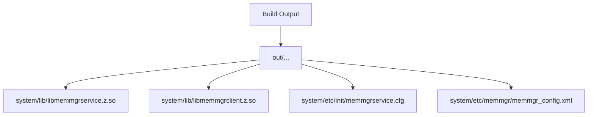

# 构建配置 (Build)

> MemMgr 组件 GN Targets 与编译产物说明

## 1. GN 构建入口

### 1.1 根配置文件

| 文件 | 用途 |
|------|------|
| `memmgr.gni` | 变量定义 (路径、开关) |
| `bundle.json` | 组件描述 (组件名、依赖、产出) |

**证据**: `memmgr.gni`, `bundle.json`

### 1.2 memmgr.gni 变量定义

```gn
# 路径变量
memmgr_subsystem_name = "resourceschedule"
memmgr_part_name = "memmgr"
memmgr_root_path = "//foundation/resourceschedule/${memmgr_part_name}"
memmgr_common_path = "${memmgr_root_path}/common"
memmgr_service_path = "${memmgr_root_path}/services/memmgrservice"
memgr_innerkits_path = "${memmgr_root_path}/interface/innerkits"

# 编译开关 (declare_args)
memmgr_report_has_bg_task_mgr = false      # 是否支持后台任务管理器
memmgr_purgeable_memory = false            # 可清理内存特性
memmgr_hyperhold_memory = false            # 超额持有内存特性
```

**证据**: `memmgr.gni:14-36`

---

## 2. Targets 清单

### 2.1 服务实现 (memmgrservice)

| Target | 类型 | 输出文件 | 用途 |
|--------|------|----------|------|
| `memmgrservice` | `ohos_shared_library` | `libmemmgrservice.z.so` | SA 服务主库 |
| `memmgrservice_init` | `ohos_prebuilt_etc` | `memmgrservice.cfg/rc` | 启动配置文件 |

**证据**: `services/memmgrservice/BUILD.gn:62-155`

#### memmgrservice target 详情

```gn
ohos_shared_library("memmgrservice") {
  sources = [
    # 公共配置模块
    "${memmgr_common_path}/src/config/avail_buffer_config.cpp",
    "${memmgr_common_path}/src/config/kill_config.cpp",
    "${memmgr_common_path}/src/config/nand_life_config.cpp",
    "${memmgr_common_path}/src/config/purgeablemem_config.cpp",
    "${memmgr_common_path}/src/config/reclaim_config.cpp",
    "${memmgr_common_path}/src/config/reclaim_priority_config.cpp",
    "${memmgr_common_path}/src/config/switch_config.cpp",
    "${memmgr_common_path}/src/config/system_memory_level_config.cpp",
    "${memmgr_common_path}/src/kernel_interface.cpp",
    "${memmgr_common_path}/src/memmgr_config_manager.cpp",
    "${memmgr_common_path}/src/xml_helper.cpp",

    # 事件模块
    "src/event/account_observer.cpp",
    "src/event/app_state_observer.cpp",
    "src/event/common_event_observer.cpp",
    "src/event/extension_connection_observer.cpp",
    "src/event/kswapd_observer.cpp",
    "src/event/mem_mgr_event_center.cpp",
    "src/event/memory_pressure_observer.cpp",
    "src/event/window_visibility_observer.cpp",

    # 查杀模块
    "src/kill_strategy_manager/low_memory_killer.cpp",

    # 服务核心
    "src/mem_mgr_service.cpp",
    "src/mem_mgr_stub.cpp",

    # 内存级别
    "src/memory_level_manager/memory_level_manager.cpp",

    # 磁盘寿命
    "src/nandlife_controller/nandlife_controller.cpp",

    # 优先级管理
    "src/reclaim_priority_manager/account_bundle_info.cpp",
    "src/reclaim_priority_manager/account_priority_info.cpp",
    "src/reclaim_priority_manager/bundle_priority_info.cpp",
    "src/reclaim_priority_manager/default_multi_account_priority.cpp",
    "src/reclaim_priority_manager/multi_account_manager.cpp",
    "src/reclaim_priority_manager/oom_score_adj_utils.cpp",
    "src/reclaim_priority_manager/process_priority_info.cpp",
    "src/reclaim_priority_manager/reclaim_priority_manager.cpp",

    # 回收策略
    "src/reclaim_strategy_manager/avail_buffer_manager.cpp",
    "src/reclaim_strategy_manager/memcg.cpp",
    "src/reclaim_strategy_manager/memcg_mgr.cpp",
    "src/reclaim_strategy_manager/reclaim_strategy_manager.cpp",
  ]

  configs = [ ":memory_memmgr_config" ]

  deps = [ "${memgr_innerkits_path}:memmgrclient" ]

  external_deps = [
    "ability_base:want",
    "ability_runtime:app_context",
    "ability_runtime:app_manager",
    "ability_runtime:connection_obs_manager",
    "ability_runtime:wantagent_innerkits",
    "access_token:libaccesstoken_sdk",
    "bundle_framework:appexecfwk_base",
    "bundle_framework:appexecfwk_core",
    "c_utils:utils",
    "common_event_service:cesfwk_core",
    "common_event_service:cesfwk_innerkits",
    "eventhandler:libeventhandler",
    "hilog:libhilog",
    "init:libbegetutil",
    "ipc:ipc_core",
    "json:nlohmann_json_static",
    "libxml2:libxml2",
    "os_account:os_account_innerkits",
    "resource_management:global_resmgr",
    "safwk:system_ability_fwk",
    "samgr:samgr_proxy",
  ]
}
```

**证据**: `services/memmgrservice/BUILD.gn:65-102`

### 2.2 Inner API 库

| Target | 类型 | 输出文件 | 用途 |
|--------|------|----------|------|
| `memmgrclient` | `ohos_shared_library` | `libmemmgrclient.z.so` | 客户端库 |

**证据**: `interface/innerkits/BUILD.gn:32-69`

#### memmgrclient target 详情

```gn
ohos_shared_library("memmgrclient") {
  sources = [
    "src/app_state_subscriber.cpp",
    "src/bundle_priority_list.cpp",
    "src/mem_mgr_client.cpp",
    "src/mem_mgr_constant.cpp",
    "src/mem_mgr_process_state_info.cpp",
    "src/mem_mgr_proxy.cpp",
    "src/mem_mgr_window_info.cpp",
  ]

  configs = [ ":memmgr_client_config" ]

  external_deps = [
    "c_utils:utils",
    "hilog:libhilog",
    "ipc:ipc_core",
    "samgr:samgr_proxy",
  ]
}
```

**证据**: `interface/innerkits/BUILD.gn:34-42`

### 2.3 Profile/配置

| Target | 类型 | 输出文件 | 用途 |
|--------|------|----------|------|
| `memmgr_sa_profile` | `ohos_sa_profile` | `1909.json` | SA 配置 |
| `memmgr_config` | - | `memmgr_config.xml` | 默认配置模板 |
| `memmgr.para` | - | `memmgr.para` | 参数配置 |
| `memmgr.para.dac` | - | `memmgr.para.dac` | DAC 权限配置 |

**证据**: `bundle.json:41-48`

---

## 3. 条件编译

### 3.1 USE_PURGEABLE_MEMORY

当启用 `memmgr_purgeable_memory = true` 时：

```gn
if (memmgr_purgeable_memory) {
  sources += [
    "src/purgeable_mem_manager/app_state_subscriber_proxy.cpp",
    "src/purgeable_mem_manager/app_state_subscriber_stub.cpp",
    "src/purgeable_mem_manager/purgeable_mem_manager.cpp",
    "src/purgeable_mem_manager/purgeable_mem_utils.cpp",
  ]
  external_deps += [ "access_token:libaccesstoken_sdk" ]
}
```

**证据**: `services/memmgrservice/BUILD.gn:136-144`

### 3.2 USE_HYPERHOLD_MEMORY

```gn
if (memmgr_hyperhold_memory) {
  defines += [ "USE_HYPERHOLD_MEMORY" ]
}
```

**证据**: `services/memmgrservice/BUILD.gn:57-59`

### 3.3 CONFIG_BGTASK_MGR

```gn
if (memmgr_report_has_bg_task_mgr) {
  sources += [ "src/event/bg_task_observer.cpp" ]
  external_deps += [ "background_task_mgr:bgtaskmgr_innerkits" ]
}
```

**证据**: `services/memmgrservice/BUILD.gn:131-134`

---

## 4. 编译产物

### 4.1 输出文件清单

| 文件名 | 路径 | 来源 |
|--------|------|------|
| `libmemmgrservice.z.so` | `system/lib/` | `memmgrservice` target |
| `libmemmgrclient.z.so` | `system/lib/` | `memmgrclient` target |
| `memmgrservice.cfg` | `system/etc/init/` | `memmgrservice_init` target |
| `memmgrservice.rc` | `system/etc/init/` | `memmgrservice_init` target |
| `memmgr_config.xml` | `system/etc/memmgr/` | `memmgr_config` target |
| `1909.json` | `sa_profile/` | `memmgr_sa_profile` target |

### 4.2 安装路径



---

## 5. 依赖关系

### 5.1 内部依赖

```
memmgrservice
    │
    └──▶ memmgrclient (inner kit)
```

### 5.2 外部依赖

| 依赖组件 | 用途 |
|----------|------|
| `ipc` | IPC 通信 |
| `safwk` | System Ability 框架 |
| `samgr` | 服务管理 |
| `ability_runtime` | 应用运行时 |
| `bundle_framework` | Bundle 管理 |
| `access_token` | 权限管理 |
| `libxml2` | XML 解析 |
| `hilog` | 日志 |
| `c_utils` | C++ 工具库 |

**证据**: `services/memmgrservice/BUILD.gn:107-128`

---

## 6. 组件声明 (bundle.json)

```json
{
  "component": {
    "name": "memmgr",
    "subsystem": "resourceschedule",
    "adapted_system_type": [ "standard" ],
    "rom": "1000KB",
    "ram": "4316KB",
    "build": {
      "sub_component": [
        "//foundation/resourceschedule/memmgr/sa_profile:memmgr_sa_profile",
        "//foundation/resourceschedule/memmgr/services/memmgrservice:memmgrservice",
        "//foundation/resourceschedule/memmgr/services/memmgrservice:memmgrservice_init",
        "//foundation/resourceschedule/memmgr/profile:memmgr_config",
        "//foundation/resourceschedule/memmgr/profile:memmgr.para",
        "//foundation/resourceschedule/memmgr/profile:memmgr.para.dac"
      ],
      "inner_kits": [
        {
          "name": "//foundation/resourceschedule/memmgr/interface/innerkits:memmgrclient",
          "header": {
            "header_files": [
              "mem_mgr_client.h",
              "i_mem_mgr.h",
              "mem_mgr_proxy.h",
              "mem_mgr_constant.h"
            ],
            "header_base": "//foundation/resourceschedule/memmgr/interface/innerkits/include/"
          }
        }
      ]
    }
  }
}
```

**证据**: `bundle.json:13-62`

---

## 7. 启用/停用组件

系统开发者可以通过配置 product 定义文件启用/停用：

```json
"resourceschedule:memmgr":{}
```

**证据**: `README_zh.md:118-120`

---

## 8. 相关跳转

- **概览**: [00_Overview.md](./00_Overview.md)
- **架构**: [01_Architecture.md](./01_Architecture.md)
- **Inner API**: [02_Inner_API.md](./02_Inner_API.md)
- **安全评审**: [04_Security.md](./04_Security.md)
- **导航**: [SUMMARY.md](./SUMMARY.md)

---

*文档版本: 3.1.0 | 最后更新: 2026-02-06*
