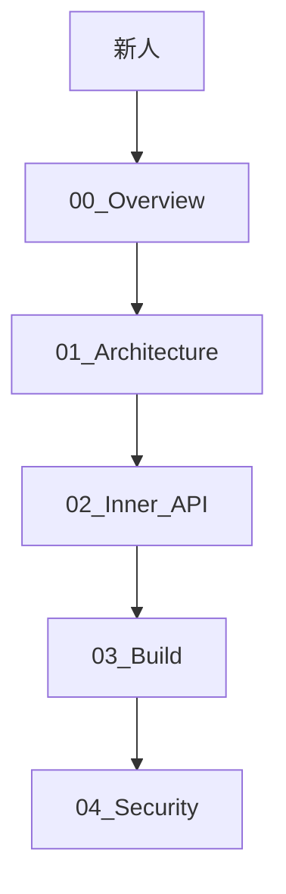

# 文档导航 (Summary)

> MemMgr 组件完整文档索引 | [返回首页](./README.md)

## 必读顺序 (新人推荐)

---

## 文档列表

### [00_Overview.md](./00_Overview.md) - 项目概览

| 章节 | 内容 |
|------|------|
| 简介 | 组件定位、核心能力 |
| 运行环境 | 依赖子系统、SA 配置 |
| 目录结构 | 模块职责映射表 |
| 关键概念 | 回收优先级、内存水线、事件驱动 |

**证据**: `README.md:1-50`, `bundle.json:1-30`

---

### [01_Architecture.md](./01_Architecture.md) - 架构说明

| 章节 | 内容 |
|------|------|
| 系统架构图 | 7大模块组成与数据流 |
| 事件中心 | 6类事件监听器详解 |
| 回收优先级管理 | 进程优先级计算与更新 |
| 回收策略模块 | 参数配置与回收参数下发 |
| 查杀策略模块 | 低内存查杀器工作原理 |
| Kernel 接口 | 与内核交互的管控命令 |
| 配置管理 | XML 配置解析与生效 |

**证据**: `services/memmgrservice/include/` 全部头文件

---

### [02_Inner_API.md](./02_Inner_API.md) - Inner API 文档

| 章节 | 内容 |
|------|------|
| API 清单表 | 全部 Inner API 汇总 |
| MemMgrClient | 客户端单例接口 |
| IMemMgr | 服务端 IPC 接口定义 |
| 进程状态通知 | NotifyProcessStateChanged 系列 |
| 可清理内存 API | PurgeableMem 系列 (条件编译) |
| 调用链 | JS → NAPI → 核心逻辑 (不适用，本组件无 N-API) |

**证据**: `interface/innerkits/include/` 全部头文件

**注意**: 本组件**无 N-API (JS API)**，仅提供 C++ Inner API

---

### [03_Build.md](./03_Build.md) - 构建配置

| 章节 | 内容 |
|------|------|
| GN Targets 清单 | 全部 BUILD.gn targets |
| 编译产物 | .so/.cfg 文件与安装路径 |
| 条件编译 | `USE_PURGEABLE_MEMORY`, `USE_HYPERHOLD_MEMORY` |
| 依赖关系 | 外部依赖与子系统配置 |

**证据**: `BUILD.gn`, `memmgr.gni`, `bundle.json`

---

### [04_Security.md](./04_Security.md) - 安全风险评审

| 章节 | 内容 |
|------|------|
| 攻击面分析 | IPC/System Ability/配置/内核接口 |
| 信任边界 | 进程间调用关系图 |
| 风险清单 | 5+ 可利用点与修复建议 |
| 检查范围 | 本次评审覆盖的代码边界 |

**证据**: `mem_mgr_service.cpp`, `kernel_interface.cpp` 等核心实现

---

## 附录

### 快速跳转

- [配置模板](../profile/memmgr_config.xml)
- [SA 配置](../sa_profile/1909.json)
- [构建入口](../memmgr.gni)

### 相关仓库

- `resource_schedule_service`: 全局资源调度服务
- OpenHarmony 官方文档: [内存管理](https://gitee.com/openharmony/docs)

---

*最后更新: 2026-02-06*
