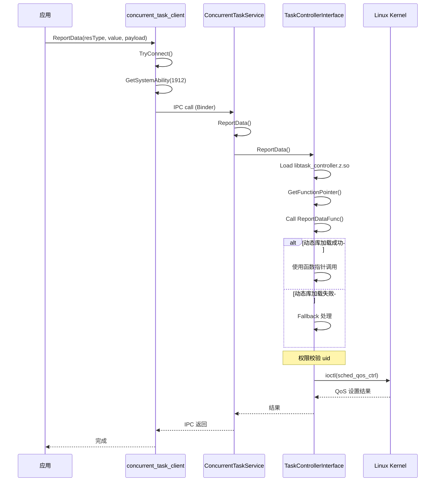
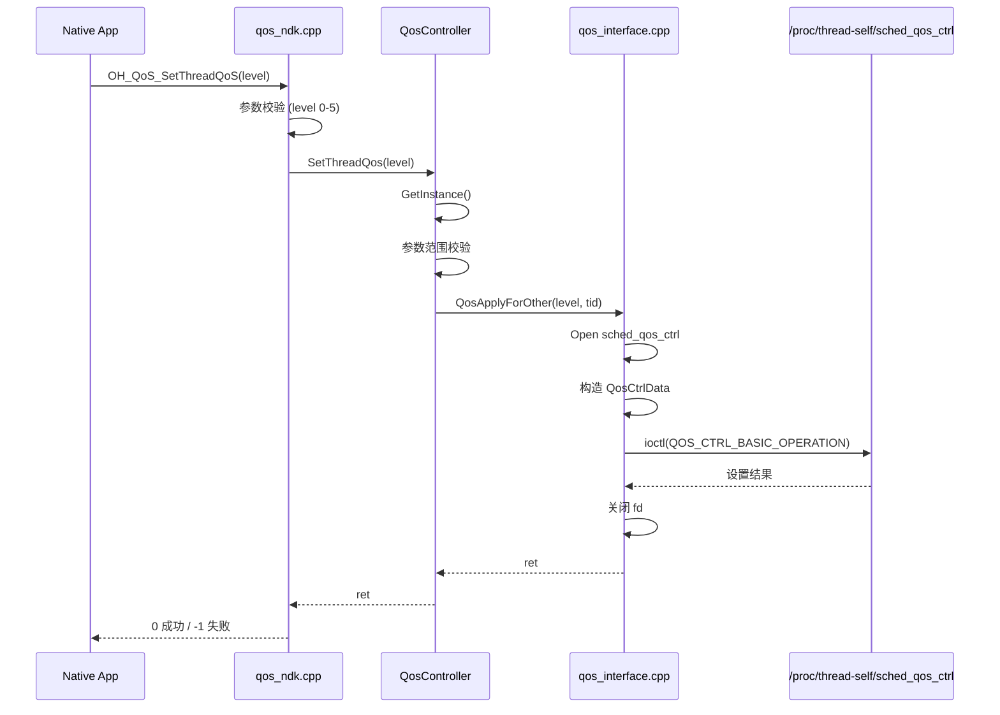
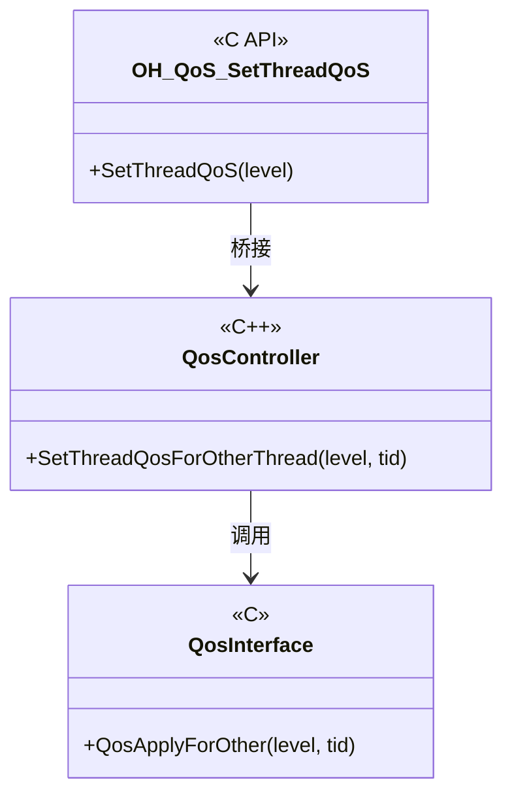

# 架构说明

## 1. 整体架构图

### 1.1 分层架构

```
┌─────────────────────────────────────────────────────────────────────────────────┐
│                           应用层 (Application Layer)                             │
├─────────────────────────────────────────────────────────────────────────────────┤
│  ┌────────────────────┐  ┌────────────────────┐  ┌────────────────────────────┐ │
│  │    Native App      │  │     FFRT 框架      │  │    GEWU AI 推理模块        │ │
│  │  (libqos.so)       │  │ (内部使用 NDK)     │  │  (libgewu_client.z.so)    │ │
│  └─────────┬──────────┘  └─────────┬──────────┘  └─────────────┬────────────┘ │
│            │                        │                           │              │
│            ▼                        ▼                           ▼              │
├─────────────────────────────────────────────────────────────────────────────────┤
│                        框架层 (Frameworks Layer)                                 │
├─────────────────────────────────────────────────────────────────────────────────┤
│  ┌─────────────────────────────────────────────────────────────────────────────┐ │
│  │                     concurrent_task_client                                    │ │
│  │   ┌────────────────────┐    ┌────────────────────────────────────────────┐  │ │
│  │   │  IPC 客户端代理      │    │            qos_ndk.cpp                     │  │ │
│  │   │  (Binder 通信)      │    │  - 加载 libgewu_client.z.so               │  │ │
│  │   │                    │    │  - NDK 到内部 API 桥接                    │  │ │
│  │   └─────────┬──────────┘    └────────────────────────────────────────────┘  │ │
│  └─────────────┼───────────────────────────────────────────────────────────────┘ │
│                │ IPC (Binder)                                                    │
├─────────────────────────────────────────────────────────────────────────────────┤
│                         服务层 (Services Layer)                                  │
├─────────────────────────────────────────────────────────────────────────────────┤
│  ┌─────────────────────────────────────────────────────────────────────────────┐ │
│  │                   ConcurrentTaskService (SA 1912)                           │ │
│  │                                                                             │ │
│  │  ┌───────────────────────┐    ┌──────────────────────────────────────────┐  │ │
│  │  │ ConcurrentTaskService │◄───│    ConcurrentTaskServiceAbility        │  │ │
│  │  │ - ReportData()        │    │    - OnStart()/OnStop()                │  │ │
│  │  │ - QueryInterval()     │    │    - SA 生命周期管理                    │  │ │
│  │  │ - QueryDeadline()     │    └──────────────────────────────────────────┘  │ │
│  │  │ - SetAudioDeadline()  │                                                  │ │
│  │  └───────────┬───────────┘                                                  │ │
│  │              │ 业务调用                                                      │ │
│  │              ▼                                                              │ │
│  │  ┌────────────────────────────────────────────────────────────────────────┐  │ │
│  │  │              TaskControllerInterface (单例)                             │  │ │
│  │  │  ┌──────────────────────────────────────────────────────────────────┐  │  │ │
│  │  │  │  动态加载: libtask_controller.z.so                              │  │  │ │
│  │  │  │  - ReportDataFunc        - QueryIntervalFunc                    │  │  │ │
│  │  │  │  - ReportSceneInfoFunc   - QueryDeadlineFunc                   │  │  │ │
│  │  │  │  - SetAudioDeadlineFunc  - RequestAuthFunc                     │  │  │ │
│  │  │  └──────────────────────────────────────────────────────────────────┘  │  │ │
│  │  │       │                                                               │  │  │
│  │  │       ▼ (失败时 fallback)                                              │  │  │
│  │  │  ┌─────────────────┐                                                  │  │ │
│  │  │  │   QosPolicy     │                                                  │  │ │
│  │  │  │  - SetQosPolicy()│                                                  │  │ │
│  │  │  └─────────────────┘                                                  │  │ │
│  │  └────────────────────────────────────────────────────────────────────────┘  │ │
│  │                                                                             │ │
│  │  ┌────────────────────────────────────────────────────────────────────────┐  │ │
│  │  │              qos_interface (直接内核 ioctl)                              │  │ │
│  │  │  - QosApply()     - QosLeave()     - QosGet()                         │  │ │
│  │  │  - QosPolicySet() - EnableRtg()                                      │  │ │
│  │  └────────────────────────────────────────────────────────────────────────┘  │ │
│  └─────────────────────────────────────────────────────────────────────────────┘ │
│                                                                                   │
│  进程: concurrent_task_service | UID: system | SELinux: u:r:concurrent_task_service:s0 │
├─────────────────────────────────────────────────────────────────────────────────┤
│                           内核层 (Kernel Layer)                                   │
├─────────────────────────────────────────────────────────────────────────────────┤
│  ┌──────────────────────┐  ┌──────────────────────┐  ┌──────────────────────────┐ │
│  │ sched_qos_ctrl       │  │ sched_rtg_ctrl       │  │      Linux CFS          │ │
│  │ (QoS 控制节点)       │  │ (RTG 调度控制)      │  │   (完全公平调度器)      │ │
│  └──────────────────────┘  └──────────────────────┘  └──────────────────────────┘ │
└─────────────────────────────────────────────────────────────────────────────────┘
```

### 1.2 数据流向图

```mermaid
flowchart TD
    subgraph App[应用层]
        A[Native App]
        F[FFRT 框架]
        G[GEWU AI]
    end

    subgraph FW[框架层]
        CC[concurrent_task_client]
        ND[qos_ndk]
    end

    subgraph SV[服务层]
        SA[ConcurrentTaskServiceAbility]
        CS[ConcurrentTaskService]
        TC[TaskControllerInterface]
        QP[QosPolicy]
        QI[qos_interface]
    end

    subgraph KN[内核层]
        QOS[/proc/thread-self/sched_qos_ctrl]
        RTG[/proc/self/sched_rtg_ctrl]
    end

    A -->|NDK API| ND
    F -->|NDK API| ND
    G -->|GEWU API| ND

    ND -->|加载 so| GE[libgewu_client.z.so]

    A -->|IPC 调用| CC
    CC -->|Binder IPC| CS
    CS -->|持有引用| SA
    CS -->|委托调用| TC

    TC -->|动态加载| LIB[libtask_controller.z.so]
    TC -->|fallback| QP

    QI -->|ioctl| QOS
    QI -->|ioctl| RTG
    QP -->|调用| QI
```

---

## 2. 模块职责

### 2.1 services/ - 系统服务

| 模块 | 职责 | 关键类 |
|------|------|--------|
| `concurrent_task_service` | IPC 请求处理，业务分发 | `ConcurrentTaskService` |
| `concurrent_task_service_ability` | SA 生命周期管理 | `ConcurrentTaskServiceAbility` |
| `concurrent_task_controller_interface` | 控制器接口，动态加载 | `TaskControllerInterface` |
| `qos_interface` | 内核 ioctl 封装 | `QosApply()`, `QosLeave()`, `QosGet()` |
| `qos_policy` | QoS 策略管理 | `QosPolicy::SetQosPolicy()` |
| `func_loader` | 动态库加载 | `FuncLoader::LoadSymbol()` |

**证据**: `services/BUILD.gn` → `ohos_shared_library("concurrentsvc")`

### 2.2 frameworks/ - 框架层

| 模块 | 职责 | 关键类 |
|------|------|--------|
| `concurrent_task_client` | IPC 客户端代理 | `ConcurrentTaskClient` |
| `qos_ndk` | NDK 接口桥接 | `OH_QoS_*()` |

**证据**: `frameworks/concurrent_task_client/BUILD.gn`, `frameworks/native/BUILD.gn`

### 2.3 qos/ - QoS 核心库

| 模块 | 职责 | 关键类 |
|------|------|--------|
| `qos` | QoS 控制核心 | `QosController` |

**证据**: `qos/BUILD.gn` → `ohos_shared_library("qos")`

---

## 3. 线程模型

### 3.1 线程角色

| 线程类型 | 数量 | 职责 | 调度策略 |
|----------|------|------|----------|
| **主线程** | 1 | SA 生命周期管理 | SCHED_OTHER |
| **IPC 处理线程** | N (Binder 线程池) | 处理客户端 IPC 请求 | SCHED_OTHER |
| **工作线程** | 动态 | 执行具体 QoS/RTG 操作 | SCHED_OTHER |

### 3.2 线程安全机制

```cpp
// 示例: ConcurrentTaskClient 中的线程安全设计
class ConcurrentTaskClient {
private:
    std::mutex mutex_;              // 互斥锁保护连接状态
    sptr<IRemoteObject> remoteObject_;
    sptr<IConcurrentTaskService> clientService_;

    class ConcurrentTaskDeathRecipient : public IRemoteObject::DeathRecipient {
        void OnRemoteDied(const wptr<IRemoteObject>& object) override;
    };
    sptr<ConcurrentTaskDeathRecipient> recipient_;
};
```

**证据**: `interfaces/inner_api/concurrent_task_client.h:134-138`

---

## 4. 关键时序

### 4.1 客户端调用服务时序



### 4.2 QoS 设置流程



---

## 5. IPC 接口定义

### 5.1 IDL 接口

**文件**: `frameworks/concurrent_task_client/idl/IConcurrentTaskService.idl`

| 方法 | 类型 | 参数 | 描述 |
|------|------|------|------|
| `ReportData` | oneway | resType, value, payload | 上报场景数据 |
| `ReportSceneInfo` | oneway | type, payload | 上报场景信息 |
| `QueryInterval` | sync | queryItem, queryRs | 查询 RTG 信息 |
| `QueryDeadline` | oneway | queryItem, ddlReply, payload | 查询截止时间 |
| `SetAudioDeadline` | sync | queryItem, tid, grpId, queryRs | 设置音频截止时间 |
| `RequestAuth` | sync | payload | 请求权限 |

### 5.2 IPC 数据结构

```cpp
// IntervalReply - RTG 间隔信息
struct IntervalReply {
    int rtgId;              // RTG 组 ID
    int tid;                // 线程 ID
    int paramA;             // 参数 A
    int paramB;             // 参数 B
    std::string bundleName; // 包名
};

// DeadlineReply - 截止时间信息
struct DeadlineReply {
    bool setStatus;         // 设置状态
};
```

**证据**: `interfaces/inner_api/concurrent_task_type.h:76-86`

---

## 6. 内核接口

### 6.1 QoS 控制节点

| 节点 | 路径 | 操作 |
|------|------|------|
| **QoS 控制** | `/proc/thread-self/sched_qos_ctrl` | ioctl |

**ioctl 命令**:

| 命令 | 宏定义 | 描述 |
|------|--------|------|
| QOS_APPLY | `QOS_APPLY = 1` | 申请 QoS 等级 |
| QOS_LEAVE | `QOS_LEAVE = 2` | 离开当前 QoS |
| QOS_GET | `QOS_GET = 3` | 获取 QoS 等级 |
| QOS_POLICY | `QOS_POLICY = 2` | 设置 QoS 策略 |

**证据**: `services/include/qos_interface.h:39-44`, `107-110`

### 6.2 RTG 控制节点

| 节点 | 路径 | 操作 |
|------|------|------|
| **RTG 控制** | `/proc/self/sched_rtg_ctrl` | ioctl |

**ioctl 命令**:

| 命令 | 宏定义 | 描述 |
|------|--------|------|
| CMD_ID_SET_ENABLE | `RTG_SCHED_IPC_MAGIC` | 启用/禁用 RTG |

**证据**: `services/include/qos_interface.h:18-19`, `57-83`

---

## 7. 关键设计模式

### 7.1 单例模式

| 类 | 说明 | 代码位置 |
|----|------|----------|
| `ConcurrentTaskClient` | IPC 客户端单例 | `interfaces/inner_api/concurrent_task_client.h:38` |
| `TaskControllerInterface` | 控制器接口单例 | `services/include/concurrent_task_controller_interface.h` |
| `QosController` | QoS 控制器单例 | `qos/qos.cpp:30-34` |

### 7.2 代理模式

```
ConcurrentTaskClient (代理)
    ↓ IPC 调用
ConcurrentTaskService (目标对象)
    ↓ 业务分发
TaskControllerInterface (业务接口)
```

### 7.3 桥接模式



### 7.4 动态加载模式

```cpp
// TaskControllerInterface 动态加载 libtask_controller.z.so
class TaskControllerInterface {
    using ReportDataFunc = std::function<ErrCode(...)>;
    FuncLoader loader_;
    ReportDataFunc reportDataFunc_;  // 函数指针

    void Init() {
        loader_.LoadFile("libtask_controller.z.so");
        reportDataFunc_ = loader_.GetSymbol<ReportDataFunc>("ReportDataFunc");
    }
}
```

**证据**: `services/src/concurrent_task_controller_interface.cpp`

---

## 8. 相关文档

| 文档 | 描述 |
|------|------|
| [00_Overview.md](./00_Overview.md) | 项目定位和边界 |
| [02_NDK_API.md](./02_NDK_API.md) | NDK 接口详细说明 |
| [03_Inner_API.md](./03_Inner_API.md) | 内部 C++ API |
| [appendix/Callgraphs.md](./appendix/Callgraphs.md) | 关键调用链详情 |
