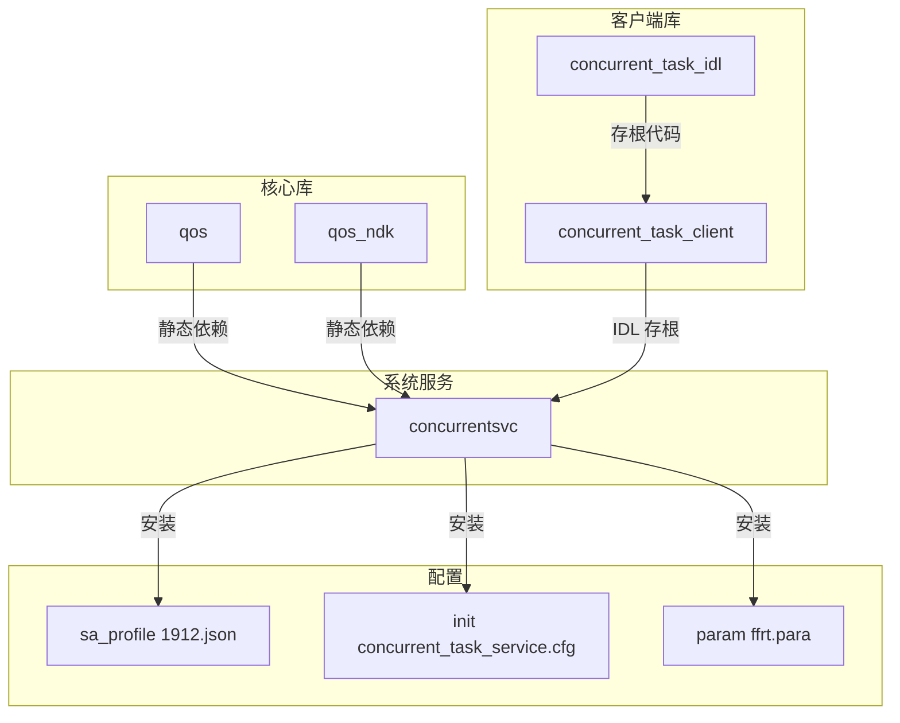

# GN 构建配置

> 本文档描述 qos_manager 项目的 GN 构建目标配置。

## 1. 构建概览

### 1.1 构建系统

| 属性 | 值 |
|------|-----|
| **构建系统** | GN (Generate Ninja) |
| **构建模板** | ohos_*(OpenHarmony 专用) |
| **构建命令** | `hb build` |

### 1.2 构建产物类型

| 类型 | 描述 | 位置 |
|------|------|------|
| **共享库 (.so)** | 动态链接库 | out/.../libs/ |
| **静态库 (.a)** | 静态链接库 (IDL 存根) | out/.../obj/ |
| **系统配置文件** | SA/Init 配置 | system/ |

---

## 2. 主要 Targets

### 2.1 qos - QoS 核心库

**BUILD.gn 位置**: `qos/BUILD.gn`

```gn
ohos_shared_library("qos") {
  branch_protector_ret = "pac_ret"  # PAC-RET 分支保护

  cflags_cc = [
    "-fomit-frame-pointer",
    "-fdata-sections",
    "-ffunction-sections",
    "-fno-unroll-loops",
    "-fno-exceptions",
    "-fno-unwind-tables",
    "-fno-asynchronous-unwind-tables",
    "-Os",
  ]

  public_configs = [ ":qos_config" ]

  sources = [
    "../common/src/concurrent_task_utils.cpp",
    "../services/src/qos_interface.cpp",
    "qos.cpp",
  ]

  # 条件编译
  if (defined(global_parts_info.hmosresourceschedule_frame_aware_sched_override)) {
    defines = [ "QOS_EXT_ENABLE" ]
  }

  external_deps = [
    "hilog:libhilog",
    "init:libbegetutil",
  ]

  subsystem_name = "resourceschedule"
  part_name = "qos_manager"
}
```

**配置定义**:

```gn
config("qos_config") {
  visibility = [ ":*" ]
  include_dirs = [
    "../include/",
    "../interfaces/inner_api/",
    "../services/include/",
    "../common/include/",
  ]
}
```

| 属性 | 值 |
|------|-----|
| **Target 类型** | ohos_shared_library |
| **输出文件** | libqos.z.so |
| **依赖** | hilog, init |
| **配置** | qos_config |

**证据**: `qos/BUILD.gn`

---

### 2.2 qos_ndk - NDK 接口库

**BUILD.gn 位置**: `frameworks/native/BUILD.gn`

```gn
ohos_shared_library("qos_ndk") {
  output_name = "qos"
  output_extension = "so"
  ndk_description_file = "./libqos.ndk.json"
  system_capability = "SystemCapability.Resourceschedule.QoS.Core"
  system_capability_headers = [ "$ndk_headers_out_dir/qos/qos.h" ]
}
```

| 属性 | 值 |
|------|-----|
| **Target 类型** | ohos_ndk_library (间接) |
| **输出文件** | libqos.so |
| **NDK 描述** | libqos.ndk.json |
| **Syscap** | SystemCapability.Resourceschedule.QoS.Core |

**NDK 符号定义** (`libqos.ndk.json`):

```json
[
  {"name": "OH_QoS_SetThreadQoS", "first_introduced": "12"},
  {"name": "OH_QoS_ResetThreadQoS", "first_introduced": "12"},
  {"name": "OH_QoS_GetThreadQoS", "first_introduced": "12"},
  {"name": "OH_QoS_GewuCreateSession", "first_introduced": "20"},
  {"name": "OH_QoS_GewuDestroySession", "first_introduced": "20"},
  {"name": "OH_QoS_GewuSubmitRequest", "first_introduced": "20"},
  {"name": "OH_QoS_GewuAbortRequest", "first_introduced": "20"}
]
```

**证据**: `interfaces/kits/BUILD.gn`, `interfaces/kits/libqos.ndk.json`

---

### 2.3 concurrent_task_client - IPC 客户端

**BUILD.gn 位置**: `frameworks/concurrent_task_client/BUILD.gn`

#### 2.3.1 IDL 生成

```gn
idl_gen_interface("qos_manager_interface") {
  src_idl = rebase_path("./idl/IConcurrentTaskService.idl")
  sources_common = [ "ConcurrentTaskIdlTypes.idl" ]
}
```

#### 2.3.2 IDL 存根

```gn
ohos_source_set("concurrent_task_idl") {
  sanitize = {
    cfi = true
    cfi_cross_dso = true
    debug = false
  }
  branch_protector_ret = "pac_ret"
  output_values = get_target_outputs(":qos_manager_interface")
  sources = filter_include(output_values, [ "*_stub.cpp" ])
  sources += filter_include(output_values, [ "*_types.cpp" ])
  public_configs = [ ":client_public_config" ]
  deps = [ ":qos_manager_interface" ]

  external_deps = [
    "c_utils:utils",
    "ipc:ipc_core",
  ]

  subsystem_name = "resourceschedule"
  part_name = "qos_manager"
}
```

#### 2.3.3 客户端库

```gn
ohos_shared_library("concurrent_task_client") {
  branch_protector_ret = "pac_ret"
  configs = [ ":client_private_config" ]
  public_configs = [ ":client_public_config" ]

  cflags_cc = [
    "-fomit-frame-pointer",
    "-fdata-sections",
    "-ffunction-sections",
    "-fno-unroll-loops",
    "-fno-exceptions",
    "-fno-unwind-tables",
    "-fno-asynchronous-unwind-tables",
    "-Os",
  ]

  ldflags = [ "-Wl,--exclude-libs=ALL" ]

  output_values = get_target_outputs(":qos_manager_interface")
  sources = [ "src/concurrent_task_client.cpp" ]
  sources += filter_include(output_values, [ "*_proxy.cpp" ])
  sources += filter_include(output_values, [ "*_types.cpp" ])

  deps = [ ":qos_manager_interface" ]

  external_deps = [
    "c_utils:utils",
    "hilog:libhilog",
    "ipc:ipc_core",
    "ipc:ipc_single",
    "samgr:samgr_proxy",
  ]

  subsystem_name = "resourceschedule"
  part_name = "qos_manager"
}
```

| 属性 | 值 |
|------|-----|
| **Target 类型** | ohos_shared_library |
| **输出文件** | libconcurrent_task_client.z.so |
| **依赖** | c_utils, hilog, ipc_core, ipc_single, samgr_proxy |

---

### 2.4 concurrentsvc - 系统服务

**BUILD.gn 位置**: `services/BUILD.gn`

```gn
ohos_shared_library("concurrentsvc") {
  public_configs = [ ":concurrent_task_config" ]
  branch_protector_ret = "pac_ret"
  sanitize = {
    cfi = true
    cfi_cross_dso = true
    cfi_no_nvcall = true
    cfi_vcall_ical_only = true
    debug = false
  }

  cflags_cc = [
    "-fomit-frame-pointer",
    "-fdata-sections",
    "-ffunction-sections",
    "-fno-unroll-loops",
    "-fno-exceptions",
    "-fno-unwind-tables",
    "-fno-asynchronous-unwind-tables",
    "-Os",
  ]

  ldflags = [ "-Wl,--exclude-libs=ALL" ]

  sources = [
    "../common/src/concurrent_task_utils.cpp",
    "src/concurrent_task_controller_interface.cpp",
    "src/concurrent_task_service.cpp",
    "src/concurrent_task_service_ability.cpp",
    "src/func_loader.cpp",
    "src/qos_interface.cpp",
    "src/qos_policy.cpp",
  ]

  deps = [
    "../frameworks/concurrent_task_client/:concurrent_task_idl",
  ]

  if (defined(global_parts_info.hmosresourceschedule_frame_aware_sched_override)) {
    defines = [ "QOS_EXT_ENABLE" ]
  }

  external_deps = [
    "access_token:libaccesstoken_sdk",
    "c_utils:utils",
    "config_policy:configpolicy_util",
    "frame_aware_sched:rtg_interface",
    "hilog:libhilog",
    "hitrace:hitrace_meter",
    "init:libbegetutil",
    "ipc:ipc_single",
    "libxml2:libxml2",
    "safwk:system_ability_fwk",
    "samgr:samgr_proxy",
  ]

  subsystem_name = "resourceschedule"
  part_name = "qos_manager"
}
```

**服务配置**:

```gn
config("concurrent_task_config") {
  visibility = [ ":*" ]
  cflags_cc = [ "-fexceptions" ]
  cflags = [ "-fstack-protector-strong", "-Wno-shift-negative-value" ]
  include_dirs = [
    "include",
    "../include",
    "../frameworks/concurrent_task_client/include/",
    "../interfaces/inner_api/",
    "../common/include/",
  ]
}
```

| 属性 | 值 |
|------|-----|
| **Target 类型** | ohos_shared_library |
| **输出文件** | libconcurrentsvc.z.so |
| **安全加固** | CFI, PAC-RET, Stack Protector |
| **外部依赖** | access_token, c_utils, config_policy, frame_aware_sched, hilog, hitrace, init, ipc, libxml2, safwk, samgr |

---

## 3. 配置文件 Targets

### 3.1 SA Profile

**BUILD.gn 位置**: `sa_profile/BUILD.gn`

```gn
ohos_prebuilt_xml("concurrent_task_sa_profile") {
  source = "1912.json"
  depfile = ""
  install_images = [ "system" ]
  subsystem_name = "resourceschedule"
  part_name = "qos_manager"
}
```

**配置文件** (`sa_profile/1912.json`):

```json
{
  "process": "concurrent_task_service",
  "systemability": [{
    "name": 1912,
    "libpath": "libconcurrentsvc.z.so",
    "run-on-create": true,
    "distributed": false,
    "dump-level": 1
  }]
}
```

### 3.2 Init 配置

**BUILD.gn 位置**: `etc/init/BUILD.gn`

```gn
ohos_prebuilt_json("concurrent_task_service_cfg") {
  source = "concurrent_task_service.cfg"
  install_images = [ "system" }
  subsystem_name = "resourceschedule"
  part_name = "qos_manager"
}
```

**配置文件** (`etc/init/concurrent_task_service.cfg`):

```json
{
  "jobs": [{
    "name": "post-fs-data",
    "cmds": ["start concurrent_task_service"]
  }],
  "services": [{
    "name": "concurrent_task_service",
    "path": ["/system/bin/sa_main", "/system/profile/concurrent_task_service.json"],
    "importance": -20,
    "uid": "system",
    "gid": ["system", "shell"],
    "secon": "u:r:concurrent_task_service:s0"
  }]
}
```

### 3.3 系统参数

**BUILD.gn 位置**: `etc/param/BUILD.gn`

```gn
ohos_prebuilt_para("ffrt") {
  source = "ffrt.para"
  install_images = [ "system" ]
  subsystem_name = "resourceschedule"
  part_name = "qos_manager"
}

ohos_prebuilt_para("ffrt_dac") {
  source = "ffrt.para.dac"
  install_images = [ "system" ]
  subsystem_name = "resourceschedule"
  part_name = "qos_manager"
}
```

---

## 4. 依赖关系图

### 4.1 Target 依赖



### 4.2 外部依赖

| Target | 外部组件 | 用途 |
|--------|----------|------|
| concurrent_task_client | ipc_core | Binder IPC |
| concurrent_task_client | samgr_proxy | SA 管理 |
| concurrentsvc | access_token | 权限校验 |
| concurrentsvc | safwk | SA 框架 |
| concurrentsvc | frame_aware_sched | RTG 接口 |
| concurrentsvc | libxml2 | XML 解析 |

---

## 5. 编译产物清单

### 5.1 库文件

| 文件名 | Target | 路径 | 用途 |
|--------|--------|------|------|
| `libqos.so` | qos_ndk | frameworks/native/ | NDK 公共接口 |
| `libqos.z.so` | qos | qos/ | QoS 核心实现 |
| `libconcurrent_task_client.z.so` | concurrent_task_client | frameworks/concurrent_task_client/ | IPC 客户端 |
| `libconcurrentsvc.z.so` | concurrentsvc | services/ | 系统服务 |

### 5.2 配置文件

| 文件 | 来源 | 安装路径 | 用途 |
|------|------|----------|------|
| `1912.json` | sa_profile/ | /system/profile/ | SA 配置 |
| `concurrent_task_service.cfg` | etc/init/ | /system/etc/init/ | 启动配置 |
| `ffrt.para` | etc/param/ | /system/etc/param/ | 参数配置 |
| `ffrt.para.dac` | etc/param/ | /system/etc/param/ | DAC 配置 |

---

## 6. 运行时加载关系

### 6.1 静态加载

```
Native App
    ↓ dlopen
libqos.so (NDK)
    ↓ 静态链接
libqos.z.so
    ↓ 无直接依赖
```

### 6.2 动态加载

```
Native App
    ↓ dlopen (ConcurrentTaskClient 内部)
libconcurrent_task_client.z.so
    ↓ Binder IPC
concurrent_task_service 进程
    ↓ dlopen (TaskControllerInterface)
libtask_controller.z.so (外部)
```

### 6.3 服务启动

```
系统启动
    ↓ post-fs-data
init
    ↓ 读取配置
/system/bin/sa_main
    ↓ 加载 SA
libconcurrentsvc.z.so
    ↓ 注册 SA 1912
SAMGR
```

---

## 7. 相关文档

| 文档 | 描述 |
|------|------|
| [01_Architecture.md](./01_Architecture.md) | 架构图和模块关系 |
| [02_NDK_API.md](./02_NDK_API.md) | NDK API 详细说明 |
| [05_Security.md](./05_Security.md) | 构建安全考量 |
| [appendix/Config_Flags.md](./appendix/Config_Flags.md) | 编译宏定义 |
