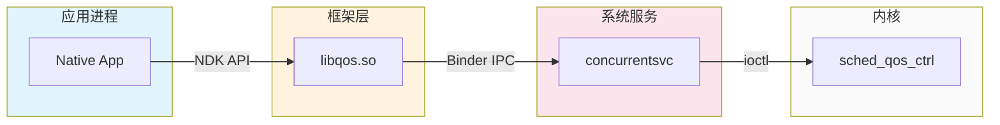

# 安全风险评审

> 本文档对 qos_manager 项目进行安全风险分析，识别潜在攻击面和可利用点。

## 1. 评审范围

### 1.1 评审目标

| 项目 | 值 |
|------|-----|
| **评审对象** | resourceschedule_qos_manager |
| **版本** | v3.1 |
| **代码范围** | 除 test/ 目录外的所有代码 |
| **评审时间** | 2026-02-06 |

### 1.2 评审方法

- **静态代码分析**: 扫描代码中的安全模式
- **架构分析**: 分析数据流和信任边界
- **攻击面枚举**: 识别外部输入点和敏感操作

---

## 2. 攻击面清单

### 2.1 外部输入点

| 编号 | 输入点 | 类型 | 来源 | 信任级别 |
|------|--------|------|------|----------|
| **A1** | `OH_QoS_SetThreadQoS(level)` | 函数参数 | 应用层 | 中 |
| **A2** | `OH_QoS_GetThreadQoS(level)` | 函数参数 | 应用层 | 中 |
| **A3** | `OH_QoS_GewuCreateSession(attributes)` | JSON 字符串 | 应用层 | 中 |
| **A4** | `OH_QoS_GewuSubmitRequest(request)` | JSON 字符串 | 应用层 | 中 |
| **A5** | `ReportData/resType/value/payload` | IPC 参数 | IPC 客户端 | 低 |
| **A6** | frame_aware_sched 场景消息 | IPC | 其他 SA | 低 |
| **A7** | `/proc/thread-self/sched_qos_ctrl` | 内核节点 | 内核 | 无 |

### 2.2 敏感操作

| 编号 | 操作 | 位置 | 风险等级 |
|------|------|------|----------|
| **S1** | `dlopen(libgewu_client.z.so)` | qos_ndk.cpp:120 | 高 |
| **S2** | `ioctl(sched_qos_ctrl)` | qos_interface.cpp | 高 |
| **S3** | `ioctl(sched_rtg_ctrl)` | qos_interface.cpp | 高 |
| **S4** | `dlsym()` 函数指针调用 | qos_ndk.cpp | 高 |
| **S5** | 文件描述符操作 | qos_interface.cpp | 中 |

---

## 3. 信任边界

### 3.1 边界图

```
┌─────────────────────────────────────────────────────────────────────────────┐
│                           信任边界模型                                         │
├─────────────────────────────────────────────────────────────────────────────┤
│                                                                             │
│  ┌───────────────────────────────────────────────────────────────────────┐   │
│  │                      信任边界 1: 应用进程                              │   │
│  │  ┌─────────┐  ┌─────────┐  ┌─────────┐  ┌─────────────────────────┐  │   │
│  │  │Native   │  │FFRT     │  │GEWU AI  │  │        JS/ArkTS        │  │   │
│  │  │App      │  │Framework│  │Module   │  │      (间接调用)          │  │   │
│  │  └────┬────┘  └────┬────┘  └────┬────┘  └─────────────────────────┘  │   │
│  └───────┼─────────────┼─────────────┼────────────────────────────────────┘   │
│          │             │             │                                        │
│          ▼             ▼             ▼                                        │
│  ┌───────────────────────────────────────────────────────────────────────┐   │
│  │                      信任边界 2: 框架层 (libqos.so)                    │   │
│  │  - 参数校验                                                           │   │
│  │  - 动态库加载                                                         │   │
│  │  - 线程安全                                                           │   │
│  └───────────────────────────────────────────────────────────────────────┘   │
│                                    │                                            │
│                          Binder IPC (低信任)                                  │
│                                    │                                            │
│  ┌───────────────────────────────────────────────────────────────────────┐   │
│  │                  信任边界 3: 系统服务 (concurrentsvc)                   │   │
│  │  - uid 权限校验                                                       │   │
│  │  - 场景信息验证                                                        │   │
│  │  - 内核 ioctl 调用                                                     │   │
│  └───────────────────────────────────────────────────────────────────────┘   │
│                                    │                                            │
│                               ioctl syscall                                   │
│                                    │                                            │
│  ┌───────────────────────────────────────────────────────────────────────┐   │
│  │                        信任边界 4: Linux 内核                          │   │
│  │  - sched_qos_ctrl                                                     │   │
│  │  - sched_rtg_ctrl                                                     │   │
│  └───────────────────────────────────────────────────────────────────────┘   │
│                                                                             │
└─────────────────────────────────────────────────────────────────────────────┘
```

### 3.2 数据流



---

## 4. 可利用风险点

### 4.1 动态库加载缺少路径校验

**风险 ID**: SEC-001

| 属性 | 值 |
|------|-----|
| **严重程度** | 高 |
| **类型** | 路径遍历 / 库劫持 |
| **位置** | `frameworks/native/qos_ndk.cpp:120` |

**证据代码**:

```cpp
// 证据: frameworks/native/qos_ndk.cpp:120
g_gewuNdkLibHandler = dlopen(GEWU_CLIENT_LIB, RTLD_LAZY | RTLD_LOCAL);
// GEWU_CLIENT_LIB = "libgewu_client.z.so"
```

**问题描述**:

- 使用**硬编码**的动态库文件名 `libgewu_client.z.so`
- 使用 `RTLD_LOCAL` 但未使用 `RTLD_NOLOAD` 校验库是否已加载
- 没有校验库文件完整性（hash/MD5）
- 没有使用 **secure loading** 机制（如 dlopen 前的文件存在性校验）

**利用路径**:

```
攻击者将恶意 so 重命名为 libgewu_client.z.so
    ↓
放置到应用可写的目录（如果 dlopen 搜索路径包含该目录）
    ↓
应用调用 OH_QoS_GewuCreateSession()
    ↓
恶意代码以应用权限执行
```

**修复建议**:

```cpp
// 1. 使用绝对路径 + 符号链接校验
const char* safePath = "/system/lib64/libgewu_client.z.so";
if (!CheckFileIntegrity(safePath)) {
    return {OH_QOS_GEWU_INVALID_SESSION_ID, OH_QOS_GEWU_FAULT};
}
g_gewuNdkLibHandler = dlopen(safePath, RTLD_LAZY | RTLD_NOLOAD);

// 2. 或使用 dlopen_preflight 预加载校验
```

---

### 4.2 函数指针调用缺少校验

**风险 ID**: SEC-002

| 属性 | 值 |
|------|-----|
| **严重程度** | 高 |
| **类型** | 空指针解引用 |
| **位置** | `frameworks/native/qos_ndk.cpp:145` |

**证据代码**:

```cpp
// 证据: frameworks/native/qos_ndk.cpp:145
return g_CreateSession(attributes);

// g_CreateSession 在 LoadSymbols() 中初始化
static GewuCreateSessionFunc g_CreateSession = nullptr;
```

**问题描述**:

- `g_CreateSession` 可能为 `nullptr`（如果 dlsym 失败）
- 调用前没有进行 **NULL 检查**
- 如果 dlsym 失败会返回 `nullptr`，后续调用会导致 **空指针解引用**

**利用路径**:

```
dlopen 失败或符号解析失败
    ↓
g_CreateSession = nullptr
    ↓
调用 OH_QoS_GewuCreateSession(nullptr)
    ↓
程序崩溃 (Segmentation Fault)
```

**修复建议**:

```cpp
// 证据: frameworks/native/qos_ndk.cpp:140-146
extern "C" OH_QoS_GewuCreateSessionResult OH_QoS_GewuCreateSession(const char* attributes)
{
    if (!EnsureGewuInitialized()) {  // 检查初始化状态
        return {OH_QOS_GEWU_INVALID_SESSION_ID, OH_QOS_GEWU_NOSYS};
    }
    // 添加额外检查
    if (g_CreateSession == nullptr) {
        CONCUR_LOGE("[Gewu] g_CreateSession is null");
        return {OH_QOS_GEWU_INVALID_SESSION_ID, OH_QOS_GEWU_FAULT};
    }
    return g_CreateSession(attributes);
}
```

---

### 4.3 参数校验不完整

**风险 ID**: SEC-003

| 属性 | 值 |
|------|-----|
| **严重程度** | 中 |
| **类型** | 输入验证不充分 |
| **位置** | `frameworks/native/qos_ndk.cpp:39-41` |

**证据代码**:

```cpp
// 证据: frameworks/native/qos_ndk.cpp:39-41
if (level < QOS_BACKGROUND || level > QOS_USER_INTERACTIVE) {
    return ERROR_NUM;
}
```

**问题描述**:

- 只校验了 `QoS_Level` 枚举范围
- **没有校验** `QoS_Level` 是否为有效枚举值（非枚举值传入）
- **没有校验** 整数溢出（C++ 中 enum 底层是整数）
- **没有校验** QoS 级别设置是否超出进程权限

**修复建议**:

```cpp
int OH_QoS_SetThreadQoS(QoS_Level level)
{
    // 1. 范围校验
    if (level < QOS_BACKGROUND || level > QOS_USER_INTERACTIVE) {
        CONCUR_LOGE("[QoS] invalid level: %{public}d", static_cast<int>(level));
        return ERROR_NUM;
    }

    // 2. 权限校验 (检查调用进程是否有权限设置该级别)
    if (!CheckQoSPermission(level)) {
        CONCUR_LOGE("[QoS] permission denied for level: %{public}d", static_cast<int>(level));
        return ERROR_NUM;
    }

    return SetThreadQos(static_cast<QosLevel>(level));
}
```

---

### 4.4 JSON 解析缺少注入防护

**风险 ID**: SEC-004

| 属性 | 值 |
|------|-----|
| **严重程度** | 中 |
| **类型** | JSON 注入 / 解析漏洞 |
| **位置** | `interfaces/kits/c/qos.h:196-206` |

**证据代码**:

```cpp
// 证据: interfaces/kits/c/qos.h:196-206
// attributes JSON 格式示例
{
    "model": "/data/storage/el2/base/files/qwen2/"
}

// request JSON 格式示例
{
    "messages": [
        {
            "role": "user",
            "content": "What is OpenHarmony"
        }
    ],
    "stream": true
}
```

**问题描述**:

- `attributes` 和 `request` 参数为 JSON 字符串
- **没有** JSON 格式校验（是否有效 JSON）
- **没有** 字段白名单校验
- **没有** 内容长度限制
- **没有** 特殊字符过滤（可能导致后续处理中的注入攻击）

**修复建议**:

```cpp
// 1. JSON 格式校验
bool ValidateAttributes(const char* attributes) {
    if (attributes == nullptr || strlen(attributes) > MAX_JSON_LEN) {
        return false;
    }
    // 解析 JSON
    json_object* obj = json_tokener_parse(attributes);
    if (obj == nullptr) {
        return false;
    }
    // 检查必需字段
    json_object* model = nullptr;
    if (!json_object_object_get_ex(obj, "model", &model)) {
        json_object_put(obj);
        return false;
    }
    // 校验 model 路径安全性
    const char* modelPath = json_object_get_string(model);
    if (!IsSafePath(modelPath)) {
        json_object_put(obj);
        return false;
    }
    json_object_put(obj);
    return true;
}
```

---

### 4.5 文件描述符泄露风险

**风险 ID**: SEC-005

| 属性 | 值 |
|------|-----|
| **严重程度** | 低 |
| **类型** | 文件描述符泄露 |
| **位置** | `services/src/qos_interface.cpp:35-44` |

**证据代码**:

```cpp
// 证据: services/src/qos_interface.cpp:36-44
static int TrivalOpenRtgNode(void)
{
    char fileName[] = "/proc/self/sched_rtg_ctrl";
    int fd = open(fileName, O_RDWR);
    if (fd < 0) {
        CONCUR_LOGE("[Interface] task %{public}d belong to user %{public}d open rtg node failed",
                    getpid(), getuid(), errno);
    }
    return fd;  // 每次调用都打开新 fd，无缓存
}
```

**问题描述**:

- 每次调用都执行 `open()`，**没有 fd 缓存机制**
- 如果调用频率高，可能导致 **fd 耗尽**
- 虽然使用 `fdsan_close_with_tag` 关闭，但错误路径可能泄露

**修复建议**:

```cpp
// 1. 使用 fd 缓存
static std::once_flag rtgFdFlag;
static int cachedRtgFd = -1;

static int GetCachedRtgFd(void) {
    std::call_once(rtgFdFlag, []() {
        cachedRtgFd = open("/proc/self/sched_rtg_ctrl", O_RDWR);
    });
    return cachedRtgFd;
}

// 2. 错误处理时确保关闭
if (fd < 0) {
    CONCUR_LOGE(...);
    return -1;  // 已有处理
}
```

---

### 4.6 IPC 权限校验不完整

**风险 ID**: SEC-006

| 属性 | 值 |
|------|-----|
| **严重程度** | 中 |
| **类型** | 权限绑定 |
| **位置** | `services/BUILD.gn` (依赖 access_token) |

**证据代码**:

```cpp
// 证据: services/BUILD.gn:75
external_deps = [
  "access_token:libaccesstoken_sdk",  // 依赖存在
  ...
]

// 但在 TaskControllerInterface 中动态加载实现
// libtask_controller.z.so 中的权限校验逻辑不可见
```

**问题描述**:

- 依赖 `access_token` 组件进行权限校验
- 但实际权限校验逻辑在 **外部动态库** `libtask_controller.z.so` 中
- 无法确认 IPC 调用者的 **uid** 是否得到充分验证
- 没有对 IPC 参数进行 **完整性校验**

**修复建议**:

```cpp
// 在 ConcurrentTaskService 中添加权限校验
ErrCode ConcurrentTaskService::ReportData(
    uint32_t resType, int64_t value,
    const std::unordered_map<std::string, std::string>& payload)
{
    // 1. 获取调用者 uid
    int32_t callingUid = IPC_INVALID_UID;
    GetCallingUid(&callingUid);

    // 2. 权限白名单校验
    if (!IsUidAllowed(callingUid, resType)) {
        CONCUR_LOGE("[Service] uid %{public}d permission denied for resType %{public}d",
                    callingUid, resType);
        return ERR_PERMISSION_DENIED;
    }

    // 3. 参数校验
    if (!ValidatePayload(payload)) {
        return ERR_INVALID_PARAM;
    }

    TaskControllerInterface::GetInstance().ReportData(resType, value, payload);
    return ERR_OK;
}
```

---

### 4.7 SELinux 上下文暴露

**风险 ID**: SEC-007

| 属性 | 值 |
|------|-----|
| **严重程度** | 低 |
| **类型** | 信息泄露 |
| **位置** | `etc/init/concurrent_task_service.cfg` |

**证据代码**:

```json
// 证据: etc/init/concurrent_task_service.cfg
{
    "secon": "u:r:concurrent_task_service:s0"
}
```

**问题描述**:

- SELinux 上下文直接暴露在配置文件中
- 攻击者可能通过分析上下文了解服务权限范围
- 上下文名称 `concurrent_task_service` 遵循标准命名，**可被枚举**

**说明**: 此问题风险较低，因为 SELinux 上下文本身是系统配置的一部分，不属于敏感信息泄露。

---

## 5. 安全机制评估

### 5.1 已实现的安全机制

| 机制 | 实现位置 | 有效性 |
|------|----------|--------|
| **CFI 加固** | `services/BUILD.gn:35-40` | 高 |
| **PAC-RET 分支保护** | 所有 shared_library targets | 高 |
| **Stack Protector** | `services/BUILD.gn:20` | 中 |
| **fdsan 文件描述符安全** | `qos_interface.cpp:69-77` | 中 |
| **SELinux 隔离** | `concurrent_task_service.cfg` | 高 |
| **Binder IPC** | IPC 框架自带 | 高 |

### 5.2 缺失的安全机制

| 机制 | 建议级别 | 影响 |
|------|----------|------|
| **动态库路径校验** | 高 | 库劫持攻击 |
| **函数指针 NULL 检查** | 高 | 崩溃/空指针攻击 |
| **JSON 输入校验** | 中 | JSON 注入 |
| **IPC 参数签名** | 中 | 参数篡改 |
| **频率限制** | 低 | DoS 攻击 |

---

## 6. 安全建议汇总

### 6.1 高优先级修复

| 风险 ID | 问题 | 修复建议 |
|---------|------|----------|
| SEC-001 | 动态库加载无校验 | 使用绝对路径 + 文件完整性校验 |
| SEC-002 | 函数指针无 NULL 检查 | 添加初始化状态和 NULL 检查 |

### 6.2 中优先级修复

| 风险 ID | 问题 | 修复建议 |
|---------|------|----------|
| SEC-003 | 参数校验不完整 | 添加权限边界校验 |
| SEC-004 | JSON 解析无防护 | 添加格式和内容校验 |
| SEC-006 | IPC 权限校验不透明 | 在服务层添加显式校验 |

### 6.3 低优先级修复

| 风险 ID | 问题 | 修复建议 |
|---------|------|----------|
| SEC-005 | fd 可能泄露 | 使用 fd 缓存机制 |

---

## 7. 检查局限性声明

### 7.1 检查范围

| 范围 | 状态 |
|------|------|
| **代码审计** | ✅ 已完成（除 test/ 外） |
| **静态分析** | ✅ 已完成 |
| **动态测试** | ❌ 未执行（需要在目标设备上运行） |
| **模糊测试** | ⚠️ 有 fuzztest，但未运行分析 |
| **外部库** | ❌ 未审计（libtask_controller.z.so, libgewu_client.z.so） |

### 7.2 未覆盖代码

| 文件/模块 | 原因 |
|-----------|------|
| `test/` | 按要求忽略 |
| `libtask_controller.z.so` | 外部仓库 |
| `libgewu_client.z.so` | 外部仓库 |
| **内核驱动** | 不在审计范围内 |

---

## 8. 相关文档

| 文档 | 描述 |
|------|------|
| [01_Architecture.md](./01_Architecture.md) | 架构图和数据流 |
| [02_NDK_API.md](./02_NDK_API.md) | API 安全考量 |
| [04_Build_Targets.md](./04_Build_Targets.md) | 构建安全配置 |
| [appendix/Callgraphs.md](./appendix/Callgraphs.md) | 详细调用链 |
