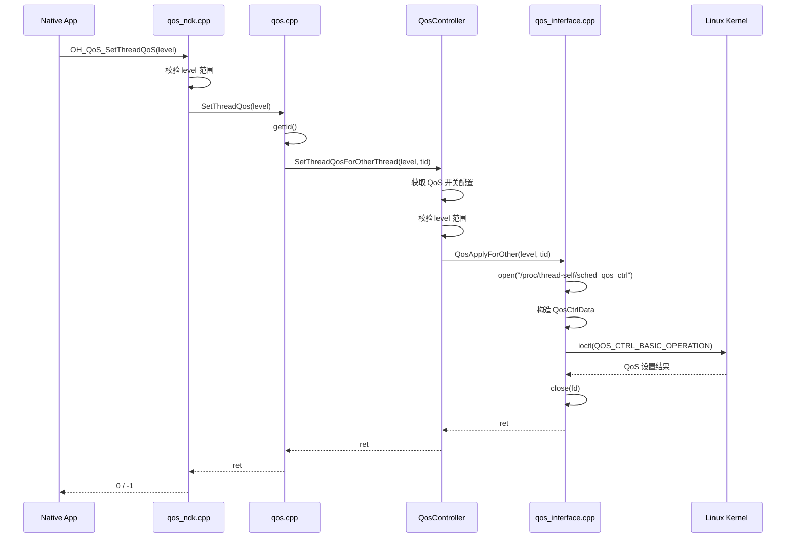
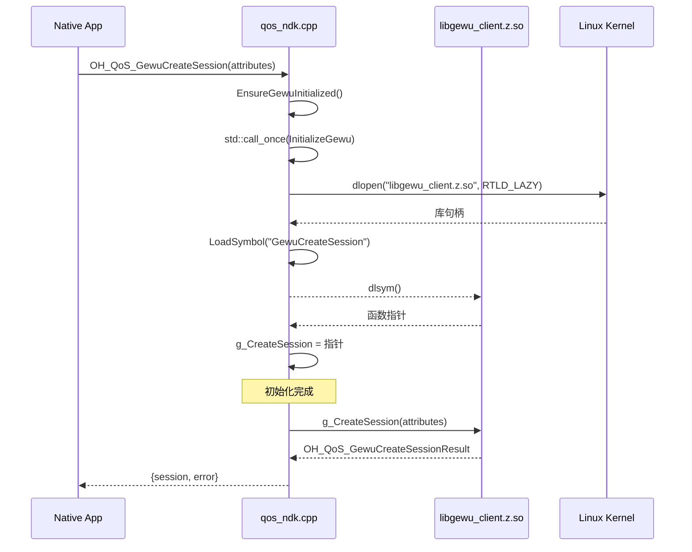
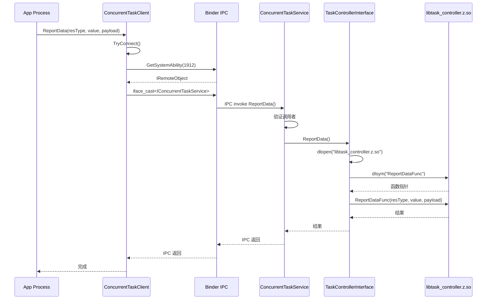
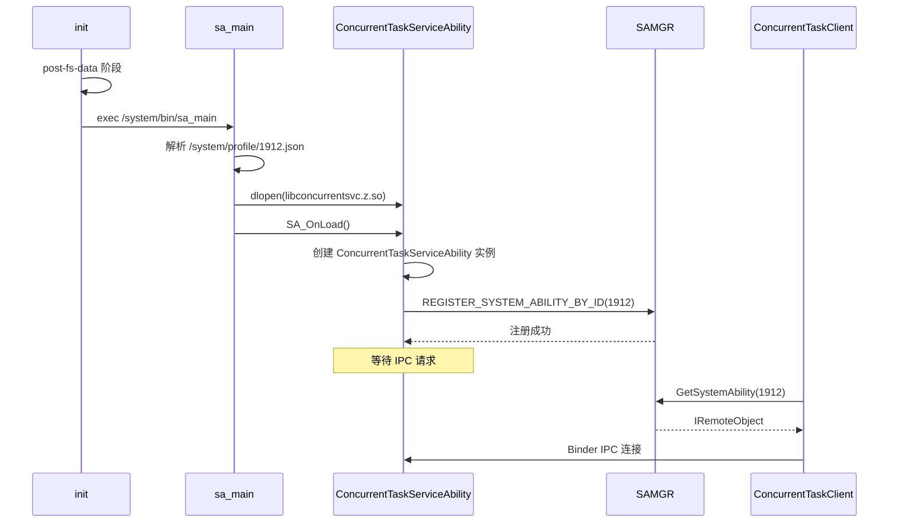

# 关键调用链

> 本文档描述 qos_manager 项目中关键功能的调用链路。

## 1. QoS 设置调用链

### 1.1 NDK API 调用链路

```
┌─────────────────────────────────────────────────────────────────────────────┐
│                        OH_QoS_SetThreadQoS 调用链                            │
└─────────────────────────────────────────────────────────────────────────────┘

Native App (应用层)
    │
    │ 调用 OH_QoS_SetThreadQoS()
    │ 文件: N/A (应用代码)
    │
    ▼
┌─────────────────────────────────────────────────────────────────────────────┐
│ frameworks/native/qos_ndk.cpp                                                │
│ 函数: OH_QoS_SetThreadQoS()                                                  │
│ 行号: 37-43                                                                 │
└─────────────────────────────────────────────────────────────────────────────┘
    │
    │ 1. 参数校验 (level 0-5)
    │ 2. 调用 SetThreadQos()
    │
    ▼
┌─────────────────────────────────────────────────────────────────────────────┐
│ qos/qos.cpp                                                                  │
│ 函数: SetThreadQos()                                                        │
│ 行号: 98-102                                                                 │
└─────────────────────────────────────────────────────────────────────────────┘
    │
    │ 1. 获取当前线程 tid (gettid())
    │ 2. 调用 QosController::SetThreadQosForOtherThread()
    │
    ▼
┌─────────────────────────────────────────────────────────────────────────────┐
│ qos/qos.cpp                                                                  │
│ 函数: QosController::SetThreadQosForOtherThread()                          │
│ 行号: 36-58                                                                  │
└─────────────────────────────────────────────────────────────────────────────┘
    │
    │ 1. 获取 QoS 开关配置 (system parameter)
    │ 2. 参数范围校验 (QOS_BACKGROUND ~ QOS_MAX)
    │ 3. 调用 QosApplyForOther()
    │
    ▼
┌─────────────────────────────────────────────────────────────────────────────┐
│ services/src/qos_interface.cpp                                              │
│ 函数: QosApplyForOther()                                                     │
│ 行号: 92-117                                                                 │
└─────────────────────────────────────────────────────────────────────────────┘
    │
    │ 1. 打开 /proc/thread-self/sched_qos_ctrl
    │ 2. 构造 QosCtrlData {level, type=QOS_APPLY, pid=tid}
    │ 3. ioctl(QOS_CTRL_BASIC_OPERATION, &data)
    │ 4. 关闭 fd
    │
    ▼
┌─────────────────────────────────────────────────────────────────────────────┐
│ Linux Kernel                                                                  │
│ 节点: /proc/thread-self/sched_qos_ctrl                                        │
│ 操作: ioctl 系统调用                                                           │
└─────────────────────────────────────────────────────────────────────────────┘

返回路径: 逆向返回 ioctl 结果
```

### 1.2 调用链 Mermaid 图



---

## 2. GEWU AI 推理调用链

### 2.1 会话创建调用链

```
┌─────────────────────────────────────────────────────────────────────────────┐
│                     OH_QoS_GewuCreateSession 调用链                          │
└─────────────────────────────────────────────────────────────────────────────┘

Native App
    │
    │ 调用 OH_QoS_GewuCreateSession(attributes)
    │ 文件: N/A (应用代码)
    │
    ▼
┌─────────────────────────────────────────────────────────────────────────────┐
│ frameworks/native/qos_ndk.cpp                                                │
│ 函数: OH_QoS_GewuCreateSession()                                             │
│ 行号: 140-146                                                                 │
└─────────────────────────────────────────────────────────────────────────────┘
    │
    │ 1. 检查初始化状态 EnsureGewuInitialized()
    │ 2. 调用 g_CreateSession(attributes)
    │
    ▼
┌─────────────────────────────────────────────────────────────────────────────┐
│ qos_ndk.cpp (libgewu_client.z.so 内部)                                       │
│ 函数: GewuCreateSession()                                                     │
│ 实现: 在 libgewu_client.z.so 中 (外部仓库)                                    │
└─────────────────────────────────────────────────────────────────────────────┘

注意: 后续实现逻辑在 libgewu_client.z.so 中，需查看对应仓库
```

### 2.2 初始化流程



---

## 3. IPC 客户端调用链

### 3.1 ReportData 调用链

```
┌─────────────────────────────────────────────────────────────────────────────┐
│                        ReportData IPC 调用链                                 │
└─────────────────────────────────────────────────────────────────────────────┘

应用进程 (Client Process)
    │
    │ 调用 ConcurrentTaskClient::ReportData()
    │ 文件: 应用代码
    │
    ▼
┌─────────────────────────────────────────────────────────────────────────────┐
│ interfaces/inner_api/concurrent_task_client.h                              │
│ 类: ConcurrentTaskClient                                                    │
│ 函数: ReportData()                                                           │
│ 行号: 47-48                                                                  │
└─────────────────────────────────────────────────────────────────────────────┘
    │
    │ 1. TryConnect() - 获取 SA 代理
    │ 2. clientService_->ReportData()
    │
    ▼
┌─────────────────────────────────────────────────────────────────────────────┐
│ framewors/concurrent_task_client/src/concurrent_task_client.cpp              │
│ 函数: TryConnect()                                                           │
│ 行号: ~60-80                                                                 │
└─────────────────────────────────────────────────────────────────────────────┘
    │
    │ 1. GetSystemAbilityManager()
    │ 2. GetSystemAbility(1912)
    │ 3. iface_cast<IConcurrentTaskService>()
    │ 4. DeathRecipient 注册
    │
    ▼ (Binder IPC)
┌─────────────────────────────────────────────────────────────────────────────┐
│ services/src/concurrent_task_service.cpp                                     │
│ 函数: ConcurrentTaskService::ReportData()                                    │
│ 行号: 23-28                                                                  │
└─────────────────────────────────────────────────────────────────────────────┘
    │
    │ 1. 权限校验 (在 libtask_controller.z.so 中)
    │ 2. TaskControllerInterface::ReportData()
    │
    ▼
┌─────────────────────────────────────────────────────────────────────────────┐
│ services/src/concurrent_task_controller_interface.cpp                        │
│ 函数: TaskControllerInterface::ReportData()                                 │
│ 行号: ~50-70                                                                 │
└─────────────────────────────────────────────────────────────────────────────┘
    │
    │ 1. Load libtask_controller.z.so
    │ 2. GetFunctionPointer("ReportDataFunc")
    │ 3. 调用 ReportDataFunc()
    │
    ▼
┌─────────────────────────────────────────────────────────────────────────────┐
│ libtask_controller.z.so (外部仓库)                                            │
│ 函数: ReportDataFunc()                                                       │
│ 实现: 在 resource_schedule_service 仓库中                                     │
└─────────────────────────────────────────────────────────────────────────────┘
```

### 3.2 IPC 调用 Mermaid 图



---

## 4. 服务启动调用链

### 4.1 SA 注册流程

```
┌─────────────────────────────────────────────────────────────────────────────┐
│                         SA 启动与注册流程                                      │
└─────────────────────────────────────────────────────────────────────────────┘

系统启动
    │
    │ post-fs-data 阶段
    │
    ▼
┌─────────────────────────────────────────────────────────────────────────────┐
│ init (init进程)                                                               │
│ 配置文件: /etc/init/concurrent_task_service.cfg                              │
│ 操作: exec /system/bin/sa_main                                               │
└─────────────────────────────────────────────────────────────────────────────┘
    │
    │ 1. 解析 SA 配置 (1912.json)
    │ 2. 加载 libconcurrentsvc.z.so
    │ 3. 调用 SA_OnLoad()
    │
    ▼
┌─────────────────────────────────────────────────────────────────────────────┐
│ services/src/concurrent_task_service_ability.cpp                            │
│ 函数: ConcurrentTaskServiceAbility::OnLoad()                                 │
│ 宏: REGISTER_SYSTEM_ABILITY_BY_ID                                           │
└─────────────────────────────────────────────────────────────────────────────┘
    │
    │ 1. 创建 SystemAbility 实例
    │ 2. 注册到 SAMGR
    │ 3. 等待客户端连接
    │
    ▼
┌─────────────────────────────────────────────────────────────────────────────┐
│ SAMGR (System Ability Manager)                                               │
│ SA ID: 1912                                                                  │
│ 状态: Registered                                                             │
└─────────────────────────────────────────────────────────────────────────────┘
```

### 4.2 启动流程 Mermaid 图



---

## 5. RTG 启用调用链

```
┌─────────────────────────────────────────────────────────────────────────────┐
│                         EnableRtg 调用链                                      │
└─────────────────────────────────────────────────────────────────────────────┘

services/src/qos_interface.cpp
    │
    │ 函数: EnableRtg(bool flag)
    │ 行号: 57-83
    │
    ▼
┌─────────────────────────────────────────────────────────────────────────────┐
│ services/src/qos_interface.cpp:57                                            │
│ 步骤:                                                                         │
│ 1. 构造 RtgEnableData {enable=flag, data=configStr}                         │
│ 2. open("/proc/self/sched_rtg_ctrl")                                         │
│ 3. fdsan_exchange_owner_tag(fd)                                              │
│ 4. ioctl(CMD_ID_SET_ENABLE, &enableData)                                    │
│ 5. fdsan_close_with_tag(fd)                                                 │
└─────────────────────────────────────────────────────────────────────────────┘
    │
    ▼
┌─────────────────────────────────────────────────────────────────────────────┐
│ Linux Kernel                                                                  │
│ 节点: /proc/self/sched_rtg_ctrl                                              │
│ 操作: CMD_ID_SET_ENABLE ioctl                                                 │
└─────────────────────────────────────────────────────────────────────────────┘

configStr 内容:
"load_freq_switch:1;sched_cycle:1;frame_max_util:1024"
```

---

## 6. QoS 策略设置调用链

```
┌─────────────────────────────────────────────────────────────────────────────┐
│                       QosPolicySet 调用链                                    │
└─────────────────────────────────────────────────────────────────────────────┘

services/src/qos_interface.cpp
    │
    │ 函数: QosPolicySet(const struct QosPolicyDatas* policyDatas)
    │ 行号: 171-191
    │
    ▼
┌─────────────────────────────────────────────────────────────────────────────┐
│ services/src/qos_interface.cpp:171                                           │
│ 步骤:                                                                         │
│ 1. open("/proc/thread-self/sched_qos_ctrl")                                 │
│ 2. 构造 QosPolicyDatas {policyType, policyFlag, policys[7]}                 │
│ 3. ioctl(QOS_CTRL_POLICY_OPERATION, policyDatas)                            │
│ 4. 关闭 fd                                                                   │
└─────────────────────────────────────────────────────────────────────────────┘
    │
    ▼
┌─────────────────────────────────────────────────────────────────────────────┐
│ Linux Kernel                                                                  │
│ 节点: /proc/thread-self/sched_qos_ctrl                                        │
│ 操作: QOS_CTRL_POLICY_OPERATION ioctl                                         │
└─────────────────────────────────────────────────────────────────────────────┘

policyDatas 结构:
- policyType: QOS_POLICY_DEFAULT/SYSTEM_SERVER/FRONT/BACK/FOCUS
- policyFlag: QOS_FLAG_NICE | QOS_FLAG_LATENCY_NICE | QOS_FLAG_UCLAMP | QOS_FLAG_RT
- policys[7]: 7个 QoS 级别的策略配置
```

---

## 7. 关键文件索引

| 调用链 | 起点 | 终点 | 关键文件 |
|--------|------|------|----------|
| QoS 设置 | OH_QoS_SetThreadQoS | ioctl | qos_ndk.cpp → qos.cpp → qos_interface.cpp |
| GEWU 会话 | OH_QoS_GewuCreateSession | dlopen | qos_ndk.cpp |
| IPC 报告 | ReportData | libtask_controller.z.so | concurrent_task_client.cpp → concurrent_task_service.cpp |
| 服务启动 | init | SAMGR | concurrent_task_service_ability.cpp |
| RTG 启用 | EnableRtg | ioctl | qos_interface.cpp |
| 策略下发 | QosPolicySet | ioctl | qos_interface.cpp |

---

## 8. 相关文档

| 文档 | 描述 |
|------|------|
| [01_Architecture.md](./01_Architecture.md) | 架构图和数据流 |
| [02_NDK_API.md](./02_NDK_API.md) | API 详细说明 |
| [03_Inner_API.md](./03_Inner_API.md) | 内部 API |
| [05_Security.md](./05_Security.md) | 安全调用链考量 |
