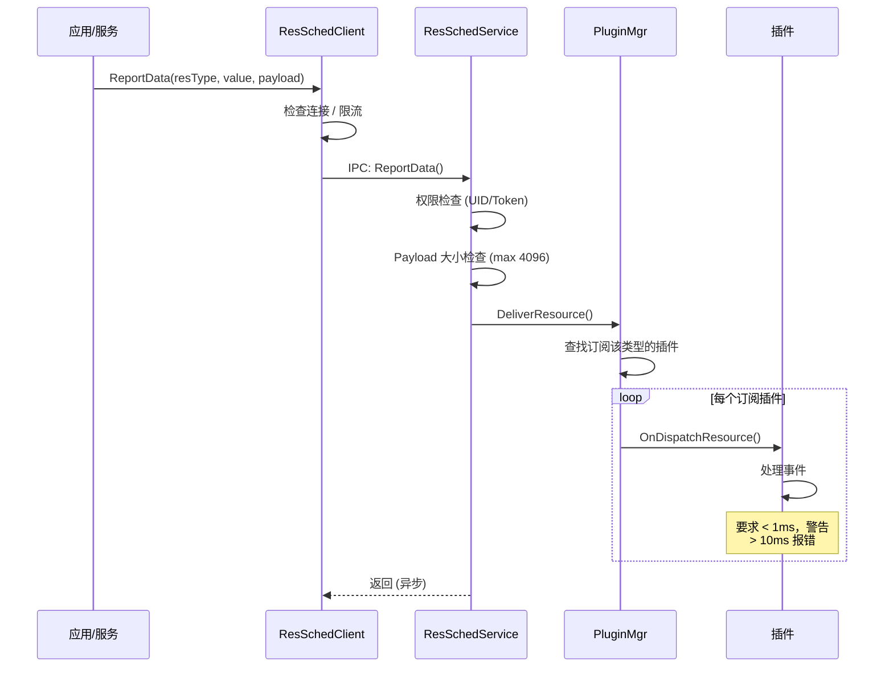
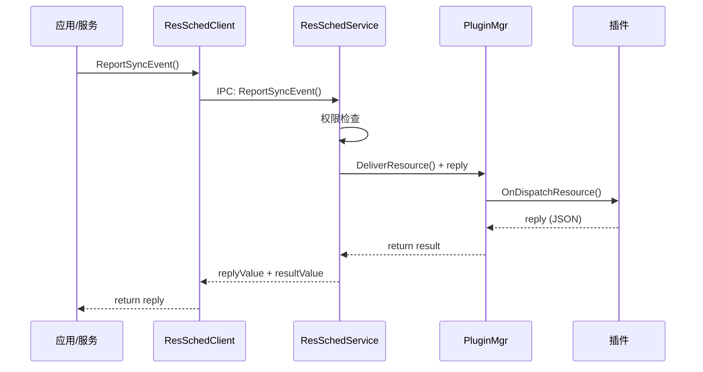
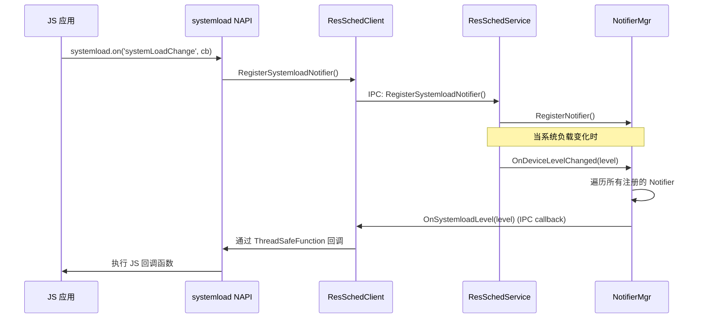
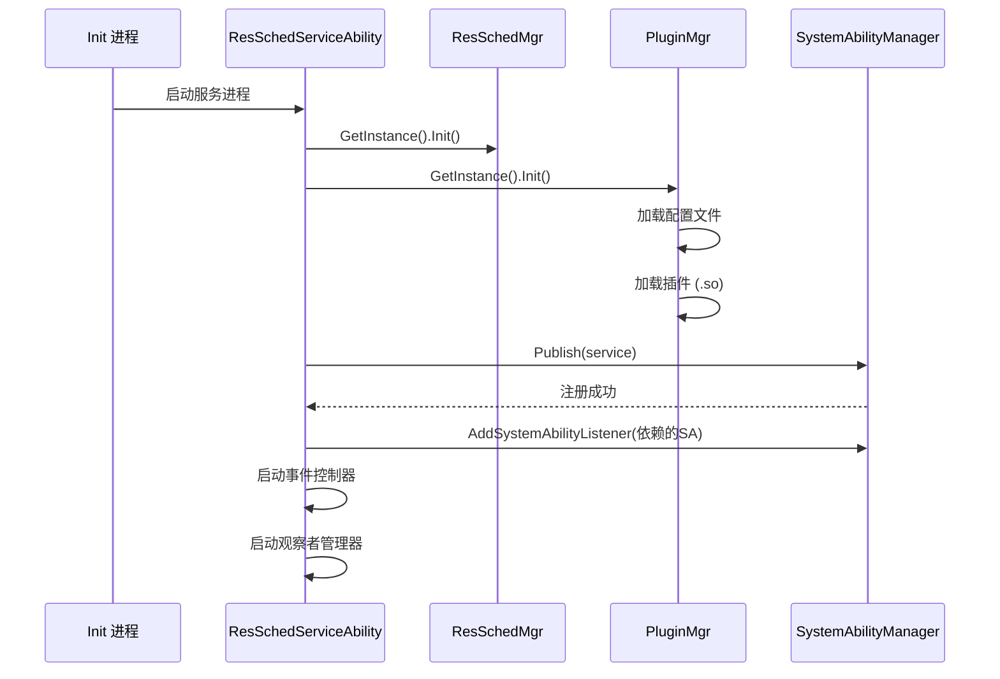
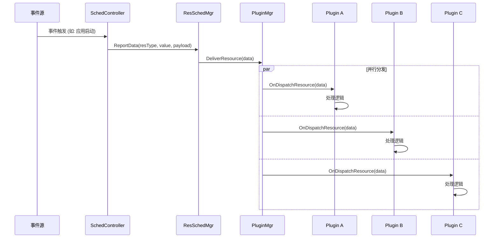

# 架构设计

## 目的

本文档描述 Resource Schedule Service 的架构设计，包括组件图、数据流、线程模型和关键时序。

## 适用范围

- 系统架构师
- 资源调度开发者
- 插件开发者

---

## 组件架构图

```
┌─────────────────────────────────────────────────────────────────────────────────┐
│                           Resource Schedule Service 架构                        │
└─────────────────────────────────────────────────────────────────────────────────┘

【Client 层】
┌─────────────────────────────────────────────────────────────────────────────────┐
│  ┌──────────────┐  ┌──────────────┐  ┌──────────────────────────────────────┐  │
│  │   JS App     │  │   JS App     │  │           System Services            │  │
│  │  (systemload)│  │(bg process mgr)│  │  (AppMgr/WindowMgr/Audio/...)       │  │
│  └──────┬───────┘  └──────┬───────┘  └──────────────────┬───────────────────┘  │
│         │                 │                             │                      │
│         ▼                 ▼                             ▼                      │
│  ┌───────────────────────────────────────────────────────────────────────┐    │
│  │                      N-API / C Interface Layer                         │    │
│  │  (systemload.so / background_process_manager.so / libressched_client.so)│   │
│  └───────────────────────────────────────────────────────────────────────┘    │
└─────────────────────────────────────────────────────────────────────────────────┘
                                      │
                                      ▼ IPC (Binder)
┌─────────────────────────────────────────────────────────────────────────────────┐
│  【Service 层 - ressched 进程 (SA 1901)】                                        │
│  ┌───────────────────────────────────────────────────────────────────────────┐  │
│  │                     ResSchedService (Stub)                                 │  │
│  │  ┌─────────────┐  ┌─────────────┐  ┌─────────────┐  ┌─────────────────┐  │  │
│  │  │ ReportData  │  │ ReportSync  │  │ KillProcess │  │ RegisterListener│  │  │
│  │  └──────┬──────┘  └──────┬──────┘  └──────┬──────┘  └────────┬────────┘  │  │
│  └─────────┼────────────────┼────────────────┼──────────────────┼───────────┘  │
│            │                │                │                  │              │
│            ▼                ▼                ▼                  ▼              │
│  ┌─────────────────────────────────────────────────────────────────────────┐ │
│  │                         ResSchedMgr / PluginMgr                          │ │
│  │                    (事件分发 / 插件管理 / 场景识别)                         │ │
│  └─────────────────────────────────────────────────────────────────────────┘ │
│            │                                                                  │
│            ▼                                                                  │
│  ┌─────────────────────────────────────────────────────────────────────────┐ │
│  │                              Plugins                                     │ │
│  │  ┌─────────────────┐ ┌───────────────┐ ┌───────────────┐ ┌────────────┐ │ │
│  │  │ cgroup_sched    │ │ socperf       │ │ frame_aware   │ │ device_    │ │ │
│  │  │ _plugin         │ │ _plugin       │ │ _plugin       │ │ standby    │ │ │
│  │  │                 │ │               │ │               │ │ _plugin    │ │ │
│  │  │ 进程分组管理     │ │ SoC 性能调频  │ │ 帧感知调度    │ │ 待机管理   │ │ │
│  │  └────────┬────────┘ └───────┬───────┘ └───────┬───────┘ └─────┬──────┘ │ │
│  └───────────┼──────────────────┼─────────────────┼───────────────┼────────┘ │
│              │                  │                 │               │          │
└──────────────┼──────────────────┼─────────────────┼───────────────┼──────────┘
               │                  │                 │               │
               │                  │                 │               ▼
               │                  │                 │    ┌─────────────────────┐
               │                  │                 │    │  System Services    │
               │                  │                 │    │ (PowerMgr/Standby)  │
               │                  │                 │    └─────────────────────┘
               ▼                  ▼                 ▼
┌─────────────────────────────────────────────────────────────────────────────────┐
│  【Executor 层 - ressched_executor 进程 (SA 1918)】                              │
│  ┌───────────────────────────────────────────────────────────────────────────┐  │
│  │                    ResSchedExeService (Stub)                               │  │
│  │  ┌─────────────┐  ┌─────────────┐  ┌─────────────┐                        │  │
│  │  │SendRequest  │  │SendRequest  │  │ KillProcess │                        │  │
│  │  │   Sync      │  │   Async     │  │             │                        │  │
│  │  └──────┬──────┘  └──────┬──────┘  └──────┬──────┘                        │  │
│  └─────────┼────────────────┼────────────────┼────────────────────────────────┘  │
│            │                │                │                                   │
│            ▼                ▼                ▼                                   │
│  ┌─────────────────────────────────────────────────────────────────────────┐    │
│  │                         ResSchedExeMgr                                   │    │
│  │                    (执行器管理器 / 配置读取)                                │    │
│  └─────────────────────────────────────────────────────────────────────────┘    │
│            │                                                                    │
│            ▼                                                                    │
│  ┌─────────────────────────────────────────────────────────────────────────┐    │
│  │                         socperf_executor_plugin                          │    │
│  │                      (写入 /sys/class/devfreq/ 等)                        │    │
│  └─────────────────────────────────────────────────────────────────────────┘    │
└─────────────────────────────────────────────────────────────────────────────────┘
```

---

## 数据流

### 1. 事件上报流程



### 2. 同步事件流程



### 3. 系统负载通知流程



---

## 线程模型

### ressched 服务线程

```
┌─────────────────────────────────────────────────────────────┐
│                    ressched 进程                             │
│                                                             │
│  ┌─────────────────────────────────────────────────────┐   │
│  │              Main Thread (主线程)                    │   │
│  │  - SA 注册 / 生命周期管理                             │   │
│  │  - IPC 请求处理 (onRemoteRequest)                    │   │
│  │  - 插件事件分发 (短时，< 10ms)                       │   │
│  └─────────────────────────────────────────────────────┘   │
│                          │                                  │
│                          ▼                                  │
│  ┌─────────────────────────────────────────────────────┐   │
│  │            EventHandler Thread (事件处理线程)         │   │
│  │  - 应用状态监听回调                                   │   │
│  │  - 窗口状态变化处理                                   │   │
│  │  - 音频/相机/电话事件                                 │   │
│  └─────────────────────────────────────────────────────┘   │
│                          │                                  │
│                          ▼                                  │
│  ┌─────────────────────────────────────────────────────┐   │
│  │            Worker Thread (FFRT 任务队列)             │   │
│  │  - ReportSyncEvent 超时处理                          │   │
│  │  - 耗时插件操作                                       │   │
│  └─────────────────────────────────────────────────────┘   │
│                                                             │
└─────────────────────────────────────────────────────────────┘
```

### 插件执行时间约束

```cpp
// 文件: ressched/services/resschedmgr/resschedfwk/src/plugin_mgr.cpp

// 事件处理时间阈值
constexpr int32_t WARN_TIME = 1000;     // 1ms 警告
constexpr int32_t ERROR_TIME = 10000;   // 10ms 错误

void PluginMgr::DeliverResource(...) {
    auto startTime = ResCommonUtil::GetNowMicroTime();
    
    // 分发到插件
    plugin->OnDispatchResource(data);
    
    auto duration = ResCommonUtil::GetNowMicroTime() - startTime;
    if (duration > ERROR_TIME) {
        // 超过 10ms，记录错误
        RESSCHED_LOGE("Plugin %{public}s process time exceed 10ms", libName.c_str());
    } else if (duration > WARN_TIME) {
        // 超过 1ms，记录警告
        RESSCHED_LOGW("Plugin %{public}s process time exceed 1ms", libName.c_str());
    }
}
```

---

## IPC/SA 架构

### SystemAbility 关系图

```
┌────────────────────────────────────────────────────────────────┐
│                    SystemAbilityManager                         │
│                        (samgr)                                  │
│  ┌─────────────────────┐    ┌─────────────────────┐            │
│  │   SA ID: 1901       │    │   SA ID: 1918       │            │
│  │   ressched          │    │   ressched_executor │            │
│  │   (资源调度服务)     │    │   (资源调度执行器)   │            │
│  │                     │    │                     │            │
│  │  ┌───────────────┐  │    │  ┌───────────────┐  │            │
│  │  │ IResSched     │  │    │  │ IResSchedExe  │  │            │
│  │  │ Service       │  │    │  │ Service       │  │            │
│  │  │ (IDL接口)      │  │◄───┼──┤ (IDL接口)      │  │            │
│  │  └───────────────┘  │    │  └───────────────┘  │            │
│  │         ▲           │    │         ▲           │            │
│  │         │ Proxy     │    │         │ Proxy     │            │
│  │    ResSchedClient   │    │    ResSchedExeClient│            │
│  └─────────┼───────────┘    └─────────┼───────────┘            │
└────────────┼──────────────────────────┼────────────────────────┘
             │                          │
    ┌────────┴────────┐        ┌────────┴────────┐
    │    Clients      │        │    Clients      │
    │  - 各系统服务    │        │  - ressched     │
    │  - N-API 接口    │        │  - 其他插件     │
    └─────────────────┘        └─────────────────┘
```

### IPC 接口定义

#### IResSchedService (SA 1901)

```cpp
// 文件: ressched/interfaces/innerkits/ressched_client/IResSchedService.idl

interface IResSchedService {
    // 异步上报事件
    [oneway] void ReportData(unsigned int resType, long value, String payload);
    
    // 同步上报事件
    void ReportSyncEvent(unsigned int resType, long value, String payload,
        [out] String replyValue, [out] int resultValue);
    
    // 杀进程
    void KillProcess(String payload, [out] int resultValue);
    
    // 系统负载监听
    void RegisterSystemloadNotifier(IRemoteObject notifier);
    void UnRegisterSystemloadNotifier();
    void GetSystemloadLevel([out] int resultValue);
    
    // 事件监听
    void RegisterEventListener(IRemoteObject listener, 
        unsigned int eventType, unsigned int listenerGroup);
    void UnRegisterEventListener(unsigned int eventType, unsigned int listenerGroup);
    
    // 应用预加载
    void IsAllowedAppPreload(String bundleName, int preloadMode, [out] boolean resultValue);
    
    // 链接跳转
    void IsAllowedLinkJump(boolean isAllowedLinkJump, [out] int resultValue);
    
    // 挂起状态
    int RegisterSuspendObserver(ISuspendStateObserverBase observer);
    int UnregisterSuspendObserver(ISuspendStateObserverBase observer);
    int GetSuspendStateByUid(int uid, [out] boolean isFrozen);
    int GetSuspendStateByPid(int pid, [out] boolean isFrozen);
}
```

#### IResSchedExeService (SA 1918)

```cpp
// 文件: ressched_executor/interfaces/innerkits/ressched_executor_client/IResSchedExeService.idl

interface IResSchedExeService {
    // 同步请求
    int SendRequestSync(unsigned int resType, long value, 
        ResJsonType context, [out] ResJsonType response);
    
    // 异步请求
    [oneway] void SendRequestAsync(unsigned int resType, long value, ResJsonType context);
    
    // 杀进程
    int KillProcess(unsigned int pid);
}
```

---

## 关键时序

### 服务启动时序



### 插件事件处理时序



---

## 代码证据

### 服务注册代码

```cpp
// 文件: ressched/services/resschedservice/src/res_sched_service_ability.cpp

void ResSchedServiceAbility::OnStart() {
    ResSchedMgr::GetInstance().Init();
    NotifierMgr::GetInstance().Init();
    EventListenerMgr::GetInstance().Init();
    
    service_ = new (std::nothrow) ResSchedService();
    service_->InitAllowIpcReportRes();
    
    // 向 SA 管理器发布服务
    if (!Publish(service_)) {
        RESSCHED_LOGE("Register to system ability manager failed!");
    }
    
    // 注册依赖的 SA 监听器
    SystemAbilityListenerInit();
    EventControllerInit();
    ObserverManagerInit();
}
```

### 插件分发代码

```cpp
// 文件: ressched/services/resschedmgr/resschedfwk/src/plugin_mgr.cpp

void PluginMgr::DeliverResource(const std::shared_ptr<ResData>& data) {
    std::lock_guard<std::mutex> lock(mutex_);
    
    // 获取订阅该资源类型的插件列表
    auto pluginList = resTypePluginMap_[data->resType];
    
    for (const auto& libName : pluginList) {
        auto plugin = pluginLibMap_[libName];
        if (plugin) {
            auto startTime = GetNowMicroTime();
            
            // 分发事件
            plugin->OnDispatchResource(data);
            
            // 检查处理时间
            auto duration = GetNowMicroTime() - startTime;
            if (duration > ERROR_TIME) {
                RESSCHED_LOGE("Plugin %s process time exceed 10ms", libName.c_str());
            }
        }
    }
}
```

---

## 相关链接

- [概览](00_Overview.md) - 项目定位与核心概念
- [目录结构](02_Directory_Structure.md) - 代码组织
- [内部 API](04_Inner_API.md) - C++ 接口详情
- [N-API 参考](03_NAPI_Reference.md) - JS 接口详情
