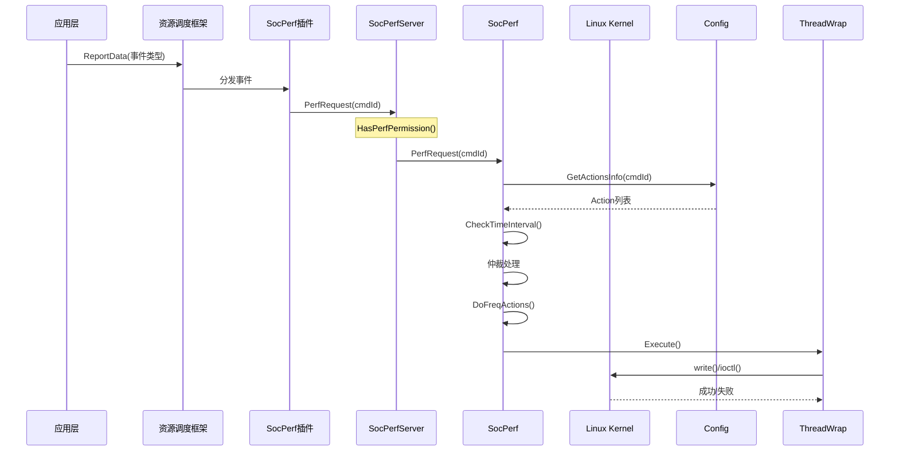

# 02_Architecture - 架构与数据流

本文档描述 SOC 统一调频部件的整体架构设计、组件交互和关键数据流。

## 整体架构

```
┌─────────────────────────────────────────────────────────────────────────────┐
│                           客户端层 (SocPerfClient)                           │
│  ┌─────────────────────────────────────────────────────────────────────┐  │
│  │  GetInstance() → CheckClientValid() → IPC 调用                       │  │
│  │  AddPidAndTidInfo() 自动添加进程/线程信息                              │  │
│  │  DeathRecipient 处理服务端死亡回调                                      │  │
│  └─────────────────────────────────────────────────────────────────────┘  │
└─────────────────────────────────────────────────────────────────────────────┘
                                    │
                                    │ IPC (Binder)
                                    ↓
┌─────────────────────────────────────────────────────────────────────────────┐
│                        服务端层 (SocPerfServer)                              │
│  ┌─────────────────────────────────────────────────────────────────────┐  │
│  │  SystemAbility (SA ID: 1906)                                        │  │
│  │  └── SocPerfStub (IDL 生成的 IPC 接口)                                 │  │
│  │      ├── PerfRequest / PerfRequestEx                                │  │
│  │      ├── PowerLimitBoost / ThermalLimitBoost                        │  │
│  │      ├── LimitRequest                                               │  │
│  │      └── 权限校验 (HasPerfPermission)                                │  │
│  └─────────────────────────────────────────────────────────────────────┘  │
└─────────────────────────────────────────────────────────────────────────────┘
                                    │
                                    ↓
┌─────────────────────────────────────────────────────────────────────────────┐
│                         核心层 (SocPerf)                                     │
│  ┌─────────────────────────────────────────────────────────────────────┐  │
│  │  调频仲裁器                                                             │  │
│  │  ├── Init() - 配置加载                                                │  │
│  │  ├── DoPerfRequestThremalLvl() - 热等级处理                           │  │
│  │  ├── MatchDeviceModeCmd() - 设备模式匹配                              │  │
│  │  └── DoFreqActions() - 频率动作执行                                   │  │
│  └─────────────────────────────────────────────────────────────────────┘  │
│  ┌─────────────────────────────────────────────────────────────────────┐  │
│  │  配置管理器 (SocPerfConfig)                                           │  │
│  │  ├── LoadConfigXmlFile() - XML 解析                                  │  │
│  │  ├── ParseBoostXmlFile() - 提频配置                                   │  │
│  │  └── ParseResourceXmlFile() - 资源配置                                │  │
│  └─────────────────────────────────────────────────────────────────────┘  │
│  ┌─────────────────────────────────────────────────────────────────────┐  │
│  │  线程封装 (SocPerfThreadWrap)                                        │  │
│  │  └── Linux cpufreq 接口调用                                           │  │
│  └─────────────────────────────────────────────────────────────────────┘  │
└─────────────────────────────────────────────────────────────────────────────┘
```

## 组件职责

| 组件 | 路径 | 职责 | 稳定性 |
|------|------|------|--------|
| **SocPerfClient** | `interfaces/inner_api/socperf_client` | IPC 客户端代理、连接管理、死亡回调 | 高（对外接口） |
| **SocPerfServer** | `services/server` | SA 服务端实现、权限校验、Dump | 高（对外接口） |
| **SocPerf** | `services/core` | 核心调频逻辑、仲裁处理 | 中（内部实现） |
| **SocPerfConfig** | `services/core` | XML 配置加载与解析 | 中（配置驱动） |
| **SocPerfThreadWrap** | `services/core` | FFRT 线程队列、内核接口封装 | 中（内部实现） |
| **SocPerfHiTraceChain** | `services/dfx` | HiTrace 跟踪链 RAII 包装 | 低（调试用途） |

**证据来源**：`services/core/include/socperf.h:26-85`

## 数据流图

### 关键操作时序



### 初始化流程

```
SocPerfServer::OnStart()
    ↓
SocPerf::Init()
    ↓
SocPerfConfig::Init()
    ├─ LoadConfigXmlFile("socperf_resource_config.xml")
    │   ├─ ParseResourceXmlFile()
    │   │   ├─ LoadResource() → CPU频率资源
    │   │   ├─ LoadGovResource() → 治理资源
    │   │   └─ LoadSceneResource() → 场景资源
    │   └─ LoadInfo() → 性能回调配置
    │
    └─ LoadConfigXmlFile("socperf_boost_config.xml")
        └─ ParseBoostXmlFile()
            └─ LoadConfig()
                ├─ LoadCmdInfo() → 命令配置
                └─ LoadInterAction() → 弱交互配置
```

## 线程模型

| 线程类型 | 职责 | 代码位置 | 备注 |
|----------|------|----------|------|
| **SA 主线程** | IPC 消息接收与分发 | `socperf_server.cpp:115-200` | SystemAbility 框架管理 |
| **FFRT 线程池** | 调频任务异步执行 | `socperf_thread_wrap.cpp` | `ffrt:libffrt` 依赖 |

### 线程同步机制

**证据**：`services/core/include/socperf.h:57-60`

```cpp
std::mutex mutex_;              // 通用互斥锁
std::mutex mutexDeviceMode_;    // 设备模式锁
std::mutex mutexBoostCmdCount_; // 提频命令计数锁
std::mutex mutexBoostTime_;     // 提频时间锁
```

### 客户端线程安全

**证据**：`interfaces/inner_api/socperf_client/include/socperf_client.h:137`

```cpp
std::mutex mutex_;  // 保护所有公共 API
```

## IPC 接口

### IDL 定义

**文件**：`interfaces/inner_api/socperf_client/ISocPerf.idl`

```idl
interface OHOS.SOCPERF.ISocPerf {
   [oneway] void PerfRequest([in] int cmdId, [in] String msg);
   [oneway] void PerfRequestEx([in] int cmdId, [in] boolean onOffTag, [in] String msg);
   [oneway] void SetRequestStatus([in] boolean status, [in] String msg);
   [oneway] void SetThermalLevel([in] int level);
   [oneway] void PowerLimitBoost([in] boolean onOffTag, [in] String msg);
   [oneway] void RequestDeviceMode([in] String mode, [in] boolean status);
   void RequestCmdIdCount([in] String msg, [out] String funcResult);
   [oneway] void ThermalLimitBoost([in] boolean onOffTag, [in] String msg);
   [oneway] void LimitRequest([in] int clientId, [in] int[] tags, [in] long[] configs, [in] String msg);
}
```

### 服务特征

| 特征 | 值 | 说明 |
|------|-----|------|
| **SA ID** | 1906 | `sa_profile/1906.json:5` |
| **运行时机** | OnDemand | 按需启动 |
| **进程模型** | 独立进程 | `resource_schedule_service` |

## 权限模型

### 权限校验流程

```
┌─────────────────────────────────────────────────────────────────┐
│                    IPC 调用到达                                  │
└─────────────────────────────────────────────────────────────────┘
                              ↓
┌─────────────────────────────────────────────────────────────────┐
│              IPCSkeleton::GetCallingTokenID()                    │
└─────────────────────────────────────────────────────────────────┘
                              ↓
              ┌────────────────┬────────────────┐
              ↓                ↓                ↓
         HAP Token      Native Token      System App
              ↓                ↓                ↓
     ┌─────────────┐      自动通过      自动通过
     │GetCallingPid()│
     │SetQos()     │   (仅 HAP 需要额外检查)
     └─────────────┘
              ↓
     ┌─────────────────────────────────┐
     │ VerifyAccessToken(PERMISSION)   │
     │ → 权限缓存 (LRU Cache)          │
     └─────────────────────────────────┘
```

### 权限检查点

| 接口 | 位置 | 权限检查 |
|------|------|----------|
| `PerfRequest()` | `socperf_server.cpp:99` | `REPORT_RESOURCE_SCHEDULE_EVENT` |
| `PerfRequestEx()` | `socperf_server.cpp:108` | `REPORT_RESOURCE_SCHEDULE_EVENT` |
| `PowerLimitBoost()` | `socperf_server.cpp:117` | `REPORT_RESOURCE_SCHEDULE_EVENT` |
| `ThermalLimitBoost()` | `socperf_server.cpp:126` | `REPORT_RESOURCE_SCHEDULE_EVENT` |
| `LimitRequest()` | `socperf_server.cpp:136` | `REPORT_RESOURCE_SCHEDULE_EVENT` |
| `SetRequestStatus()` | `socperf_server.cpp:145` | `REPORT_RESOURCE_SCHEDULE_EVENT` |
| `SetThermalLevel()` | `socperf_server.cpp:154` | `REPORT_RESOURCE_SCHEDULE_EVENT` |
| `RequestDeviceMode()` | `socperf_server.cpp:162` | `REPORT_RESOURCE_SCHEDULE_EVENT` |
| `RequestCmdIdCount()` | `socperf_server.cpp:176` | `REPORT_RESOURCE_SCHEDULE_EVENT` + HIVIEW_UID |
| `Dump()` | `socperf_server.cpp:76` | `DUMP` + ENG_MODE |

### 权限缓存

**证据**：`services/server/include/socperf_server.h:124`

```cpp
SocPerfLRUCache<AccessToken::AccessTokenID, int32_t> permissionCache_;
```

### 权限列表

| 权限 | 用途 | 位置 |
|------|------|------|
| `ohos.permission.REPORT_RESOURCE_SCHEDULE_EVENT` | 性能请求接口 | `socperf_server.cpp:183` |
| `ohos.permission.DUMP` | 调试 Dump | `socperf_server.cpp:66` |

**证据**：`services/server/src/socperf_server.cpp:183-212`

---

## 相关文档

- 项目概览：[01_Overview](01_Overview.md)
- 接口文档：[04_Interface](04_Interface.md)
- 攻击面分析：[05_AttackSurface](05_AttackSurface.md)

---

*文档版本：v1.0*
*最后更新：2026-02-07*
