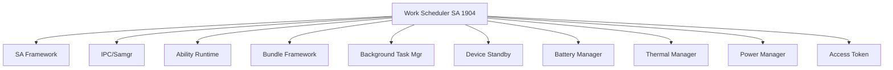

# 项目概览

**一句话定义**: Work Scheduler 是 OpenHarmony 资源调度子系统的延迟任务调度服务，为应用提供基于系统状态智能触发的后台任务执行能力。

---

## 目录

- [项目定位与核心价值](#项目定位与核心价值)
- [能力边界](#能力边界)
- [运行环境与依赖](#运行环境与依赖)
- [快速开始](#快速开始)
- [使用约束](#使用约束)
- [相关链接](#相关链接)

---

## 项目定位与核心价值

### 解决的问题

在移动设备上，后台任务的执行面临以下挑战：
1. **电量敏感**: 任意时刻执行任务会快速消耗电池
2. **资源竞争**: 多应用同时执行后台任务导致系统卡顿
3. **时机选择**: 应用难以感知系统最佳状态

### Work Scheduler 的方案

Work Scheduler 采用**条件驱动 + 系统感知**的调度模型：

```
应用设定条件 → 系统监控状态 → 最佳时机触发 → 统一资源管控
```

**核心价值**:
- **省电**: 利用充电、空闲时段执行任务
- **流畅**: 避开高负载时段，统一调度减少竞争
- **简单**: 应用只需声明条件，无需关心调度细节

### 典型应用场景

| 场景 | 使用条件 | 调度策略 |
|------|----------|----------|
| 数据同步 | WiFi + 充电 | 夜间空闲时 |
| 日志上报 | 网络可用 | 系统低负载时 |
| 模型训练 | 充电 + 低热 | 温度正常时 |
| 预加载 | WiFi | 内存充足时 |

---

## 能力边界

### 能做什么

| 能力 | 说明 | 代码位置 |
|------|------|----------|
| **延迟执行** | 非实时性任务的延迟触发 | `services/native/src/work_scheduler_service.cpp` |
| **条件触发** | 8种条件类型组合 | `services/native/include/conditions/` |
| **频率管控** | 基于应用分组限制执行间隔 | `services/native/src/work_policy_manager.cpp` |
| **持久化任务** | 设备重启后自动恢复 | `services/native/src/work_sched_data_manager.cpp` |
| **系统感知** | 根据CPU/内存/温度决策 | `services/native/include/policy/` |
| **Extension支持** | 任务回调通过ExtensionAbility | `frameworks/extension/` |

### 不能做什么

| 限制 | 说明 | 原因 |
|------|------|------|
| **实时任务** | 不支持精确时间触发 | 设计目标是延迟调度 |
| **长时任务** | 单次最长120秒 | 防止资源滥用 |
| **高频执行** | 最小间隔2-48小时 | 基于应用分组限制 |
| **跨应用任务** | 只能调度自身Ability | 安全隔离 |
| **后台保活** | 不保证任务立即执行 | 系统统一决策 |

---

## 运行环境与依赖

### 系统要求

| 要求 | 值 | 来源 |
|------|-----|------|
| **系统类型** | Standard | `bundle.json:18` |
| **SA ID** | 1904 | `sa_profile/1904.json:5` |
| **进程名** | resource_schedule_service | `sa_profile/1904.json:2` |
| **ROM占用** | 2048 KB | `bundle.json:20` |
| **RAM占用** | 10240 KB | `bundle.json:21` |

### 依赖组件



**完整依赖列表**（30+ 组件）:
- **核心框架**: safwk, ability_runtime, ability_base, ipc, c_utils
- **系统服务**: bundle_framework, common_event_service, background_task_mgr, device_standby
- **资源管理**: power_manager, battery_manager, thermal_manager, resource_schedule_service
- **安全**: access_token, os_account
- **基础设施**: hilog, hisysevent, eventhandler, ffrt, samgr

---

## 快速开始

### 1. 声明权限

在 `module.json5` 中声明所需权限：

```json
{
  "module": {
    "requestPermissions": [
      {
        "name": "ohos.permission.RUNNING_STATE",
        "reason": "$string:permission_reason"
      }
    ]
  }
}
```

### 2. 创建 Work Scheduler Extension

```typescript
// MyWorkAbility.ets
import { WorkSchedulerExtensionAbility, workScheduler } from '@kit.BackgroundTasksKit';

export default class MyWorkAbility extends WorkSchedulerExtensionAbility {
  onWorkStart(workInfo: workScheduler.WorkInfo): void {
    console.log(`任务开始: ${workInfo.workId}`);
    // 执行后台任务
  }

  onWorkStop(workInfo: workScheduler.WorkInfo): void {
    console.log(`任务停止: ${workInfo.workId}`);
  }
}
```

### 3. 在 module.json5 中注册

```json
{
  "extensionAbilities": [
    {
      "name": "MyWorkAbility",
      "srcEntry": "./ets/work/MyWorkAbility.ets",
      "type": "workScheduler"
    }
  ]
}
```

### 4. 申请延迟任务

```typescript
import { workScheduler } from '@kit.BackgroundTasksKit';

// 构建 WorkInfo
const workInfo: workScheduler.WorkInfo = {
  workId: 1,                              // 任务ID，必填
  bundleName: 'com.example.myapp',        // 包名，必填
  abilityName: 'MyWorkAbility',           // Ability名，必填
  networkType: workScheduler.NetworkType.NETWORK_TYPE_WIFI,  // 网络条件
  isCharging: true,                       // 充电条件
  batteryLevel: 50,                       // 电量条件(>50%)
  isRepeat: true,                         // 是否循环
  repeatCycleTime: 20 * 60 * 1000,        // 循环间隔20分钟
  parameters: {                           // 自定义参数
    taskType: 'sync',
    priority: 1
  }
};

// 启动任务
try {
  workScheduler.startWork(workInfo);
  console.log('任务申请成功');
} catch (error) {
  console.error(`任务申请失败: ${error.message}`);
}
```

### 5. 查询和停止任务

```typescript
// 查询任务状态
workScheduler.getWorkStatus(1).then((work) => {
  console.log(`任务状态: ${JSON.stringify(work)}`);
});

// 停止任务
workScheduler.stopWork(workInfo, false);  // false: 不取消正在执行的任务

// 停止并清除所有任务
workScheduler.stopAndClearWorks();
```

---

## 使用约束

### 超时限制

```
单次任务最长运行时间: 120秒
```

超时后系统会强制停止任务。系统应用可通过能效资源申请获取更长时间：
- 充电状态: 20分钟
- 非充电状态: 10分钟

### 执行频率约束

系统根据应用活跃度分组限制执行频率：

| 应用分组 | 执行频率 | 说明 |
|----------|----------|------|
| 活跃组 (active) | 最小间隔 2小时 | 高频使用应用 |
| 每日使用组 (daily used) | 最小间隔 4小时 | 每天使用 |
| 经常使用组 (fixed) | 最小间隔 24小时 | 规律使用 |
| 不经常使用组 (rare used) | 最小间隔 48小时 | 偶尔使用 |
| 受限分组 (restricted) | 禁止执行 | 被系统限制 |
| 未使用分组 (unused) | 禁止执行 | 长期未使用 |
| 能效资源豁免分组 | 不受限制 | 申请了能效资源 |

### WorkInfo 参数约束

| 约束项 | 要求 | 验证位置 |
|--------|------|----------|
| **必填字段** | workId、bundleName、abilityName | `services/native/src/work_scheduler_service.cpp:CheckWorkInfo` |
| **bundleName** | 必须与调用者一致 | 同上 |
| **触发条件** | 至少设置一个条件 | 同上 |
| **循环间隔** | 最小 20分钟 (1200000ms) | 同上 |
| **参数类型** | 仅支持 number、string、boolean | `interfaces/kits/js/napi/src/common.cpp` |

---

## 相关链接

### 内部文档

- [02_Architecture.md](02_Architecture.md) - 架构与数据流
- [03_CodeMap.md](03_CodeMap.md) - 代码地图
- [04_Interface.md](04_Interface.md) - 完整 API 文档
- [05_AttackSurface.md](05_AttackSurface.md) - 攻击面分析
- [07_Build.md](07_Build.md) - 构建说明

### 外部资源

- [OpenHarmony 官方文档 - 延迟任务调度](https://docs.openharmony.cn/pages/v5.0/zh-cn/application-dev/task-management/work-scheduler.md)
- [Background Task Manager](https://gitee.com/openharmony/resourceschedule_background_task_mgr)
- [Bundle Framework](https://gitee.com/openharmony/appexecfwk_standard)

### 关键文件

| 文件 | 描述 |
|------|------|
| `interfaces/kits/js/napi/src/init.cpp:41-62` | N-API 注册点 |
| `frameworks/IWorkSchedService.idl:17-33` | IPC 接口定义 |
| `services/native/include/work_scheduler_service.h:45-411` | 服务类定义 |
| `frameworks/include/work_info.h:33-420` | WorkInfo 数据结构 |

---

**文档版本**: 1.0  
**更新日期**: 2026-02-07  
**作者**: AI Agent
