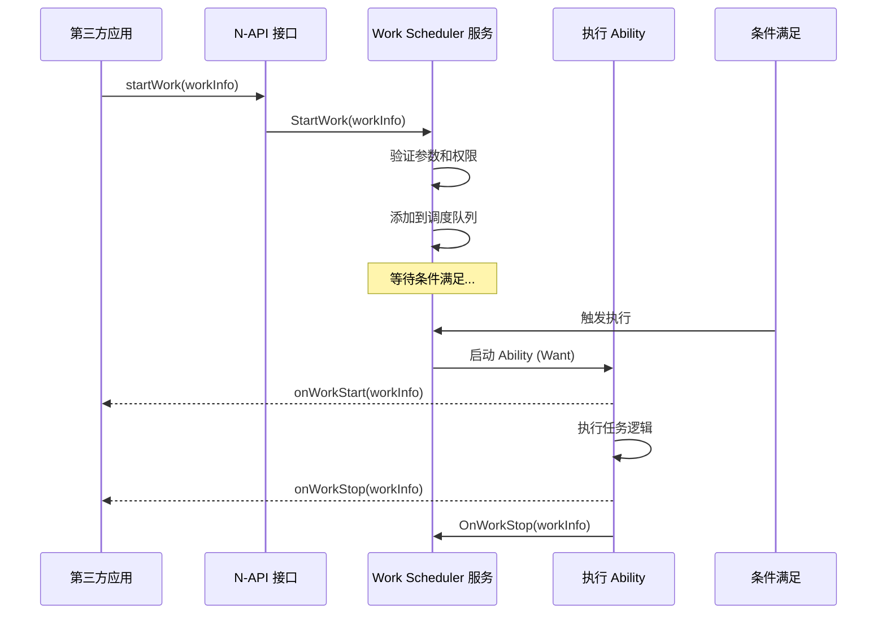

# 项目定位与边界

> **目的**: 明确 Work Scheduler 在 OpenHarmony 生态中的位置、职责和边界
> **适用范围**: 系统开发者、应用开发者、架构师

---

## 模块定位

### 在资源调度子系统的位置

```
resourceschedule/
├── work_scheduler        ◄── 本模块（任务调度）
├── background_task_mgr  ◄── 后台任务管理（延时任务、短暂任务）
├── device_standby       ◄── 设备待机（应用冻结）
├── device_usage_statistics  ◄── 设备使用统计（应用活跃度）
└── resource_schedule_service ◄── 资源调度服务（策略引擎）
```

**Work Scheduler 的独特价值**:
- ✅ 提供应用可控的**条件触发**机制
- ✅ 与系统资源状态**智能协同**
- ✅ 支持应用开发的**延迟执行**场景

### 与其他模块的边界

| 模块 | 职责 | 与 Work Scheduler 的关系 |
|------|------|---------------------|
| **Background Task Manager** | 延时任务、短暂任务 | 互补，Work Scheduler 适用于更长时间的任务 |
| **Device Standby** | 应用冻结、待机策略 | Work Scheduler 尊待机状态，避免在冻结时触发任务 |
| **Device Usage Statistics** | 应用活跃度统计 | Work Scheduler 依赖其进行频率控制 |
| **AlarmManager** | 精准时钟唤醒 | Work Scheduler 不提供精确时间控制，互补使用场景 |
| **Ability Runtime** | 前台/后台 Ability | Work Scheduler 通过 Ability 执行实际任务 |

---

## 系统能力（Syscap）

### Syscap 定义

```json
{
  "name": "work_scheduler",
  "subsystem": "resourceschedule",
  "syscap": [ "SystemCapability.ResourceSchedule.WorkScheduler" ]
}
```

**Syscap 影响**:
- 应用声明此 Syscap 后可使用 Work Scheduler API
- 设备厂商可通过 `ohos.bundle.json` 的 `syscap` 字段控制功能可用性
- SDK 层通过 `OHOS_SYSTEM_FEATURE_RESOURCESCHEDULE_WORKSCHEDULER` 宏判断

---

## 核心能力

### 对外提供的能力

1. **任务管理 API**
   - 启动任务：`startWork(workInfo)`
   - 停止任务：`stopWork(workInfo, needCancel?)`
   - 查询状态：`getWorkStatus(workId)`
   - 查询所有：`obtainAllWorks()`
   - 清空任务：`stopAndClearWorks()`

2. **条件类型枚举**
   - 网络类型：6 种
   - 充电类型：4 种
   - 电池状态：3 种
   - 存储状态：3 种

3. **回调机制**
   - 任务启动：`onWorkStart(workInfo)`
   - 任务停止：`onWorkStop(workInfo)`

4. **Extension 能力**
   - WorkSchedulerExtensionAbility：扩展后台任务处理
   - WorkSchedulerExtensionContext：扩展上下文访问

---

## 运行环境

### 进程模型

| 组件 | 进程 | 说明 |
|------|------|------|
| **Work Scheduler Service** | resource_schedule_service | 系统服务进程 |
| **N-API 模块** | 应用进程（随应用加载） | 工作在应用进程中 |

### 线程模型

**服务端线程**:
- **EventRunner**: 基于 FFRT（Fiber-based Runtime）
- **WorkEventHandler**: 处理任务调度事件
- **WorkQueueEventHandler**: 处理队列管理事件

**客户端线程**:
- **N-API 线程池**: 处理 JS 回调（通过 `napi_create_async_work`）
- **IPC 调用**: 同步/异步取决于接口

### 内存占用

| 模块 | ROM | RAM | 说明 |
|------|-----|-----|
| **Work Scheduler Service** | 2048 KB | 包含所有条件监听器和策略 |
| **N-API 库** | ~200 KB | 核心接口库 |
| **Extension 框架** | ~100 KB | 扩展支持 |

---

## 技术边界

### 不支持的功能

❌ **精确时间调度**: 不提供"在具体时间点执行"的能力
❌ **任务优先级控制**: 不支持应用设置任务优先级
❌ **任务依赖**: 不支持任务间的依赖关系
❌ **跨应用任务**: 一个应用只能管理自己的任务
❌ **持久化存储**: 重启后任务不保留（需应用重新注册）

### 依赖的外部系统

**必须依赖**:
- ✅ Ability Runtime（启动 Ability）
- ✅ Bundle Framework（获取应用信息）
- ✅ Common Event Service（监听系统事件）
- ✅ IPC（进程间通信）

**可选依赖**（由 Feature Flags 控制）:
- 🔋 Device Usage Statistics（频率控制，默认启用）
- 🔋 Device Standby（待机协同，默认启用）
- 🔋 Background Task Manager（任务订阅，默认启用）
- 🔋 Battery Manager（电池状态，默认启用）
- 🔋 Thermal Manager（温度策略，默认启用）
- 🔋 Power Manager（功耗策略，默认启用）
- 🔋 Network Manager（网络状态，默认启用）
- 🔋 HiCollie（故障收集，默认启用）

---

## 应用使用场景

### 目标应用类型

✅ **系统应用**: 可调用所有内部接口
✅ **第三方应用**: 仅可调用公开 API（受频率限制）
✅ **应用扩展**: 可继承 WorkSchedulerExtensionAbility

### 典型用户旅程



---

## 相关跳转

- [00_Overview.md](00_Overview.md) - 模块概览
- [04_External_API.md](04_External_API.md) - API 使用详情
- [03_Architecture.md](03_Architecture.md) - 架构深度解析

---

**证据索引**:

| 结论 | 证据 |
|------|------|
| SA ID 1904 | `sa_profile/1904.json:5` |
| 进程名 | `sa_profile/1904.json:2` |
| Syscap | `bundle.json:15` |
| ROM/RAM | `bundle.json:20-21` |
| Feature Flags | `workscheduler.gni:42-91` |
