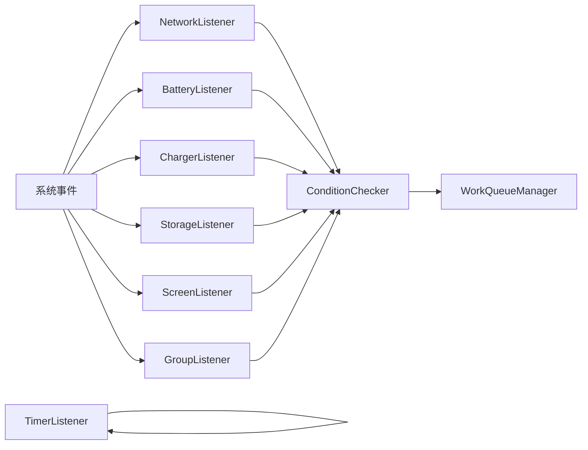
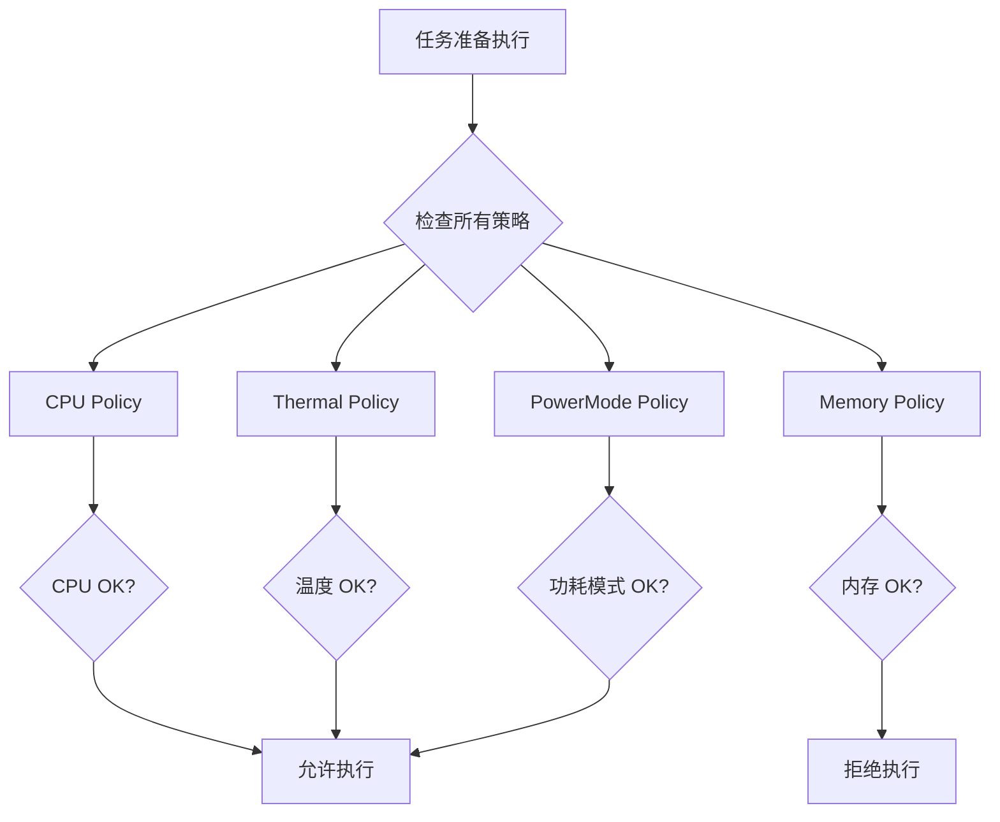
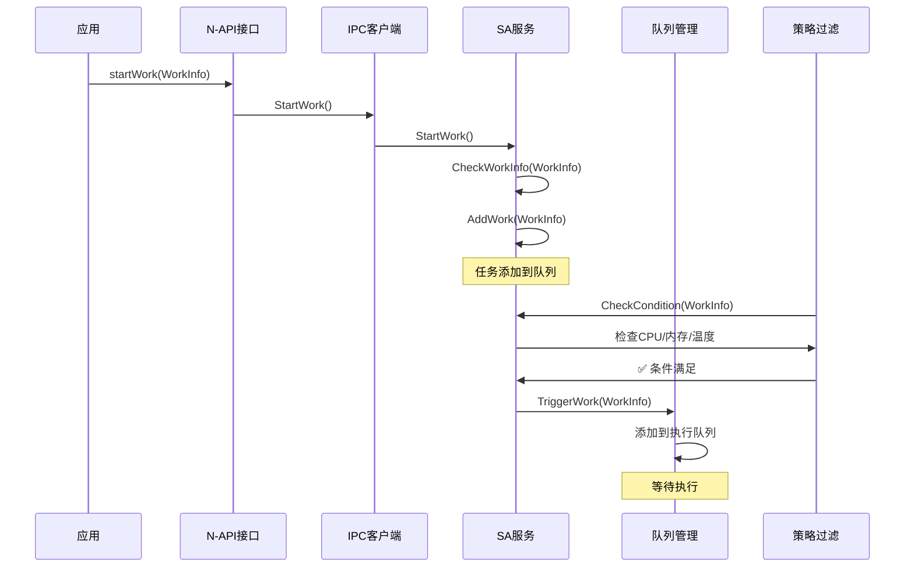
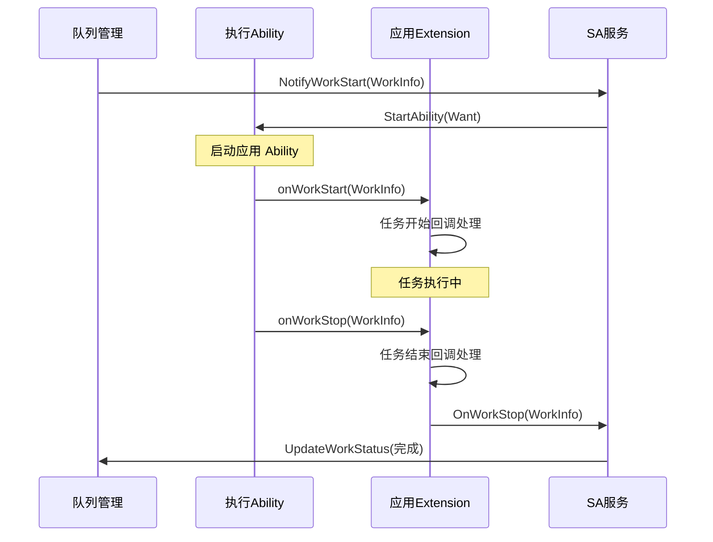
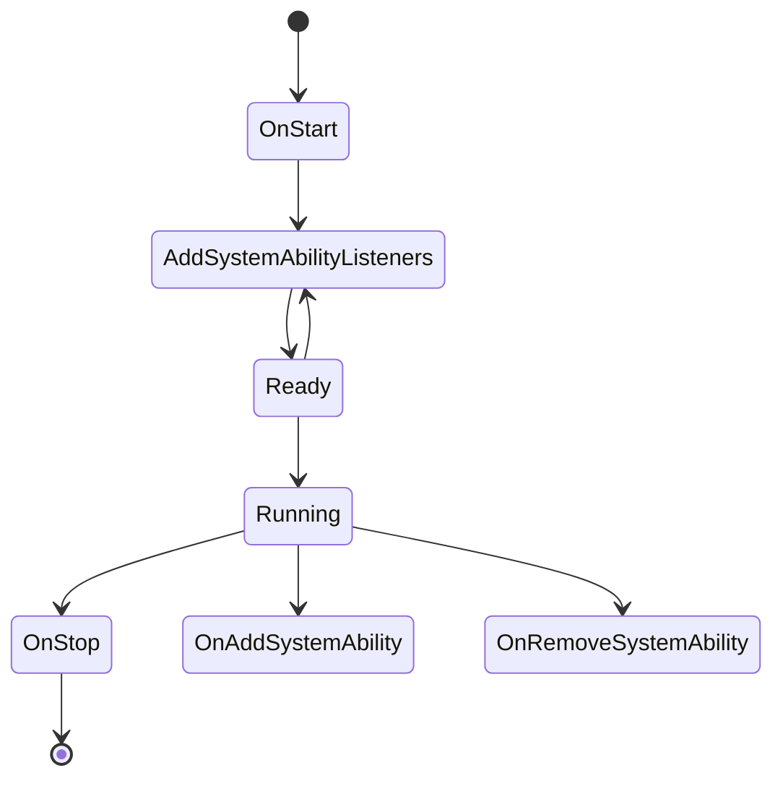

# Work Scheduler 模块架构说明

> **目的**: 详细说明 Work Scheduler 的架构设计、组件关系和数据流
> **适用范围**: 系统架构师、模块开发者、集成者

---

## 架构概览

### 分层架构

```
┌─────────────────────────────────────────────────────────────┐
│               应用层（第三方应用）                     │
│  ┌────────────────────────────────────────┐            │
│  │ JS/ArkTS/Cangjie/N-API 接口       │            │
│  │  - resourceschedule.workScheduler        │            │
│  │  - WorkSchedulerExtensionAbility        │            │
│  └───────────┬────────────────────┘            │
│              ↓ 调用                                │
│  ┌────────────────────────────────────────┐            │
│  │ Frameworks 层（客户端 SDK）              │            │
│  │  - WorkSchedulerSrvClient          │            │
│  │  - WorkInfo 封装                  │            │
│  └───────────┬────────────────────┘            │
│              ↓ IPC (HIDL/ZIDL)                  │
│  ┌────────────────────────────────────────┐            │
│  │ Services 层（System Ability 1904）     │            │
│  │  ┌────────────────────────────┐           │            │
│  │  │ 条件监听器              │           │
│  │  │ - 网络/电池/屏幕/存储     │           │
│  │  │ 定时器                 │           │
│  │  └────────────────────────────┘           │
│  │  ┌────────────────────────────┐           │
│  │  │ 策略过滤器              │           │
│  │  │ - CPU/内存/温度/功耗     │           │
│  │  └────────────────────────────┘           │
│  │  ┌────────────────────────────┐           │
│  │  │ 队列管理器              │           │
│  │  │ - 任务队列              │           │
│  │  │ - 执行状态管理          │           │
│  │  └────────────────────────────┘           │
│  │  ┌────────────────────────────┐           │
│  │  │ 连接管理器              │           │
│  │  │ - Extension 回调          │           │
│  │  └────────────────────────────┘           │
│  └────────────────────────────────────┘            │
│              ↓ 系统服务调用                        │
│  ┌────────────────────────────────────────┐            │
│  │ Ability Runtime               │            │
│  │ Bundle Manager              │            │
│  │ Common Event Service        │            │
│  │ IPC/SAMGR                   │            │
│  └────────────────────────────────────┘            │
└─────────────────────────────────────────────────────┘
```

---

## 核心组件

### 1. 条件监听器子系统

**职责**: 监听系统状态变化，通知 WorkScheduler 条件是否满足

**组件列表**:
```
Conditions (条件监听器)
├── NetworkListener (网络类型)
├── BatteryLevelListener (电池电量)
├── BatteryStatusListener (电池状态)
├── ChargerListener (充电类型)
├── StorageListener (存储状态)
├── ScreenListener (屏幕状态)
├── TimerListener (定时器)
└── GroupListener (应用分组)
```

**事件流**:


---

### 2. 策略过滤器子系统

**职责**: 根据系统资源状态决定是否执行任务

**组件列表**:
```
Policies (策略过滤器)
├── CpuPolicy (CPU 使用率)
├── MemoryPolicy (内存占用)
├── ThermalPolicy (温度)
└── PowerModePolicy (功耗模式)
```

**决策流程**:


---

### 3. 队列管理子系统

**职责**: 管理所有任务的队列、状态和执行

**组件关系**:
```
WorkQueueManager
├── WorkQueue (单 UID 任务队列)
│   ├── WorkInfo 列表
│   ├── 状态管理
│   └── 条件监听
├── WorkStatus (任务状态跟踪)
│   ├── 开始时间
│   ├── 结束时间
│   ├── 超时标志
│   └── 执行时长
└── Watchdog (超时保护)
    └── 120 秒超时
```

**队列状态转换**:
```
待调度 → 条件满足 → 队列中 → 执行中 → 已完成/已取消/超时
```

---

### 4. 连接管理子系统

**职责**: 管理与应用 Extension 的 IPC 回调连接

**组件**:
```
WorkSchedulerConnection
├── WorkSchedulerStubImp (服务端 Stub)
│   └── 实现 IWorkScheduler 接口
└── Extension 连接管理
    ├── 连接建立
    ├── 断开检测
    └── 死亡通知
```

---

## 数据流

### 任务注册数据流



### 任务执行数据流



---

## 线程模型

### 服务端线程池

**基于 FFRT (Fiber-based Runtime)**:

```
WorkSchedulerService
├── EventRunner (FFRT 事件循环)
│   └── 主事件循环
├── WorkEventHandler (FFRT Handler)
│   └── 处理任务调度事件
└── WorkQueueEventHandler (FFRT Handler)
    └── 处理队列管理事件
```

**线程职责**:
- **EventRunner**: 主线程，管理 FFRT 事件循环
- **WorkEventHandler**: 异步处理任务相关事件（添加/移除）
- **WorkQueueEventHandler**: 异步处理队列事件（触发/停止）

### N-API 线程模型

**应用进程中的 N-API**:

```
应用进程
├── JS 主线程
│   └── 执行应用代码
└── N-API 线程池
    └── 执行异步任务（如 getWorkStatus）
```

**异步任务处理**:
```cpp
// interfaces/kits/js/napi/src/get_work_status.cpp:100
napi_create_async_work(env, resourceName,
    // Executor 线程
    [](napi_env env, void *data) {
        // 执行同步操作
        AsyncCallbackInfoGetWorkStatus *asyncCallbackInfo = ...
    },
    // Complete 线程
    [](napi_env env, napi_status status, void *data) {
        // 回调 JS
    },
    data
);
```

---

## 关键接口定义

### IWorkSchedService (服务接口)

**定义位置**: `frameworks/IWorkSchedService.idl`

**方法列表**:
```idl
interface OHOS.WorkScheduler.IWorkSchedService {
    // 任务管理
    void StartWork([in] WorkInfo workInfo);
    void StartWorkForInner([in] WorkInfo workInfo);
    void StopWork([in] WorkInfo workInfo);
    void StopWorkForInner([in] WorkInfo workInfo, [in] boolean needCancel);
    void StopAndCancelWork([in] WorkInfo workInfo);
    void StopAndClearWorks();

    // 查询接口
    void IsLastWorkTimeout([in] int workId, [out] boolean isTimeout);
    void ObtainAllWorks([out] List<WorkInfo> workInfos);
    void GetWorkStatus([in] int workId, [out] WorkInfo workInfo);
    void GetAllRunningWorks([out] List<WorkInfo> workInfos);

    // 内部接口
    void ObtainWorksByUidAndWorkIdForInner([in] int uid, [out] List<WorkInfo> workInfos, [in] int workId);
    void PauseRunningWorks([in] int uid);
    void ResumePausedWorks([in] int uid);
    void SetWorkSchedulerConfig([in] String configData, [in] int sourceType);
    void StopWorkForSA([in] int saId);
}
```

**证据**: `frameworks/IWorkSchedService.idl:16-33`

---

### IWorkScheduler (Extension 回调接口)

**定义位置**: `services/zidl/IWorkScheduler.idl`

**方法列表**:
```idl
interface OHOS.WorkScheduler.IWorkScheduler {
    void OnWorkStart([in] WorkInfo workInfo);
    void OnWorkStop([in] WorkInfo workInfo);
}
```

**用途**: 服务端通过此接口通知应用 Extension 任务状态

**证据**: `services/zidl/IWorkScheduler.idl:17-20`

---

## 生命周期管理

### SA 生命周期



**关键方法**:
- `OnStart()`: 初始化 EventRunner 和 Handler
- `OnAddSystemAbility()`: 依赖 SA 启动时回调
- `OnRemoveSystemAbility()`: 依赖 SA 停止时回调
- `OnStop()`: 清理资源

### 任务生命周期

```
注册 → 队列中 → 条件满足 → 执行中 → 已完成
                     ↓              ↓            ↓
                   暂停        已取消      超时
```

---

## 依赖方向

### 模块依赖图

```
应用层
    ↓ depends
Frameworks 层
    ↓ depends (IPC)
Services 层
    ↓ depends (系统服务)
Utils 层
    ↓ provides to
Frameworks/Services
```

### 接口稳定性

| 层 | 接口类型 | 稳定性 |
|-----|----------|--------|
| N-API | JS 接口 | 🟢 稳定 |
| IDL | HIDL/ZIDL 接口 | 🟢 稳定 |
| 内部 API | C++ 头文件 | 🟡 中等 |

**不稳定接口说明**:
- N-API 接口在主版本中保持稳定
- JS/TS 接口可能有版本变化
- 内部 C++ API 可能在重构时变化

---

## 性能设计

### 并发控制

| 组件 | 并发模型 | 说明 |
|--------|----------|------|
| **任务执行** | 单 Ability 串行 | 防止资源竞争 |
| **条件检查** | 异步触发 | 使用 EventRunner 事件驱动 |
| **队列管理** | 线程安全 | 使用 FFRT Handler 处理 |

### 资源优化

| 优化策略 | 实现方式 |
|----------|---------|
| **条件缓存** | 条件监听器缓存最新状态 |
| **策略短路** | 优先级检查策略（CPU/温度） |
| **队列限制** | 限制最大任务数量 |
| **对象池** | 重用 WorkInfo 对象 |
| **智能指针** | 自动管理内存 |

---

## 相关跳转

- [02_Directory.md](02_Directory.md) - 目录结构与职责
- [04_External_API.md](04_External_API.md) - 对外 API 文档
- [appendix/Callgraphs.md](appendix/Callgraphs.md) - 关键调用链
- [05_Internal_API.md](05_Internal_API.md) - 内部 API 说明

---

**证据索引**:

| 结论 | 证据 |
|------|------|
| 分层架构 | 目录树 + README |
| 条件监听器 | `services/native/include/conditions/` |
| 策略过滤器 | `services/native/include/policy/` |
| 队列管理 | `services/native/include/work_queue_manager.h` |
| 连接管理 | `services/native/include/work_scheduler_connection.h` |
| IDL 接口 | `frameworks/IWorkSchedService.idl`, `services/zidl/IWorkScheduler.idl` |
| SA 生命周期 | `services/native/src/work_scheduler_service.cpp:138-440` |
