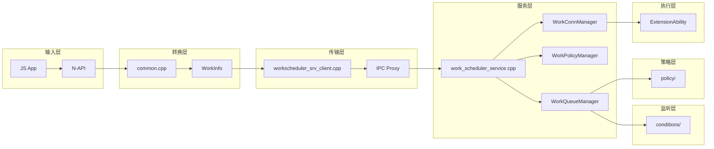

# 目录结构与代码地图

**本文档提供 Work Scheduler 代码库的导航指南，帮助快速定位关键代码位置。**

---

## 目录

- [顶层目录结构](#顶层目录结构)
- [Services 目录详解](#services-目录详解)
- [Frameworks 目录详解](#frameworks-目录详解)
- [Interfaces 目录详解](#interfaces-目录详解)
- [代码导航图](#代码导航图)
- [关键文件速查](#关键文件速查)

---

## 顶层目录结构

```
foundation/resourceschedule/work_scheduler/
│
├── BUILD.gn                          # 根构建文件
├── bundle.json                       # 组件清单
├── README.md / README_ZH.md          # 项目说明
├── hisysevent.yaml                   # 事件日志配置
├── workscheduler.gni                 # 构建变量定义
│
├── frameworks/                       # 框架层（客户端SDK）
│   ├── BUILD.gn
│   ├── IWorkSchedService.idl         # IPC接口定义
│   ├── include/                      # 公共头文件
│   ├── src/                          # 框架实现
│   └── extension/                    # ExtensionAbility支持
│
├── interfaces/                       # 接口层（多语言绑定）
│   └── kits/
│       ├── js/                       # N-API（JavaScript）
│       ├── cj/                       # CJ-FFI（Cangjie）
│       └── ets/                      # Taihe（ArkTS）
│
├── services/                         # 服务层（System Ability）
│   ├── BUILD.gn
│   ├── native/                       # 核心服务实现
│   │   ├── include/                  # 头文件
│   │   └── src/                      # 源文件
│   └── zidl/                         # Extension回调IPC
│
├── utils/                            # 工具库
│   └── native/
│       ├── include/                  # 工具头文件
│       └── src/                      # 工具实现
│
├── sa_profile/                       # SA配置文件
│   ├── BUILD.gn
│   └── 1904.json                     # SA 1904注册信息
│
└── wiki/                             # 本文档库
    ├── README.md
    ├── 01_Overview.md
    ├── 02_Architecture.md
    ├── 03_CodeMap.md
    ├── 04_Interface.md
    ├── 05_AttackSurface.md
    ├── 06_SecurityReview.md
    └── _work/                        # 工作文档
```

---

## Services 目录详解

### 核心服务实现 (`services/native/`)

```
services/native/
├── include/
│   ├── work_scheduler_service.h          # [核心] 主服务类定义
│   ├── work_event_handler.h              # 事件处理器
│   ├── work_queue_manager.h              # 任务队列管理器
│   ├── work_policy_manager.h             # 策略管理器
│   ├── work_conn_manager.h               # 连接管理器
│   ├── work_queue.h                      # 任务队列
│   ├── work_status.h                     # 任务状态
│   ├── work_sched_data_manager.h         # 数据持久化
│   ├── watchdog.h                        # 看门狗（超时保护）
│   │
│   ├── conditions/                       # 条件监听器
│   │   ├── icondition_listener.h         # 监听器接口
│   │   ├── condition_checker.h           # 条件检查器
│   │   ├── network_listener.h            # 网络监听
│   │   ├── battery_level_listener.h      # 电量监听
│   │   ├── battery_status_listener.h     # 电池状态监听
│   │   ├── charger_listener.h            # 充电监听
│   │   ├── storage_listener.h            # 存储监听
│   │   ├── screen_listener.h             # 屏幕监听
│   │   ├── timer_listener.h              # 定时器监听
│   │   └── group_listener.h              # 应用分组监听
│   │
│   └── policy/                           # 策略过滤器
│       ├── ipolicy_listener.h            # 策略监听器接口
│       ├── ipolicy_filter.h              # 过滤器接口
│       ├── cpu_policy.h                  # CPU策略
│       ├── memory_policy.h               # 内存策略
│       ├── thermal_policy.h              # 热策略
│       └── power_mode_policy.h           # 电源模式策略
│
└── src/
    ├── work_scheduler_service.cpp        # [核心] 服务实现 (~1800行)
    ├── work_event_handler.cpp
    ├── work_queue_manager.cpp
    ├── work_policy_manager.cpp
    ├── work_conn_manager.cpp
    ├── work_queue.cpp
    ├── work_status.cpp
    ├── work_sched_data_manager.cpp
    ├── work_scheduler_connection.cpp
    ├── watchdog.cpp
    │
    ├── conditions/                       # 监听器实现
    │   ├── condition_checker.cpp
    │   ├── network_listener.cpp
    │   ├── battery_level_listener.cpp
    │   ├── battery_status_listener.cpp
    │   ├── charger_listener.cpp
    │   ├── storage_listener.cpp
    │   ├── screen_listener.cpp
    │   ├── timer_listener.cpp
    │   └── group_listener.cpp
    │
    └── policy/                           # 策略实现
        ├── cpu_policy.cpp
        ├── memory_policy.cpp
        ├── thermal_policy.cpp
        └── power_mode_policy.cpp
```

### Extension回调IPC (`services/zidl/`)

```
services/zidl/
├── IWorkScheduler.idl                    # Extension回调接口定义
├── include/
│   ├── work_scheduler_stub_imp.h         # Stub实现头
│   └── work_scheduler_stub_ani.h         # ANI Stub头
└── src/
    ├── work_scheduler_stub_imp.cpp       # Stub实现
    └── work_scheduler_stub_ani.cpp       # ANI Stub实现
```

---

## Frameworks 目录详解

```
frameworks/
├── BUILD.gn
├── IWorkSchedService.idl                 # [核心] IPC服务接口定义
│
├── include/                              # 公共头文件
│   ├── work_info.h                       # [核心] WorkInfo数据类
│   ├── work_condition.h                  # 条件类型定义
│   └── workscheduler_srv_client.h        # [核心] 客户端API
│
├── src/                                  # 框架实现
│   ├── work_info.cpp                     # WorkInfo序列化实现
│   └── workscheduler_srv_client.cpp      # [核心] 客户端实现
│
└── extension/                            # ExtensionAbility框架
    ├── BUILD.gn
    ├── include/
    │   ├── work_scheduler_extension.h
    │   ├── work_scheduler_extension_context.h
    │   ├── js_work_scheduler_extension.h
    │   └── js_work_scheduler_extension_context.h
    └── src/
        ├── work_scheduler_extension.cpp
        ├── work_scheduler_extension_context.cpp
        ├── js_work_scheduler_extension.cpp
        └── js_work_scheduler_extension_context.cpp
```

---

## Interfaces 目录详解

### JavaScript N-API (`interfaces/kits/js/`)

```
interfaces/kits/js/
├── BUILD.gn
│
└── napi/
    ├── include/                          # N-API头文件
    │   ├── init.h                        # [核心] 模块初始化
    │   ├── common.h                      # 公共函数
    │   ├── work_condition.h              # 条件类型转换
    │   ├── start_work.h
    │   ├── stop_work.h
    │   ├── get_work_status.h
    │   ├── obtain_all_works.h
    │   ├── stop_and_clear_works.h
    │   ├── is_last_work_time_out.h
    │   └── common_want.h
    │
    ├── src/                              # N-API实现
    │   ├── init.cpp                      # [核心] N-API注册（6个API）
    │   ├── common.cpp                    # [核心] WorkInfo转换
    │   ├── start_work.cpp                # startWork实现
    │   ├── stop_work.cpp                 # stopWork实现
    │   ├── get_work_status.cpp           # getWorkStatus实现
    │   ├── obtain_all_works.cpp          # obtainAllWorks实现
    │   ├── stop_and_clear_works.cpp      # stopAndClearWorks实现
    │   ├── is_last_work_time_out.cpp     # isLastWorkTimeOut实现
    │   └── common_want.cpp               # Want参数处理
    │
    ├── work_scheduler_extension/         # Extension N-API
    │   └── work_scheduler_extension_ability_module.cpp
    │
    └── work_scheduler_extension_context/ # Extension Context N-API
        └── work_scheduler_extension_context_module.cpp
```

### Cangjie FFI (`interfaces/kits/cj/`)

```
interfaces/kits/cj/
├── BUILD.gn
└── work_scheduler/
    └── work_scheduler_ffi.cpp            # CJ FFI实现（10个函数）
```

### ArkTS Taihe (`interfaces/kits/ets/`)

```
interfaces/kits/ets/taihe/
├── work_scheduler/
│   ├── BUILD.gn
│   ├── idl/
│   ├── include/
│   └── src/
│
└── work_scheduler_extension/
    ├── BUILD.gn
    ├── ets/application/
    └── src/
```

---

## 代码导航图

### 功能 → 文件映射

| 功能 | 入口文件 | 核心实现 | 辅助文件 |
|------|----------|----------|----------|
| **任务启动** | `interfaces/kits/js/napi/src/start_work.cpp` | `services/native/src/work_scheduler_service.cpp:StartWork` | `work_queue_manager.cpp`, `work_policy_manager.cpp` |
| **任务停止** | `interfaces/kits/js/napi/src/stop_work.cpp` | `services/native/src/work_scheduler_service.cpp:StopWork` | `work_conn_manager.cpp` |
| **状态查询** | `interfaces/kits/js/napi/src/get_work_status.cpp` | `services/native/src/work_scheduler_service.cpp:GetWorkStatus` | `work_status.cpp` |
| **条件触发** | `services/native/src/conditions/*_listener.cpp` | `services/native/src/work_queue_manager.cpp:OnConditionReady` | `conditions/condition_checker.cpp` |
| **策略过滤** | `services/native/src/policy/*_policy.cpp` | `services/native/src/work_policy_manager.cpp` | - |
| **任务执行** | `services/native/src/work_scheduler_connection.cpp` | `frameworks/extension/src/js_work_scheduler_extension.cpp` | `watchdog.cpp` |
| **持久化** | `services/native/src/work_scheduler_service.cpp:InitPersistedWork` | `services/native/src/work_sched_data_manager.cpp` | - |
| **配置加载** | `services/native/src/work_scheduler_service.cpp:LoadExemptionBundlesFromFile` | `services/native/src/work_sched_config.cpp` | - |

### 数据流 → 文件映射



---

## 关键文件速查

### 按角色分类

#### 新人入门必读

| 文件 | 说明 | 阅读顺序 |
|------|------|----------|
| `README.md` | 项目整体说明 | 1 |
| `frameworks/include/work_info.h` | WorkInfo 数据结构 | 2 |
| `interfaces/kits/js/napi/src/init.cpp` | N-API 入口 | 3 |
| `services/native/include/work_scheduler_service.h` | 服务接口定义 | 4 |

#### 架构设计必读

| 文件 | 说明 | 关键内容 |
|------|------|----------|
| `frameworks/IWorkSchedService.idl` | IPC接口定义 | 16个服务方法 |
| `services/native/include/work_queue_manager.h` | 队列管理 | 条件注册、任务调度 |
| `services/native/include/work_policy_manager.h` | 策略管理 | 频率限制、资源管控 |
| `services/native/include/conditions/*.h` | 条件监听 | 8种条件类型 |
| `services/native/include/policy/*.h` | 策略过滤 | 4种策略类型 |

#### 安全分析必读

| 文件 | 说明 | 关注重点 |
|------|------|----------|
| `interfaces/kits/js/napi/src/common.cpp` | 参数验证 | 输入校验逻辑 |
| `services/native/src/work_scheduler_service.cpp` | 服务实现 | 权限检查、输入验证 |
| `utils/native/src/work_sched_utils.cpp` | 工具函数 | 路径验证、权限辅助 |

### 按行号定位

#### 大文件关键位置

**services/native/src/work_scheduler_service.cpp** (~1800行)

| 功能 | 行号 | 函数名 |
|------|------|--------|
| 服务启动 | ~100-150 | OnStart() |
| 任务启动 | ~250-350 | StartWork(), StartWorkInner() |
| 任务停止 | ~400-500 | StopWork() |
| 状态查询 | ~550-650 | GetWorkStatus() |
| 输入验证 | ~700-800 | CheckWorkInfo() |
| 权限检查 | ~1000-1100 | AllowDump(), CheckProcessName() |
| 持久化加载 | ~1300-1400 | InitPersistedWork(), ReadPersistedWorks() |
| 配置加载 | ~1400-1500 | LoadExemptionBundlesFromFile() |
| IPC超时 | ~1740 | OnRemoteRequest timeout |
| Token检查 | ~1760 | CheckCallingToken() |

**frameworks/src/work_info.cpp** (~800行)

| 功能 | 行号 |
|------|------|
| 序列化 | ~200-300 |
| 反序列化 | ~300-400 |
| JSON解析 | ~550-650 |
| Parcel读写 | ~700-800 |

### 符号索引

#### 核心类

| 类名 | 头文件 | 实现文件 | 职责 |
|------|--------|----------|------|
| `WorkSchedulerService` | `services/native/include/work_scheduler_service.h` | `services/native/src/work_scheduler_service.cpp` | 主服务 |
| `WorkSchedulerSrvClient` | `frameworks/include/workscheduler_srv_client.h` | `frameworks/src/workscheduler_srv_client.cpp` | 客户端 |
| `WorkInfo` | `frameworks/include/work_info.h` | `frameworks/src/work_info.cpp` | 任务数据 |
| `WorkQueueManager` | `services/native/include/work_queue_manager.h` | `services/native/src/work_queue_manager.cpp` | 队列管理 |
| `WorkPolicyManager` | `services/native/include/work_policy_manager.h` | `services/native/src/work_policy_manager.cpp` | 策略管理 |
| `WorkStatus` | `services/native/include/work_status.h` | `services/native/src/work_status.cpp` | 状态管理 |

#### 核心函数

| 函数 | 位置 | 说明 |
|------|------|------|
| `InitApi()` | `interfaces/kits/js/napi/src/init.cpp:41` | N-API初始化 |
| `StartWork()` | `interfaces/kits/js/napi/src/start_work.cpp:27` | 启动任务入口 |
| `StartWork()` | `services/native/src/work_scheduler_service.cpp:67` | 服务实现 |
| `CheckWorkInfo()` | `services/native/src/work_scheduler_service.cpp:708` | 参数验证 |
| `OnConditionReady()` | `services/native/src/work_queue_manager.cpp` | 条件触发处理 |

---

**文档版本**: 1.0  
**更新日期**: 2026-02-07  
**统计信息**: 约160个源文件，总代码量约2万行
