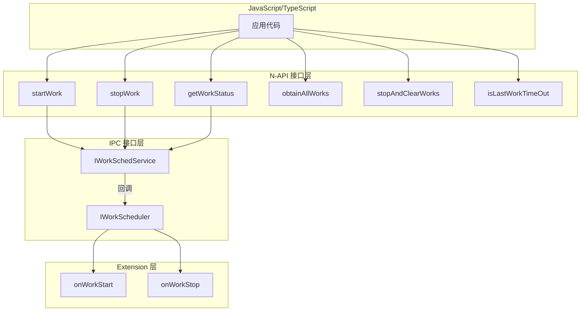

# 对外接口文档

**本文档详细说明 Work Scheduler 提供的所有对外接口，包括 N-API、IPC 和 Extension API。**

---

## 目录

- [接口总览](#接口总览)
- [N-API 接口](#napi-接口)
- [IPC 接口](#ipc-接口)
- [Extension API](#extension-api)
- [数据类型定义](#数据类型定义)
- [错误码](#错误码)

---

## 接口总览



---

## N-API 接口

**模块路径**: `@ohos.resourceschedule.workScheduler`  
**系统能力**: `SystemCapability.ResourceSchedule.WorkScheduler`  
**源码位置**: `interfaces/kits/js/napi/src/`

### 1. startWork

启动一个延迟任务。

**函数签名**:
```typescript
function startWork(work: WorkInfo): void;
```

**参数**:
| 参数 | 类型 | 必填 | 说明 |
|------|------|------|------|
| work | [WorkInfo](#workinfo) | 是 | 任务配置信息 |

**代码位置** (`interfaces/kits/js/napi/src/init.cpp:44`):
```cpp
DECLARE_NAPI_FUNCTION("startWork", StartWork)
```

**实现入口** (`interfaces/kits/js/napi/src/start_work.cpp:27`):
```cpp
napi_value StartWork(napi_env env, napi_callback_info info)
{
    // 参数解析
    size_t argc = START_WORK_PARAMS;
    napi_value argv[START_WORK_PARAMS] = {nullptr};
    napi_get_cb_info(env, info, &argc, argv, nullptr, nullptr);
    
    // 类型检查
    if (!MatchValueType(env, argv[0], napi_object)) {
        return ThrowError(env, PARAM_ERROR, "Invalid parameter type");
    }
    
    // 转换为 WorkInfo
    WorkInfo workInfo;
    UnwrapWorkInfo(env, argv[0], workInfo);
    
    // 调用客户端
    auto ret = WorkSchedulerSrvClient::GetInstance().StartWork(workInfo);
    return WrapVoid(env, ret);
}
```

**使用示例**:
```typescript
import { workScheduler } from '@ohos.resourceschedule.workScheduler';

const workInfo: workScheduler.WorkInfo = {
    workId: 1,
    bundleName: 'com.example.myapp',
    abilityName: 'MyWorkSchedulerExtensionAbility',
    networkType: workScheduler.NetworkType.NETWORK_TYPE_WIFI,
    isCharging: true
};

try {
    workScheduler.startWork(workInfo);
} catch (error) {
    console.error(`启动失败: ${error.code}, ${error.message}`);
}
```

**约束条件**:
- `workId` ≥ 0
- `bundleName` 必须与调用者一致
- 至少设置一个触发条件
- 循环任务间隔 ≥ 20分钟

---

### 2. stopWork

停止指定的延迟任务。

**函数签名**:
```typescript
function stopWork(work: WorkInfo, needCancel?: boolean): void;
```

**参数**:
| 参数 | 类型 | 必填 | 说明 |
|------|------|------|------|
| work | [WorkInfo](#workinfo) | 是 | 任务配置信息 |
| needCancel | boolean | 否 | 是否取消正在执行的任务，默认 false |

**代码位置** (`interfaces/kits/js/napi/src/init.cpp:45`):
```cpp
DECLARE_NAPI_FUNCTION("stopWork", StopWork)
```

**实现入口** (`interfaces/kits/js/napi/src/stop_work.cpp:28`):
```cpp
napi_value StopWork(napi_env env, napi_callback_info info)
{
    // 解析 WorkInfo 和 needCancel 参数
    // 调用 WorkSchedulerSrvClient::GetInstance().StopWork()
}
```

**使用示例**:
```typescript
// 停止任务（不中断正在执行的）
workScheduler.stopWork(workInfo, false);

// 停止任务（强制中断）
workScheduler.stopWork(workInfo, true);
```

---

### 3. getWorkStatus

获取指定任务的状态信息。

**函数签名**:
```typescript
function getWorkStatus(workId: number, callback: AsyncCallback<WorkInfo>): void;
function getWorkStatus(workId: number): Promise<WorkInfo>;
```

**参数**:
| 参数 | 类型 | 必填 | 说明 |
|------|------|------|------|
| workId | number | 是 | 任务ID |
| callback | AsyncCallback<WorkInfo> | 否 | 回调函数 |

**返回值**:
| 类型 | 说明 |
|------|------|
| Promise<WorkInfo> | 任务状态信息 |

**代码位置** (`interfaces/kits/js/napi/src/init.cpp:46`):
```cpp
DECLARE_NAPI_FUNCTION("getWorkStatus", GetWorkStatus)
```

**实现入口** (`interfaces/kits/js/napi/src/get_work_status.cpp:72`):
```cpp
napi_value GetWorkStatus(napi_env env, napi_callback_info info)
{
    // 解析 workId 参数
    int32_t workId;
    napi_get_value_int32(env, argv[0], &workId);
    
    // 异步调用获取状态
    // 返回 WorkInfo 对象
}
```

**使用示例**:
```typescript
// Promise 方式
const workStatus = await workScheduler.getWorkStatus(1);
console.log(`任务状态: ${JSON.stringify(workStatus)}`);

// Callback 方式
workScheduler.getWorkStatus(1, (err, status) => {
    if (err) {
        console.error(`获取失败: ${err.message}`);
        return;
    }
    console.log(`任务状态: ${JSON.stringify(status)}`);
});
```

---

### 4. obtainAllWorks

获取当前应用注册的所有延迟任务。

**函数签名**:
```typescript
function obtainAllWorks(callback: AsyncCallback<Array<WorkInfo>>): void;
function obtainAllWorks(): Promise<Array<WorkInfo>>;
```

**返回值**:
| 类型 | 说明 |
|------|------|
| Promise<Array<WorkInfo>> | 任务列表 |

**代码位置** (`interfaces/kits/js/napi/src/init.cpp:47`):
```cpp
DECLARE_NAPI_FUNCTION("obtainAllWorks", ObtainAllWorks)
```

**使用示例**:
```typescript
const allWorks = await workScheduler.obtainAllWorks();
console.log(`共有 ${allWorks.length} 个任务`);
allWorks.forEach(work => {
    console.log(`任务ID: ${work.workId}`);
});
```

---

### 5. stopAndClearWorks

停止并清除当前应用的所有延迟任务。

**函数签名**:
```typescript
function stopAndClearWorks(): void;
```

**代码位置** (`interfaces/kits/js/napi/src/init.cpp:48`):
```cpp
DECLARE_NAPI_FUNCTION("stopAndClearWorks", StopAndClearWorks)
```

**实现入口** (`interfaces/kits/js/napi/src/stop_and_clear_works.cpp:23`):
```cpp
napi_value StopAndClearWorks(napi_env env, napi_callback_info info)
{
    auto ret = WorkSchedulerSrvClient::GetInstance().StopAndClearWorks();
    return WrapVoid(env, ret);
}
```

**使用示例**:
```typescript
workScheduler.stopAndClearWorks();
console.log('所有任务已清除');
```

---

### 6. isLastWorkTimeOut

检查上次任务执行是否超时（仅针对循环任务）。

**函数签名**:
```typescript
function isLastWorkTimeOut(workId: number, callback: AsyncCallback<boolean>): void;
function isLastWorkTimeOut(workId: number): Promise<boolean>;
```

**参数**:
| 参数 | 类型 | 必填 | 说明 |
|------|------|------|------|
| workId | number | 是 | 任务ID |

**返回值**:
| 类型 | 说明 |
|------|------|
| Promise<boolean> | true=上次执行超时，false=未超时 |

**代码位置** (`interfaces/kits/js/napi/src/init.cpp:49`):
```cpp
DECLARE_NAPI_FUNCTION("isLastWorkTimeOut", IsLastWorkTimeOut)
```

**使用示例**:
```typescript
const isTimeout = await workScheduler.isLastWorkTimeOut(1);
if (isTimeout) {
    console.log('上次任务执行超时');
}
```

---

## IPC 接口

### IWorkSchedService

**接口定义** (`frameworks/IWorkSchedService.idl:17-33`):
```idl
sequenceable work_info..OHOS.WorkScheduler.WorkInfo;

interface OHOS.WorkScheduler.IWorkSchedService {
    void StartWork([in] WorkInfo workInfo);
    void StartWorkForInner([in] WorkInfo workInfo);
    void StopWork([in] WorkInfo workInfo);
    void StopWorkForInner([in] WorkInfo workInfo, [in] boolean needCancel);
    void StopAndCancelWork([in] WorkInfo workInfo);
    void StopAndClearWorks();
    void IsLastWorkTimeout([in] int workId, [out] boolean isTimeout);
    void ObtainAllWorks([out] List<WorkInfo> workInfos);
    void ObtainWorksByUidAndWorkIdForInner([in] int uid, [out] List<WorkInfo> workInfos, [in] int workId);
    void GetWorkStatus([in] int workId, [out] WorkInfo workInfo);
    void GetAllRunningWorks([out] List<WorkInfo> workInfos);
    void PauseRunningWorks([in] int uid);
    void ResumePausedWorks([in] int uid);
    void SetWorkSchedulerConfig([in] String configData, [in] int sourceType);
    void StopWorkForSA([in] int saId);
}
```

**方法说明**:

| 方法 | 权限 | 说明 |
|------|------|------|
| StartWork | 普通应用 | 启动延迟任务 |
| StartWorkForInner | 系统应用 | 内部接口 |
| StopWork | 普通应用 | 停止延迟任务 |
| StopWorkForInner | 系统应用 | 内部接口 |
| StopAndCancelWork | 普通应用 | 停止并取消任务 |
| StopAndClearWorks | 普通应用 | 清除所有任务 |
| IsLastWorkTimeout | 普通应用 | 查询上次是否超时 |
| ObtainAllWorks | 普通应用 | 获取所有任务 |
| ObtainWorksByUidAndWorkIdForInner | 特权 | 按UID查询（内部） |
| GetWorkStatus | 普通应用 | 获取任务状态 |
| GetAllRunningWorks | 特权 | 获取运行中任务 |
| PauseRunningWorks | 白名单 | 暂停任务 |
| ResumePausedWorks | 白名单 | 恢复任务 |
| SetWorkSchedulerConfig | 特权 | 设置配置 |
| StopWorkForSA | Native/Shell | 停止SA任务 |

---

### IWorkScheduler

**接口定义** (`services/zidl/IWorkScheduler.idl:17-20`):
```idl
sequenceable work_info..OHOS.WorkScheduler.WorkInfo;

interface OHOS.WorkScheduler.IWorkScheduler {
    void OnWorkStart([in] WorkInfo workInfo);
    void OnWorkStop([in] WorkInfo workInfo);
}
```

**说明**: 服务端回调客户端 Extension 的接口。

---

## Extension API

### WorkSchedulerExtensionAbility

**基类**: `WorkSchedulerExtensionAbility`  
**模块**: `@kit.BackgroundTasksKit`

#### onWorkStart

任务开始执行时回调。

**函数签名**:
```typescript
onWorkStart(work: WorkInfo): void;
```

**参数**:
| 参数 | 类型 | 说明 |
|------|------|------|
| work | WorkInfo | 任务信息 |

**实现位置** (`frameworks/extension/src/js_work_scheduler_extension.cpp`):
```cpp
void JSWorkSchedulerExtension::OnWorkStart(const WorkInfo& workInfo)
{
    // 调用 JS 端的 onWorkStart
    CallJsMethod("onWorkStart", workInfo);
}
```

**使用示例**:
```typescript
import { WorkSchedulerExtensionAbility, workScheduler } from '@kit.BackgroundTasksKit';

export default class MyWorkSchedulerExtensionAbility extends WorkSchedulerExtensionAbility {
    onWorkStart(work: workScheduler.WorkInfo): void {
        console.log(`任务 ${work.workId} 开始执行`);
        // 执行后台任务逻辑
    }
}
```

#### onWorkStop

任务停止时回调（完成或超时）。

**函数签名**:
```typescript
onWorkStop(work: WorkInfo): void;
```

**使用示例**:
```typescript
onWorkStop(work: workScheduler.WorkInfo): void {
    console.log(`任务 ${work.workId} 停止`);
    // 清理资源
}
```

---

## 数据类型定义

### WorkInfo

**定义** (`frameworks/include/work_info.h:33-418`):

```typescript
interface WorkInfo {
    // 必填字段
    workId: number;                    // 任务ID (≥0)
    bundleName: string;                // 应用包名
    abilityName: string;               // Extension Ability 名
    
    // 条件字段（至少设置一个）
    networkType?: NetworkType;         // 网络类型条件
    isCharging?: boolean;              // 是否充电条件
    chargerType?: ChargingType;        // 充电类型条件
    batteryLevel?: number;             // 电量条件 (0-100)
    batteryStatus?: BatteryStatus;     // 电池状态条件
    storageRequest?: StorageRequest;   // 存储状态条件
    isDeepIdle?: boolean;              // 待机条件
    
    // 循环任务字段
    isRepeat?: boolean;                // 是否循环
    repeatCycleTime?: number;          // 循环间隔 (ms, ≥20min)
    repeatCount?: number;              // 循环次数
    
    // 其他字段
    isPersisted?: boolean;             // 是否持久化
    idleWaitTime?: number;             // 待机等待时间
    parameters?: {                     // 自定义参数
        [key: string]: number | string | boolean;
    };
    earliestStartTime?: number;        // 最早开始时间 (API 22+)
}
```

### NetworkType

**定义** (`interfaces/kits/js/napi/src/init.cpp:64-102`):

```typescript
enum NetworkType {
    NETWORK_TYPE_ANY = 0,           // 任意网络
    NETWORK_TYPE_MOBILE = 1,        // 移动网络
    NETWORK_TYPE_WIFI = 2,          // WiFi
    NETWORK_TYPE_BLUETOOTH = 3,     // 蓝牙
    NETWORK_TYPE_WIFI_P2P = 4,      // WiFi P2P
    NETWORK_TYPE_ETHERNET = 5       // 以太网
}
```

### ChargingType

**定义** (`interfaces/kits/js/napi/src/init.cpp:119-148`):

```typescript
enum ChargingType {
    CHARGING_PLUGGED_ANY = 0,       // 任意充电
    CHARGING_PLUGGED_AC = 1,        // 交流充电
    CHARGING_PLUGGED_USB = 2,       // USB充电
    CHARGING_PLUGGED_WIRELESS = 3   // 无线充电
}
```

### BatteryStatus

**定义** (`interfaces/kits/js/napi/src/init.cpp:166-191`):

```typescript
enum BatteryStatus {
    BATTERY_STATUS_LOW = 0,             // 电量低
    BATTERY_STATUS_OKAY = 1,            // 电量正常
    BATTERY_STATUS_LOW_OR_OKAY = 2      // 电量低或正常
}
```

### StorageRequest

**定义** (`interfaces/kits/js/napi/src/init.cpp:208-233`):

```typescript
enum StorageRequest {
    STORAGE_LEVEL_LOW = 0,              // 存储空间不足
    STORAGE_LEVEL_OKAY = 1,             // 存储空间正常
    STORAGE_LEVEL_LOW_OR_OKAY = 2       // 存储空间不足或正常
}
```

---

## 错误码

### N-API 错误码

| 错误码 | 值 | 说明 | 触发场景 |
|--------|-----|------|----------|
| 401 | - | 参数错误 | 参数类型/范围/格式错误 |
| 9700001 | 9700001 | 内存操作失败 | 内存分配失败 |
| 9700002 | 9700002 | Parcel操作失败 | IPC序列化失败 |
| 9700003 | 9700003 | 系统服务操作失败 | 服务调用失败 |
| 9700004 | 9700004 | WorkInfo检查失败 | 参数校验失败 |
| 9700005 | 9700005 | StartWork失败 | 任务启动失败 |

### IPC 错误码

**定义** (`frameworks/include/iwork_sched_service.h`):

```cpp
enum ErrCode {
    ERR_OK = 0,
    ERR_INVALID_VALUE = 401,
    ERR_WORK_INFO_INVALID = 9700004,
    ERR_START_WORK_FAILED = 9700005,
    // ...
};
```

### 错误处理示例

```typescript
import { workScheduler } from '@ohos.resourceschedule.workScheduler';
import { BusinessError } from '@ohos.base';

try {
    workScheduler.startWork(workInfo);
} catch (error) {
    const err = error as BusinessError;
    switch (err.code) {
        case 401:
            console.error('参数错误，请检查WorkInfo');
            break;
        case 9700004:
            console.error('WorkInfo校验失败');
            break;
        case 9700005:
            console.error('启动任务失败，可能已达到频率限制');
            break;
        default:
            console.error(`未知错误: ${err.code}, ${err.message}`);
    }
}
```

---

**文档版本**: 1.0  
**更新日期**: 2026-02-07  
**API 版本**: API 9+
