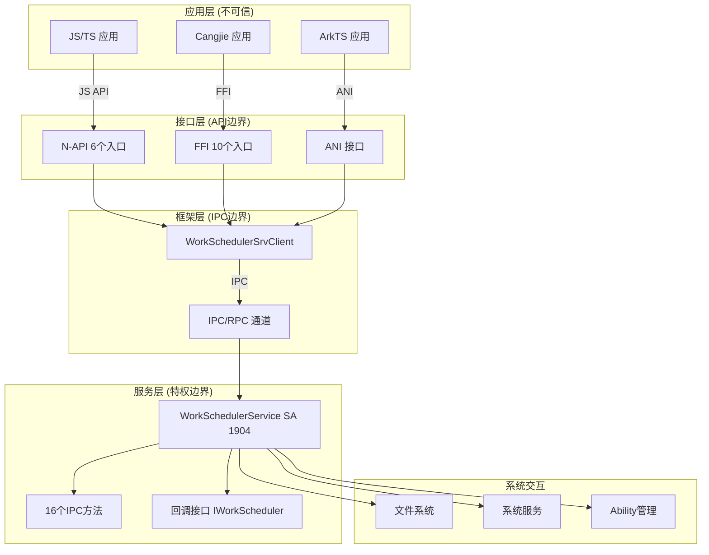
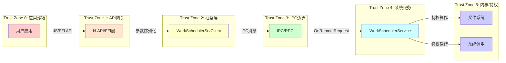

# 攻击面分析

**本文档识别和分析 Work Scheduler 模块的所有外部攻击面，包括输入入口、敏感操作和信任边界。**

---

## 目录

- [攻击面总览](#攻击面总览)
- [外部输入清单](#外部输入清单)
- [敏感操作清单](#敏感操作清单)
- [信任边界图](#信任边界图)
- [各攻击面详细分析](#各攻击面详细分析)
- [缓解措施总结](#缓解措施总结)

---

## 攻击面总览



---

## 外部输入清单

### 1. N-API 接口输入 (6个入口)

| 函数 | 文件位置 | 输入参数 | 风险等级 |
|------|----------|----------|----------|
| **StartWork** | `interfaces/kits/js/napi/src/start_work.cpp:27` | WorkInfo 对象 | 🔴 高 |
| **StopWork** | `interfaces/kits/js/napi/src/stop_work.cpp:28` | WorkInfo 对象 | 🟡 中 |
| **GetWorkStatus** | `interfaces/kits/js/napi/src/get_work_status.cpp:72` | workId (number) | 🟢 低 |
| **ObtainAllWorks** | `interfaces/kits/js/napi/src/obtain_all_works.cpp:59` | 无 | 🟢 低 |
| **StopAndClearWorks** | `interfaces/kits/js/napi/src/stop_and_clear_works.cpp:23` | 无 | 🟡 中 |
| **IsLastWorkTimeOut** | `interfaces/kits/js/napi/src/is_last_work_time_out.cpp:105` | workId (number) | 🟢 低 |

**入口点代码** (`interfaces/kits/js/napi/src/init.cpp:44-50`):
```cpp
napi_property_descriptor desc[] = {
    DECLARE_NAPI_FUNCTION("startWork", StartWork),
    DECLARE_NAPI_FUNCTION("stopWork", StopWork),
    DECLARE_NAPI_FUNCTION("getWorkStatus", GetWorkStatus),
    DECLARE_NAPI_FUNCTION("obtainAllWorks", ObtainAllWorks),
    DECLARE_NAPI_FUNCTION("stopAndClearWorks", StopAndClearWorks),
    DECLARE_NAPI_FUNCTION("isLastWorkTimeOut", IsLastWorkTimeOut),
};
```

### 2. FFI 接口输入 (10个入口)

| 函数 | 文件位置 | 风险等级 |
|------|----------|----------|
| **CJ_StartWork** | `interfaces/kits/cj/work_scheduler/work_scheduler_ffi.cpp:90` | 🔴 高 |
| **CJ_StopWork** | `interfaces/kits/cj/work_scheduler/work_scheduler_ffi.cpp:102` | 🟡 中 |
| **CJ_GetWorkStatus** | `interfaces/kits/cj/work_scheduler/work_scheduler_ffi.cpp:119` | 🟢 低 |
| **CJ_ObtainAllWorks** | `interfaces/kits/cj/work_scheduler/work_scheduler_ffi.cpp:132` | 🟢 低 |
| **CJ_IsLastWorkTimeOut** | `interfaces/kits/cj/work_scheduler/work_scheduler_ffi.cpp:160` | 🟢 低 |
| **CJ_StopAndClearWorks** | `interfaces/kits/cj/work_scheduler/work_scheduler_ffi.cpp:165` | 🟡 中 |
| **CJ_StartWorkV2** | `interfaces/kits/cj/work_scheduler/work_scheduler_ffi.cpp:170` | 🔴 高 |
| **CJ_StopWorkV2** | `interfaces/kits/cj/work_scheduler/work_scheduler_ffi.cpp:182` | 🟡 中 |
| **CJ_GetWorkStatusV2** | `interfaces/kits/cj/work_scheduler/work_scheduler_ffi.cpp:199` | 🟢 低 |
| **CJ_ObtainAllWorksV2** | `interfaces/kits/cj/work_scheduler/work_scheduler_ffi.cpp:216` | 🟢 低 |

### 3. IPC 接口输入 (16个方法)

**主要服务接口** (`frameworks/IWorkSchedService.idl:17-33`):
```idl
interface OHOS.WorkScheduler.IWorkSchedService {
    void StartWork([in] WorkInfo workInfo);                    // 🔴 高
    void StartWorkForInner([in] WorkInfo workInfo);           // 🔴 高 (内部)
    void StopWork([in] WorkInfo workInfo);                    // 🟡 中
    void StopWorkForInner([in] WorkInfo workInfo, [in] boolean needCancel);  // 🟡 中
    void StopAndCancelWork([in] WorkInfo workInfo);           // 🟡 中
    void StopAndClearWorks();                                 // 🟡 中
    void IsLastWorkTimeout([in] int workId, [out] boolean isTimeout);  // 🟢 低
    void ObtainAllWorks([out] List<WorkInfo> workInfos);      // 🟢 低
    void ObtainWorksByUidAndWorkIdForInner(...);              // 🟢 低 (内部)
    void GetWorkStatus([in] int workId, [out] WorkInfo workInfo);  // 🟢 低
    void GetAllRunningWorks([out] List<WorkInfo> workInfos);  // 🟢 低
    void PauseRunningWorks([in] int uid);                     // 🟡 中 (特权)
    void ResumePausedWorks([in] int uid);                     // 🟡 中 (特权)
    void SetWorkSchedulerConfig([in] String configData, [in] int sourceType);  // 🔴 高 (配置)
    void StopWorkForSA([in] int saId);                        // 🟡 中
}
```

**回调接口** (`services/zidl/IWorkScheduler.idl:17-20`):
```idl
interface OHOS.WorkScheduler.IWorkScheduler {
    void OnWorkStart([in] WorkInfo workInfo);   // 服务端→客户端回调
    void OnWorkStop([in] WorkInfo workInfo);    // 服务端→客户端回调
}
```

### 4. 文件系统输入

| 文件路径 | 操作 | 风险等级 | 代码位置 |
|----------|------|----------|----------|
| `/data/service/el1/public/WorkScheduler/persisted_work` | 读写 | 🟡 中 | `services/native/src/work_scheduler_service.cpp:1329` |
| `/data/service/el1/public/WorkScheduler/preinstalled_works.json` | 读 | 🟢 低 | `services/native/src/work_scheduler_service.cpp:428` |
| `/data/service/el1/public/WorkScheduler/exemption_bundles.json` | 读 | 🟢 低 | `services/native/src/work_scheduler_service.cpp:LoadExemptionBundlesFromFile` |
| `/proc/meminfo` | 读 | 🟢 低 | `services/native/src/policy/memory_policy.cpp:53` |

### 5. 配置输入

| 配置类型 | 来源 | 风险等级 | 说明 |
|----------|------|----------|------|
| **JSON配置文件** | 文件系统 | 🟡 中 | `SetWorkSchedulerConfig` 接收JSON字符串 |
| **Feature Flags** | 编译期 | 🟢 低 | `work_scheduler_device_enable` 等 |
| **SA Profile** | 系统配置 | 🟢 低 | `sa_profile/1904.json` |

---

## 敏感操作清单

### 1. 权限相关操作

| 操作 | 代码位置 | 权限检查 | 风险 |
|------|----------|----------|------|
| **Dump接口访问** | `services/native/src/work_scheduler_service.cpp:1016` | `ohos.permission.DUMP` | 信息泄露 |
| **Pause/Resume任务** | `services/native/src/work_scheduler_service.cpp:1514` | 进程名白名单检查 | 权限绕过 |
| **SA任务停止** | `services/native/src/work_scheduler_service.cpp:1769` | Token类型检查 | 未授权访问 |
| **配置修改** | `services/native/src/work_scheduler_service.cpp:SetWorkSchedulerConfig` | 调用者身份检查 | 配置篡改 |

**进程名白名单** (`services/native/src/work_scheduler_service.cpp:1514`):
```cpp
// WORK_SCHED_NATIVE_OPERATE_CALLER
- "resource_schedule_service"
- "hidumper_service"

// WORK_SCHED_SA_CALLER
- "push_manager_service"
```

### 2. Ability 启动操作

| 操作 | 代码位置 | 风险 |
|------|----------|------|
| **启动ExtensionAbility** | `services/native/src/work_scheduler_service.cpp:LoadSa` | 恶意Ability注入 |
| **连接Ability** | `services/native/src/work_scheduler_connection.cpp` | 连接劫持 |
| **创建回调连接** | `services/native/src/work_conn_manager.cpp` | 资源耗尽 |

### 3. 系统服务调用

| 被调用服务 | 用途 | 风险 |
|------------|------|------|
| **AbilityManager** | 启动/停止Ability | 滥用启动能力 |
| **BackgroundTaskMgr** | 订阅后台任务事件 | 事件伪装 |
| **DeviceStandby** | 待机状态监听 | 状态欺骗 |
| **BatteryManager** | 电池状态获取 | 信息收集 |
| **BundleFramework** | 包信息查询 | 信息泄露 |
| **DataShare** | 数据持久化 | 数据篡改 |

### 4. 资源管理操作

| 操作 | 代码位置 | 风险 |
|------|----------|------|
| **创建定时器** | `services/native/src/conditions/timer_listener.cpp` | 定时器耗尽 |
| **创建线程** | `services/native/src/work_event_handler.cpp` | 线程耗尽 |
| **内存分配** | `utils/native/src/work_sched_dump.cpp` | 内存耗尽 |
| **队列操作** | `services/native/src/work_queue.cpp` | 队列溢出 |

---

## 信任边界图



### 边界穿越点

| 穿越点 | 边界 | 验证机制 | 失败处理 |
|--------|------|----------|----------|
| **N-API入口** | TZ0→TZ1 | 参数类型检查、范围检查 | 返回错误码 |
| **IPC调用** | TZ2→TZ4 | UID验证、Token验证 | 拒绝调用 |
| **Ability启动** | TZ4→外部 | BundleName白名单 | 拒绝启动 |
| **文件访问** | TZ4→TZ5 | 路径规范化、权限检查 | 访问拒绝 |

---

## 各攻击面详细分析

### A1: WorkInfo 参数注入

**攻击向量**: 通过 `StartWork` 接口传递恶意构造的 WorkInfo

**关键字段**:
```cpp
// frameworks/include/work_info.h:391-409
struct WorkInfo {
    int32_t workId_;           // 需验证 >= 0
    std::string bundleName_;   // 需匹配调用者
    std::string abilityName_;  // 需非空
    std::map<...> conditionMap_;  // 条件类型验证
    AAFwk::WantParams extras_; // 自定义参数，JSON解析
    // ...
}
```

**验证链**:
1. **N-API层**: `common.cpp:63` workId >= 0 检查
2. **N-API层**: `common.cpp:71-76` bundleName/abilityName 非空检查
3. **服务层**: `work_scheduler_service.cpp:CheckWorkInfo` bundleName匹配UID
4. **服务层**: `CheckCondition` 条件类型合法性检查

**潜在风险**:
- `extras` 参数通过 JSON 传递，可能存在解析漏洞
- `parameters` 支持任意 key-value，可能导致内存占用过大

### A2: IPC 接口越权访问

**攻击向量**: 伪造 IPC 消息调用特权接口

**受保护接口**:
```cpp
// services/native/include/work_scheduler_service.h
int32_t PauseRunningWorks(int32_t uid);      // 需白名单
int32_t ResumePausedWorks(int32_t uid);      // 需白名单
int32_t SetWorkSchedulerConfig(...);         // 需特权
int32_t StopWorkForSA(int32_t saId);         // 需检查
```

**保护机制**:
```cpp
// services/native/src/work_scheduler_service.cpp:1514
bool CheckProcessName() {
    // 检查调用进程名是否在白名单
    // resource_schedule_service, hidumper_service
}

// services/native/src/work_scheduler_service.cpp:1769
bool CheckCallingToken() {
    // 检查 Token 类型为 NATIVE 或 SHELL
}
```

### A3: 配置文件注入

**攻击向量**: 通过配置文件加载恶意数据

**受影响文件**:
- `persisted_work` - 任务持久化数据
- `preinstalled_works.json` - 预置任务
- `exemption_bundles.json` - 豁免应用名单

**JSON解析代码** (`services/native/src/work_scheduler_service.cpp:430`):
```cpp
nlohmann::json::parse(data, nullptr, false);  // 禁用异常，使用discard检查
if (root.is_discarded()) {
    // 解析失败处理
}
```

**风险**: 如果解析器存在漏洞，可能导致拒绝服务或内存损坏。

### A4: 资源耗尽攻击

**攻击向量**: 创建大量任务、定时器或连接

**限制机制**:
- 任务数量: 每个UID有上限（代码中检查）
- 执行频率: 应用分组限制（2h-48h）
- 超时: 单次任务120秒

**潜在风险**:
- 多个UID协同攻击可能耗尽系统资源
- 持久化任务重启后全部恢复，可能导致启动延迟

---

## 缓解措施总结

| 攻击面 | 已有缓解措施 | 建议加强 |
|--------|--------------|----------|
| **WorkInfo注入** | 参数类型/范围检查、bundleName验证 | 深度JSON校验、参数大小限制 |
| **IPC越权** | 进程名白名单、Token类型检查 | 能力级(Capability)细粒度控制 |
| **配置注入** | 严格JSON解析、路径规范化 | Schema验证、签名检查 |
| **资源耗尽** | UID级配额、频率限制 | 全局资源池监控、异常检测 |
| **信息泄露** | UID隔离、权限检查 | 审计日志、敏感数据脱敏 |

---

**文档版本**: 1.0  
**更新日期**: 2026-02-07  
**分析依据**: 代码静态分析、IPC接口定义、安全模式搜索
