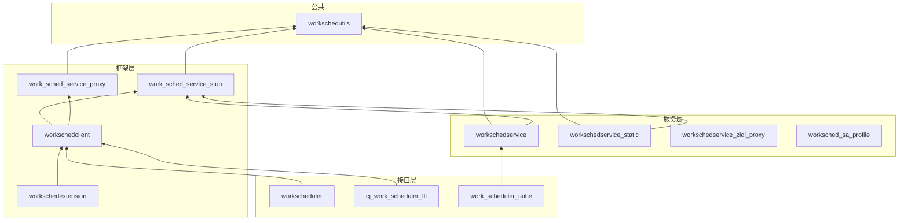

# 构建与产物

**本文档说明 Work Scheduler 的构建配置、GN 目标和编译产物。**

---

## 目录

- [构建总览](#构建总览)
- [GN 目标清单](#gn-目标清单)
- [编译产物](#编译产物)
- [Feature 开关](#feature-开关)
- [构建命令](#构建命令)

---

## 构建总览

### 构建系统

Work Scheduler 使用 OpenHarmony 标准构建系统：

```
GN (Generate Ninja) → Ninja → 编译产物
```

### 构建配置文件

| 文件 | 用途 |
|------|------|
| `BUILD.gn` | 根构建文件，定义三个构建组 |
| `workscheduler.gni` | 构建变量定义 |
| `bundle.json` | 组件清单和依赖声明 |
| `*/BUILD.gn` | 子模块构建配置 |

### 构建变量 (`workscheduler.gni`)

```gn
# 路径变量
worksched_root_path = "//foundation/resourceschedule/work_scheduler"
worksched_frameworks_path = "//foundation/resourceschedule/work_scheduler/frameworks"
worksched_interfaces_path = "//foundation/resourceschedule/work_scheduler/interfaces/kits"
worksched_service_path = "//foundation/resourceschedule/work_scheduler/services"
worksched_taihe_path = "//foundation/resourceschedule/work_scheduler/interfaces/kits/ets/taihe"
worksched_test_path = "//foundation/resourceschedule/work_scheduler/test"
```

---

## GN 目标清单

### 根目标 (`BUILD.gn`)

```gn
group("fwk_group_work_scheduler_all") {
  # 框架层构建组
  deps = [
    "${worksched_frameworks_path}:workschedclient",
    "${worksched_frameworks_path}/extension:workschedextension",
    "${worksched_interfaces_path}/cj:cj_work_scheduler_ffi",
    "${worksched_taihe_path}/work_scheduler:work_scheduler_taihe",
    "${worksched_taihe_path}/work_scheduler_extension:workschedulerextension_ani",
    "${worksched_interfaces_path}/js:workscheduler",
    "${worksched_interfaces_path}/js/napi/work_scheduler_extension:workschedulerextensionability_napi",
    "${worksched_interfaces_path}/js/napi/work_scheduler_extension_context:workschedulerextensioncontext_napi",
  ]
}

group("service_group_work_scheduler_all") {
  # 服务层构建组
  deps = [
    "${worksched_root_path}/sa_profile:worksched_sa_profile",
    "${worksched_service_path}:workschedservice",
  ]
}

group("test_work_scheduler_all") {
  # 测试构建组
  deps = [
    "${worksched_frameworks_path}/test/unittest:workinfotest",
    "${worksched_interfaces_path}/test/unittest/work_scheduler_jsunittest:js_unittest",
    "${worksched_service_path}/test:unittest",
    "${worksched_test_path}/fuzztest:fuzztest",
  ]
}
```

### 详细目标列表

| 目标名 | 类型 | 路径 | 说明 |
|--------|------|------|------|
| **workschedclient** | shared_library | `frameworks/BUILD.gn` | 客户端 SDK |
| **workschedextension** | shared_library | `frameworks/extension/BUILD.gn` | Extension 框架 |
| **work_sched_service_proxy** | source_set | `frameworks/BUILD.gn` | IPC Proxy |
| **work_sched_service_stub** | source_set | `frameworks/BUILD.gn` | IPC Stub |
| **workscheduler** | shared_library | `interfaces/kits/js/BUILD.gn` | N-API 模块 |
| **cj_work_scheduler_ffi** | shared_library | `interfaces/kits/cj/BUILD.gn` | Cangjie FFI |
| **work_scheduler_taihe** | shared_library | `interfaces/kits/ets/taihe/work_scheduler/BUILD.gn` | Taihe 绑定 |
| **workschedulerextension_ani** | shared_library | `interfaces/kits/ets/taihe/work_scheduler_extension/BUILD.gn` | Extension ANI |
| **workschedservice** | shared_library | `services/BUILD.gn` | 系统服务 |
| **workschedservice_static** | static_library | `services/BUILD.gn` | 静态库（测试用）|
| **workschedservice_zidl_proxy** | source_set | `services/zidl/BUILD.gn` | ZIDL Proxy |
| **worksched_sa_profile** | sa_profile | `sa_profile/BUILD.gn` | SA 配置文件 |
| **workschedutils** | static_library | `utils/native/BUILD.gn` | 工具库 |

### 目标依赖图



---

## 编译产物

### 产物清单

| 产物名 | 类型 | 安装路径 | 说明 |
|--------|------|----------|------|
| `libworkschedservice.z.so` | 共享库 | `/system/lib64/` | 主服务库 |
| `libworkscheduler.so` | 共享库 | `/system/lib64/` | N-API 模块 |
| `libworkschedclient.so` | 共享库 | `/system/lib64/` | 客户端库 |
| `libworkschedextension.so` | 共享库 | `/system/lib64/` | Extension 库 |
| `libcj_work_scheduler_ffi.so` | 共享库 | `/system/lib64/` | Cangjie FFI |
| `libwork_scheduler_taihe.so` | 共享库 | `/system/lib64/` | Taihe 绑定 |
| `libworkschedutils.a` | 静态库 | - | 工具库 |
| `worksched_sa_profile` | 配置文件 | `/system/profile/` | SA 1904 配置 |
| `persisted_work` | 数据文件 | `/data/service/el1/public/WorkScheduler/` | 持久化数据 |

### 产物详情

#### libworkschedservice.z.so

**源码**: `services/native/src/*.cpp`, `services/zidl/src/*.cpp`

**导出符号**:
```cpp
// 主要导出：SystemAbility 工厂函数
extern "C" void* CreateSystemAbility();

// IPC 接口
class IWorkSchedService {
    virtual int32_t StartWork(const WorkInfo& workInfo) = 0;
    virtual int32_t StopWork(const WorkInfo& workInfo) = 0;
    // ... 14个方法
};
```

**依赖**:
- `libipc_core.z.so`
- `libsafwk.z.so`
- `libhilog.z.so`
- `libffrt.so`
- `libeventhandler.z.so`

#### libworkscheduler.so

**源码**: `interfaces/kits/js/napi/src/*.cpp`

**N-API 模块注册** (`interfaces/kits/js/napi/src/init.cpp:254-258`):
```cpp
static napi_module g_apiModule = {
    .nm_version = 1,
    .nm_flags = 0,
    .nm_filename = nullptr,
    .nm_register_func = InitApi,
    .nm_modname = "resourceschedule.workScheduler",
    .nm_priv = nullptr,
    .reserved = { 0 }
};
```

**依赖**:
- `libworkschedclient.so`
- `libnapi.z.so`
- `libhilog.z.so`

#### libworkschedclient.so

**源码**: `frameworks/src/*.cpp`

**导出符号**:
```cpp
class WorkSchedulerSrvClient {
public:
    static WorkSchedulerSrvClient& GetInstance();
    ErrCode StartWork(WorkInfo& workInfo);
    ErrCode StopWork(WorkInfo& workInfo);
    // ...
};
```

---

## Feature 开关

### 编译期开关

| 开关名 | 默认值 | 说明 | 定义位置 |
|--------|--------|------|----------|
| `work_scheduler_device_enable` | true | 启用 Work Scheduler | `workscheduler.gni` |
| `DEVICE_USAGE_STATISTICS_ENABLE` | - | 启用应用分组统计 | 代码中 `#ifdef` |
| `DEVICE_STANDBY_ENABLE` | - | 启用待机状态监听 | 代码中 `#ifdef` |
| `RESOURCESCHEDULE_BGTASKMGR_ENABLE` | - | 启用后台任务管理 | 代码中 `#ifdef` |

### 运行时配置

| 配置项 | 默认值 | 说明 | 位置 |
|--------|--------|------|------|
| `minTimeCycle_` | 20 * 60 * 1000 (20分钟) | 最小循环间隔 | `work_scheduler_service.h:401` |
| `WATCHDOG_TIMEOUT` | 120000 (120秒) | 任务超时时间 | `watchdog.cpp` |

---

## 构建命令

### 完整构建

```bash
# 构建所有目标
gn gen out/default --args='target_os="ohos" target_cpu="arm64"'
ninja -C out/default foundation/resourceschedule/work_scheduler:all
```

### 分层构建

```bash
# 仅构建框架层
ninja -C out/default foundation/resourceschedule/work_scheduler:fwk_group_work_scheduler_all

# 仅构建服务层
ninja -C out/default foundation/resourceschedule/work_scheduler:service_group_work_scheduler_all

# 仅构建测试
ninja -C out/default foundation/resourceschedule/work_scheduler:test_work_scheduler_all
```

### 单独目标构建

```bash
# 构建 N-API 模块
ninja -C out/default foundation/resourceschedule/work_scheduler/interfaces/kits/js:workscheduler

# 构建服务
ninja -C out/default foundation/resourceschedule/work_scheduler/services:workschedservice

# 构建客户端
ninja -C out/default foundation/resourceschedule/work_scheduler/frameworks:workschedclient
```

### 查看所有目标

```bash
gn ls out/default//foundation/resourceschedule/work_scheduler
```

---

## 安装与部署

### 系统镜像

编译产物自动打包到系统镜像：

```
system.img
├── system/lib64/
│   ├── libworkschedservice.z.so
│   ├── libworkscheduler.so
│   └── ...
└── system/profile/
    └── 1904.json
```

### 运行时目录

```
/data/service/el1/public/WorkScheduler/
├── persisted_work              # 持久化任务数据
├── preinstalled_works.json     # 预置任务配置
└── exemption_bundles.json      # 豁免应用名单
```

---

**文档版本**: 1.0  
**更新日期**: 2026-02-07  
**构建系统**: GN + Ninja
