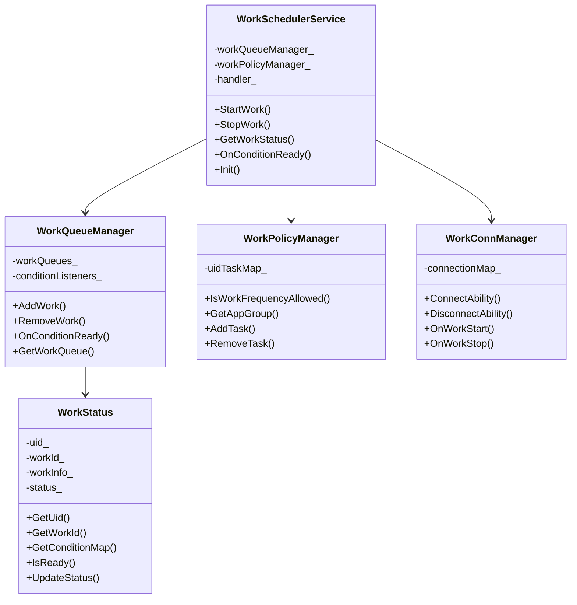
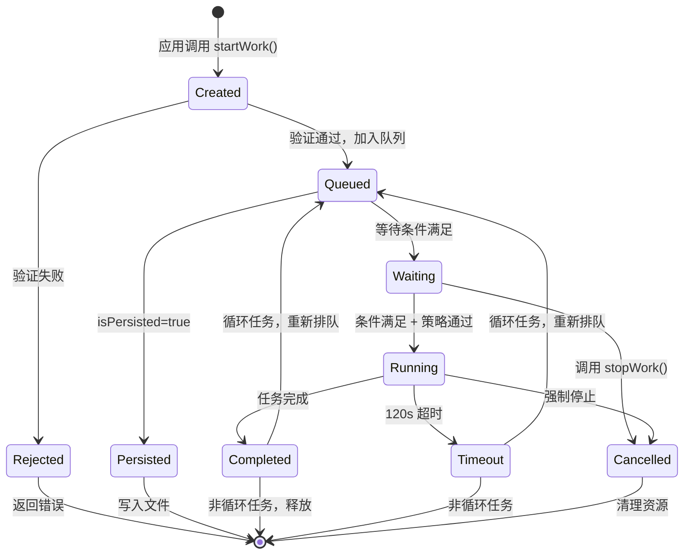

# 内部实现细节

**本文档深入说明 Work Scheduler 的核心类职责、内部 API 和资源生命周期管理。**

---

## 目录

- [核心类职责](#核心类职责)
- [内部 API 契约](#内部-api-契约)
- [资源生命周期](#资源生命周期)
- [关键算法](#关键算法)
- [性能考虑](#性能考虑)

---

## 核心类职责

### 服务层核心类



### 详细类说明

#### WorkSchedulerService

**文件**: `services/native/include/work_scheduler_service.h:45-411`

**职责**: 系统服务主类，协调所有组件

**关键方法**:
```cpp
// 生命周期
void OnStart() override;           // 服务启动
void OnStop() override;            // 服务停止
bool Init(const std::shared_ptr<AppExecFwk::EventRunner>& runner);

// 任务管理
int32_t StartWork(const WorkInfo& workInfo);
int32_t StopWork(const WorkInfo& workInfo);
int32_t GetWorkStatus(int32_t workId, WorkInfo& workInfo);

// 条件回调
void OnConditionReady(std::shared_ptr<std::vector<std::shared_ptr<WorkStatus>>> workStatusVector);

// 权限检查
bool CheckProcessName();
bool CheckCallingToken();
```

**内部状态**:
```cpp
std::shared_ptr<WorkQueueManager> workQueueManager_;      // 队列管理
std::shared_ptr<WorkPolicyManager> workPolicyManager_;    // 策略管理
std::shared_ptr<WorkEventHandler> handler_;               // 事件处理器
std::atomic<bool> ready_ {false};                         // 就绪标志
```

#### WorkQueueManager

**文件**: `services/native/include/work_queue_manager.h`

**职责**: 管理所有任务队列，处理条件变化

**核心逻辑**:
```cpp
class WorkQueueManager {
public:
    // 添加任务到对应条件的队列
    bool AddWork(const std::shared_ptr<WorkStatus>& workStatus) {
        auto conditionMap = workStatus->GetConditionMap();
        for (auto& [type, condition] : *conditionMap) {
            auto listener = GetListener(type);
            listener->AddWork(workStatus);
        }
    }
    
    // 条件满足时触发
    void OnConditionReady(WorkCondition::Type type, int32_t value) {
        auto works = GetReadyWorks(type, value);
        for (auto& work : works) {
            if (work->IsReady()) {
                TriggerWork(work);
            }
        }
    }
};
```

#### WorkPolicyManager

**文件**: `services/native/include/work_policy_manager.h`

**职责**: 应用频率限制和资源管控

**频率控制算法**:
```cpp
bool WorkPolicyManager::IsWorkFrequencyAllowed(
    const std::shared_ptr<WorkStatus>& workStatus) {
    
    int32_t uid = workStatus->GetUid();
    int32_t group = GetAppGroup(uid);
    
    // 根据分组获取最小间隔
    uint32_t minInterval = GetMinIntervalByGroup(group);
    
    // 检查上次执行时间
    auto lastTime = GetLastRunTime(uid, workStatus->GetWorkId());
    auto currentTime = GetCurrentTime();
    
    return (currentTime - lastTime) >= minInterval;
}
```

**应用分组**:
```cpp
enum AppGroup {
    ACTIVE_GROUP = 0,           // 活跃组 - 2小时
    DAILY_USED_GROUP = 1,       // 每日使用 - 4小时
    FIXED_GROUP = 2,            // 经常使用 - 24小时
    RARE_USED_GROUP = 3,        // 不经常使用 - 48小时
    RESTRICTED_GROUP = 4,       // 受限分组 - 禁止
    UNUSED_GROUP = 5,           // 未使用 - 禁止
    EXEMPT_GROUP = 10           // 豁免分组 - 无限制
};
```

---

## 内部 API 契约

### 稳定接口 (可依赖)

| 接口 | 位置 | 稳定性 | 说明 |
|------|------|--------|------|
| `WorkSchedulerSrvClient` | `frameworks/include/workscheduler_srv_client.h` | 高 | 客户端单例，接口稳定 |
| `WorkInfo` | `frameworks/include/work_info.h` | 高 | 数据结构稳定 |
| `IWorkSchedService` | `frameworks/IWorkSchedService.idl` | 高 | IPC接口定义 |
| `StartWork/StopWork` | 服务实现 | 高 | 核心API行为稳定 |

### 内部实现细节 (可能变化)

| 接口 | 位置 | 稳定性 | 说明 |
|------|------|--------|------|
| `WorkQueueManager` 内部实现 | `services/native/src/work_queue_manager.cpp` | 中 | 可能优化调度算法 |
| `WorkPolicyManager` 策略 | `services/native/src/work_policy_manager.cpp` | 中 | 可能调整分组策略 |
| 条件监听器实现 | `services/native/src/conditions/*.cpp` | 中 | 可能增加新条件 |
| 持久化格式 | `services/native/src/work_sched_data_manager.cpp` | 低 | JSON格式可能变化 |

### 不推荐直接使用的接口

| 接口 | 原因 | 替代方案 |
|------|------|----------|
| `WorkSchedulerService` 内部方法 | 仅服务内使用 | 通过 IPC 调用 |
| `WorkStatus` 内部状态 | 可能变化 | 使用公开 getter |
| 直接操作队列 | 破坏一致性 | 通过 Manager API |

---

## 资源生命周期

### 任务对象生命周期



### WorkInfo 所有权

```cpp
// N-API 层：临时对象，函数结束销毁
napi_value StartWork(napi_env env, napi_callback_info info) {
    WorkInfo workInfo;                    // 栈上临时对象
    UnwrapWorkInfo(env, argv[0], workInfo);
    client.StartWork(workInfo);           // 复制到 IPC
    return nullptr;
}

// 服务层：共享所有权，多组件引用
class WorkSchedulerService {
    void StartWork(const WorkInfo& workInfo) {
        auto workStatus = std::make_shared<WorkStatus>(workInfo);
        // workStatus 被多个组件共享
        workQueueManager_->AddWork(workStatus);
        persistedMap_[key] = workInfo;      // 额外副本
    }
};
```

### IPC 连接生命周期

```cpp
// WorkSchedulerSrvClient 管理连接
class WorkSchedulerSrvClient {
    sptr<IWorkSchedService> iWorkSchedService_;  // IPC代理
    sptr<IRemoteObject::DeathRecipient> deathRecipient_;
    
    ErrCode Connect() {
        // 获取服务代理
        iWorkSchedService_ = iface_cast<IWorkSchedService>(
            samgr->GetSystemAbility(WORK_SCHEDULE_SERVICE_ID));
        
        // 注册死亡通知
        deathRecipient_ = new WorkSchedulerDeathRecipient(*this);
        iWorkSchedService_->AsObject()->AddDeathRecipient(deathRecipient_);
    }
    
    void OnRemoteDied() {
        // 服务死亡，清理代理
        iWorkSchedService_ = nullptr;
    }
};
```

---

## 关键算法

### 1. 条件匹配算法

```cpp
// services/native/src/conditions/condition_checker.cpp
bool ConditionChecker::CheckCondition(
    const std::shared_ptr<WorkStatus>& workStatus,
    WorkCondition::Type type,
    int32_t value) {
    
    auto conditionMap = workStatus->GetConditionMap();
    auto it = conditionMap->find(type);
    if (it == conditionMap->end()) {
        return true;  // 该条件未设置，视为满足
    }
    
    auto condition = it->second;
    switch (type) {
        case WorkCondition::Type::NETWORK:
            return (value & condition->value) != 0;
        case WorkCondition::Type::BATTERY_LEVEL:
            return value >= condition->value;
        case WorkCondition::Type::BATTERY_STATUS:
        case WorkCondition::Type::STORAGE:
        case WorkCondition::Type::CHARGER:
            return value == condition->value;
        default:
            return false;
    }
}
```

### 2. 任务调度优先级

```cpp
// services/native/src/work_queue_manager.cpp
std::vector<std::shared_ptr<WorkStatus>> 
WorkQueueManager::GetReadyWorks(WorkCondition::Type type, int32_t value) {
    std::vector<std::shared_ptr<WorkStatus>> readyWorks;
    
    auto& queue = workQueues_[type];
    for (auto& work : queue) {
        if (work->CheckCondition(type, value)) {
            work->SetConditionReady(type);
            if (work->IsAllConditionsReady()) {
                readyWorks.push_back(work);
            }
        }
    }
    
    // 按优先级排序（系统应用优先）
    std::sort(readyWorks.begin(), readyWorks.end(),
        [](auto& a, auto& b) {
            return a->IsSystemApp() > b->IsSystemApp();
        });
    
    return readyWorks;
}
```

### 3. Watchdog 超时监控

```cpp
// services/native/src/watchdog.cpp
class Watchdog {
public:
    void StartWatchdog(const std::shared_ptr<WorkStatus>& workStatus) {
        auto timer = std::make_shared<TimerInfo>();
        timer->SetCallback([workStatus, this]() {
            this->OnTimeout(workStatus);
        });
        timer->SetTimeout(120000);  // 120秒
        
        timerManager_.RegisterTimer(timer);
        timers_[workStatus->GetUriKey()] = timer;
    }
    
    void OnTimeout(const std::shared_ptr<WorkStatus>& workStatus) {
        WS_HILOGE("Work timeout: %{public}s", workStatus->GetUriKey().c_str());
        
        // 通知服务超时
        service_->WatchdogTimeOut(workStatus);
        
        // 停止任务
        workStatus->SetStatus(WorkStatus::Status::TIMEOUT);
    }
};
```

---

## 性能考虑

### 内存使用

| 组件 | 内存占用 | 优化策略 |
|------|----------|----------|
| WorkStatus | ~500B/任务 | 延迟加载 extras |
| WorkQueue | 指针数组 | 使用 shared_ptr 避免复制 |
| 条件监听器 | 固定8个 | 单例模式 |
| 持久化数据 | 文件存储 | 按需加载 |

### 并发优化

```cpp
// 使用 FFRT 轻量级锁
ffrt::mutex mutex_;  // 代替 std::mutex

// 细粒度锁分离
ffrt::mutex whitelistMutex_;      // 白名单专用
ffrt::mutex deepIdleTimeMutex_;   // 深度空闲时间专用
ffrt::mutex specialMutex_;        // 特殊任务专用
```

### 延迟优化

| 操作 | 延迟目标 | 优化措施 |
|------|----------|----------|
| StartWork | < 10ms | 异步 IPC，快速返回 |
| 条件触发 | < 50ms | 批量处理，减少 IPC |
| 任务启动 | < 100ms | 预加载，连接池 |
| 状态查询 | < 5ms | 内存缓存 |

### 资源限制

```cpp
// 任务数量限制（代码中隐含）
const size_t MAX_WORKS_PER_UID = 10;        // 每UID最大任务数
const size_t MAX_PERSISTED_WORKS = 100;     // 最大持久化任务数

// 频率限制（显式配置）
uint32_t minTimeCycle_ = 20 * 60 * 1000;    // 最小循环间隔
```

---

**文档版本**: 1.0  
**更新日期**: 2026-02-07  
**适用范围**: 内部开发参考
