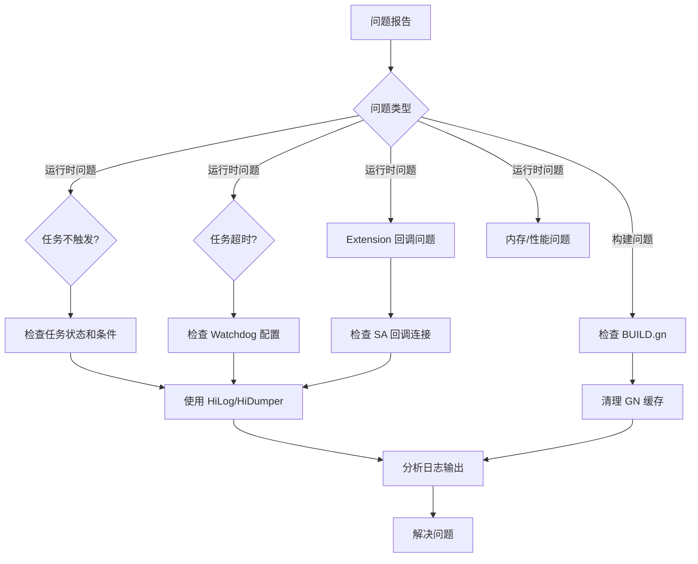

# 常见问题与定位路径

> **目的**: 提供 Work Scheduler 模块的常见问题解答和调试指南
> **适用范围**: 应用开发者、系统开发者、测试工程师

---

## 构建问题

### 问题 1: 编译错误 - 找不到头文件

**错误信息**:
```
fatal error: work_condition.h: No such file or directory
```

**原因**: 未正确配置 workscheduler.gni 中的路径变量

**解决方法**:
```bash
# 确认 gni 文件路径正确
cat foundation/resourceschedule/work_scheduler/workscheduler.gni

# 清理构建缓存
rm -rf out/[产品名]/

# 重新构建
./build.sh --product-name [产品名] --build-target sa
```

**证据**: `workscheduler.gni:22-38` (路径变量定义)

---

### 问题 2: SA 注册失败

**错误信息**:
```
E RegisterWorkSchedulerService: AddSystemAbility failed, saId = 1904
```

**原因**: sa_profile/1904.json 配置错误或 SA 冲突

**定位步骤**:
```bash
# 1. 检查 SA 配置文件
cat foundation/resourceschedule/work_scheduler/sa_profile/1904.json

# 2. 检查是否已存在 SA 1904
hdc shell hdc shell dump -l | grep 1904

# 3. 查看系统日志
hdc shell hdc shell "hilog -x WorkScheduler | grep SA"

# 4. 查看 SAMGR 日志
hdc shell hdc shell "hilog -x Foundation | grep SAMGR"
```

**常见原因**:
- SA 进程崩溃
- 依赖的服务未启动
- 配置文件格式错误

**证据**: `sa_profile/1904.json` + `services/native/src/work_scheduler_service.cpp:103`

---

### 问题 3: N-API 模块加载失败

**错误信息**:
```
Error: Unable to load module '@ohos.resourceschedule.workScheduler'
```

**原因**: N-API 库编译失败或依赖缺失

**定位步骤**:
```bash
# 1. 检查 N-API 库是否存在
hdc shell hdc shell "ls -l /system/module/resourceschedule/libworkscheduler.so"

# 2. 查看加载日志
hdc shell hdc shell "hilog -x WorkScheduler | grep Load"

# 3. 检查依赖库
hdc shell hdc shell "ldd /system/module/resourceschedule/libworkscheduler.so"

# 4. 验证模块注册
hdc shell hdc shell "cat /data/el2/public/module.json | grep workScheduler"
```

**证据**: `interfaces/kits/js/BUILD.gn:22-68`

---

### 问题 4: Feature Flag 未生效

**问题**: 修改 workscheduler.gni 中的 Feature Flag 后未生效

**原因**: GN 缓存未清理

**解决方法**:
```bash
# 清理 GN 缓存
rm -rf out/[产品名]/.gn/

# 指定产品名重新构建
./build.sh --product-name [产品名] --ccache

# 验证宏定义
grep -r "DEVICE_USAGE_STATISTICS_ENABLE" out/[产品名]
```

**证据**: `workscheduler.gni:42-91` (Feature Flags 定义)

---

## 运行时问题

### 问题 1: 任务不触发

**现象**: 应用调用 startWork() 后任务一直不执行

**定位步骤**:
```bash
# 1. 检查任务状态
hdc shell hdc shell "hilog -x WorkScheduler | grep 'workId = [你的ID]'"

# 2. 检查条件监听器状态
hdc shell hdc shell "hilog -x WorkScheduler | grep 'NetworkListener'"

# 3. 检查策略过滤器
hdc shell hdc shell "hilog -x WorkScheduler | grep 'PolicyFilter'"

# 4. 使用 dump 查看详细状态
hdc shell hdc shell "hidumper -s WorkScheduler"

# 5. 查看 HiSysEvent
hdc shell hdc shell "hilog -x WorkScheduler | grep 'WORK_SCHEDULER'"
```

**常见原因**:
- 条件设置不合理（如要求不可能的网络类型）
- 应用组配置导致被拒绝
- 系统资源紧张导致策略拒绝
- 条件监听器未正常工作

**证据**: `services/native/src/work_scheduler_service.cpp:661-678` (CheckWorkInfo)

---

### 问题 2: 任务频繁超时

**现象**: 任务执行后总是提示超时（120 秒）

**定位步骤**:
```bash
# 1. 检查任务执行时长
hdc shell hdc shell "hilog -x WorkScheduler | grep 'taskDuration'"

# 2. 检查 Watchdog 配置
hdc shell hdc shell "cat /system/profile/work_sched_config.json | grep watchdog"

# 3. 查看 Ability 启动日志
hdc shell hdc shell "hilog -x AbilityRuntime | grep 'WorkAbility'"

# 4. 查看系统负载
hdc shell hdc shell "top -n 1"
```

**常见原因**:
- Watchdog 超时时长配置过短
- 任务执行时间确实超过 120 秒
- Ability 进程卡死
- 系统资源竞争导致执行延迟

**解决方法**:
- 调整 Watchdog 超时时长（如修改 `WATCHDOG_TIME` 常量）
- 优化 Ability 执行逻辑，减少执行时间
- 调整任务执行时机（避开系统高负载时段）

**证据**: `utils/native/include/work_sched_constants.h` (WATCHDOG_TIME)

---

### 问题 3: Extension 回调未触发

**现象**: 实现 WorkSchedulerExtensionAbility 后 onWorkStart/onWorkStop 未被调用

**定位步骤**:
```bash
# 1. 检查 SA 回调连接
hdc shell hdc shell "hilog -x WorkScheduler | grep 'OnWorkStart'"

# 2. 检查 Extension 注册
hdc shell hdc shell "hilog -x AbilityRuntime | grep 'WorkSchedulerExtension'"

# 3. 查看任务状态
hdc shell hdc shell "hidumper -s WorkScheduler"

# 4. 检查 Ability 生命周期
hdc shell hdc shell "hilog -x AbilityRuntime | grep 'onCreate/onDestroy'"
```

**常见原因**:
- Extension 未在 module.json 中正确配置
- 回调方法签名不匹配
- SA 回调连接失败（网络问题）
- 任务被策略过滤器拒绝

**解决方法**:
- 验证 Ability 配置中的 bundleName 与 startWork 中的匹配
- 检查 onWorkStart/onWorkStop 方法的参数类型
- 确保 Ability 导出的回调方法与接口定义一致
- 检查 SA 事件日志，确认回调是否发出

**证据**: `services/zidl/IWorkScheduler.idl:17-19` (回调接口定义)

---

### 问题 4: 内存泄漏

**现象**: 系统长时间运行后内存持续增长

**定位步骤**:
```bash
# 1. 查看进程内存占用
hdc shell hdc shell "ps -A | grep resource_schedule_service"

# 2. 使用 meminfo 查看详细信息
hdc shell hdc shell "cat /proc/[PID]/meminfo"

# 3. 使用 HiSysEvent 查看内存分配
hdc shell hdc shell "hilog -x WorkScheduler | grep 'memory'"

# 4. 使用 HiDumper 查看队列大小
hdc shell hdc shell "hidumper -s WorkScheduler | grep 'workQueue'"
```

**常见原因**:
- 任务队列无限增长
- WorkInfo 对象未释放
- 条件监听器回调未解注册
- Extension 回调连接未清理

**解决方法**:
- 定期清理已完成任务
- 限制队列最大长度
- 检查智能指针引用计数
- 确保所有 RAII 对象正确析构
- 使用内存分析工具（如 AddressSanitizer）编译调试版本

**证据**: `services/native/src/work_queue_manager.cpp:11-37` (WorkQueueManager)

---

## 调试工具

### HiLog 日志

**日志域**: `0xD001712`
**日志标签**: `WORK_SCHEDULER`

**常用日志级别**:
| 级别 | 使用场景 |
|--------|---------|
| DEBUG | 开发调试 |
| INFO | 关键流程 |
| WARN | 异常情况 |
| ERROR | 错误信息 |

**日志命令**:
```bash
# 查看所有日志
hdc shell hdc shell "hilog -x WorkScheduler"

# 实时跟踪日志
hdc shell hdc shell "hilog -x WorkScheduler | grep 'StartWork'"

# 过滤错误日志
hdc shell hdc shell "hilog -x WorkScheduler -e | grep 'ERROR'"

# 保存日志到文件
hdc shell hdc shell "hilog -x WorkScheduler -f work_scheduler.log"
```

**证据**: `utils/native/include/work_sched_hilog.h`

---

### HiDumper 工具

**SA 名称**: `WorkScheduler`
**常用命令**:
```bash
# 基础 dump
hdc shell hdc shell "hidumper -s WorkScheduler"

# 查看 SA 信息
hdc shell hdc shell "hidumper -s WorkScheduler -a"

# 查看所有任务
hdc shell hdc shell "hidumper -s WorkScheduler -a -t workQueue"

# 查看条件监听器状态
hdc shell hdc shell "hidumper -s WorkScheduler -a -t conditions"

# 查看策略过滤器
hdc shell hdc shell "hidumper -s WorkScheduler -a -t policies"

# 保存 dump 结果
hdc shell hdc shell "hidumper -s WorkScheduler > work_scheduler_dump.txt"
```

---

### HiSysEvent 事件

**事件域**: `WORK_SCHEDULER`
**常用事件**:
| 事件名 | 说明 |
|--------|------|
| `WORK_SCHEDULER_START` | 任务启动 |
| `WORK_SCHEDULER_STOP` | 任务停止 |
| `WORK_SCHEDULER_TIMEOUT` | 任务超时 |
| `WORK_SCHEDULER_CONDITION_CHANGE` | 条件变化 |
| `WORK_SCHEDULER_POLICY_CHECK` | 策略检查 |

**查看事件**:
```bash
# 查看所有 Work Scheduler 事件
hdc shell hdc shell "hilog -x WorkScheduler -t HILOG_EVENT"

# 查看特定事件
hdc shell hdc shell "hilog -x WorkScheduler -t HILOG_EVENT | grep 'START'"
```

**事件配置**: `hisysevent.yaml`

---

### 故障定位流程图



---

## 配置调整

### 调整任务超时时长

**配置文件**: 无（硬编码常量）

**修改方法**:
```cpp
// utils/native/include/work_sched_constants.h
// 默认: WATCHDOG_TIME = 120 (秒)
// 根据实际需求调整

// 建议值:
// - 轻量任务: 60 秒
// - 中等任务: 120 秒
// - 重量任务: 180-300 秒（需同步修改超时检查逻辑）
```

**证据**: `utils/native/include/work_sched_constants.h`

---

### 调整频率限制

**配置文件**: 服务端内部配置（无公开接口）

**说明**:
- 频率限制由 Device Usage Statistics 决定
- 应用分组逻辑不可配置
- 可通过修改白名单影响分组

**证据**: `services/native/src/work_sched_config.cpp:53-63`

---

### 条件监听器调试验证

**验证脚本**:
```bash
# 1. 触发网络状态变化
hdc shell hdc shell "svc wifi disable"
sleep 2
hdc shell hdc shell "svc wifi enable"
hdc shell hdc shell "hilog -x WorkScheduler | grep 'NetworkListener'"

# 2. 触发屏幕状态变化
hdc shell hdc shell "svc power reboot"  # 临时重启
# 或使用 keyevent
hdc shell hdc shell "keyevent 26"  # POWER 键
hdc shell hdc shell "hilog -x WorkScheduler | grep 'ScreenListener'"

# 3. 触发电池变化
# 插拔充电器
hdc shell hdc shell "hilog -x WorkScheduler | grep 'BatteryListener'"
```

---

## 性能优化建议

### 应用开发者

| 优化项 | 说明 |
|--------|------|
| **合理设置条件** | 避免任务频繁检查消耗系统资源 |
| **控制任务执行时长** | 避免超时和 Watchdog 中断 |
| **使用参数而非全局变量** | 减少 Ability 状态管理复杂度 |
| **及时调用 stopWork** | 完成后清理任务，释放资源 |
| **避免频繁 obtainAllWorks** | 该操作可能遍历大量任务 |

### 系统开发者

| 优化项 | 说明 |
|--------|------|
| **优化条件检查逻辑** | 减少不必要的系统调用 |
| **使用 FFRT 线程池** | 避免频繁创建销毁线程 |
| **减少锁竞争** | 使用细粒度锁或无锁数据结构 |
| **限制队列大小** | 防止内存无限增长 |
| **定期清理历史数据** | 避免内存泄漏 |

---

## 相关跳转

- [00_Overview.md](00_Overview.md) - 模块概览
- [06_GN_Targets.md](06_GN_Targets.md) - 构建配置
- [04_External_API.md](04_External_API.md) - API 使用参考
- [08_Security.md](08_Security.md) - 安全最佳实践

---

**证据索引**:

| 结论 | 证据 |
|------|------|
| 日志系统 | `utils/native/include/work_sched_hilog.h` |
| Dump 工具 | `services/native/src/work_scheduler_service.cpp:1014` (AllowDump) |
| HiSysEvent | `hisysevent.yaml` |
| 常量定义 | `utils/native/include/work_sched_constants.h` |
| Watchdog | `services/native/src/watchdog.cpp` |
