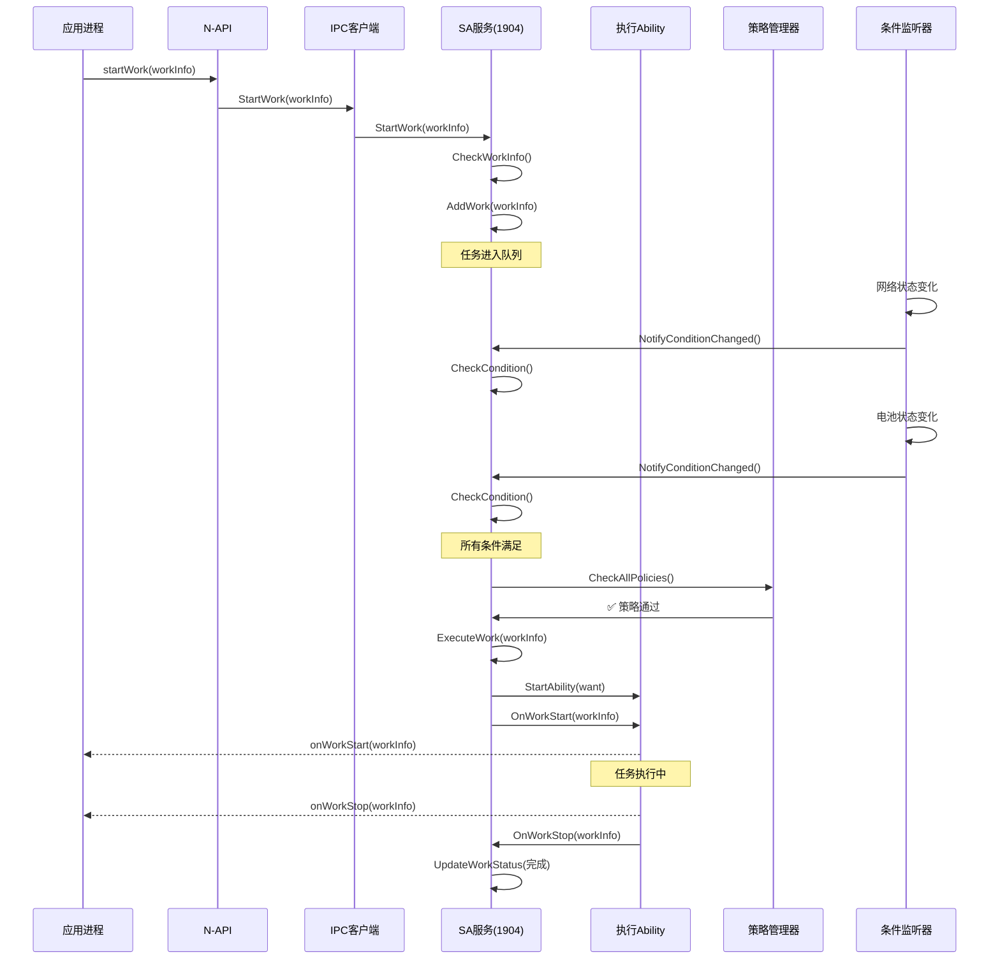

# 关键调用链

> **目的**: 记录 Work Scheduler 模块的典型调用链和执行流程
> **适用范围**: 开发者调试、架构理解、问题定位

---

## 主要调用链

### 1. 应用启动任务流程

```
应用代码 (JS/TS)
  ↓
workScheduler.startWork(workInfo)
  ↓ [interfaces/kits/js/napi/src/start_work.cpp:27]
StartWork()
  ↓ 参数校验
  ↓ [interfaces/kits/js/napi/src/common.cpp:58]
Common::GetWorkInfo()
  ↓ 类型检查
  ↓ [frameworks/src/workscheduler_srv_client.cpp]
WorkSchedulerSrvClient::GetInstance().StartWork(workInfo)
  ↓ IPC 连接检查
  ↓ [frameworks/src/workscheduler_srv_client.cpp]
WorkSchedulerSrvClient::Connect()
  ↓ 获取 SA 1904
  ↓ [frameworks/src/workscheduler_srv_client.cpp]
IPCSkeleton::CheckSystemAbility(WORK_SCHEDULE_SERVICE_ID)
  ↓ 转换为接口代理
  ↓ [services/native/src/work_scheduler_service.cpp]
WorkSchedulerService::StartWork(WorkInfo)
  ↓ 权限检查
  ↓ [services/native/src/work_scheduler_service.cpp:661]
CheckWorkInfo()
  ↓ UID 验证和 BundleName 匹配
  ↓ 添加到队列
  ↓ [services/native/src/work_queue_manager.cpp]
WorkQueueManager::AddWork(WorkInfo)
  ↓ 按 UID 分配到队列
  ↓ [services/native/src/conditions/condition_checker.cpp]
ConditionChecker::CheckCondition()
  ↓ 条件检查（网络/电池/屏幕等）
  ↓ 条件满足时
  ↓ [services/native/src/work_scheduler_service.cpp]
WorkSchedulerService::ExecuteWork(WorkInfo)
  ↓ 构造 Want
  ↓ [services/native/src/work_scheduler_service.cpp]
WorkSchedulerService::StartAbility(Want)
  ↓ 通过 Ability Runtime 启动
  ↓ [Ability 进程]
WorkAbility::onStart()
  ↓ 执行任务逻辑
  ↓ [Ability 进程]
WorkAbility::onWorkStart(workInfo)
  ↓ 回调通知服务
  ↓ [services/native/src/work_scheduler_service.cpp]
WorkSchedulerService::OnWorkStart(WorkInfo)
  ↓ 更新任务状态为"执行中"
  ↓ 任务执行完成
  ↓ [Ability 进程]
WorkAbility::onWorkStop(workInfo)
  ↓ 回调通知服务
  ↓ [services/native/src/work_scheduler_service.cpp]
WorkSchedulerService::OnWorkStop(WorkInfo)
  ↓ 更新任务状态为"已完成"
```

**关键文件**:
- `interfaces/kits/js/napi/src/start_work.cpp:27` (JS 入口)
- `frameworks/src/workscheduler_srv_client.cpp` (IPC 客户端)
- `services/native/src/work_scheduler_service.cpp` (SA 服务)
- `services/native/src/work_queue_manager.cpp` (队列管理)

---

### 2. 条件监听流程

```
系统事件（网络/电池/屏幕等）
  ↓ [services/native/src/conditions/network_listener.cpp]
NetworkListener::OnNetworkStateChanged()
  ↓ 更新网络状态
  ↓ [services/native/src/conditions/condition_checker.cpp]
ConditionChecker::NotifyConditionChanged()
  ↓ 触发条件检查
  ↓ [services/native/src/conditions/condition_checker.cpp]
ConditionChecker::CheckCondition(WorkInfo)
  ↓ 检查所有条件是否满足
  ↓ 条件满足
  ↓ [services/native/src/work_queue_manager.cpp]
WorkQueueManager::TriggerWork()
  ↓ 执行任务
```

**关键文件**:
- `services/native/src/conditions/network_listener.cpp`
- `services/native/src/conditions/battery_level_listener.cpp`
- `services/native/src/conditions/screen_listener.cpp`
- `services/native/src/conditions/condition_checker.cpp`

---

### 3. 策略过滤流程

```
任务准备执行
  ↓ [services/native/src/conditions/condition_checker.cpp]
ConditionChecker::CheckCondition()
  ↓ 条件检查通过
  ↓ [services/native/src/work_policy_manager.cpp]
WorkPolicyManager::CheckAllPolicies()
  ↓ 依次检查所有策略过滤器
  ↓ [services/native/src/policy/cpu_policy.cpp]
CpuPolicy::Check()
  ↓ CPU 使用率检查
  ↓ [services/native/src/policy/memory_policy.cpp]
MemoryPolicy::Check()
  ↓ 内存使用率检查
  ↓ [services/native/src/policy/thermal_policy.cpp]
ThermalPolicy::Check()
  ↓ 温度检查
  ↓ 所有策略通过
  ↓ [services/native/src/work_queue_manager.cpp]
WorkQueueManager::TriggerWork()
  ↓ 执行任务
```

**关键文件**:
- `services/native/src/work_policy_manager.cpp`
- `services/native/src/policy/cpu_policy.cpp`
- `services/native/src/policy/memory_policy.cpp`
- `services/native/src/thermal_policy.cpp`

---

### 4. 查询任务状态流程

```
应用代码
  ↓
workScheduler.getWorkStatus(workId)
  ↓ [interfaces/kits/js/napi/src/get_work_status.cpp:72]
GetWorkStatus()
  ↓ 创建异步任务
  ↓ [interfaces/kits/js/napi/src/get_work_status.cpp:100]
napi_create_async_work()
  ↓ 执行 Worker 线程
  ↓ [interfaces/kits/js/napi/src/get_work_status.cpp:101-105]
WorkerExecute()
  ↓ 调用客户端
  ↓ [frameworks/src/workscheduler_srv_client.cpp]
WorkSchedulerSrvClient::GetInstance().GetWorkStatus(workId, workInfo)
  ↓ IPC 调用
  ↓ [services/native/src/work_scheduler_service.cpp]
WorkSchedulerService::GetWorkStatus(workId, workInfo)
  ↓ 查询任务状态
  ↓ [services/native/src/work_sched_data_manager.cpp]
WorkSchedDataManager::GetWorkInfo(workId)
  ↓ 返回 WorkInfo
  ↓ 通过 Promise/Callback 返回应用
```

**关键文件**:
- `interfaces/kits/js/napi/src/get_work_status.cpp`
- `services/native/src/work_scheduler_service.cpp`
- `services/native/src/work_sched_data_manager.cpp`

---

### 5. 停止任务流程

```
应用代码
  ↓
workScheduler.stopWork(workInfo, needCancel)
  ↓ [interfaces/kits/js/napi/src/stop_work.cpp:28]
StopWork()
  ↓ 参数解析
  ↓ [frameworks/src/workscheduler_srv_client.cpp]
WorkSchedulerSrvClient::GetInstance().StopWork(workInfo)
  ↓ IPC 调用
  ↓ [services/native/src/work_scheduler_service.cpp]
WorkSchedulerService::StopWork(WorkInfo)
  ↓ 移除任务或停止执行
  ↓ [services/native/src/work_scheduler_service.cpp]
WorkSchedulerService::StopAndCancelWork(WorkInfo)
  ↓ needCancel=true 时删除任务
  ↓ 通知 Ability 停止
  ↓ [services/native/src/work_scheduler_service.cpp]
WorkSchedulerService::StopAbility(WorkInfo)
  ↓ [Ability 进程]
WorkAbility::onStop()
  ↓ Ability 销毁
```

**关键文件**:
- `interfaces/kits/js/napi/src/stop_work.cpp`
- `services/native/src/work_scheduler_service.cpp`

---

### 6. Extension 回调流程

```
任务完成
  ↓ [Ability 进程]
WorkAbility::onWorkStop(workInfo)
  ↓ [services/zidl/src/work_scheduler_stub_imp.cpp]
WorkSchedulerStubImp::OnWorkStop(WorkInfo)
  ↓ Extension Stub 回调
  ↓ [services/zidl/include/work_scheduler_stub_imp.h]
IWorkScheduler::OnWorkStop(WorkInfo)
  ↓ 跨进程 IPC
  ↓ [应用进程]
WorkSchedulerExtensionAbility::onWorkStop(WorkInfo)
  ↓ 应用处理回调
```

**关键文件**:
- `services/zidl/src/work_scheduler_stub_imp.cpp`
- `Ability 进程实现`

---

## 关键类和函数索引

### Framework 层

| 类 | 文件 | 主要方法 |
|------|------|---------|
| `WorkSchedulerSrvClient` | `frameworks/src/workscheduler_srv_client.cpp` | Connect, StartWork, StopWork, GetWorkStatus, ObtainAllWorks |
| `WorkInfo` | `frameworks/src/work_info.cpp` | 数据结构封装 |

### Services 层

| 类 | 文件 | 主要方法 |
|------|------|---------|
| `WorkSchedulerService` | `services/native/src/work_scheduler_service.cpp` | StartWork, StopWork, ExecuteWork, GetWorkStatus, OnWorkStart, OnWorkStop |
| `WorkQueueManager` | `services/native/src/work_queue_manager.cpp` | AddWork, TriggerWork, RemoveWork, PauseWorks |
| `WorkPolicyManager` | `services/native/src/work_policy_manager.cpp` | CheckAllPolicies, AddPolicyListener |
| `WorkSchedDataManager` | `services/native/src/work_sched_data_manager.cpp` | GetWorkInfo, GetAllWorks, AddWork, UpdateWork |

### 条件监听器

| 类 | 文件 | 监听条件 |
|------|------|---------|
| `NetworkListener` | `services/native/src/conditions/network_listener.cpp` | 网络类型变化 |
| `BatteryLevelListener` | `services/native/src/conditions/battery_level_listener.cpp` | 电池电量变化 |
| `BatteryStatusListener` | `services/native/src/conditions/battery_status_listener.cpp` | 电池状态变化 |
| `ChargerListener` | `services/native/src/conditions/charger_listener.cpp` | 充电状态变化 |
| `StorageListener` | `services/native/src/conditions/storage_listener.cpp` | 存储空间变化 |
| `ScreenListener` | `services/native/src/conditions/screen_listener.cpp` | 屏幕状态变化 |
| `TimerListener` | `services/native/src/conditions/timer_listener.cpp` | 定时器触发 |

### 策略过滤器

| 类 | 文件 | 过滤条件 |
|------|------|---------|
| `CpuPolicy` | `services/native/src/policy/cpu_policy.cpp` | CPU 使用率 |
| `MemoryPolicy` | `services/native/src/policy/memory_policy.cpp` | 内存使用率 |
| `ThermalPolicy` | `services/native/src/policy/thermal_policy.cpp | 温度 |
| `PowerModePolicy` | `services/native/src/policy/power_mode_policy.cpp` | 功耗模式 |

---

## 调用时序图

### 完整任务生命周期



---

## 数据流追踪

### WorkInfo 数据流

```
应用创建 (JS/TS)
  ↓
WorkInfo {workId, bundleName, abilityName, networkType, ...}
  ↓ [NAPI]
WorkInfo C++ 对象 (序列化)
  ↓ [IPC]
WorkInfo (Parcelable)
  ↓ [SA 服务]
WorkInfo (反序列化)
  ↓ [队列管理]
WorkInfo (存储在队列)
  ↓ [条件检查]
WorkInfo (条件验证)
  ↓ [策略过滤]
WorkInfo (策略验证)
  ↓ [任务执行]
WorkInfo (传递给 Ability)
  ↓ [Ability]
WorkInfo (JSON/Want 参数)
  ↓ [Extension 回调]
WorkInfo (回调参数)
```

---

## 性能分析点

### 调用链热点

| 位置 | 操作 | 性能影响 |
|------|------|----------|
| `ConditionChecker::CheckCondition()` | 遍历所有条件 | 🟡 中 - 条件多时可能耗时 |
| `WorkPolicyManager::CheckAllPolicies()` | 遍历所有策略 | 🟡 中 - 策略多时可能耗时 |
| `WorkSchedDataManager::GetAllWorks()` | 遍历所有任务 | 🟢 低 - 通常有索引 |
| `ObtainAllWorks()` (N-API) | 一次性返回所有任务 | 🟡 中 - 可能数据量大 |

### 优化建议

1. **条件缓存**:
   - 避免重复检查系统状态
   - 使用事件驱动更新条件

2. **策略短路**:
   - 优先级检查耗时策略（如 CPU、温度）
   - 失败时立即返回

3. **异步处理**:
   - 耗时操作异步化（如权限检查）
   - 避免阻塞主线程

---

## 相关跳转

- [03_Architecture.md](03_Architecture.md) - 架构设计详解
- [04_External_API.md](04_External_API.md) - API 完整文档
- [09_FAQ.md](09_FAQ.md) - 常见问题定位

---

**证据索引**:

| 结论 | 证据 |
|------|------|
| startWork 流程 | `interfaces/kits/js/napi/src/start_work.cpp:27` |
| IPC 客户端 | `frameworks/src/workscheduler_srv_client.cpp` |
| SA 服务入口 | `services/native/src/work_scheduler_service.cpp:661` (StartWork) |
| 条件检查 | `services/native/include/conditions/condition_checker.h` |
| 策略检查 | `services/native/src/work_policy_manager.cpp:11` (CheckAllPolicies) |
| 队列管理 | `services/native/src/work_queue_manager.cpp:11` |
| Extension 回调 | `services/zidl/src/work_scheduler_stub_imp.cpp` |
