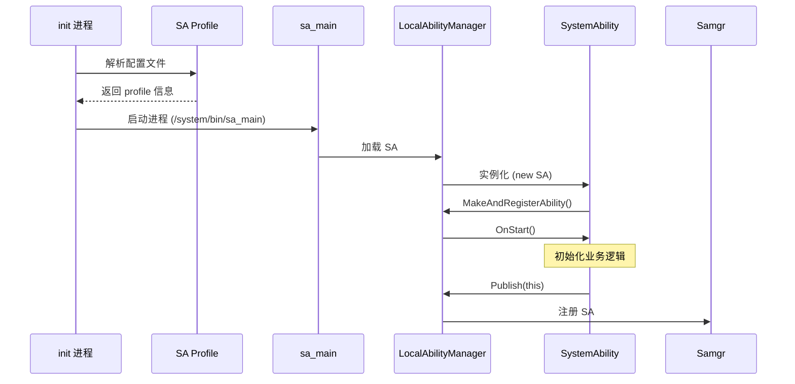
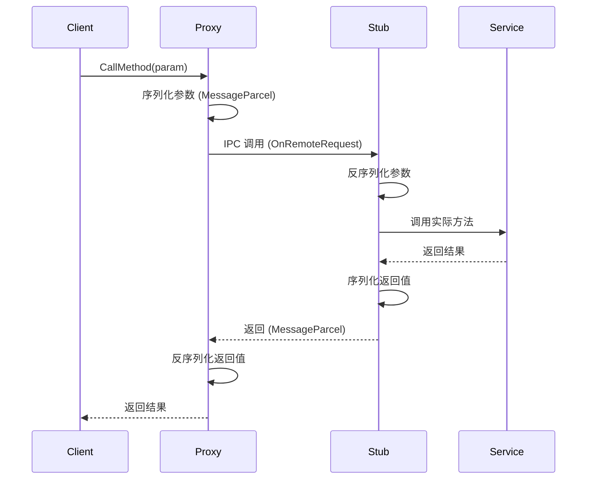

# SAFWK 架构设计

## 整体架构

```
┌─────────────────────────────────────────────────────────────────┐
│                        SAFWK 架构                                │
├─────────────────────────────────────────────────────────────────┤
│                                                                 │
│  ┌─────────────┐    ┌─────────────┐    ┌─────────────┐       │
│  │   Client     │───→│   SAFWK      │───→│   System     │       │
│  │ Application  │    │  (Client)    │    │  Ability     │       │
│  └─────────────┘    └─────────────┘    └─────────────┘       │
│                            │                     ▲              │
│                            │                     │              │
│                     ┌──────┴──────┐              │              │
│                     │ LocalAbility │──────────────┘              │
│                     │  Manager     │                             │
│                     └──────┬──────┘                             │
│                            │                                    │
│                   ┌────────┴────────┐                           │
│                   │   Samgr         │  (跨进程通信)              │
│                   │   (IPC)         │                           │
│                   └─────────────────┘                           │
│                                                                 │
├─────────────────────────────────────────────────────────────────┤
│                         关键组件                                │
├─────────────────────────────────────────────────────────────────┤
│                                                                 │
│  ┌─────────────────────────────────────────────────────────┐   │
│  │                    SAFWK Core                           │   │
│  │  ┌─────────────────┐  ┌─────────────────────────────┐  │   │
│  │  │ SystemAbility   │  │ LocalAbilityManager         │  │   │
│  │  │ - 生命周期管理   │  │ - SA 注册/注销              │  │   │
│  │  │ - 按需启动/停止  │  │ - 依赖管理                  │  │   │
│  │  │ - 能力查询      │  │ - 状态监控                  │  │   │
│  │  └─────────────────┘  └─────────────────────────────┘  │   │
│  │  ┌─────────────────┐  ┌─────────────────────────────┐  │   │
│  │  │ API Cache       │  │ FFRT Handler                │  │   │
│  │  │ Manager         │  │ - 异步任务处理               │  │   │
│  │  └─────────────────┘  └─────────────────────────────┘  │   │
│  └─────────────────────────────────────────────────────────┘   │
│                                                                 │
│  ┌─────────────────────────────────────────────────────────┐   │
│  │                    IPC Layer                             │   │
│  │  ┌─────────────┐  ┌─────────────┐  ┌─────────────┐     │   │
│  │  │IRemoteBroker │  │IRemoteProxy │  │IRemoteStub  │     │   │
│  │  │ (接口定义)   │  │ (客户端)     │  │ (服务端)     │     │   │
│  │  └─────────────┘  └─────────────┘  └─────────────┘     │   │
│  │           ▲                 │                ▲          │   │
│  │           │                 │                │          │   │
│  │           └────────┬────────┘                │          │   │
│  │                    │                          │          │   │
│  │              MessageParcel / MessageOption     │          │   │
│  └─────────────────────────────────────────────────────────┘   │
│                                                                 │
└─────────────────────────────────────────────────────────────────┘
```

## 核心组件

### SystemAbility 基类

**职责**: 所有系统能力的抽象基类

**文件**: `services/safwk/include/system_ability.h`

**关键方法**:

| 方法 | 类型 | 描述 |
|------|------|------|
| `OnStart()` | 虚函数 | SA 启动入口 |
| `OnStop()` | 虚函数 | SA 停止入口 |
| `Publish()` | 函数 | 注册 SA 到框架 |
| `GetSystemAbility()` | 函数 | 获取其他 SA |
| `MakeAndRegisterAbility()` | 静态 | 注册 SA 实例 |
| `AddSystemAbilityListener()` | 函数 | 监听其他 SA |
| `CancelIdle()` | 函数 | 取消空闲状态 |
| `StopAbility()` | 静态 | 停止指定 SA |

**生命周期状态**:

```cpp
enum class SystemAbilityState {
    NOT_LOADED = 0,  // 未加载
    ACTIVE,          // 活跃
    IDLE,            // 空闲 (可卸载)
};
```

### LocalAbilityManager

**职责**: 管理单个进程中所有本地 SA 的生命周期

**文件**: `services/safwk/include/local_ability_manager.h`

**核心功能**:

| 功能 | 描述 |
|------|------|
| SA 注册 | 接收 `Publish()` 调用 |
| 依赖管理 | 处理 `AddSystemAbilityListener()` |
| 按需启动 | 根据请求延迟启动 SA |
| 状态转换 | 管理 ACTIVE ↔ IDLE 转换 |

### IPC 框架

#### 三元组架构

```
┌─────────────────────────────────────────────────────────────┐
│                      IPC 三元组                              │
├─────────────────────────────────────────────────────────────┤
│                                                             │
│  IRemoteBroker (接口契约)                                    │
│      │                                                      │
│      ├── IRemoteProxy (客户端代理)                           │
│      │       └── 负责: 序列化请求 → 发送 → 反序列化响应       │
│      │                                                       │
│      └── IRemoteStub (服务端存根)                             │
│              └── 负责: 反序列化请求 → 调用实现 → 序列化响应    │
│                                                             │
│  通信载体: MessageParcel (数据) + MessageOption (选项)       │
│                                                             │
└─────────────────────────────────────────────────────────────┘
```

#### 接口注册宏

**文件**: `services/safwk/include/system_ability.h:29`

```cpp
#define REGISTER_SYSTEM_ABILITY_BY_ID(abilityClassName, systemAbilityId, runOnCreate) \
    const bool abilityClassName##_##RegisterResult = \
    SystemAbility::MakeAndRegisterAbility(new abilityClassName(systemAbilityId, runOnCreate));
```

### API Cache Manager

**职责**: 缓存 API 调用结果，减少 IPC 开销

**文件**: `interfaces/innerkits/safwk/api_cache_manager.h`

```cpp
class ApiCacheManager {
public:
    static ApiCacheManager& GetInstance();
    void AddCacheApi(const std::u16string& descriptor, uint32_t apiCode, int64_t expireTimeSec);
    void DelCacheApi(const std::u16string& descriptor, uint32_t apiCode);
    bool PreSendRequest(const std::u16string& descriptor, uint32_t apiCode, ...);
    bool PostSendRequest(const std::u16string& descriptor, uint32_t apiCode, ...);
};
```

## 数据流

### SA 启动流程



### IPC 调用流程



## 线程模型

### 主线程

- SAFWK 守护进程主线程
- 负责 IPC 请求分发
- 负责 SA 生命周期事件处理

### FFRT 任务线程

**文件**: `services/safwk/include/ffrt_handler.h`

- 使用 Fast Function Runtime (FFRT) 处理异步任务
- 支持任务调度和依赖管理
- 用于按需启动的异步初始化

### IPC 线程

- 来自 IPC 框架的调用线程
- 处理跨进程请求
- 权限验证在此线程执行

## 按需启动机制

### 触发条件

| 条件 | 描述 |
|------|------|
| 首次访问 | 客户端调用 `GetSystemAbility()` |
| 依赖请求 | 其他 SA 需要此 SA |
| 定时触发 | 配置的定时启动策略 |

### 启动延迟

```cpp
// local_ability_manager.cpp
// 根据依赖超时配置计算延迟时间
int32_t delayTime = SA.GetDependTimeout();
if (delayTime > 0) {
    // 延迟启动
    PostDelayedStart(SA, delayTime);
}
```

## 稳定性标注

### 稳定接口 (Stable)

| 接口 | 位置 | 说明 |
|------|------|------|
| `SystemAbility` 基类 | `interfaces/innerkits/safwk/` | 对外 SDK |
| `REGISTER_SYSTEM_ABILITY_BY_ID` | `system_ability.h:29` | 官方注册宏 |
| `LocalAbilityManager` | `services/safwk/include/` | 内部接口 |

### 不稳定接口 (Unstable)

| 接口 | 位置 | 说明 |
|------|------|------|
| `ApiCacheManager` | `interfaces/innerkits/safwk/` | 性能优化层 |
| Rust FFI | `rust/src/wrapper.rs` | CXX 绑定 |
| 内部实现细节 | `services/safwk/src/*.cpp` | 可能变更 |

## 相关文档

| 文档 | 链接 |
|------|------|
| 项目概览 | [00_Overview.md](00_Overview.md) |
| API 接口 | [02_APIs.md](02_APIs.md) |
| 构建系统 | [03_Build.md](03_Build.md) |
| 安全评审 | [04_Security.md](04_Security.md) |
