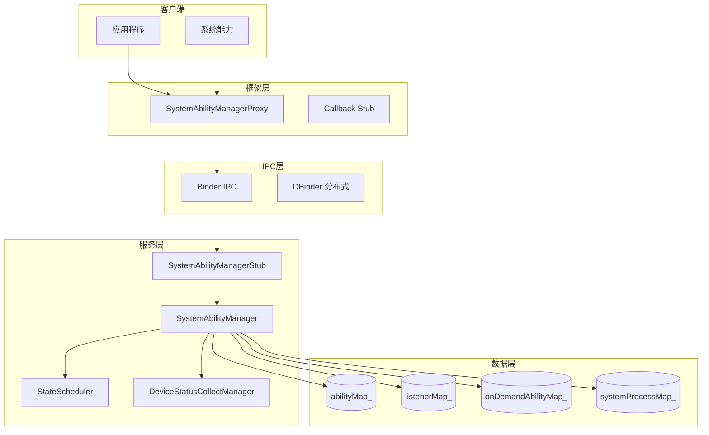
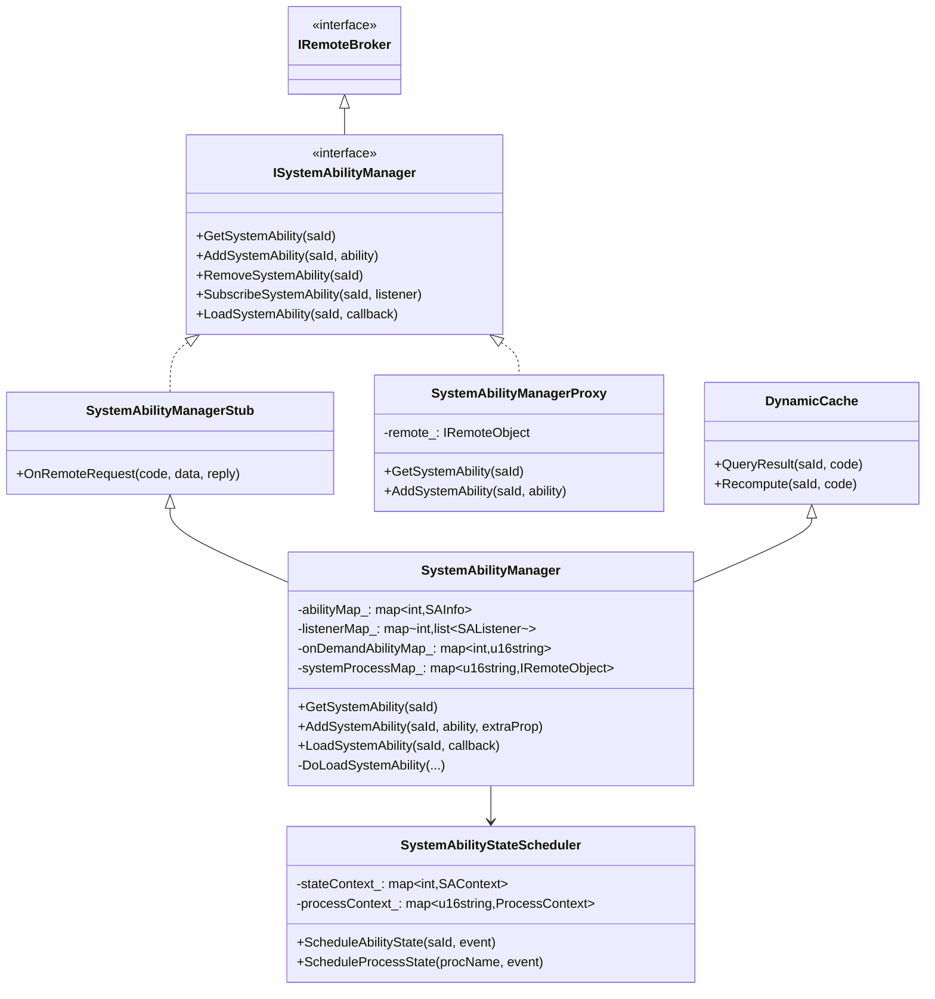
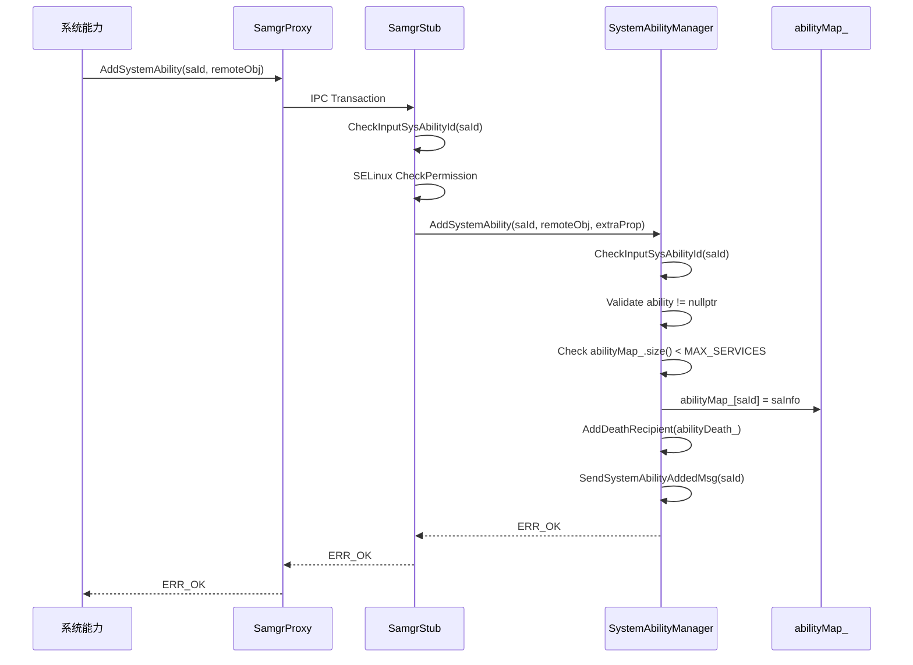
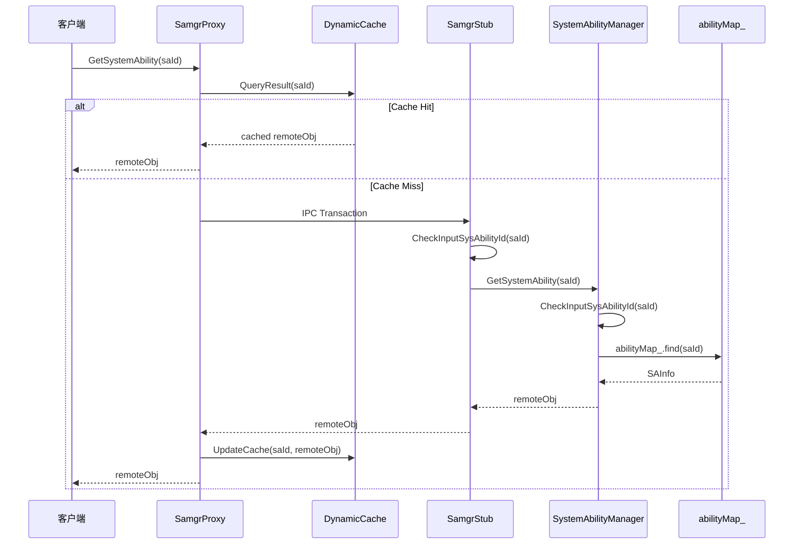
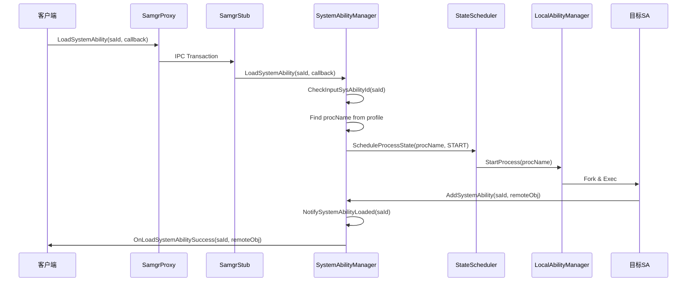
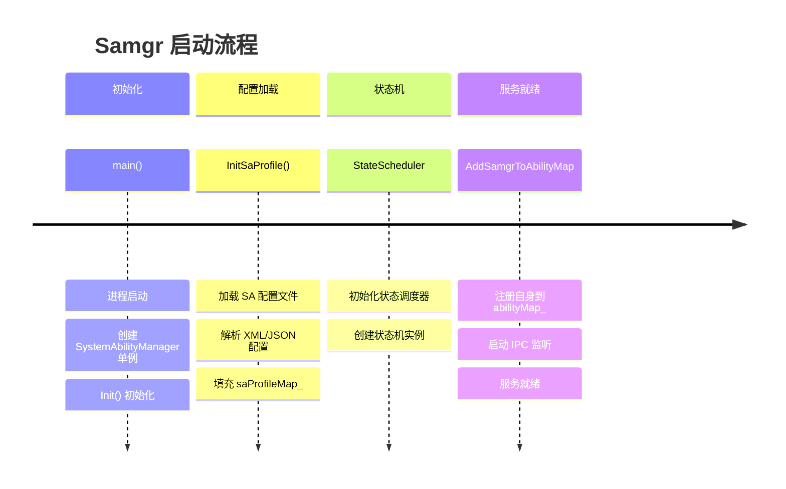
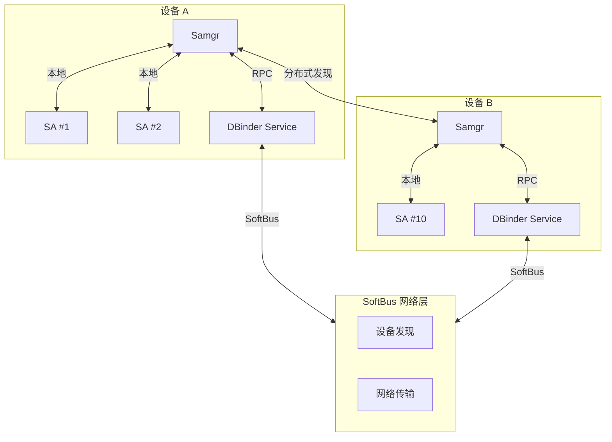
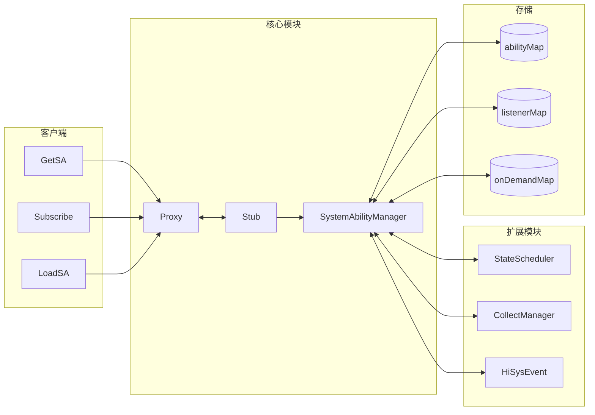

# 架构设计

## 组件架构图



## 类层次结构



## 数据流

### 1. 服务注册流程



### 2. 服务查询流程



### 3. 动态加载流程



## 线程模型

### 主服务线程

```
┌─────────────────────────────────────────────┐
│              Samgr Main Thread              │
│  ┌─────────────────────────────────────┐   │
│  │  IPC Thread Pool (Binder)           │   │
│  │  - OnRemoteRequest handlers         │   │
│  │  - Synchronous operations           │   │
│  └─────────────────────────────────────┘   │
│                    │                        │
│  ┌─────────────────▼───────────────────┐   │
│  │  FFRT Work Queue (async tasks)      │   │
│  │  - SendSystemAbilityAddedMsg        │   │
│  │  - RemoveCheckLoadedMsg             │   │
│  │  - Notify callbacks                 │   │
│  └─────────────────────────────────────┘   │
│                    │                        │
│  ┌─────────────────▼───────────────────┐   │
│  │  Timer Thread                       │   │
│  │  - reportEventTimer_                │   │
│  │  - Periodic tasks                   │   │
│  └─────────────────────────────────────┘   │
└─────────────────────────────────────────────┘
```

### 并发控制

| 数据 | 锁类型 | 用途 |
|------|--------|------|
| `abilityMap_` | `shared_mutex` | SA 注册表读写保护 |
| `listenerMap_` | `mutex` | 监听者列表保护 |
| `onDemandLock_` | `mutex` | 按需加载状态保护 |
| `saProfileMapLock_` | `mutex` | SA 配置文件保护 |
| `systemProcessMapLock_` | `mutex` | 进程映射保护 |

## 关键时序

### 启动时序



### SA 生命周期状态机

```
                    ┌─────────────┐
                    │    INIT     │
                    └──────┬──────┘
                           │ Load request
                           ▼
                    ┌─────────────┐
         ┌─────────│  STARTING   │─────────┐
         │         └──────┬──────┘         │
         │ Timeout        │ Success        │ Fail
         ▼                ▼                ▼
   ┌───────────┐   ┌───────────┐    ┌───────────┐
   │ LOAD_FAIL │   │  STARTED  │    │ LOAD_FAIL │
   └───────────┘   └─────┬─────┘    └───────────┘
                         │
              ┌──────────┼──────────┐
              ▼          ▼          ▼
        ┌─────────┐ ┌─────────┐ ┌─────────┐
        │  IDLE   │ │ ACTIVE  │ │ STOPPED │
        └─────────┘ └─────────┘ └─────────┘
```

## 分布式架构



## 模块交互


