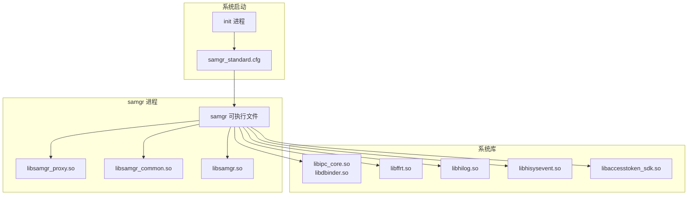

# 编译产物

## 产物清单

### 可执行文件

| 文件名 | 类型 | 安装路径 | 说明 |
|--------|------|----------|------|
| `samgr` | executable | `system/bin/samgr` | System Ability Manager 主服务 |

### 共享库

| 文件名 | 类型 | 安装路径 | 说明 |
|--------|------|----------|------|
| `libsamgr_proxy.so` | shared_library | `system/lib/` | 客户端代理库 |
| `libsamgr_common.so` | shared_library | `system/lib/` | 公共工具库 |
| `libsamgr.so` | shared_library | `system/lib/` | Rust 绑定库 |

### 静态库

| 文件名 | 类型 | 说明 |
|--------|------|------|
| `libdynamic_cache.a` | static_library | 动态缓存库（被链接） |
| `libsamgr_rust_cpp.a` | static_library | Rust C++ 包装层（被链接） |

### 配置文件

| 文件名 | 类型 | 安装路径 | 说明 |
|--------|------|----------|------|
| `samgr.para` | prebuilt_etc | `system/etc/param/` | 系统参数 |
| `samgr.para.dac` | prebuilt_etc | `system/etc/param/` | DAC 参数 |
| `samgr_standard.cfg` | prebuilt_etc | `system/etc/init/` | 启动配置 |

## 产物详情

### samgr (可执行文件)

**构建目标**: `//foundation/systemabilitymgr/samgr/services/samgr/native:samgr`

**输出路径**: `out/{product}@ {device}/system/bin/samgr`

**文件属性**:
- **CFI 保护**: 启用
- **PAC-RET**: 启用
- **依赖库**:
  - libsamgr_proxy.so
  - libsamgr_common.so
  - libsamgr.so
  - libipc_core.so
  - libdbinder.so
  - libffrt.so
  - libhilog.so
  - libhisysevent.so
  - libhitrace_meter.so
  - libbeget_proxy.so
  - libbegetutil.so
  - libaccesstoken_sdk.so
  - libutils.so
  - libhicollie.so (条件)
  - libservice_checker.so (条件)

**运行时加载顺序**:
```
1. init 进程启动
2. 解析 samgr_standard.cfg
3. fork/exec samgr
4. samgr 加载依赖库
5. 初始化 SystemAbilityManager
6. 注册到 abilityMap_
7. 进入 IPC 消息循环
```

### libsamgr_proxy.so (共享库)

**构建目标**: `//foundation/systemabilitymgr/samgr/interfaces/innerkits/samgr_proxy:samgr_proxy`

**输出路径**: `out/{product}@{device}/system/lib/libsamgr_proxy.so`

**符号导出控制**: `libsamgr_proxy.versionscript`

**客户端使用**:
```cpp
// 链接时
external_deps += [ "samgr:samgr_proxy" ]

// 运行时
#include "iservice_registry.h"
auto samgr = SystemAbilityManagerClient::GetInstance().GetSystemAbilityManager();
```

**主要导出符号**:
- `SystemAbilityManagerClient::GetInstance()`
- `SystemAbilityManagerProxy` 类方法
- `SystemAbilityStatusChangeStub` 类
- `SystemAbilityLoadCallbackStub` 类

### libsamgr_common.so (共享库)

**构建目标**: `//foundation/systemabilitymgr/samgr/interfaces/innerkits/common:samgr_common`

**输出路径**: `out/{product}@{device}/system/lib/libsamgr_common.so`

**主要功能**:
- SA 配置文件解析 (ParseUtil)
- 系统事件适配 (HiSysEventAdapter)
- XCollie 集成 (SamgrXCollie)

**安全特性**:
- 整数溢出检测
- 未定义行为检测

### samgr_standard.cfg (启动配置)

**路径**: `system/etc/init/samgr_standard.cfg`

**示例内容**:
```json
{
    "services": [{
        "name": "samgr",
        "path": ["/system/bin/samgr"],
        "uid": "system",
        "gid": ["system", "shell"],
        "critical": ["system", "vendor"],
        "boot-mode": ["normal", "recovery"],
        "secon": "u:r:samgr:s0"
    }]
}
```

**配置项说明**:

| 字段 | 值 | 说明 |
|------|-----|------|
| name | samgr | 服务名称 |
| path | /system/bin/samgr | 可执行文件路径 |
| uid | system | 运行用户 |
| gid | system, shell | 运行组 |
| critical | system, vendor | 关键服务 |
| boot-mode | normal, recovery | 启动模式 |
| secon | u:r:samgr:s0 | SELinux 上下文 |

### samgr.para (系统参数)

**路径**: `system/etc/param/samgr.para`

**示例内容**:
```
# Samgr 系统参数
samgr.max_services=1000
samgr.load_timeout=4000
samgr.extend_timeout=12000
```

## 运行时加载关系



## 安装路径映射

| 源码路径 | 安装路径 | 说明 |
|----------|----------|------|
| `services/samgr/native:samgr` | `system/bin/samgr` | 可执行文件 |
| `interfaces/innerkits/samgr_proxy:samgr_proxy` | `system/lib/libsamgr_proxy.so` | 客户端库 |
| `interfaces/innerkits/common:samgr_common` | `system/lib/libsamgr_common.so` | 公共库 |
| `interfaces/innerkits/rust:samgr_rust` | `system/lib/libs*.so` | Rust 库 |
| `etc:samgr.para` | `system/etc/param/samgr.para` | 系统参数 |
| `etc:samgr.para.dac` | `system/etc/param/samgr.para.dac` | DAC 参数 |
| `etc:samgr_init` | `system/etc/init/samgr_standard.cfg` | 启动配置 |

## 产物大小

| 产物 | ROM 大小 (预估) | RAM 占用 (预估) |
|------|-----------------|-----------------|
| samgr | ~500KB | ~7MB |
| libsamgr_proxy.so | ~100KB | - |
| libsamgr_common.so | ~50KB | - |
| libsamgr.so | ~200KB | - |
| 配置文件 | ~5KB | - |
| **总计** | **~855KB** | **~7MB** |

*注: bundle.json 中声明 ROM 300KB, RAM 7130KB*

## 版本控制

### 符号版本脚本

**libsamgr_proxy.versionscript**:
```
{
    global:
        *SystemAbilityManager*;
        *ISystemAbilityManager*;
        *SystemAbilityStatusChange*;
        *SystemAbilityLoadCallback*;
    local:
        *;
};
```

**libsamgr_common.versionscript**:
```
{
    global:
        *ParseUtil*;
        *HiSysEventAdapter*;
    local:
        *;
};
```

## 调试产物

### 符号文件

构建时生成的符号文件 (用于调试):
- `samgr.map`
- `libsamgr_proxy.so.map`
- `libsamgr_common.so.map`

### 覆盖率数据

启用 `samgr_feature_coverage` 时生成:
- `.gcno` 文件 (编译时)
- `.gcda` 文件 (运行时)

## 验证产物

```bash
# 检查可执行文件
file out/product@device/system/bin/samgr
# 输出: ELF 64-bit LSB executable, ARM aarch64

# 检查共享库依赖
readelf -d out/product@device/system/bin/samgr | grep NEEDED

# 检查符号导出
readelf -s out/product@device/system/lib/libsamgr_proxy.so | grep SystemAbility

# 检查 CFI 保护
readelf -s out/product@device/system/bin/samgr | grep __cfi
```
