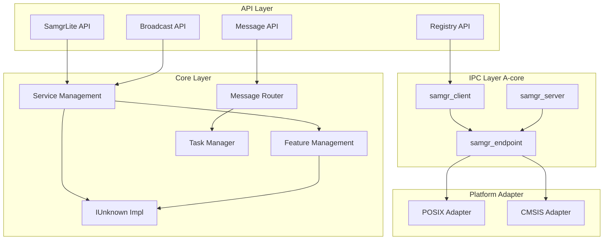
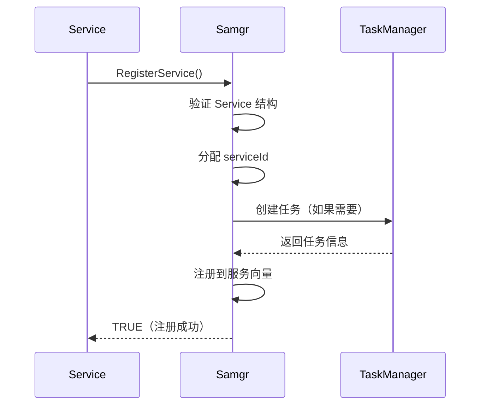
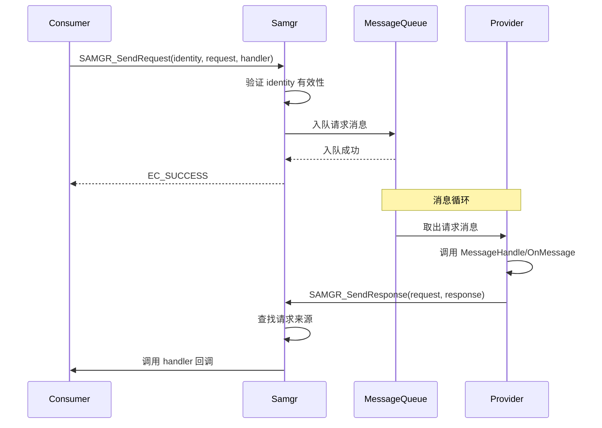

# 系统架构

## 架构概述

samgr_lite 采用分层架构设计，从上到下分为：

1. **API 层**：对外接口定义
2. **核心层**：服务管理、消息路由
3. **IPC 层**：跨进程通信（A-core）
4. **适配层**：平台差异屏蔽

## 组件图



## 数据流

### 进程内消息流程

```
┌──────────┐         ┌─────────┐         ┌──────────┐
│ Consumer │ ──────► │ Samgr   │ ──────► │ Provider │
│          │         │         │         │          │
└──────────┘         └─────────┘         └──────────┘
                         │
                   ┌─────┴─────┐
                   ▼           ▼
            ┌───────────┐ ┌───────────┐
            │  Service  │ │  Feature  │
            └───────────┘ └───────────┘
```

**调用链**：
1. Consumer 调用 `SAMGR_GetFeatureApi()` 获取 IUnknown 接口
2. Consumer 调用 `IUnknown->QueryInterface()` 获取具体接口
3. Consumer 构造 Request 调用 `SAMGR_SendRequest()`
4. Samgr 路由到 Provider 的消息队列
5. Provider 在消息处理线程中调用 `MessageHandle` 或 `OnMessage`
6. Provider 调用 `SAMGR_SendResponse()` 发送响应

### 跨进程消息流程 (A-core)

```
┌──────────────┐                    ┌──────────────┐
│ Client Proc  │                    │ Server Proc  │
│              │                    │              │
│ ┌──────────┐ │    IPC (Binder)   │ ┌──────────┐ │
│ │ Consumer  │ │ ◄────────────────► │ │ Provider │ │
│ └──────────┘ │                    │ └────┬─────┘ │
│      │       │                    │      │      │
│      ▼       │                    │      ▼      │
│ ┌──────────┐ │                    │ ┌──────────┐ │
│ │samgr_cli │ │                    │ │samgr_srv │ │
│ └────┬─────┘ │                    │ └────┬─────┘ │
│      │       │                    │      │      │
│      ▼       │                    │      ▼      │
│ ┌──────────┐ │                    │ ┌──────────┐ │
│ │Endpoint  │ │                    │ │Endpoint  │ │
│ └──────────┘ │                    │ └──────────┘ │
└──────────────┘                    └──────────────┘
```

**调用链**：
1. Client 调用 `SAMGR_GetFeatureApi()` 获取 IClientProxy
2. Client 调用 `IClientProxy->Invoke()` 发送 IPC 消息
3. Endpoint 序列化消息并通过 Binder 发送
4. Server 端 Endpoint 接收消息并路由到 Provider
5. Provider 的 `IServerProxy->Invoke()` 处理消息
6. 响应通过相同路径返回

## 线程模型

### 任务类型

samgr_lite 支持三种任务类型（`TaskType` 定义于 `service.h:66-75`）：

| 任务类型 | 说明 | 适用场景 |
|----------|------|----------|
| `SHARED_TASK` | 多服务共享任务池 | 资源受限的 M-core |
| `SINGLE_TASK` | 独占任务 | 需要高隔离性的服务 |
| `SPECIFIED_TASK` | 指定任务 | 特定优先级的服务 |

### 优先级范围

任务优先级范围为 9-39（`TaskPriority` 定义于 `service.h:105-116`）：

| 优先级 | 范围 | 说明 |
|--------|------|------|
| `PRI_LOW` | 9-15 | 低优先级 |
| `PRI_BELOW_NORMAL` | 16-23 | 低于正常 |
| `PRI_NORMAL` | 24-31 | 正常优先级（可用日志服务） |
| `PRI_ABOVE_NORMAL` | 32-39 | 高优先级（可用通信服务） |

### 任务配置示例

```c
static TaskConfig GetTaskConfig(Service *service)
{
    TaskConfig config = {
        .level = LEVEL_HIGH,           // 共享任务标签
        .priority = PRI_BELOW_NORMAL,   // 优先级
        .stackSize = 0x800,            // 栈大小
        .queueSize = 20,               // 消息队列深度
        .taskFlags = SHARED_TASK,      // 共享任务
    };
    return config;
}
```

## 关键时序

### 服务注册时序



### 消息处理时序



## 生命周期

### Service 生命周期

```
┌─────────┐    ┌─────────┐    ┌─────────┐    ┌─────────┐    ┌─────────┐
│  初始化  │───►│  运行   │───►│ 消息处理 │───►│  停止   │───►│ 注销    │
└─────────┘    └─────────┘    └─────────┘    └─────────┘    └─────────┘
     │              │              │              │              │
     ▼              ▼              ▼              ▼              ▼
Initialize()    GetTaskConfig()  MessageHandle()  UnregisterService()
```

### Feature 生命周期

```
┌─────────┐    ┌─────────┐    ┌─────────┐    ┌─────────┐    ┌─────────┐
│  初始化  │───►│ 关联父服务│───►│ 消息处理 │───►│  停止   │───►│ 注销    │
└─────────┘    └─────────┘    └─────────┘    └─────────┘    └─────────┘
     │              │              │              │              │
     ▼              ▼              ▼              ▼              ▼
OnInitialize()  parent 指针     OnMessage()   OnStop()     UnregisterFeature()
```

## 下一章

- [核心概念](./03_Core_Concepts.md) - Service/Feature/IUnknown 详解
- [SamgrLite API](./04_SamgrLite_API.md) - API 详细说明
