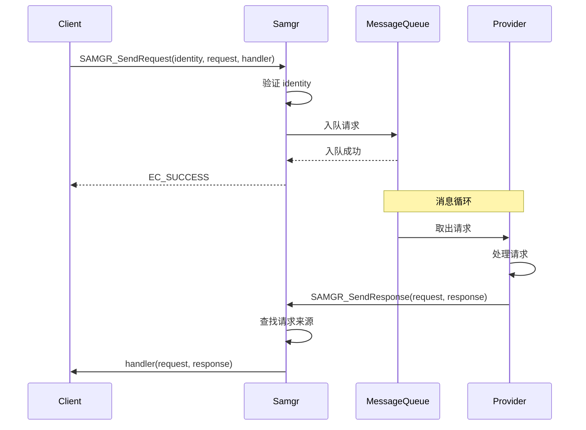

# 消息通信 API

## 概述

消息通信 API 提供进程内服务间的请求/响应机制，支持同步和异步两种模式。

## API 清单

### 请求发送

| API | 说明 | 同步/异步 | 头文件 |
|-----|------|----------|--------|
| `SAMGR_SendRequest()` | 发送请求 | 异步 | `message.h:139` |
| `SAMGR_SendSharedRequest()` | 发送共享请求 | 异步 | `message.h:162` |
| `SAMGR_SendSharedDirectRequest()` | 发送直接请求 | 异步 | `message.h:193` |

### 响应发送

| API | 说明 | 同步/异步 | 头文件 |
|-----|------|----------|--------|
| `SAMGR_SendResponse()` | 发送响应 | 异步 | `message.h:216` |
| `SAMGR_SendResponseByIdentity()` | 按身份发送响应 | 异步 | `message.h:242` |

## SAMGR_SendRequest

发送请求到指定的服务或 Feature。

### 函数签名

```c
// evidence: interfaces/kits/samgr/message.h:139
int32 SAMGR_SendRequest(const Identity *identity, const Request *request, Handler handler);
```

### 参数说明

| 参数 | 类型 | 说明 |
|------|------|------|
| identity | const Identity* | 目标服务/Feature 的身份标识 |
| request | const Request* | 请求消息 |
| handler | Handler | 响应处理回调（可为 NULL） |

**Handler 类型定义** - `message.h:66`:
```c
typedef void (*Handler)(const Request *request, const Response *response);
```

### 返回值

| 返回值 | 说明 |
|--------|------|
| EC_SUCCESS | 请求发送成功 |
| 其他错误码 | 发送失败 |

### 使用示例

```c
// 发送请求
Request request = {
    .msgId = MSG_SYNC,
    .data = NULL,
    .len = 0,
    .msgValue = 0,
};

int32 ret = SAMGR_SendRequest(&targetIdentity, &request, ResponseHandler);
if (ret != EC_SUCCESS) {
    // 处理错误
}

// 响应处理回调
void ResponseHandler(const Request *request, const Response *response)
{
    if (response->data != NULL) {
        // 处理响应数据
    }
}
```

## SAMGR_SendSharedRequest

发送共享请求，可被多个处理者响应。

### 函数签名

```c
// evidence: interfaces/kits/samgr/message.h:162
uint32 *SAMGR_SendSharedRequest(const Identity *identity, const Request *request, 
                                 uint32 *token, Handler handler);
```

### 参数说明

| 参数 | 类型 | 说明 |
|------|------|------|
| identity | const Identity* | 目标身份 |
| request | const Request* | 请求消息 |
| token | uint32* | 引用计数令牌 |
| handler | Handler | 响应处理回调 |

### 返回值

| 返回值 | 说明 |
|--------|------|
| 非 NULL | 令牌指针，用于取消 |
| NULL | 发送失败 |

### 使用示例

```c
Request request = {
    .msgId = MSG_BROADCAST,
    .data = broadcastData,
    .len = dataLen,
    .msgValue = 0,
};

uint32 token = 0;
uint32 *tokenPtr = SAMGR_SendSharedRequest(&identity, &request, &token, Handler);
// 处理...
// 取消: free(tokenPtr)
```

## SAMGR_SendSharedDirectRequest

发送直接请求，处理完成后直接调用 handler。

### 函数签名

```c
// evidence: interfaces/kits/samgr/message.h:193
int32 SAMGR_SendSharedDirectRequest(const Identity *id, const Request *req, 
                                     const Response *resp, uint32 **ref,
                                     Handler handler);
```

### 参数说明

| 参数 | 类型 | 说明 |
|------|------|------|
| id | const Identity* | 目标身份 |
| req | const Request* | 请求消息 |
| resp | const Response* | 响应消息 |
| ref | uint32** | 引用计数 |
| handler | Handler | 处理回调 |

### 返回值

| 返回值 | 说明 |
|--------|------|
| EC_SUCCESS | 成功 |
| 其他错误码 | 失败 |

## SAMGR_SendResponse

处理完成后发送响应。

### 函数签名

```c
// evidence: interfaces/kits/samgr/message.h:216
int32 SAMGR_SendResponse(const Request *request, const Response *response);
```

### 参数说明

| 参数 | 类型 | 说明 |
|------|------|------|
| request | const Request* | 原始请求 |
| response | const Response* | 响应内容 |

### 使用示例

```c
BOOL OnMessage(Feature *feature, Request *request)
{
    if (request->msgId == MSG_PROC) {
        Response response = {
            .data = "Processed!",
            .len = 0,
            .reply = NULL,
        };
        SAMGR_SendResponse(request, &response);
        return TRUE;
    }
    return FALSE;
}
```

## SAMGR_SendResponseByIdentity

按身份发送响应，用于指定目标。

### 函数签名

```c
// evidence: interfaces/kits/samgr/message.h:242
int32 SAMGR_SendResponseByIdentity(const Identity *id, const Request *request, 
                                    const Response *response);
```

## 消息结构

### Request 结构

```c
// evidence: interfaces/kits/samgr/message.h:95-104
struct Request {
    int16 msgId;      // 消息 ID，开发者自定义
    int16 len;        // 数据长度
    void *data;       // 数据指针
    uint32 msgValue;  // 消息值，开发者自定义
};
```

### Response 结构

```c
// evidence: interfaces/kits/samgr/message.h:114-120
struct Response {
    void *data;   // 响应数据
    int16 len;    // 数据长度
    void *reply;  // 额外回复
};
```

### Identity 结构

```c
// evidence: interfaces/kits/samgr/message.h:77-84
struct Identity {
    int16 serviceId;   // 服务 ID
    int16 featureId;   // Feature ID
    MQueueId queueId;  // 消息队列 ID
};
```

## 完整调用示例

### 服务端处理请求

```c
// 在 Feature 中处理请求
static BOOL FEATURE_OnMessage(Feature *feature, Request *request)
{
    switch (request->msgId) {
        case MSG_SYNC: {
            // 同步处理
            Response response = {
                .data = "Sync response",
                .len = 0,
                .reply = NULL,
            };
            SAMGR_SendResponse(request, &response);
            return TRUE;
        }
        case MSG_ASYNC: {
            // 异步处理（启动异步任务）
            AsyncProcess(feature, request);
            return FALSE;  // 尚未完成
        }
        default:
            break;
    }
    return FALSE;
}
```

### 客户端发送请求

```c
// 发送请求并处理响应
void SendRequest(Identity target)
{
    Request request = {
        .msgId = MSG_QUERY,
        .data = queryData,
        .len = sizeof(queryData),
        .msgValue = 0,
    };

    int32 ret = SAMGR_SendRequest(&target, &request, QueryResponseHandler);
    if (ret != EC_SUCCESS) {
        HILOG_ERROR(HILOG_MODULE_APP, "Send request failed: %d", ret);
    }
}

void QueryResponseHandler(const Request *request, const Response *response)
{
    if (response != NULL && response->data != NULL) {
        // 处理响应数据
        ProcessResponseData(response->data, response->len);
    }
}
```

## 消息流图



## 约束与限制

| 约束 | 说明 |
|------|------|
| handler 可为 NULL | 不需要响应时可传 NULL |
| 内存管理 | 调用者负责释放 request->data |
| 阻塞注意 | 回调中不要阻塞 |

## 下一章

- [IPC 跨进程接口](./06_IPC_API.md) - 跨进程服务调用
- [广播服务 API](./07_Broadcast_API.md) - 发布/订阅模式
