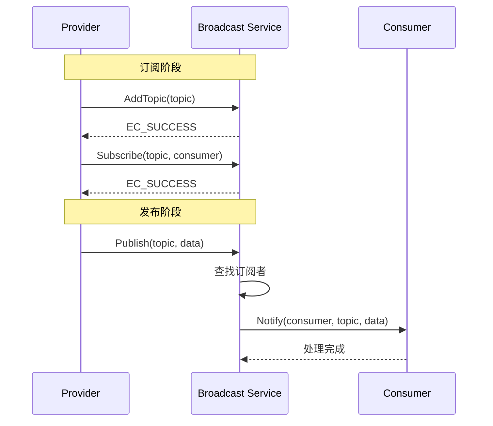

# 广播服务 API

## 概述

广播服务（Broadcast Service）提供发布/订阅模式的事件通知机制，支持在同一进程内的服务、Feature 和模块之间进行事件广播。

## 核心概念

### Provider（发布者）

发布者负责发布主题（Topic）及其关联的数据。

### Consumer（消费者）

消费者订阅感兴趣的主题，当有数据发布时接收通知。

### Topic（主题）

主题是事件的唯一标识符（`uint32` 类型），用于区分不同类型的事件。

## API 清单

### 发布接口

| API | 说明 | 同步/异步 | 头文件 |
|-----|------|----------|--------|
| `Publish()` | 发布主题数据 | 同步 | `broadcast_interface.h:147` |

### 订阅接口

| API | 说明 | 同步/异步 | 头文件 |
|-----|------|----------|--------|
| `AddTopic()` | 添加主题 | 同步 | `broadcast_interface.h:169` |
| `Subscribe()` | 订阅主题 | 同步 | `broadcast_interface.h:185` |
| `ModifyConsumer()` | 修改消费者 | 同步 | `broadcast_interface.h:201` |
| `Unsubscribe()` | 取消订阅 | 同步 | `broadcast_interface.h:218` |

## 数据结构

### PubSubInterface

```c
// evidence: interfaces/kits/communication/broadcast/broadcast_interface.h:223-227
struct PubSubInterface {
    INHERIT_IUNKNOWN;
    Subscriber subscriber;
    Provider provider;
};
```

### Consumer

```c
// evidence: interfaces/kits/communication/broadcast/broadcast_interface.h:92-123
struct Consumer {
    const Identity *identity;

    // 处理通知
    void (*Notify)(Consumer *consumer, const Topic *topic, const Request *origin);

    // 判断相等（防止重复订阅）
    BOOL (*Equal)(const Consumer *current, const Consumer *other);
};
```

### Provider

```c
// evidence: interfaces/kits/communication/broadcast/broadcast_interface.h:130-148
struct Provider {
    // 发布主题
    BOOL (*Publish)(IUnknown *iUnknown, const Topic *topic, uint8 *data, int16 len);
};
```

### Subscriber

```c
// evidence: interfaces/kits/communication/broadcast/broadcast_interface.h:155-219
struct Subscriber {
    // 添加主题
    int (*AddTopic)(IUnknown *iUnknown, const Topic *topic);

    // 订阅主题
    int (*Subscribe)(IUnknown *iUnknown, const Topic *topic, Consumer *consumer);

    // 修改消费者
    Consumer *(*ModifyConsumer)(IUnknown *iUnknown, const Topic *topic, 
                                 Consumer *old, Consumer *current);

    // 取消订阅
    Consumer *(*Unsubscribe)(IUnknown *iUnknown, const Topic *topic, 
                              const Consumer *consumer);
};
```

## 使用示例

### 获取广播服务接口

```c
// 获取发布/订阅接口
PubSubInterface *pubSubApi = NULL;
IUnknown *iUnknown = SAMGR_GetInstance()->GetFeatureApi(BROADCAST_SERVICE, PUB_SUB_FEATURE);
int result = iUnknown->QueryInterface(iUnknown, DEFAULT_VERSION, (void **)&pubSubApi);
if (result != EC_SUCCESS) {
    // 处理错误
}

// 使用 subscriber 和 provider
Subscriber *subscriber = &pubSubApi->subscriber;
Provider *provider = &pubSubApi->provider;
```

### 定义消费者

```c
// 定义消费者
static Consumer g_consumer = {
    .identity = NULL,
    .Notify = ConsumerNotify,
    .Equal = ConsumerEqual,
};

static void ConsumerNotify(Consumer *consumer, const Topic *topic, const Request *origin)
{
    // 处理接收到的数据
    uint8 *data = (uint8 *)origin->data;
    int16 len = origin->len;
    // ...
}

static BOOL ConsumerEqual(const Consumer *current, const Consumer *other)
{
    // 比较逻辑
    return (current->identity == other->identity);
}
```

### 订阅主题

```c
// 1. 获取 PubSub 接口
PubSubInterface *pubSubApi = NULL;
IUnknown *iUnknown = SAMGR_GetInstance()->GetFeatureApi(BROADCAST_SERVICE, PUB_SUB_FEATURE);
iUnknown->QueryInterface(iUnknown, DEFAULT_VERSION, (void **)&pubSubApi);

// 2. 添加主题
Topic topic = TOPIC_DATA_READY;
int ret = pubSubApi->subscriber.AddTopic(iUnknown, &topic);
if (ret != EC_SUCCESS) {
    // 处理错误
}

// 3. 订阅主题
g_consumer.identity = &serviceIdentity;
ret = pubSubApi->subscriber.Subscribe(iUnknown, &topic, &g_consumer);
if (ret != EC_SUCCESS) {
    // 处理错误
}
```

### 发布主题

```c
// 发布数据
Topic topic = TOPIC_DATA_READY;
uint8 data[] = {0x01, 0x02, 0x03};
int16 len = sizeof(data);

BOOL success = pubSubApi->provider.Publish(iUnknown, &topic, data, len);
if (!success) {
    // 发布失败
}
```

### 取消订阅

```c
// 取消订阅
pubSubApi->subscriber.Unsubscribe(iUnknown, &topic, &g_consumer);
```

### 修改消费者

```c
// 修改消费者（用于更新身份）
Consumer newConsumer = {
    .identity = &newIdentity,
    .Notify = ConsumerNotify,
    .Equal = ConsumerEqual,
};
Consumer *old = pubSubApi->subscriber.ModifyConsumer(iUnknown, &topic, &g_consumer, &newConsumer);
if (old != NULL) {
    // 旧消费者被替换
}
```

## 错误码

| 错误码 | 说明 |
|--------|------|
| EC_SUCCESS | 成功 |
| EC_ALREADY_SUBSCRIBED | 主题已被订阅 | `broadcast_interface.h:83` |

## 广播流程图



## 使用场景

### 场景 1：数据就绪通知

```c
// 发布者
void OnDataReady(Service *service, uint8 *data, int16 len)
{
    PubSubInterface *pubSubApi = GetPubSubInterface();
    Topic topic = TOPIC_DATA_READY;
    pubSubApi->provider.Publish(iUnknown, &topic, data, len);
}

// 消费者
void InitConsumer(Service *service)
{
    PubSubInterface *pubSubApi = GetPubSubInterface();
    Topic topic = TOPIC_DATA_READY;
    pubSubApi->subscriber.AddTopic(iUnknown, &topic);
    
    g_consumer.identity = &service->identity;
    pubSubApi->subscriber.Subscribe(iUnknown, &topic, &g_consumer);
}
```

### 场景 2：状态变化广播

```c
// 定义状态主题
#define TOPIC_STATUS_CHANGE 0x1001

// 发布状态变化
void PublishStatusChange(Service *service, uint32 status)
{
    PubSubInterface *pubSubApi = GetPubSubInterface();
    pubSubApi->provider.Publish(iUnknown, &TOPIC_STATUS_CHANGE, 
                                 (uint8 *)&status, sizeof(status));
}
```

## 约束与限制

| 约束 | 说明 |
|------|------|
| 主题必须先添加后订阅 | `broadcast_interface.h:160-175` |
| 消费者需实现 Equal 函数 | 用于防止重复订阅 |
| 数据长度限制 | 根据具体实现确定 |

## 下一章

- [GN 构建系统](./08_Build_System.md) - 构建配置详解
- [安全风险评审](./12_Security_Review.md) - 安全考量
