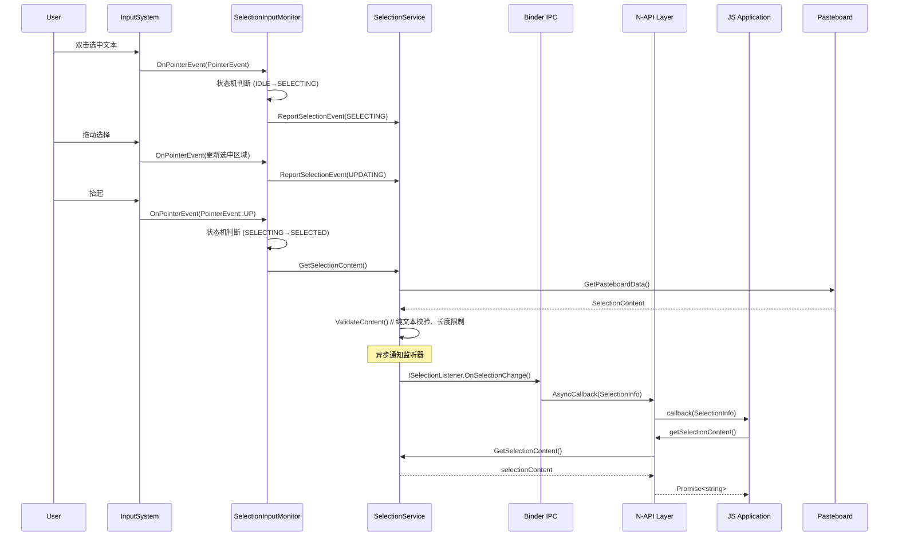
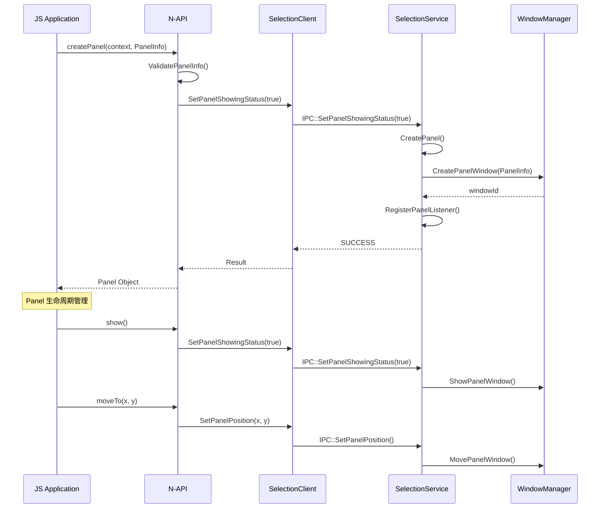

# 架构说明

本文档详细描述划词服务子系统的整体架构设计，包括核心组件划分、数据流设计、线程模型以及关键时序流程。

## 1. 系统架构总览

### 1.1 架构定位

划词服务子系统是 OpenHarmony 基础服务层的重要组成部分，位于 `foundation/systemabilitymgr/` 目录下，负责提供全局文本选择能力。其核心职责包括：

1. **全局划词捕获**: 跨应用捕获用户选中的文本内容
2. **划词应用管理**: 管理划词扩展 Ability 的生命周期
3. **面板管理**: 提供面板创建、显示、移动、销毁能力
4. **配置持久化**: 管理划词服务的用户级配置项

### 1.2 系统分层

```
┌─────────────────────────────────────────────────────────────┐
│                    JavaScript/ArkTS Layer                   │
│   (selectionInput.SelectionManager, SelectionPanel, etc.)  │
├─────────────────────────────────────────────────────────────┤
│                      N-API Binding Layer                    │
│         (frameworks/js/napi/*/ *_module.cpp)               │
├─────────────────────────────────────────────────────────────┤
│                     Client Library                          │
│        (selection_client.so, ISelectionService Proxy)      │
├─────────────────────────────────────────────────────────────┤
│                         IPC Layer                          │
│              (Binder Driver, ISelectionService)            │
├─────────────────────────────────────────────────────────────┤
│                   Selection Service (SA)                   │
│         (libselection_service.z.so, SA ID: 8500)           │
├─────────────────────────────────────────────────────────────┤
│                    Input & Focus Monitor                    │
│              (InputManager, FocusMonitorManager)           │
└─────────────────────────────────────────────────────────────┘
```

**证据来源**: 目录结构分析 `frameworks/js/napi/` + `service/BUILD.gn` + `interfaces/idl/`

## 2. 核心模块划分

### 2.1 模块职责矩阵

| 模块名称 | 源码位置 | 职责描述 | 稳定性 |
|---------|---------|---------|--------|
| SelectionService | `service/src/` | 核心服务实现、IPC 接口 | Stable |
| SelectionAbility | `frameworks/native/selection_ability/` | Native Ability 框架 | Stable |
| SelectionExtension | `frameworks/native/selection_extension/` | 扩展 Ability 实现 | Stable |
| SelectionClient | `frameworks/native/selection_client/` | 客户端 IPC 调用 | Stable |
| SelectionPanel | `frameworks/js/napi/selection_panel/` | 面板 N-API | Stable |
| SelectionManager | `frameworks/js/napi/selection_ability/` | 管理器 N-API | Stable |
| SelectionExtensionAbility | `frameworks/js/napi/selection_extension_ability/` | 扩展 Ability N-API | Stable |
| SelectionExtensionContext | `frameworks/js/napi/selection_extension_context/` | 上下文 N-API | Stable |

### 2.2 模块依赖关系

**证据来源**: 各模块 `BUILD.gn` 文件的 `deps` 和 `external_deps` 配置

```
SelectionService
├── ISelectionService (IPC Interface)
│   ├── ISelectionListener (回调接口)
│   ├── SelectionInfoData (数据结构)
│   └── SelectionFocusChangeInfo (焦点变化信息)
├── SelectionConfig (配置管理)
├── SelectionInputMonitor (输入监控)
├── FocusMonitorManager (焦点监控)
└── SelectionAppValidator (应用校验)

SelectionClient (Inner API)
├── ISelectionService Proxy
└── ISelectionListener Proxy

N-API Modules
├── SelectionManager → SelectionClient
├── SelectionPanel → SelectionClient
├── SelectionExtensionAbility → SelectionClient
└── SelectionExtensionContext → SelectionClient
```

### 2.3 目录结构与职责映射

```
selectionfwk/
├── common/                          # 公共代码模块
│   ├── callback_handler.cpp/h       # 回调处理工具
│   ├── callback_object.cpp/h       # JS 回调对象封装
│   ├── concurrent_map.h            # 并发 Map 实现
│   ├── event_checker.cpp/h         # 事件类型校验
│   ├── selection_data_inner.h      # 内部数据结构定义
│   ├── selection_js_utils.h/cpp    # JS 工具函数
│   ├── util.cpp/h                  # 通用工具函数
│   └── selectionmethod_trace.cpp/h # 方法追踪
│
├── frameworks/
│   ├── js/napi/                    # N-API 实现
│   │   ├── selection_ability/      # SelectionManager
│   │   ├── selection_panel/        # SelectionPanel
│   │   ├── selection_extension_ability/
│   │   ├── selection_extension_context/
│   │   └── selection_client/       # 异步调用封装
│   │
│   ├── native/                     # Native 实现
│   │   ├── selection_ability/      # Native Ability
│   │   ├── selection_extension/   # Native Extension
│   │   └── selection_client/       # Client 库
│   │
│   └── ets/                        # ArkTS 实现
│       ├── taihe/                  # Taihe UI 框架集成
│       └── ets/                    # ETS 扩展
│
├── interfaces/
│   ├── idl/                        # IPC 接口定义
│   │   ├── ISelectionService.idl
│   │   └── ISelectionListener.idl
│   │
│   └── inner_kits/
│       └── selection_client/       # 内部 API 头文件
│           ├── include/
│           │   ├── selection_client.h
│           │   └── visibility.h
│           └── BUILD.gn
│
├── service/
│   ├── src/                        # 服务核心实现
│   │   ├── selection_service.cpp   # 主服务入口
│   │   ├── selection_input_monitor.cpp  # 输入监控
│   │   ├── selection_config.cpp    # 配置管理
│   │   ├── db_selection_config_repository.cpp  # DB 持久化
│   │   ├── sys_selection_config_repository.cpp # 系统配置
│   │   ├── selection_app_validator.cpp # 应用校验
│   │   ├── focus_monitor_manager.cpp   # 焦点管理
│   │   └── ...
│   │
│   ├── include/                    # 服务头文件
│   │   ├── selection_service.h
│   │   ├── selection_interface.h
│   │   └── ...
│   │
│   ├── focus_monitor/             # 焦点监控子模块
│   │   ├── include/
│   │   └── src/
│   │
│   └── BUILD.gn
│
├── sa_profile/                     # SA 配置
│   ├── BUILD.gn
│   └── 8500.json                  # SA ID: 8500
│
├── etc/
│   ├── init/                      # 初始化配置
│   │   ├── BUILD.gn
│   │   └── selection_service.cfg
│   │
│   └── para/                      # 参数配置
│       ├── BUILD.gn
│       ├── selection_para
│       └── selection_para_dac
│
├── utils/                         # 工具代码
│   ├── include/
│   ├── src/
│   │   └── selection_timer.cpp
│   └── BUILD.gn
│
├── hiappevent_agent/              # HiAppEvent 打点
├── sysevent/                      # HiSysEvent 打点
│   └── BUILD.gn
│
├── test/                          # 测试目录 (不纳入本文档范围)
│
├── bundle.json                    # 组件配置
├── selection_service.gni          # 构建配置
└── README.md                      # 项目说明
```

## 3. 数据结构定义

### 3.1 SelectionInfoData

**证据来源**: `common/selection_data_inner.h:29-117`

```cpp
struct SelectionInfoData : public Parcelable {
    SelectionInfo data;
    
    // 序列化/反序列化
    bool ReadFromParcel(Parcel &in);
    bool Marshalling(Parcel &out) const;
    static SelectionInfoData *Unmarshalling(Parcel &in);
};
```

**字段说明**:

| 字段名 | 类型 | 说明 |
|-------|------|------|
| selectionType | SelectionType | 选择类型枚举 |
| startDisplayX | int32_t | 选中区域起始屏幕 X 坐标 |
| startDisplayY | int32_t | 选中区域起始屏幕 Y 坐标 |
| endDisplayX | int32_t | 选中区域结束屏幕 X 坐标 |
| endDisplayY | int32_t | 选中区域结束屏幕 Y 坐标 |
| startWindowX | int32_t | 选中区域起始窗口 X 坐标 |
| startWindowY | int32_t | 选中区域起始窗口 Y 坐标 |
| endWindowX | int32_t | 选中区域结束窗口 X 坐标 |
| endWindowY | int32_t | 选中区域结束窗口 Y 坐标 |
| displayId | uint32_t | 显示器 ID |
| windowId | uint32_t | 窗口 ID |
| bundleName | String | 应用 Bundle 名称 |

### 3.2 SelectionFocusChangeInfo

**证据来源**: `common/selection_data_inner.h:124-174`

```cpp
class SelectionFocusChangeInfo : public Parcelable {
    int32_t windowId_ = -1;
    uint64_t displayId_ = 0;
    int32_t pid_ = -1;
    int32_t uid_ = -1;
    uint32_t windowType_ = 1;
    bool isFocused_ = false;
    FocusChangeSource source_ = FocusChangeSource::WindowManager;
};
```

### 3.3 焦点变化来源枚举

```cpp
enum class FocusChangeSource : uint32_t {
    WindowManager,  // 来自窗口管理器
    InputManager,   // 来自输入管理器
};
```

## 4. 线程模型

### 4.1 服务线程架构

**证据来源**: `service/src/selection_service.cpp` 分析

```
┌─────────────────────────────────────────────────────────────┐
│                   Main Thread (UI Thread)                   │
│   - SystemAbility 主线程                                    │
│   - IPC 请求处理                                            │
│   - 状态机流转                                              │
├─────────────────────────────────────────────────────────────┤
│                SelectionInputMonitor Thread                 │
│   - 独立线程监听多模输入事件                                 │
│   - 键鼠事件处理                                            │
│   - 状态机触发                                              │
├─────────────────────────────────────────────────────────────┤
│                 FocusMonitor Thread                        │
│   - 焦点变化监听                                            │
│   - 窗口切换响应                                            │
├─────────────────────────────────────────────────────────────┤
│                   IPC Threads (Binder)                      │
│   - 按需创建                                                │
│   - IPC 请求处理                                            │
└─────────────────────────────────────────────────────────────┘
```

### 4.2 输入监控线程

**证据来源**: `service/src/selection_input_monitor.cpp`

```cpp
class SelectionInputMonitor : public MMI::InputObserver {
public:
    virtual void OnInputEvent(std::shared_ptr<MMI::KeyEvent> event) override;
    virtual void OnInputEvent(std::shared_ptr<MMI::PointerEvent> event) override;
};
```

### 4.3 焦点监控线程

**证据来源**: `service/focus_monitor/` 目录结构

```cpp
class FocusMonitorManager {
public:
    void RegisterFocusChangeListener(std::shared_ptr<FocusChangeListener> listener);
    void UnregisterFocusChangeListener(std::shared_ptr<FocusChangeListener> listener);
};
```

## 5. 状态机设计

### 5.1 划词状态流转

**证据来源**: 服务状态管理逻辑

```
┌─────────┐    双击事件     ┌─────────┐    抬起事件     ┌─────────┐
│  IDLE   │──────────────▶│ SELECTING│──────────────▶│ SELECTED│
└─────────┘               └─────────┘               └─────────┘
       │                       │                       │
       │                       │                       │ 超时/取消
       │                       │                       ▼
       │                       │               ┌─────────┐
       │                       └──────────────▶│  PANEL  │
       │                                   │   SHOWING  │
       │                                   └─────────┘
       │                                          │
       │                                          │ 点击其他区域
       └──────────────────────────────────────────┘
```

### 5.2 状态转换触发条件

| 当前状态 | 事件 | 下一状态 | 说明 |
|---------|------|---------|------|
| IDLE | 双击 | SELECTING | 进入划词选择状态 |
| SELECTING | 抬起 | SELECTED | 划词完成，进入选中状态 |
| SELECTED | 超时 | IDLE | 超时未操作，复位 |
| SELECTED | 点击面板 | PANEL_SHOWING | 面板显示 |
| PANEL_SHOWING | 点击空白 | IDLE | 取消面板显示 |

## 6. IPC 接口定义

### 6.1 ISelectionService 接口

**证据来源**: `interfaces/idl/ISelectionService.idl`

```idl
interface OHOS.SelectionFwk.ISelectionService {
    void RegisterListener([in] ISelectionListener listener);
    void UnregisterListener([in] ISelectionListener listener);
    void IsCurrentSelectionApp([in] int pid, [out] boolean resultValue);
    void GetSelectionContent([out] String selectionContent);
    void SetPanelShowingStatus([in] boolean status);
};
```

### 6.2 ISelectionListener 接口

**证据来源**: `interfaces/idl/ISelectionListener.idl`

```idl
interface OHOS.SelectionFwk.ISelectionListener {
    void OnSelectionChange([in] SelectionInfoData selectionInfoData);
    void FocusChange([in] SelectionFocusChangeInfo focusChangeInfo);
};
```

### 6.3 IPC 数据序列化

**证据来源**: `selection_data_inner.h` 中的 Parcelable 实现

```
SelectionInfoData ── Marshalling() ──▶ Parcel Buffer ──▶ IPC Binder
                    │
                    └── ReadFromParcel() ◀── IPC Response ◀──
```

## 7. 配置管理架构

### 7.1 配置类型

| 配置类型 | 存储方式 | 访问方式 |
|---------|---------|---------|
| 用户配置 | Relational Store (RDB) | SysSelectionConfigRepository |
| 系统配置 | 系统参数 | SystemAbility |
| DAC 配置 | 配置文件 | Init |

### 7.2 配置仓库实现

**证据来源**: `service/src/*_selection_config_repository.cpp`

```
┌─────────────────────────────────────────────────────────────┐
│                   SelectionConfig                           │
│         (统一配置访问接口，内存缓存)                         │
├─────────────────────────────────────────────────────────────┤
│         │                    │                    │        │
         ▼                    ▼                    ▼
┌─────────────────┐  ┌─────────────────┐  ┌─────────────────┐
│ SysSelection    │  │ DBSelection     │  │ SelectionConfig │
│ ConfigRepository│  │ ConfigRepository│  │ Database        │
│ (系统参数)      │  │ (用户配置)      │  │ (持久化存储)    │
└─────────────────┘  └─────────────────┘  └─────────────────┘
```

## 8. 时序图

### 8.1 划词完整流程



### 8.2 面板创建流程



## 9. 关键设计决策

### 9.1 SA 懒加载机制

**证据来源**: `sa_profile/8500.json`

```json
{
    "name": 8500,
    "libpath": "libselection_service.z.so",
    "run-on-create": false,
    "auto-restart": true
}
```

**设计理由**:
- `run-on-create: false`: 延迟启动，按需初始化
- `auto-restart: true`: 服务异常时自动恢复

### 9.2 事件驱动架构

**设计模式**: 观察者模式 + 状态机

**证据来源**: `service/src/selection_service.cpp:56-58`

```cpp
const bool REGISTER_RESULT = SystemAbility::MakeAndRegisterAbility(
    SelectionService::GetInstance().GetRefPtr());
sptr<ISelectionListener> SelectionService::listener_ { nullptr };
```

### 9.3 异步回调设计

**证据来源**: `frameworks/js/napi/selection_client/async_call.h/cpp`

```cpp
class AsyncCall {
public:
    static napi_value Call(napi_env env, napi_callback_info info,
                           AsyncContext* ctx,
                           void*(*Exec)(AsyncContext*),      // FFRT 线程执行
                           void(*Complete)(AsyncContext*));  // JS 线程回调
};
```

---

**相关链接**:

- [返回 SUMMARY](./SUMMARY.md)
- [N-API 参考](./03_NAPI_Reference.md)
- [构建系统](./04_Build_System.md)
- [安全评审](./05_Security_Review.md)
