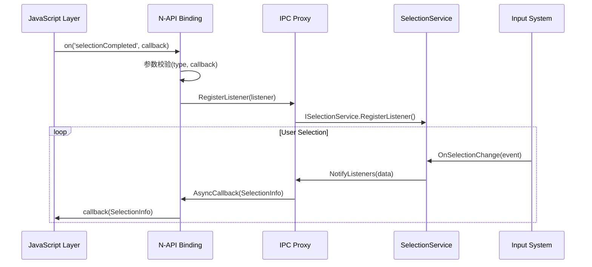
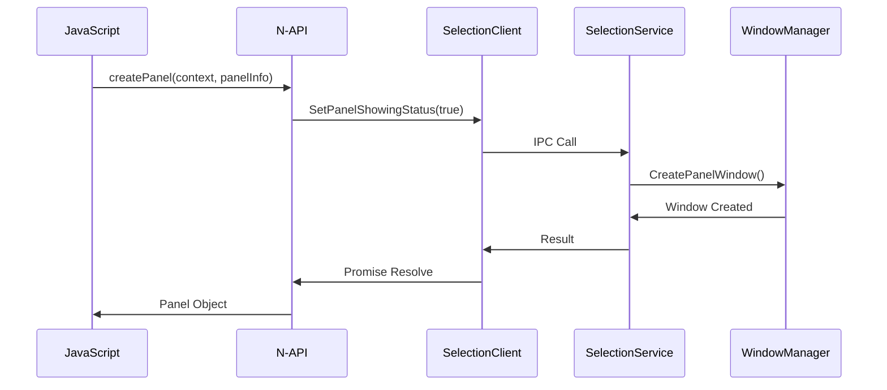

# N-API 接口参考

本文档详细描述划词服务子系统对外暴露的所有 JavaScript API，包括 N-API 绑定层实现、参数校验机制、错误码定义以及调用链路追溯。

## 1. API 概览

划词服务子系统提供四个主要 N-API 模块，涵盖划词扩展的完整生命周期管理：

| 模块名称 | JS 命名空间 | 主要功能 |
|---------|-------------|----------|
| selectionManager | selectionInput.SelectionManager | 划词核心管理器，监听事件、获取内容、管理面板 |
| selectionPanel | selectionInput.SelectionPanel | 划词面板属性与信息管理 |
| selectionExtensionAbility | selectionInput.SelectionExtensionAbility | 划词扩展 Ability 生命周期 |
| selectionExtensionContext | selectionInput.SelectionExtensionContext | 划词扩展上下文管理 |

**证据来源**: `frameworks/js/napi/` 目录下各模块的 `*_module.cpp` 文件

## 2. SelectionManager 模块

### 2.1 模块注册点

**文件位置**: `frameworks/js/napi/selection_ability/selection_engine_module.cpp`

```cpp
static napi_module _module = {
    .nm_filename = "libselectionmanager_napi.so/selection_ability.js",
    .nm_modname = "selectionInput.SelectionManager",
};
```

**注册函数**: `NAPI_selectionInput_SelectionManager_AutoRegister()` 通过 `napi_module_register` 完成自动注册

### 2.2 导出方法清单

基于 `js_selection_ability.cpp` 和 `js_selection_engine_setting.cpp` 分析，SelectionManager 导出以下核心方法：

| JS API 名称 | C++ 实现函数 | 功能描述 |
|-------------|--------------|----------|
| on(type, callback) | `JsSelectionAbility::Subscribe()` | 订阅划词完成事件，使用 callback 回调 |
| off(type, callback?) | `JsSelectionAbility::UnSubscribe()` | 取消订阅事件，callback 可选 |
| getSelectionContent() | `JsSelectionAbility::JsGetSelectionContent()` | 异步获取选中文本内容 |
| createPanel(ctx, info) | `JsSelectionAbility::JsCreatePanel()` | 创建划词面板 |
| getSelectedTextInfo() | `JsSelectionAbility::JsGetSelectedTextInfo()` | 获取选中文本详细信息 |

### 2.3 订阅事件类型

**证据来源**: `common/event_checker.h` 和 `event_checker.cpp`

```cpp
enum class EventSubscribeModule {
    SELECTION_METHOD_ABILITY,
};

const std::vector<std::string> VALID_EVENT_TYPES = {
    "selectionCompleted",  // 划词完成事件
};
```

### 2.4 订阅 API 详细规格

#### `on(type: 'selectionCompleted', callback: Callback<SelectionInfo>): void`

**C++ 实现**: `JsSelectionAbility::Subscribe()` (line 76-104)

**参数解析**:

```cpp
// 源码证据: js_selection_ability.cpp:76-90
size_t argc = ARGC_TWO;
napi_value argv[ARGC_TWO] = { nullptr };
NAPI_CALL(env, napi_get_cb_info(env, info, &argc, argv, &thisVar, &data));
std::string type;
if (argc < 2 || !JsUtil::GetValue(env, argv[0], type) ||
    !EventChecker::IsValidEventType(EventSubscribeModule::SELECTION_METHOD_ABILITY, type) ||
    JsUtil::GetType(env, argv[1]) != napi_function) {
    return nullptr;
}
```

**参数校验规则**:

| 参数 | 类型要求 | 校验逻辑 | 错误处理 |
|-----|---------|---------|---------|
| type | string | 必须为 "selectionCompleted" | 返回 nullptr |
| callback | function | 必须是 JS 函数类型 | 返回 nullptr |

**异步回调触发时机**:

当用户完成划词操作后，服务端通过 `ISelectionListener::OnSelectionChange()` 回调触发，数据经由 IPC 传递至 N-API 层，最终通过 `JSCallbackObject` 触发 JS 回调。

### 2.5 获取内容 API 详细规格

#### `getSelectionContent(): Promise<string>`

**C++ 实现**: `JsSelectionAbility::JsGetSelectionContent()` (异步调用链)

**调用链路**:

```
JS API → async_call.cpp AsyncCall机制 → selection_client.cpp → IPC调用 → SelectionService
```

**返回结果**:

- **成功**: Promise resolve 返回 string 类型的选中文本内容
- **失败**: Promise reject 返回 Error 对象，包含错误码和描述

**长度限制**: 选中文本最大长度为 6000 字节

**证据来源**: README.md 约束说明及 `selection_client.h` 接口定义

## 3. SelectionPanel 模块

### 3.1 模块注册点

**文件位置**: `frameworks/js/napi/selection_panel/selection_panel_module.cpp`

```cpp
static napi_module _module = {
    .nm_version = 1,
    .nm_flags = 0,
    .nm_filename = nullptr,
    .nm_register_func = Init,
    .nm_modname = "selectionInput.SelectionPanel",
    .nm_priv = ((void *)0),
    .reserved = { 0 }
};

extern "C" __attribute__((constructor)) void NAPI_selectionInput_SelectionPanel_AutoRegister()
{
    napi_module_register(&_module);
}
```

### 3.2 导出方法清单

**证据来源**: `js_selection_panel.cpp` 和 `js_selection_panel.h`

| JS API 名称 | C++ 实现函数 | 功能描述 |
|-------------|--------------|----------|
| show() | `JsSelectionPanel::Show()` | 显示面板 |
| hide() | `JsSelectionPanel::Hide()` | 隐藏面板 |
| moveTo(x, y) | `JsSelectionPanel::MoveTo()` | 移动面板至指定位置 |
| startMoving() | `JsSelectionPanel::StartMoving()` | 启用面板拖动 |
| setPanelType(type) | `JsSelectionPanel::SetPanelType()` | 设置面板类型 |
| getPanelInfo() | `JsSelectionPanel::GetPanelInfo()` | 获取面板信息 |

### 3.3 面板类型枚举

**证据来源**: PanelInfo 接口定义

```typescript
enum PanelType {
    PANEL_TYPE_ABC,      // 默认面板
    PANEL_TYPE_CUSTOM,   // 自定义面板
}
```

### 3.4 面板移动 API 详细规格

#### `moveTo(x: number, y: number): Promise<void>`

**C++ 实现**: `JsSelectionPanel::MoveTo()` 

**参数解析**:

```cpp
// 参数验证逻辑
napi_value argv[ARGC_TWO] = { nullptr };
NAPI_CALL(env, napi_get_cb_info(env, info, &argc, argv, &thisVar, &data));
double x, y;
if (!JsUtil::GetValue(env, argv[0], x) || !JsUtil::GetValue(env, argv[1], y)) {
    return nullptr;
}
```

**参数校验规则**:

| 参数 | 类型要求 | 范围限制 | 错误码 |
|-----|---------|---------|--------|
| x | number | 0 ≤ x ≤ 屏幕宽度 | INVALID_PARAM |
| y | number | 0 ≤ y ≤ 屏幕高度 | INVALID_PARAM |

**异步机制**: 使用 Promise 异步返回，通过 IPC 调用 `SelectionService::SetPanelShowingStatus()` 实现

## 4. SelectionExtensionAbility 模块

### 4.1 模块注册点

**文件位置**: `frameworks/js/napi/selection_extension_ability/selection_extension_ability_module.cpp`

**特殊设计**: 该模块同时支持 JS 和 ArkTS (ABC) 双形态

```cpp
static napi_module _module = {
    .nm_filename = "libselectionextensionability_napi.so/selection_extension_ability.js",
    .nm_modname = "selectionInput.SelectionExtensionAbility",
};

extern "C" __attribute__((visibility("default"))) void
    NAPI_selectionInput_SelectionExtensionAbility_GetJSCode(const char** buf, int* bufLen)
{
    if (buf != nullptr) {
        *buf = _binary_selection_extension_ability_js_start;
    }
    if (bufLen != nullptr) {
        *bufLen = _binary_selection_extension_ability_js_end - _binary_selection_extension_ability_js_start;
    }
}

extern "C" __attribute__((visibility("default"))) void
    NAPI_selectionInput_SelectionExtensionAbility_GetABCCode(const char** buf, int* buflen)
{
    if (buf != nullptr) {
        *buf = _binary_selection_extension_ability_abc_start;
    }
    if (buflen != nullptr) {
        *buflen = _binary_selection_extension_ability_abc_end - _binary_selection_extension_ability_abc_start;
    }
}
```

### 4.2 生命周期回调

**导出函数**: `selection_extension_ability.js` 中定义的回调

| 回调名称 | 触发时机 | 功能描述 |
|---------|---------|---------|
| onCreate() | 扩展 Ability 创建 | 初始化资源 |
| onDestroy() | 扩展 Ability 销毁 | 清理资源 |
| onSelectionChange(data) | 选中文本变化 | 处理划词数据 |

### 4.3 上下文获取

Extension 通过 `getContext()` 获取 `selectionExtensionContext`，提供应用级操作能力。

## 5. SelectionExtensionContext 模块

### 5.1 模块注册点

**文件位置**: `frameworks/js/napi/selection_extension_context/selection_extension_context_module.cpp`

```cpp
static napi_module _module = {
    .nm_modname = "selectionInput.SelectionExtensionContext",
};
```

### 5.2 上下文方法

| JS API 名称 | 功能描述 |
|-------------|----------|
| getDisplayX() | 获取选中区域起始 X 坐标 |
| getDisplayY() | 获取选中区域起始 Y 坐标 |
| getSelectionType() | 获取选择类型 |

## 6. 错误码定义

### 6.1 错误码常量

**证据来源**: `service/src/selection_errors.h`

```cpp
enum SelectionServiceError {
    SUCCESS = 0,
    INVALID_DATA = 401,           // 参数错误
    NOT_SUPPORTED = 801,          // 不支持该操作
    PERMISSION_DENIED = 201,      // 权限拒绝
    SERVICE_UNAVAILABLE = 4600001,// 服务不可用
    TIMEOUT = 4600002,            // 操作超时
};
```

### 6.2 错误处理机制

**N-API 层错误处理**:

```cpp
// 源码证据: js_selection_ability.cpp:85-90
if (argc < 2 || !JsUtil::GetValue(env, argv[0], type) ||
    !EventChecker::IsValidEventType(EventSubscribeModule::SELECTION_METHOD_ABILITY, type) ||
    JsUtil::GetType(env, argv[1]) != napi_function) {
    SELECTION_HILOGE("subscribe failed, type: %{public}s!", type.c_str());
    return nullptr;
}
```

## 7. 调用链路图

### 7.1 划词事件订阅流程



### 7.2 面板创建与显示流程



## 8. 线程模型与异步机制

### 8.1 异步调用架构

**证据来源**: `frameworks/js/napi/selection_client/async_call.h/cpp`

```cpp
class AsyncCall {
public:
    static napi_value Call(napi_env env, napi_callback_info info,
                           AsyncContext* ctx, void*(*Exec)(AsyncContext*),
                           void(*Complete)(AsyncContext*));
};
```

**线程模型**:

- **JS 线程**: 参数解析、Promise 创建
- **Worker 线程**: 实际 IPC 调用 (通过 FFRT 调度)
- **JS 线程**: 结果回调、Promise resolve/reject

### 8.2 回调对象生命周期

**证据来源**: `common/callback_object.h/cpp`

```cpp
class JSCallbackObject {
public:
    JSCallbackObject(napi_env env, napi_value callback,
                     std::thread::id threadId,
                     std::shared_ptr<AppExecFwk::EventHandler> handler);
};
```

## 9. 参数校验工具

### 9.1 JsUtil 工具类

**证据来源**: `common/selection_js_utils.h/cpp`

| 方法名称 | 功能描述 |
|---------|---------|
| GetValue(env, value, &result) | 类型安全的值提取 |
| GetType(env, value) | 获取 napi_value 类型 |
| SetProperty(env, target, key, value) | 设置对象属性 |

### 9.2 EventChecker 事件校验

**证据来源**: `common/event_checker.h/cpp`

```cpp
class EventChecker {
public:
    static bool IsValidEventType(EventSubscribeModule module, const std::string& type);
};
```

## 10. 绑定文件清单

| 模块 | 源码文件 | 导出符号 |
|-----|---------|---------|
| SelectionManager | `selection_ability/BUILD.gn` | libselectionmanager_napi.so |
| SelectionPanel | `selection_panel/BUILD.gn` | libselectionpanel_napi.so |
| SelectionExtensionAbility | `selection_extension_ability/BUILD.gn` | libselectionextensionability_napi.so |
| SelectionExtensionContext | `selection_extension_context/BUILD.gn` | libselectionextensioncontext_napi.so |
| SelectionClient | `selection_client/BUILD.gn` | libselection_client.so |

---

**相关链接**:

- [返回 SUMMARY](../SUMMARY.md)
- [架构说明](./02_Architecture.md)
- [构建系统](./04_Build_System.md)
- [安全评审](./05_Security_Review.md)
