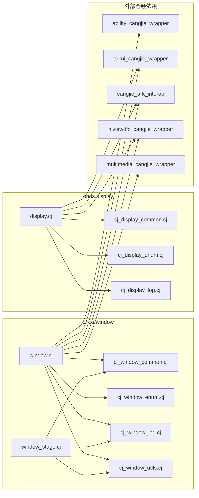
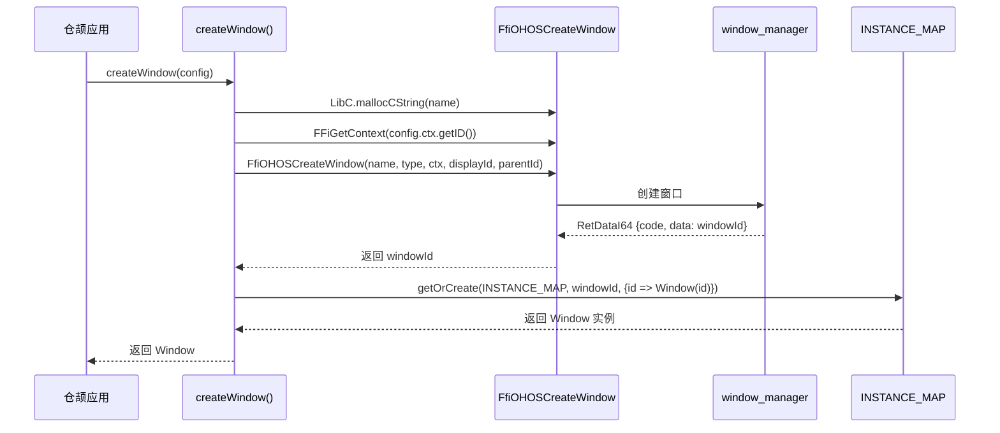
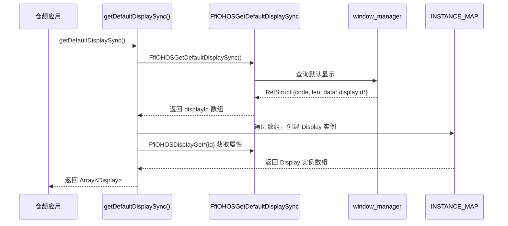
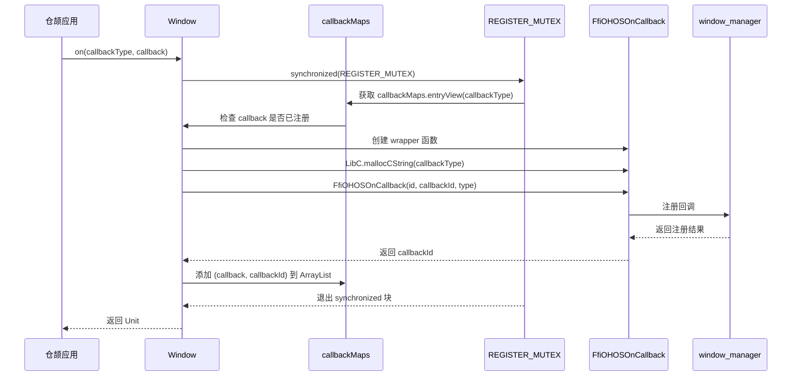
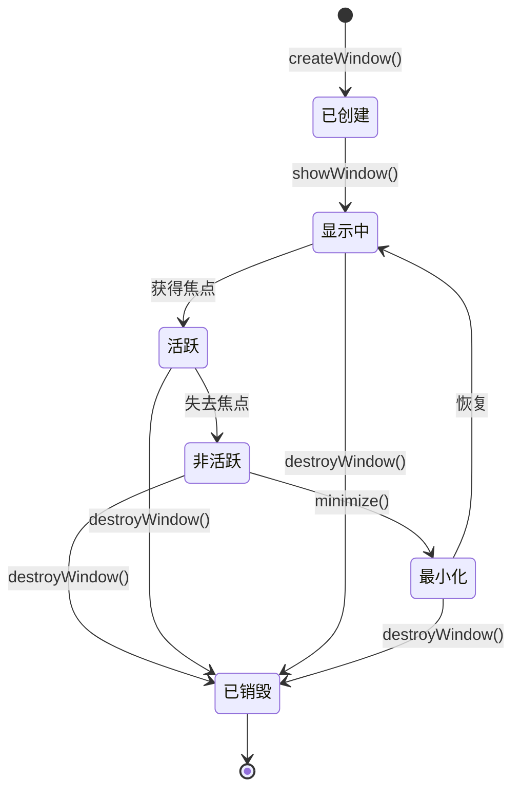
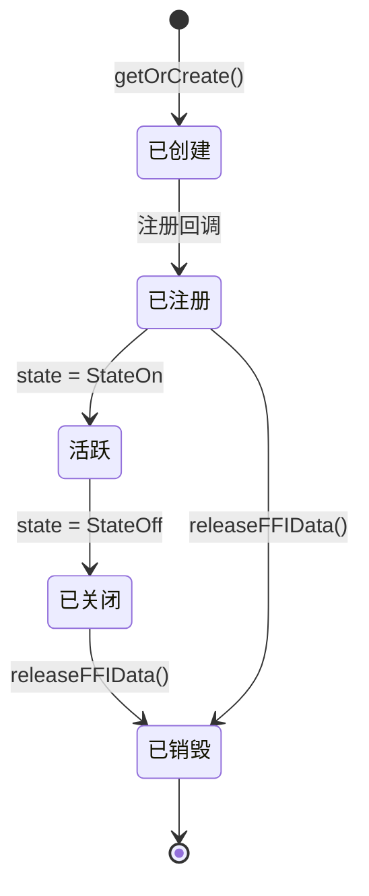
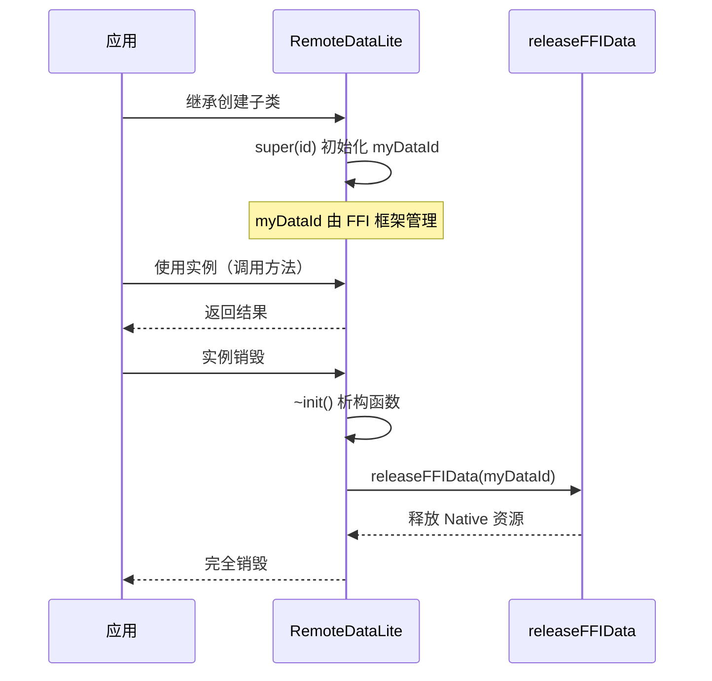
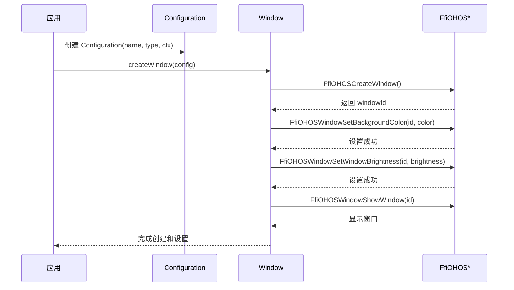
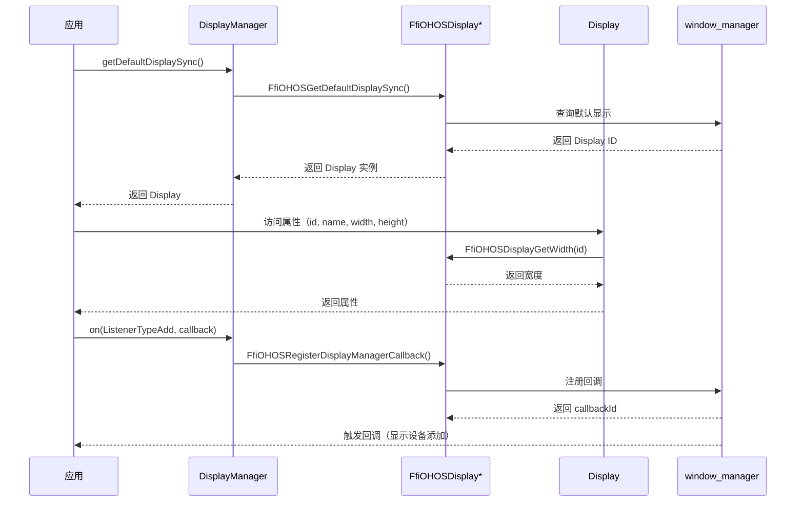
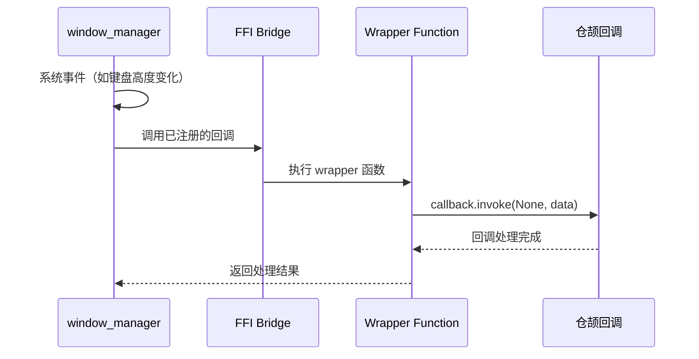

# 系统架构

> 组件图、数据流、线程模型、关键时序

---

## 目的

本文档说明 `window_cangjie_wrapper` 的系统架构，包括组件关系、数据流向、线程模型和关键时序，帮助开发者理解系统设计。

---

## 组件图

### 层次结构

```mermaid
graph TB
    subgraph仓颉应用层[Cangjie App]
        A1[应用代码]
    end

    subgraph仓颉封装层[Cangjie Wrapper]
        W1[ohos.window]
        W2[ohos.display]
        W3[公共工具]
    end

    subgraph FFI接口层[FFI Layer]
        F1[cj_window_ffi]
        F2[cj_display_ffi]
    end

    subgraph Native服务层[Native Services]
        N1[window_manager]
        N2[ability_runtime]
    end

    subgraph外部依赖[External Dependencies]
        D1[ability_cangjie_wrapper]
        D2[arkui_cangjie_wrapper]
        D3[cangjie_ark_interop]
        D4[hiviewdfx_cangjie_wrapper]
        D5[multimedia_cangjie_wrapper]
    end

    A1 --> W1
    A1 --> W2
    W1 --> D1
    W2 --> D2
    W1 --> D3
    W2 --> D3
    W1 --> D4
    W1 --> D5
    W2 --> D4
    W1 --> F1
    W2 --> F2
    F1 --> N1
    F2 --> N1
    F1 --> N2
    D1 --> N2
```

**证据**：
- 仓颉应用层使用 `ohos.window` 和 `ohos.display` API
- 通过 FFI 接口调用 Native 层实现（`cj_window_ffi` 和 `cj_display_ffi`）
- 依赖多个外部仓颉封装组件

### 模块依赖图



**证据**：
- `ohos/window/BUILD.gn:26-35`（cj_external_deps）
- `ohos/display/BUILD.gn:24-31`（cj_external_deps）

---

## 数据流

### 窗口创建流程



**证据**：`window.cj:190-209`

### Display 查询流程



**证据**：`display.cj:130-142`

### 回调注册流程



**证据**：`window.cj:769-802`

---

## 线程模型

### 并发控制

#### Mutex 保护

**场景**：回调注册/注销时的并发访问保护

**实现**：使用 `std.sync.Mutex` 保护共享数据结构

```cangjie
let REGISTER_MUTEX = Mutex()

synchronized(REGISTER_MUTEX) {
    // 操作 callbackMaps
    var value = callbackMaps.entryView(callbackType)
    value.value.getOrThrow().add((callback, callbackId))
}
```

**证据**：`window.cj:148`、`display.cj:96`

### 线程安全

| 数据结构 | 保护机制 | 证据 |
|----------|----------|--------|
| `Window.INSTANCE_MAP` | `getOrCreate()` 原子操作（线程安全） | `ohos.ffi.getOrCreate` |
| `callbackMaps` | `Mutex` 同步块 | `window.cj:148`、`display.cj:96` |
| `CALLBACK_MAP` | `Mutex` 同步块 | `display.cj:96` |

### FFI 调用线程模型

**假设**：FFI 调用由 Native 层处理，仓颉层不控制线程

**特点**：
1. 每个 FFI 函数调用是同步的
2. 回调执行由 Native 层分发到仓颉线程
3. 使用 `unsafe` 块进行指针操作

**证据**：所有 FFI 函数定义（`window.cj:32-146`、`display.cj:27-93`）

---

## 资源生命周期

### Window 生命周期



**证据**：`window.cj:310-387`（方法实现）

### Display 生命周期



**证据**：`display.cj:683-690`（~init 析构函数）

### RemoteDataLite 生命周期



**证据**：`window.cj:295-297`、`display.cj:688-690`

---

## 关键时序

### 窗口创建与属性设置



**证据**：`window.cj:190-314`

### 显示设备查询与监听



**证据**：`display.cj:130-142`、`display.cj:295-330`

### 回调触发流程



**证据**：`window.cj:788-792`（wrapper 函数定义）

---

## 架构特点

### FFI 架构

**设计模式**：Foreign Function Interface（外部函数接口）

**优点**：
1. 复用成熟的 Native 层实现（window_manager 子系统）
2. 避免重复开发，保证功能对等性
3. 仓颉层轻量，仅负责类型转换和 API 封装

**证据**：`window.cj:32-146`、`display.cj:27-93`

### 资源管理模式

**设计模式**：RAII（Resource Acquisition Is Initialization）

**实现**：
```cangjie
public class Window <: RemoteDataLite {
    init(id: Int64) {
        super(id)  // 初始化 myDataId
    }

    ~init() {
        releaseFFIData(myDataId)  // 自动释放 Native 资源
    }
}
```

**证据**：`window.cj:290-297`、`display.cj:683-690`

### 回调管理模式

**设计模式**：观察者模式（Observer Pattern）

**特点**：
1. 使用 HashMap 存储多个回调
2. 支持同一事件类型注册多个回调
3. Mutex 保证线程安全
4. 自动释放 C 字符串资源（try-resource 模式）

**证据**：`window.cj:270-286`、`display.cj:97-108`

---

## 关键结论

| 结论 | 证据 |
|------|--------|
| 三层架构：仓颉应用层 → 仓颉封装层 → FFI 接口层 → Native 服务层 | 组件图 |
| display 和 window 模块独立，通过 Native 层协调 | 模块依赖图 |
| 使用 Mutex 保护并发访问，确保线程安全 | 线程模型 |
| 继承 RemoteDataLite 管理资源生命周期，自动释放 Native 资源 | 资源生命周期 |
| 支持异步回调机制，使用 HashMap + Mutex | 回调管理 |

---

**生成时间**: 2025-02-06
