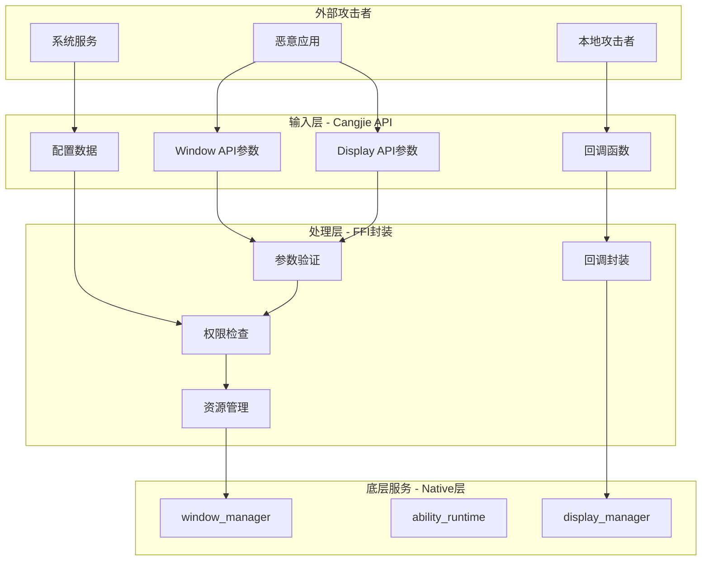
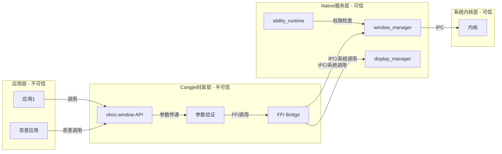

# 攻击面分析 (Attack Surface Analysis)

> 识别 Window Cangjie Wrapper 的所有外部输入入口、敏感操作和信任边界跨越点

---

## 目的

本文档系统性地识别 `window_cangjie_wrapper` 项目的攻击面，帮助安全研究员：
- 快速定位所有外部输入入口
- 识别敏感操作和权限检查点
- 理解信任边界跨越位置
- 为渗透测试提供起点

---

## 威胁模型



---

## 外部输入清单

### 1. 字符串输入

| API | 参数 | 类型 | 验证措施 | 风险等级 | 证据 |
|-----|------|------|----------|----------|------|
| `findWindow` | `name` | String | 空值检查 | 低 | window.cj:161 |
| `createWindow` | `config.name` | String | 空值检查 | 低 | window.cj:198-200 |
| `createSubWindow` | `name` | String | 无验证 | 中 | window_stage.cj:105 |
| `loadContent` | `path` | String | **无验证** | **高** | window_stage.cj:149 |
| `setWindowBackgroundColor` | `color` | String | **无格式验证** | 中 | window.cj:456 |
| `setWindowSystemBarProperties` | 多个颜色 | String | 无验证 | 中 | window.cj:733 |
| `Display.name` | 返回值 | String | 需要释放 | 低 | display.cj:511 |

**关键风险点**：
- `loadContent(path)` 未进行路径遍历检查（`../` 过滤）
- `setWindowBackgroundColor(color)` 未验证颜色格式（`#RRGGBB`）

---

### 2. 数值输入

| API | 参数 | 类型 | 范围检查 | 风险等级 | 证据 |
|-----|------|------|----------|----------|------|
| `resize` | `width/height` | UInt32 | **无上限检查** | 中 | window.cj:346 |
| `moveWindowTo` | `x/y` | Int32 | 无检查 | 低 | window.cj:328 |
| `setWindowBrightness` | `brightness` | Float32 | 无范围检查 | 低 | window.cj:475 |
| `setAspectRatio` | `ratio` | Float64 | 无检查 | 低 | window.cj:605 |
| `shiftAppWindowFocus` | `source/target` | Int32 | 无检查 | 低 | window.cj:255 |
| `createWindow` | `displayId` | Int64 | 无检查 | 低 | window.cj:203 |

**关键风险点**：
- `resize()` 未检查窗口大小上限，可能导致 Native 层整数溢出

---

### 3. 枚举/类型输入

| API | 参数 | 枚举类型 | 验证措施 | 风险等级 | 证据 |
|-----|------|----------|----------|----------|------|
| `createWindow` | `windowType` | WindowType | Native层检查 | 中 | window.cj:203 |
| `setPreferredOrientation` | `orientation` | Orientation | Native层检查 | 低 | window.cj:565 |
| `getWindowAvoidArea` | `areaType` | AvoidAreaType | Native层检查 | 低 | window.cj:584 |
| `setWindowColorSpace` | `colorSpace` | ColorSpace | Native层检查 | 低 | window.cj:635 |
| `Window.on/off` | `callbackType` | WindowCallbackType | **Cangjie层验证** | 低 | window.cj:769-842 |

**关键风险点**：
- 枚举类型主要在 Native 层验证，Cangjie 层仅进行部分回调类型检查

---

### 4. 回调函数输入

| API | 回调类型 | 事件来源 | 并发风险 | 证据 |
|-----|----------|----------|----------|------|
| `Window.on` | `Callback1Argument<UInt32>` | 键盘高度变化 | 有 | window.cj:769 |
| `Window.off` | 同上 | - | 有 | window.cj:817 |
| `Display.on` | `Callback1Argument<FoldStatus>` | 折叠状态变化 | 有 | display.cj:295 |
| `Display.off` | 同上 | - | 有 | display.cj:346 |

**回调注册表**（攻击者可操作）：
```cangjie
// window.cj:270-286
let callbackMaps = HashMap<String, ArrayList<(CallbackObject, Int64)>>([
    ("windowSizeChange", ArrayList<...>()),
    ("avoidAreaChange", ArrayList<...>()),
    ("keyboardHeightChange", ArrayList<...>()),
    // ... 共13种回调类型
])
```

---

### 5. 上下文/对象引用输入

| API | 参数 | 类型 | 空值检查 | 风险等级 | 证据 |
|-----|------|------|----------|----------|------|
| `createWindow` | `config.ctx` | BaseContext | ✅ 有检查 | 低 | window.cj:192-196 |
| `getLastWindow` | `ctx` | BaseContext | ✅ 有检查 | 低 | window.cj:225-229 |
| `WindowStage.init` | `windowStageHandler` | Int64 | 无检查 | 中 | window_stage.cj:67 |

---

## 敏感操作清单

### 1. 权限敏感操作

| 操作 | 所需权限 | 检查位置 | 风险等级 | 证据 |
|------|----------|----------|----------|------|
| 创建悬浮窗 (`TypeFloat`) | `ohos.permission.SYSTEM_FLOAT_WINDOW` | 注解标注，Native层检查 | **高** | window.cj:187 |
| 设置隐私模式 | `ohos.permission.PRIVACY_WINDOW` | 注解标注，Native层检查 | **高** | window.cj:524 |
| 窗口截图 (`snapshot`) | 无 | - | 中 | window.cj:689 |
| 设置窗口属性 | 无 | - | 低 | window.cj:328-605 |

**风险说明**：
- 权限检查完全依赖 Native 层，Cangjie 层仅通过注解标注
- 如果 Native 层权限检查被绕过，攻击者可直接创建悬浮窗

---

### 2. 资源敏感操作

| 操作 | 资源类型 | 释放机制 | 风险等级 | 证据 |
|------|----------|----------|----------|------|
| `createWindow` | Native窗口句柄 | RemoteDataLite析构 | 中 | window.cj:207 |
| `createSubWindow` | Native子窗口句柄 | RemoteDataLite析构 | 中 | window_stage.cj:112 |
| `getDefaultDisplaySync` | Native显示句柄 | RemoteDataLite析构 | 中 | display.cj:140 |
| `snapshot` | PixelMap图像 | PixelMap析构 | 低 | window.cj:694 |
| `mallocCString` | C字符串内存 | try-asResource自动释放 | 低 | 多处 |

**资源生命周期**：
```cangjie
// RemoteDataLite 模式
class Window <: RemoteDataLite {
    init(id: Int64) { super(id) }  // myDataId = Native句柄
    ~init() { releaseFFIData(myDataId) }  // 自动释放Native资源
}
```

---

### 3. 系统服务调用

| 操作 | 底层服务 | 调用方式 | 风险等级 | 证据 |
|------|----------|----------|----------|------|
| 所有Window操作 | window_manager | FFI (46个函数) | 中 | window.cj:32-146 |
| 所有WindowStage操作 | window_manager | FFI (12个函数) | 中 | window_stage.cj:27-52 |
| 所有Display操作 | display_manager | FFI (33个函数) | 中 | display.cj:27-93 |

---

## 信任边界图



### 信任边界跨越点

| 边界 | 位置 | 风险 | 缓解措施 |
|------|------|------|----------|
| **应用 → Cangjie API** | 所有Public API入口 | 参数注入 | 参数验证、类型检查 |
| **Cangjie → FFI** | `foreign {}` 块 | 指针操作、内存安全 | unsafe块封装、RAII |
| **FFI → Native** | `FfiOHOS*` 函数 | Native层漏洞 | Native层安全检查 |

---

## 攻击向量汇总

### 高优先级攻击向量

| 向量 | 目标 | 条件 | 潜在影响 |
|------|------|------|----------|
| **路径遍历** | `loadContent` | 应用有窗口权限 | 读取任意文件 |
| **权限绕过** | `createWindow(TypeFloat)` | Native层检查失败 | 创建未授权悬浮窗 |
| **整数溢出** | `resize(UInt32.MAX)` | Native层未检查 | 内存损坏 |

### 中优先级攻击向量

| 向量 | 目标 | 条件 | 潜在影响 |
|------|------|------|----------|
| **回调竞态** | 回调注册 | 多线程应用 | 悬垂回调、UAF |
| **内存泄露** | Window/Display实例 | 频繁创建销毁 | OOM |
| **格式注入** | `setWindowBackgroundColor` | 无格式验证 | Native层解析错误 |

### 低优先级攻击向量

| 向量 | 目标 | 条件 | 潜在影响 |
|------|------|------|----------|
| **信息泄露** | 错误日志 | 日志可读 | 泄露窗口ID等 |
| **DoS** | 超大数值参数 | 无范围检查 | 拒绝服务 |

---

## 审计检查清单

### 输入验证审计

- [ ] 所有字符串输入是否进行长度检查？
- [ ] 路径参数是否过滤 `../` 遍历？
- [ ] 数值参数是否设置合理范围？
- [ ] 枚举参数是否在有效范围内？
- [ ] 回调函数是否验证非空？

### 权限审计

- [ ] 权限敏感API是否在Cangjie层进行二次检查？
- [ ] 权限错误是否返回统一错误码？
- [ ] 是否存在权限提升路径？

### 内存安全审计

- [ ] 所有 `unsafe` 块是否必要？
- [ ] C字符串分配是否使用 `try-asResource`？
- [ ] 指针操作前是否检查空值？
- [ ] 析构函数是否释放所有资源？

### 并发安全审计

- [ ] 回调注册是否使用互斥锁保护？
- [ ] 静态集合（INSTANCE_MAP）是否线程安全？
- [ ] 是否存在竞态窗口？

---

## 关键结论

| 结论 | 证据 |
|------|------|
| **90处unsafe代码块** 构成主要攻击面 | window.cj(51) + display.cj(31) + others(8) |
| **路径遍历风险** 存在于 `loadContent` | window_stage.cj:149 |
| **权限检查完全依赖Native层** 存在绕过风险 | window.cj:187,524 |
| **回调机制存在竞态条件** | window.cj:777-801 |
| **资源管理依赖RemoteDataLite** 相对安全 | window.cj:295-297 |

---

## 相关文档

- [安全风险评估](06_SecurityReview.md) - 详细风险分析和修复建议
- [对外接口文档](04_Interface.md) - 完整API清单
- [内部实现细节](08_Internals.md) - 资源生命周期管理

---

**生成时间**: 2026-02-07
