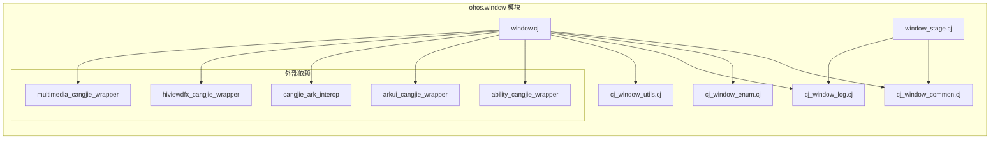
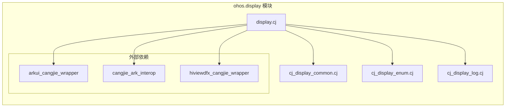

# 内部 API

> 模块接口、依赖方向、稳定性标注

---

## 目的

本文档说明 `window_cangjie_wrapper` 的内部 API 接口、模块依赖关系和接口稳定性，帮助理解代码内部工作机制。

---

## 模块内部接口

### ohos.window 模块

#### Window 类内部接口

| 接口 | 可见性 | 稳定性 | 证据 |
|------|--------|----------|--------|
| `init(id: Int64)` | internal | 稳定 | `window.cj:290-293` |
| `~init()` | internal | 稳定 | `window.cj:295-297` |
| `getID()` | public（继承） | 稳定 | `RemoteDataLite` 基类 |
| `showWindow()` | public | 稳定 | `window.cj:310-315` |
| `destroyWindow()` | public | 稳定 | `window.cj:382-387` |
| `findCallbackObject(list, callback)` | private | 稳定 | `window.cj:747-754` |
| `onKeyboardHeightChange(callbackType, callback)` | private | 稳定 | `window.cj:776-802` |
| `commonUnregister(callbackType)` | private | 稳定 | `window.cj:846-862` |

#### WindowStage 类内部接口

| 接口 | 可见性 | 稳定性 | 证据 |
|------|--------|----------|--------|
| `init(windowStageHandler: Int64)` | protected | 稳定 | `window_stage.cj:66-70` |
| `~init()` | internal | 稳定 | `window_stage.cj:72-74` |
| `getID()` | public（继承） | 稳定 | `RemoteDataLite` 基类 |
| `getMainWindow()` | public | 稳定 | `window_stage.cj:86-92` |
| `createSubWindow(name)` | public | 稳定 | `window_stage.cj:105-114` |
| `getSubWindow()` | public | 稳定 | `window_stage.cj:126-137` |
| `loadContent(path)` | public | 稳定 | `window_stage.cj:149-155` |

### ohos.display 模块

#### Display 类内部接口

| 接口 | 可见性 | 稳定性 | 证据 |
|------|--------|----------|--------|
| `init(id: Int64)` | internal | 稳定 | `display.cj:683-686` |
| `~init()` | internal | 稳定 | `display.cj:688-690` |
| `getID()` | public（继承） | 稳定 | `RemoteDataLite` 基类 |
| 所有属性 getter | public | 稳定 | `display.cj:496-681` |

---

## 依赖方向

### ohos.window 模块依赖图



**依赖详情**：
- `window.cj` 导入 `ohos.ffi.*`、`ohos.app.ability.*`、`ohos.business_exception.*`、`ohos.labels.*`、`ohos.callback_invoke.*`、`ohos.multimedia.image.*`
- `window_stage.cj` 导入 `ohos.ffi.*`、`ohos.callback_invoke.*`、`ohos.business_exception.*`、`ohos.labels.*`
- `cj_window_utils.cj` 提供 `checkRet()` 错误处理函数，被所有模块使用

**证据**：`ohos/window/BUILD.gn:26-35`、源代码 `import` 语句

### ohos.display 模块依赖图



**依赖详情**：
- `display.cj` 导入 `ohos.ffi.*`、`ohos.callback_invoke.*`、`ohos.business_exception.*`、`ohos.labels.*`、`ohos.hilog.*`
- `cj_display_common.cj` 提供公共结构体定义

**证据**：`ohos/display/BUILD.gn:24-31`、源代码 `import` 语句

---

## 模块间依赖

### ohos.window → ohos.display

**交互场景**：较少直接调用，主要通过 Native 层协调

**证据**：window 模块未直接导入 display 模块

| 交互类型 | 说明 | 证据 |
|----------|--------|--------|
| **Display 查询** | window 模块需要 Display 信息时，直接调用 `getDefaultDisplaySync()` | `window.cj:203` |
| **窗口创建** | `createWindow(config)` 接受 `displayId` 参数，使用 Native 层处理 | `window.cj:203` |

### 共享工具模块

**cj_window_utils.cj**：
- 提供 `checkRet(errCode, message)` 统一错误处理
- 被所有 FFI 调用点使用

**证据**：`window.cj`、`window_stage.cj`、`display.cj` 中所有 FFI 调用都使用 `checkRet()`

---

## 接口稳定性标注

### 稳定接口（不破坏性修改）

| 模块 | 接口/类 | 稳定性 | 理由 | 证据 |
|------|----------|----------|--------|
| **ohos.window** | `Window`、`WindowStage` | 稳定 | 继承自 `RemoteDataLite`，生命周期由 FFI 框架管理 |
| **ohos.window** | `findWindow()`, `createWindow()`, `getLastWindow()` | 稳定 | 核心公共 API，向后兼容 |
| **ohos.window** | `Window` 所有属性设置方法 | 稳定 | 直接封装 FFI 调用 |
| **ohos.window** | `WindowStage` | 稳定 | WindowStage 是独立的生命周期实体 |
| **ohos.display** | `Display` | 稳定 | 继承自 `RemoteDataLite`，生命周期由 FFI 框架管理 |
| **ohos.display** | `getDefaultDisplaySync()`, `getAllDisplays()` | 稳定 | 核心公共 API，向后兼容 |
| **ohos.display** | `Display` 所有属性 getter | 稳定 | 属性访问，无状态变更 |

### 内部实现接口（可能变化）

| 模块 | 接口/类 | 稳定性 | 理由 | 证据 |
|------|----------|----------|--------|
| **ohos.window** | `Window.INSTANCE_MAP` | 内部 | 单例 HashMap，管理 Window 实例 |
| **ohos.window** | `callbackMaps` | 内部 | HashMap 管理，可能重构 |
| **ohos.window** | `findCallbackObject()` | 内部 | 回调查找逻辑可能优化 |
| **ohos.window** | `on/off` 回调方法 | 内部 | 回调注册/注销逻辑可能调整 |
| **ohos.window** | FFI 函数签名 | 内部 | Native 层变化需要同步更新 |
| **ohos.display** | `Display.INSTANCE_MAP` | 内部 | 单例 HashMap，管理 Display 实例 |
| **ohos.display** | `CALLBACK_MAP` | 内部 | 全局 HashMap，管理回调 |

### 工具函数稳定性

| 函数 | 模块 | 稳定性 | 证据 |
|------|--------|----------|--------|
| `checkRet(errCode, message)` | cj_window_utils.cj | 稳定 | 统一错误处理，被所有模块依赖 |

---

## 内部数据结构

### 单例模式

#### Window.INSTANCE_MAP

```cangjie
static let INSTANCE_MAP = HashMap<Int64, Window>()
```

**目的**：管理全局 Window 实例，通过 ID 获取已存在的实例

**使用**：
- `getOrCreate(Window.INSTANCE_MAP, id, {id => Window(id)})`
- 避免重复创建相同 ID 的 Window 实例

**稳定性**：稳定（内部实现，不对外暴露）

**证据**：`window.cj:288`、`display.cj:486`

#### Display.INSTANCE_MAP

```cangjie
static let INSTANCE_MAP = HashMap<Int64, Display>()
```

**目的**：管理全局 Display 实例，通过 ID 获取已存在的实例

**稳定性**：稳定（内部实现，不对外暴露）

**证据**：`display.cj:486`

### 回调管理数据结构

#### Window.callbackMaps

```cangjie
let callbackMaps = HashMap<String, ArrayList<(CallbackObject, Int64)>>(
    [
        ("windowSizeChange", ...),
        ("avoidAreaChange", ...),
        ("keyboardHeightChange", ...),
        ("touchOutside", ...),
        ("screenshot", ...),
        ("dialogTargetTouch", ...),
        ("windowEvent", ...),
        ("windowVisibilityChange", ...),
        ("windowStatusChange", ...),
        ("windowTitleButtonRectChange", ...),
        ("noInteractionDetected", ...),
        ("windowRectChange", ...),
        ("subWindowClose", ...)
    ]
)
```

**目的**：管理 14 种窗口事件类型的回调

**稳定性**：内部数据结构，可能扩展

**证据**：`window.cj:270-286`

#### Display.CALLBACK_MAP

```cangjie
let CALLBACK_MAP = HashMap<String, ArrayList<(CallbackObject, Int64)>>(
    [
        (ListenerTypeAdd.getValue(), ...),
        (ListenerTypeRemove.getValue(), ...),
        (ListenerTypeChange.getValue(), ...),
        (ListenerTypeFoldStatusChange.getValue(), ...),
        (ListenerTypeFoldAngleChange.getValue(), ...),
        (ListenerTypeCaptureStatusChange.getValue(), ...),
        (ListenerTypeFoldDisplayModeChange.getValue(), ...),
        (ListenerTypeAvailableAreaChange.getValue(), ...)
    ]
)
```

**目的**：管理 8 种显示事件类型的回调

**稳定性**：内部数据结构，可能扩展

**证据**：`display.cj:97-108`

---

## 依赖方向避免环

### 依赖关系验证

**验证方法**：检查是否存在循环依赖

| 模块 | 依赖方向 | 是否形成环 | 证据 |
|------|----------|---------|--------|
| ohos.window → ability_cangjie_wrapper | 否 | 单向依赖，Ability 上下文 |
| ohos.window → arkui_cangjie_wrapper | 否 | 单向依赖，基础类型 |
| ohos.window → cangjie_ark_interop | 否 | 单向依赖，FFI 框架 |
| ohos.window → hiviewdfx_cangjie_wrapper | 否 | 单向依赖，日志能力 |
| ohos.window → multimedia_cangjie_wrapper | 否 | 单向依赖，图像处理 |
| ohos.display → arkui_cangjie_wrapper | 否 | 单向依赖，基础类型 |
| ohos.display → cangjie_ark_interop | 否 | 单向依赖，FFI 框架 |
| ohos.display → hiviewdfx_cangjie_wrapper | 否 | 单向依赖，日志能力 |

**结论**：依赖关系无环，层次清晰

**证据**：所有 BUILD.gn 文件的 `cj_external_deps` 和 `external_deps` 配置

---

## 线程安全性

### Mutex 保护

#### REGISTER_MUTEX（window 模块）

```cangjie
let REGISTER_MUTEX = Mutex()
```

**保护范围**：
- `Window.callbackMaps` 的并发访问
- 回调注册/注销操作

**证据**：`window.cj:776-802`（synchronized 块）

#### REGISTER_MUTEX（display 模块）

```cangjie
let REGISTER_MUTEX = Mutex()
```

**保护范围**：
- `CALLBACK_MAP` 的并发访问
- 回调注册/注销操作

**证据**：`display.cj:262-279`（synchronized 块）

### 线程安全保证

| 数据结构 | 保护机制 | 证据 |
|----------|----------|--------|
| `Window.INSTANCE_MAP` | `getOrCreate()` 原子操作 | `ohos.ffi.getOrCreate` |
| `Window.callbackMaps` | `synchronized(REGISTER_MUTEX)` | `window.cj:777` |
| `Display.INSTANCE_MAP` | `getOrCreate()` 原子操作 | `ohos.ffi.getOrCreate` |
| `Display.CALLBACK_MAP` | `synchronized(REGISTER_MUTEX)` | `display.cj:262` |

---

## 可替换点

### 工具函数层

| 替换点 | 当前实现 | 稳定性 | 建议 |
|----------|----------|----------|--------|
| `checkRet()` | 统一错误处理 | 稳定 | 保持接口，可扩展错误码映射 |

### FFI 层

| 替换点 | 当前实现 | 稳定性 | 建议 |
|----------|----------|----------|--------|
| Native 层实现 | window_manager 子系统 | 外部 | 通过 bundle.json 依赖，不可替换 |

---

## 关键结论

| 结论 | 证据 |
|------|--------|
| 模块职责清晰：ohos.window 负责窗口管理，ohos.display 负责显示管理 | 目录结构 |
| 依赖关系无环：单向依赖外部仓颉封装组件 | BUILD.gn 分析 |
| 核心接口稳定：Window、WindowStage、Display 类及公共 API 稳定 | 继承 RemoteDataLite |
| 线程安全：使用 Mutex 保护共享数据结构 | synchronized 块 |
| 内部实现可变：callbackMaps、CALLBACK_MAP 可能调整 | 内部数据结构 |
| FFI 层固定：通过 Native 层实现，仓颉层仅做封装 | foreign 块定义 |

---

**生成时间**: 2025-02-06
