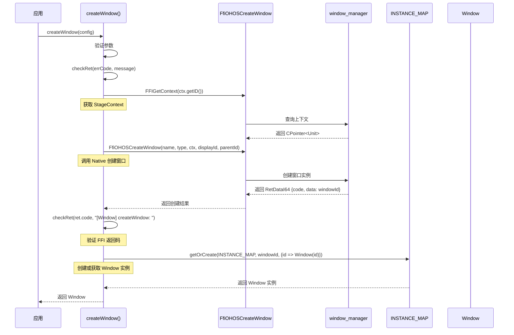
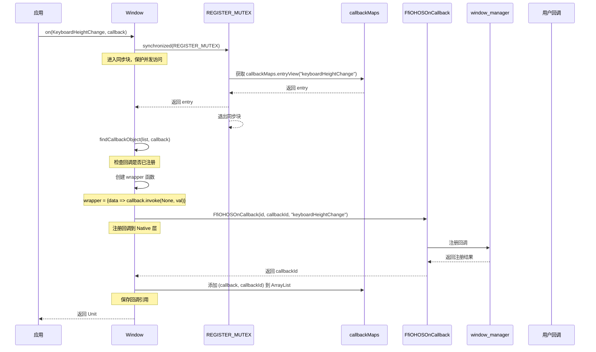
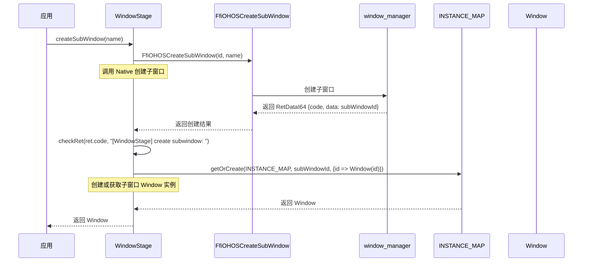
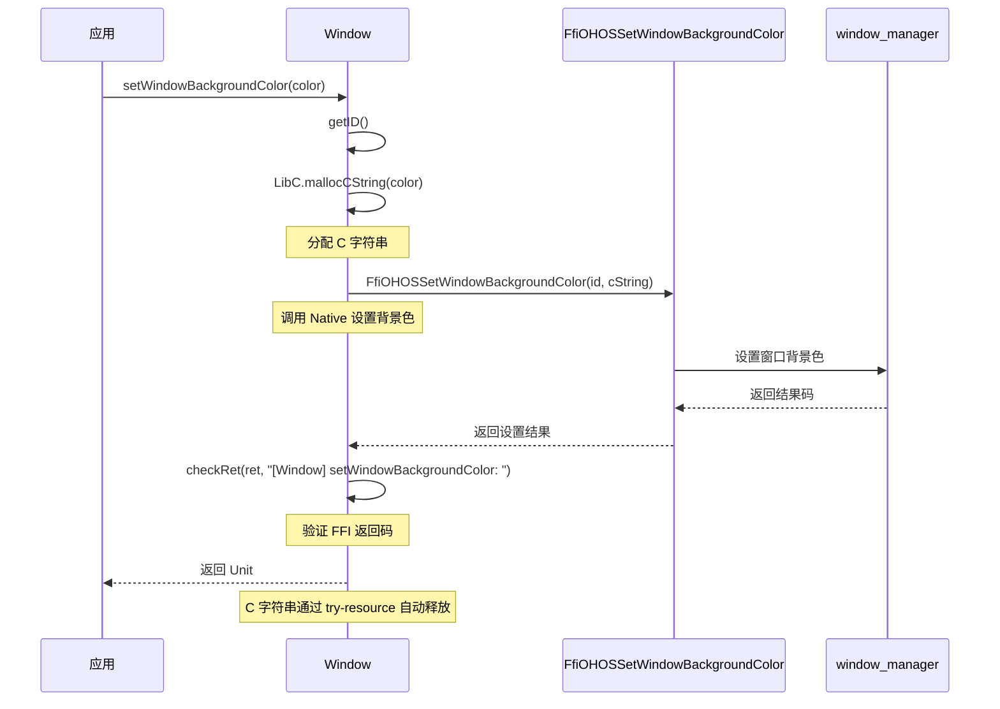
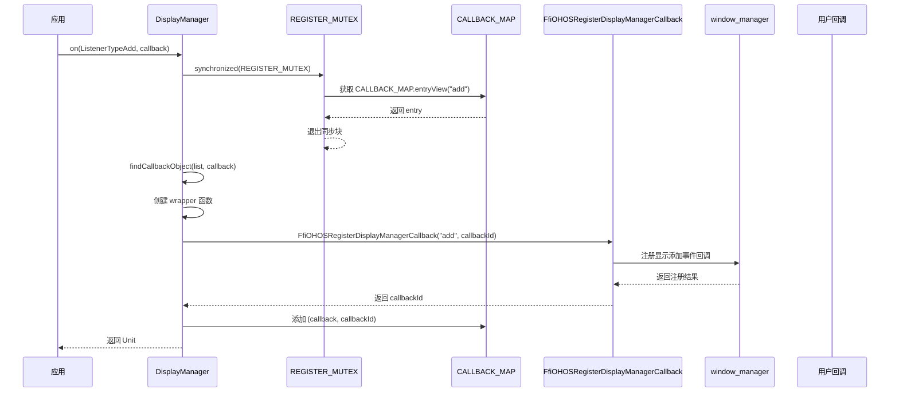

# 关键调用链

> 核心功能的入口→核心逻辑的调用链分析

---

## 目的

本文档详细说明 `window_cangjie_wrapper` 的关键调用链，帮助理解数据流向和执行流程。

---

## 窗口创建调用链

### 完整流程



**代码位置**：`window.cj:190-209`

**关键点**：
1. `FFIGetContext()` - 获取 Ability 上下文的 StageContext
2. `FfiOHOSCreateWindow()` - Native 层创建窗口
3. `getOrCreate(INSTANCE_MAP, ...)` - 单例管理窗口实例
4. `Window(id)` - 创建 Window 实例，继承 RemoteDataLite

---

## Display 查询调用链

### getDefaultDisplaySync 流程

```mermaid
sequenceDiagram
    participant App as 应用
    participant GS as getDefaultDisplaySync()
    participant FFI1 as FfiOHOSGetDefaultDisplaySync
    participant Native as window_manager
    participant FFI2 as FfiOHOSDisplayGet*
    participant Map as INSTANCE_MAP
    participant Disp as Display

    App->>GS: getDefaultDisplaySync()
    GS->>FFI1: FfiOHOSGetDefaultDisplaySync()
    Note over GS: 调用 Native 查询默认显示
    FFI1->>Native: 执行查询
    Native-->>FFI1: 返回 RetStruct {code, len, data: displayId*}
    Note over GS: 返回 Display ID 数组
    FFI1-->>GS: 返回查询结果
    GS->>GS: 检查返回码
    GS->>Map: 遍历数组，为每个 ID 创建 Display 实例
    loop 遍历 displayId[]
        GS->>FFI2: FfiOHOSDisplayGetId(displayId[i])
        Note over GS: 获取 Display 属性
        FFI2->>Native: 查询属性
        Native-->>FFI2: 返回属性值
        FFI2-->>GS: 返回属性
        GS->>Map: getOrCreate(INSTANCE_MAP, displayId[i], {id => Display(id)})
    Note over GS: 创建 Display 实例
    GS-->>App: 返回 Array<Display>
```

**代码位置**：`display.cj:130-142`

**关键点**：
1. `FfiOHOSGetDefaultDisplaySync()` - Native 层查询默认显示
2. 遍历 Display ID 数组，为每个 ID 创建实例
3. `FfiOHOSDisplayGet*()` - 系列获取 Display 属性（id, name, width, height 等）
4. `getOrCreate(INSTANCE_MAP, ...)` - 单例管理 Display 实例

---

## 回调注册调用链

### KeyboardHeightChange 回调



**代码位置**：`window.cj:776-802`

**关键点**：
1. `synchronized(REGISTER_MUTEX)` - Mutex 保护并发访问
2. `findCallbackObject()` - 避免重复注册
3. `FfiOHOSOnCallback()` - Native 层注册回调
4. 将 `(callback, callbackId)` 保存到 `callbackMaps` - 便于后续注销

---

## WindowStage 创建子窗口调用链



**代码位置**：`window_stage.cj:105-114`

**关键点**：
1. `FfiOHOSCreateSubWindow()` - Native 层创建子窗口
2. `checkRet()` - 验证 Native 层返回码
3. `getOrCreate(INSTANCE_MAP, ...)` - 使用 Window 单例管理子窗口
4. 子窗口返回 `Window` 实例，与主窗口共享类型

---

## 窗口属性设置调用链

### setWindowBackgroundColor 流程



**代码位置**：`window.cj:456-463`

**关键点**：
1. `LibC.mallocCString(color)` - 分配 C 字符串
2. `try-resource` 模式 - 自动释放 C 字符串
3. `FfiOHOSSetWindowBackgroundColor()` - Native 层设置背景色
4. `checkRet()` - 统一错误处理

---

## 显示事件回调调用链

### Display 添加事件回调



**代码位置**：`display.cj:295-301`

**关键点**：
1. `FfiOHOSRegisterDisplayManagerCallback()` - Native 层注册全局显示事件回调
2. `findCallbackObject()` - 检查是否已注册
3. 将 `(callback, callbackId)` 保存到 `CALLBACK_MAP`
4. 使用 `Mutex` 保证线程安全

---

## 关键结论

| 调用链类型 | 关键方法 | 代码位置 |
|----------|----------|--------|
| 窗口创建 | `createWindow()` | `window.cj:190-209` |
| Display 查询 | `getDefaultDisplaySync()` | `display.cj:130-142` |
| 回调注册 | `on(KeyboardHeightChange, callback)` | `window.cj:776-802` |
| 子窗口创建 | `createSubWindow()` | `window_stage.cj:105-114` |
| 属性设置 | `setWindowBackgroundColor()` | `window.cj:456-463` |
| 显示事件回调 | `on(ListenerTypeAdd, callback)` | `display.cj:295-301` |

**数据流特点**：
- 应用层 → 仓颉封装层 → FFI 接口 → Native 服务层
- 使用 `Mutex` 保护并发访问
- 使用单例 HashMap 管理实例
- 统一错误处理机制（`checkRet`）

---

**生成时间**: 2025-02-06
